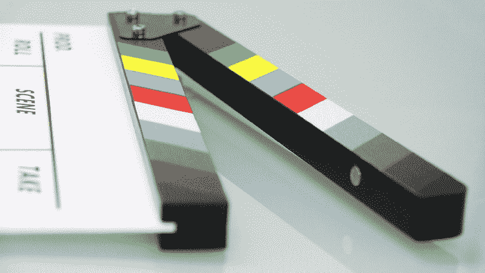

# 我在 React Native 中构建时学到的经验

> 原文：<https://www.freecodecamp.org/news/lessons-i-learned-while-building-in-react-native-917cb7bb5993/>

阿曼达·伯灵顿

# **我在 React Native 中构建时学到的经验**

Photo by [Sean Lim](https://unsplash.com/photos/kdHOdg1Bi3U?utm_source=unsplash&utm_medium=referral&utm_content=creditCopyText) on [Unsplash](https://unsplash.com/search/photos/software-mobile-app-development?utm_source=unsplash&utm_medium=referral&utm_content=creditCopyText)

当我收到一份在 React Native 中开发应用程序的软件工程职位的邀请时，我不知道该期待什么。

一方面，能够使用单一代码库为 iOS 和 Android 构建移动应用听起来令人兴奋。另一方面，听说像 Airbnb 这样的公司已经[测试了这个平台，并最终决定不使用它](https://medium.com/airbnb-engineering/react-native-at-airbnb-the-technology-dafd0b43838),这让我觉得未来会有相当多的挑战。

现在我已经几个月了，以下是我在这一路上学到的一些经验。

#### **选择正确的库**

我对 React Native 了解的第一件事是，第三方库的选择通常是有限的。作为一名 JavaScript web 开发人员，我有很多可供选择的库，可以根据不同的项目进行定制。

React 本地库构建起来更复杂。他们需要了解 iOS 和 Android 的本地代码，以便跨平台工作。正因为如此，为 React Native 开发库的人并不多。

There really aren’t this many choices in React Native

在 GitHub 上进行了一些徒劳的搜索后，我最终从 [React Native Community repo](https://github.com/react-native-community) 中选择了我的大多数应用程序库。这些通常是维护得最好的，并且几乎可以保证与 React 的最新版本一起工作。[本机目录](https://native.directory/)是另一个快速搜索 React Native 中可用内容的有用地方。

即使在 RN 社区 repo 中，也不是所有的库都能开箱即用。有时我需要进行回购，并做一些自己的调整。其他时候，我需要降级到一个版本，修复我的应用程序中出现的特定错误。当只有很少的库和维护人员时，版本控制就更加重要了。

#### **熟悉 Flexbox**

仅 Android 就有 10，000 多种设备，要开发一款适用于所有屏幕尺寸的应用可能会很困难。我需要我的应用程序在小到 iPhone SE，大到 Pixel 2XL 的设备上都能看起来很好。

起初，我试图通过使用 React Native 的内置 Dimensions 类来确定每个屏幕的宽度和高度，从而对我的应用程序进行样式化。最终，随着应用程序的增长，维护起来太复杂了。相反，Flexbox 是能够跨屏幕尺寸优雅地处理样式的关键。快速浏览一下 [Flexbox Froggy](https://flexboxfroggy.com/) 工具是提高速度的好方法。

Flexbox 并没有解决我所有的造型问题。我仍然会遇到古怪的屏幕尺寸，它们需要自己的风格解决方案，比如 iPhone X 系列的[安全区域视图](https://facebook.github.io/react-native/docs/safeareaview)。我还需要在许多屏幕上为不同的 iOS 和 Android 样式使用条件语句。但总的来说，它是 React Native 中设计应用程序的一个很好的工具。

#### **关机并再次开机**

有一次我安装了新的第三方库，运行`react-native link`，经常碰到“未定义不是对象”的错误。React Native 以其非描述性的错误消息而闻名。我花了一段时间才明白这意味着什么。一开始我以为是图书馆有问题。或者它无法与我安装的 React Native 版本兼容。

然后，在一个特定库的 GitHub 问题线程深处，我发现了这个评论,它最终解释了为什么我的库都不能顺利工作。

像许多开发人员一样，我已经养成了在运行`react-native run-android`或`react-native run-ios`时简单地重新加载项目的习惯。在对应用程序进行微小的样式调整和检查屏幕时，热重新加载非常节省时间。然而，它无助于将新的库集成到应用程序中。我的新库不会工作，直到我关闭所有的模拟器/仿真器，断开我的设备，并重新运行`npm start`来重启 Metro bundler。

换句话说，我需要关闭所有的东西，然后再重新打开，以便顺利地集成第三方库，而不会出现误导性的错误消息。

#### **在没有调试器的情况下工作**

Photo by [Mikes Photos](https://www.pexels.com/@mikebirdy?utm_content=attributionCopyText&utm_medium=referral&utm_source=pexels) from [Pexels](https://www.pexels.com/photo/ladybug-plastic-toy-198101/?utm_content=attributionCopyText&utm_medium=referral&utm_source=pexels)

作为一名网络开发人员，我擅长在谷歌浏览器调试器中搜索 bug。在 React Native 中，仅仅过了几周我就失去了在 Chrome 中调试的能力。

我的应用程序的一个限制是我需要使用 Realm 作为我的主数据库。然而，Realm 有一个[经常被报道的问题](https://github.com/realm/realm-js/issues/2128)，它蚕食了 Chrome 调试器，使其无法使用。我需要找到不同的解决方案。

React Native 有一个[内置调试器](https://facebook.github.io/react-native/docs/debugging)，你可以用`react-native log-android`或`react-native log-ios`将 console.logs 记录到终端。虽然这在 Android 上运行良好，但我在 iOS 上使用这个调试器时遇到了[问题](https://github.com/facebook/react-native/issues/9441)。我开始采用 Android 优先的开发方法，在 Android 上构建和测试一切，以便轻松访问 console.logs，然后根据需要对 iOS 版本进行调整。我还投资在我的应用程序中编写更好的错误消息，这对我和我的用户都有好处。

我还尝试使用 XCode 和 Android Studio 进行调试，但我最终发现我的 Android 优先方法是最简单的解决方案，屏幕切换最少。

#### **早期运行生产构建**

经验丰富的 React 本地开发人员告诉我，他们很少在生产模式中遇到任何他们在开发中没有发现和解决的问题。那不是我的经历。当我在物理设备上运行我的产品构建时，我能够捕捉到一些以前没有发现的错误。

Ready, set, production

一个例子是导航。起初，在移动应用程序中设置导航对我来说很棘手，我需要对设置 react-navigation 库的方式进行一些更改，以便在正确的时间向用户交付数据。使用物理设备让我模拟用户可能运行我的应用程序的所有方式(例如，当他们移动到一个新屏幕时，与按下后退按钮相比)，并相应地设置导航。

我在生产中发现的另一个问题涉及危险的 [Android 权限](https://facebook.github.io/react-native/docs/permissionsandroid)。较新的 Android 手机需要更明确的权限请求，一旦我在物理设备上测试，我意识到我的应用程序的照片库需要这些权限才能正确加载。

#### **结论**

React Native 是有据可查的，学习起来也相对较快，尤其是如果你已经知道 React 的话。用一个代码库构建一个可以在 iOS 和 Android 上运行的移动应用程序是非常令人满意的。

我在上面遇到的挑战是一些更棘手的部分——但总的来说，在 React Native 中开发应用程序没有任何巨大的障碍。大多数情况下，我需要思考移动开发的古怪之处，并适应一些尴尬的错误消息。现在，我已经度过了最初的学习曲线，并确定了 Android 优先的方法，开发速度更快了。

我会再次在 React Native 中发展吗？绝对的。