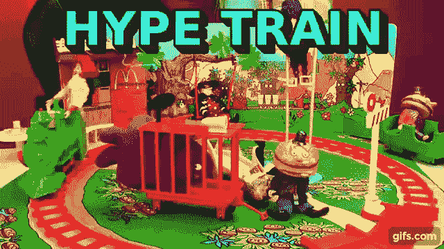

# 在使用 Electron.js 之前我希望知道的事情

> 原文：<https://www.freecodecamp.org/news/lessons-learned-from-electronjs/>

在这篇文章中，我将分享你如何避免我在学习 Electron.js 时犯的一些错误？‍♂️.希望有帮助！

**注意**:这不是一个编码教程，而是一个关于我个人收获的讨论。

几个月前，我决定更加专注于构建我的副产品，*。我的灵感来自于我电脑里的照片。*

*对于我们这些保留照片备份的人来说，这些收藏往往会变得如此庞大和复杂，以至于他们需要全职工作来管理。文件夹和子文件夹的组合可能包含即时消息图片备份、您的巴厘岛之旅、您叔叔的婚礼或去年的单身派对的高分辨率图片。*

*总是保持这样的收藏整洁是乏味的(相信我，我已经努力了很多年)。也很难发现藏在文件夹深处你最爱的照片。*

*所以 [*taggr*](https://taggr.ai/) 就是解决那个问题的桌面 app。它让用户在保持隐私的同时重新发现他们的记忆。*

*我正在构建一个跨平台桌面应用程序 *[taggr](https://taggr.ai/)* 。在这里我将和 [Electron.js](https://www.electronjs.org/) 分享一些我学到的关于跨平台 app 开发的东西，我希望我从一开始就知道。我们开始吧！*

## *背景*

*在介绍我在这个持续的电子之旅中的收获之前，我想多介绍一点关于我自己和 [*taggr*](https://taggr.ai/) 的要求的背景。*

*每个开发人员都来自不同的背景，他们开发的应用程序的需求也是如此。*

*将我为这个项目所做的选择放在上下文中，可能会帮助未来的开发人员根据他们的需求和专业知识选择正确的工具(而不是在那里大肆宣传的东西——GitHub？，我在看你)。*

*

JavaScript development in a nutshell. Source: [giphy](https://giphy.com/gifs/train-hype-FY2ew2Zii9VOE).* 

*如前所述，从一开始我就设想 [*taggr*](https://taggr.ai/) 是一个跨平台的应用。由于注重隐私，该应用程序将在客户端执行所有必要的预处理和机器学习计算。*

*作为一个人的表演，我希望能够编写一次我的应用程序，并将其发送到不同的系统，而不会失去理智。*

*从我这方面来说，我是一名热爱网络和 JavaScript 的前端工程师。我以前使用过 Java 和 C#，但是我喜欢网络提供的灵活性和它充满活力的生态系统。*

*在经历了使用像 [Eclipse RCP](https://wiki.eclipse.org/Rich_Client_Platform) 这样的工具来构建客户端应用程序的痛苦之后，我知道我不想再使用这种技术了。*

*简而言之，我对 taggr 的堆栈需求可以归结为如下内容:*

*   *它应该提供**跨平台支持，**最好是在框架级别。？*
*   *它应该允许我**写一次代码**，如果需要的话，为每个平台调整。？️*
*   *它应该使**能够访问机器学习能力**，而不管主机环境如何，无需安装特定的运行时。设置起来应该是没有痛苦的。？*
*   *如果可行，它应该**使用网络技术**。利用我现有的知识会很棒。？*

*正如你所看到的，需求并没有读作:**我应该用 Redux、observables 和 WebSockets** 来反应。那些是较低层次的实施细节，当需要时，它们应该由*决定。**

*为工作选择合适的工具，而不是从一开始就选择一堆工具，忽视手边的问题。*

*所以，在疯狂的搜索之后，我决定试试电子。我以前没有使用过那个框架，但是我知道很多公司都在成功地使用它在产品中，比如 [Atom](https://atom.io/) 、 [VS Code](https://code.visualstudio.com/) 、 [Discord](https://discord.com/) 、 [Signal](https://signal.org/#signal) 、 [Slack](https://slack.com/) 等等。*

*Electron.js 是开源的，并且与 JS 和 Node 生态系统都有现成的兼容性(Electron 是使用 Chromium 和 Node 构建的)，对于手头的工作来说，它是一个有吸引力的工具。*

*关于栈的其余部分，我就不赘述了，因为我在需要的时候反复修改了核心部分(持久层和视图层)，这超出了本文的范围。*

*不过我想提一下 [Tensorflow.js](https://www.tensorflow.org/js) ，它可以直接在浏览器(用 WebGL)和节点(用 C 绑定)中运行训练和部署 ML 模型，而不需要在主机中为 ML 安装特定的运行时。*

*所以回到电子-认为它是完美的，乐趣开始了。？？*

*背景说的够多了。让我们深入了解一下外卖。*

## *1.从小处着手(而且要慢)？*

*这不是一个新概念，但值得定期提出来。仅仅因为有一大堆棒极了的电子启动项目，并不意味着你应该马上选择一个。*

***等等。什么？***

> *慢就是顺，顺就是快。—海军说*

### *伴随便利而来的是复杂性*

*虽然这些初学者包括许多有用的集成(Webpack、Babel、Vue、React、Angular、Express、Jest、Redux)，但它们也有自己的问题。*

*作为一个电子新手，我决定使用一个精益模板，它包括“创建、发布和安装电子应用程序”的基本内容，没有额外的附加功能。一开始连 Webpack 都没有。*

*我建议从类似于[electronic-forge](https://www.electronforge.io/)的东西开始，为了快速启动和运行，你可以在上面建立你的依赖图和结构，以学习电子的诀窍。*

*当问题出现时(它们会出现)，如果您构建自己的定制启动项目，而不是选择一个有+30 个 npm 脚本和+180 个依赖项的[项目，您会更好。](https://github.com/electron-react-boilerplate/electron-react-boilerplate/blob/master/package.json)*

*也就是说，一旦你对 Electron 的基础感到满意，就可以随意使用 web pack/React/Redux/TheNextHotFramework 来加强游戏了。我在需要的时候**逐步**做这件事。不要仅仅因为你在某个地方读到了一篇关于实时数据库的很酷的文章，就把它添加到你的 todo 应用程序中。*

## *2.用心构建你的应用程序？‍♂️*

*我很高兴地承认，这一次花的时间比我想象的要长。？*

*一开始，**将 UI 和后端代码**(文件访问，扩展的 CPU 操作)混在一起可能很诱人，但是事情很快变得复杂起来。随着我的应用程序在功能、大小和复杂性方面的增长，维护一个复杂的 UI+后端代码库变得更加复杂和容易出错。此外，耦合使得很难单独测试每个部分。*

*当构建一个桌面应用程序时，除了嵌入式网页(数据库访问、文件访问、密集的 CPU 任务……)之外，我建议**将应用程序分割成模块**并减少耦合。单元测试变得轻而易举，模块间的集成测试有了清晰的路径。对于[*taggr*](https://taggr.ai/)*我松散地沿用了这里提出的的结构。**

**除此之外，还有**性能**。根据您正在构建的应用程序的不同，在这个问题上的需求和用户期望可能会有很大的不同。但是用昂贵的调用阻塞主线程或渲染线程从来都不是一个好主意。**

## **3.在设计中考虑线程模型？**

**我不会在这里讲太多的细节——我只是主要对[官方文件](https://www.electronjs.org/docs/tutorial/performance)中令人惊叹的解释加倍。**

**在 [*taggr*](https://taggr.ai/) 的具体情况下，有很多长时间运行的 CPU、GPU、IO 密集型操作。当在 Electron 的 main 或 renderer 线程中执行这些操作时，FPS 计数从 60 开始下降，使 UI 感觉迟钝。**

**Electron 提供了几个替代方案来从主线程和呈现线程中卸载这些操作，比如 T2 的网络工作者、T4 的节点工作者、或者浏览器窗口的实例。每一种都有其优点和注意事项，您所面对的用例将决定哪一种是最适合的。**

**无论您选择哪种方法来卸载主线程和渲染器线程的操作(当需要时)，**考虑通信接口将如何**。我花了一段时间才想出一个令我满意的界面，因为它严重影响了您的应用程序的结构和功能。我发现在选择一种方法之前尝试不同的方法很有帮助。**

**例如，如果您认为 WebWorkers 消息传递接口可能不是最容易调试的，那么尝试一下 [comlink](https://github.com/GoogleChromeLabs/comlink) 。**

**

Sponge Bob knows best. Source: [giphy](https://giphy.com/embed/jV4wbvtJxdjnMriYmY)** 

## **4.测试□，测试□，测试□**

**旧闻了吧？我想把这一点作为最后一点补充，因为我最近遇到了一些轶事性的“问题”。与第一点和第二点紧密相关的是，构建您的定制 starter 项目并在早期犯错误将会在开发过程中节省您宝贵的调试时间。**

**如果你按照我的建议，将应用程序的 UI 和后端分成模块，两者之间有一个清晰的接口，那么设置自动化单元和集成测试应该很容易。随着应用程序的成熟，您可能也想添加对 [e2e 测试](https://www.electronjs.org/spectron)的支持。**

### **GPS 位置提取？️**

**两天前，在为 [*taggr*](https://taggr.ai/) *，*实现 GPS 位置提取特性时，一旦单元测试通过并且该特性在开发中有效(使用 Webpack)，我决定在生产环境中尝试一下。**

**虽然该特性在开发中运行良好，但在生产中却惨遭失败。图片中的 EXIF 信息被读取为二进制，并由第三方库进行处理。虽然二进制信息在两种环境中都正确加载了(使用 [diff](https://www.lifewire.com/compare-two-text-files-linux-3861434) 进行了检查)，但是第三方库在生产版本中解析此类数据时失败了。请问？？**

****解决方案**:我发现 Webpack 设置的开发和生产环境中的编码设置不一样。这导致二进制数据在开发中被解析为 UTF-8，但在生产中却没有。通过在电子加载的 HTML 文件中设置正确的编码标题，修复了该问题。**

### **时髦的图片？**

**当操作和处理图像时，你可能会认为如果一个 JPEG 文件在你的电脑上“正常工作”,它就是一个有效的 JPEG 文件。**错了**。**

**在使用节点图像处理库 [*sharp*](https://sharp.pixelplumbing.com/) 时，调整一些 JPEG 图像的大小使应用程序崩溃。经仔细查看，原因是由[三星固件](https://github.com/lovell/sharp/issues/1578)生成的错误 JPEG 图像。？‍♂️**

****解决方案**:在 app 中设置改进的错误边界(例如。try-catch 块)，调整 JPEG 解析模块，怀疑一切。？️**

## **摘要**

**Node 和 JavaScripts 生态系统正在蓬勃发展，每天都有许多强大的工具被创建和共享。**

**选项的数量让你很难选择一条清晰的道路来开始构建你的新的令人敬畏的电子应用程序。无论您选择什么样的框架，我都建议您关注以下几点:**

1.  ****从小处着手**，逐渐增加复杂性。**
2.  ****用心构建你的应用**，保持后端和用户界面的模块化。**
3.  ****设计时考虑线程模型**，即使构建小型应用也是如此。**
4.  ****测试再测试**，尽早发现大部分错误，避免头痛。**

**谢谢你坚持到最后！？**

**[*taggr*](https://taggr.ai/) 是一个跨平台的桌面应用程序，使用户能够**重新发现**他们的数字**记忆**，同时保持他们的**隐私**。Open-alpha 即将在 Linux、Windows 和 Mac OS 上推出。所以，请关注一下 [Twitter](https://twitter.com/TaggrOfficial) 和 [Instagram](https://www.instagram.com/taggrofficial/) ，我会在那里发布开发更新、即将推出的功能和新闻。**