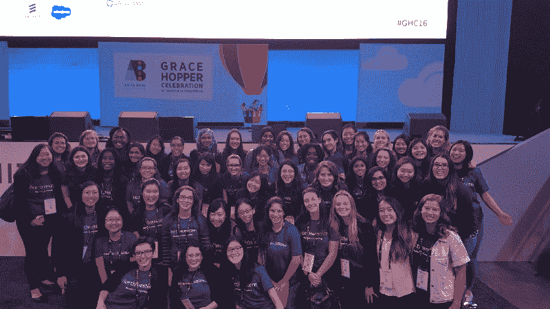

# 从科技组织中的女性领导者身上学到的经验

> 原文：<https://www.freecodecamp.org/news/lessons-learned-from-leading-women-in-tech-organizations-37eca542b2a5/>

阿兰·卡夫卡

# 从科技组织中的女性领导者身上学到的经验

WiC takes #GHC16!

如果不控制生活中的压力，任何一个善意的社区领袖都有可能在试图服务社区的同时崩溃。

这篇文章部分是指南，部分是对我在西北大学领导女性技术社区的反思。我已经把我必须学习的一些经验教训——有时是艰难的教训——整理成给未来领导者的八点建议。

虽然我是从我作为一名女性领导者的经验来说的，但这些观点中有许多并不是女性独有的。其他未被充分代表的少数民族也可能发现他们是有关联的。

#### 我在代码和社区建设方面的背景

我对编码和社区建设的兴趣总是相伴而生。在我宣布我的计算机科学专业之前，我就加入了西北大学计算机女性(WiC)的执行委员会。

在经历了一次难忘的经历后，我试图将 WiC 建设成一个科技女性的 T2 社区，而不是一个俱乐部。我试行了一个本科生-研究生导师项目。我将 WiC 成员的团体与当地以技术为导向的非营利组织联系起来，如[她是代码](http://evanstonnow.com/event/class/education/evanston-now/2016-02-18/74473/coding-workshop-planned-for-womens-day)。

在被选为 WiC 联合主席后不久，我带着一个雄心勃勃的想法找到了我的 WiC 联合主席同事:就在芝加哥创建一个对新人友好的跨学科女性黑客马拉松。就在几天前，我们发布了就职[builder](http://buildher.io/)的黑客应用程序。

我认为自己很幸运在 WiC 的发展和 BuildHer 的实例化中发挥了作用。当我从西北大学毕业时，我坚信这些组织将会继续他们吸引和满足会员的上升趋势。当我想象未来几代西北妇女推进 WiC 和 BuildHer 的社区建设使命时，我感到无比喜悦。

上周，WiC 开放了其执行委员会的申请——这是我不会加入的第一个委员会。尽管我有许多来自 WiC 和 BuildHer 的不可思议的回忆，但如果我把领导者的角色视为技术领域女性中的“典范”,那将是不负责任的。

是的，WiC 社区的许多女性似乎都认识我并钦佩我，但是技术社区的女性领导者并没有让我变得“完美”——远非如此。有时，我努力平衡我的承诺，我觉得我不能把我的一切都给 WiC 和 BuildHer，更不用说我的学业，我的职业机会，我的朋友和家人，以及我的福祉。

但是作为一名科技界女性领袖，我学到了比我学到的更多的东西。

事不宜迟，以下是我对未来社区建设者和领导者的建议。

#### **第一课:让女性进入技术社区可能会抹杀领导者在技术领域的学术和/或职业热情。**

对个人来说，支持女性在科技领域的事业可能会让人感到心力交瘁，这种情绪在社区建设者中只会加剧。因为我花了太多精力塑造 WiC 并支持其成员，所以除了倡导女性参与技术领域，我没有寻找机会追求其他技术兴趣。
我在科技社区的主要身份变成了“女性”或“领导者”，尽管我对健康科技和区块链等科技行业充满热情。

虽然我与所有科技界的女性站在一起，但我认为在 WiC 和 BuildHer 这样的组织中担任领导暂时剥夺了我的热情，降低了我的身份。只有在我意识到这一点并重新评估我如何度过时间之后，我才能够重新点燃我对其他计算的兴趣。

#### 第二课:根据激情、远见和同情心，而不是简单的技术能力来选择未来的领导者。

Meg——我的 BuildHer 联合创始人——在我们筛选潜在 BuildHer 联合组织者的申请时，让我看到了前两个标准。她的一个见解尤其打动了我:技术领导者中成功、敬业的女性应该同样关心——如果不是更多的话！—关于原因，就像关于编码本身一样。选择我们的 BuildHer 合作组织者是基于他们与我们分享的愿望和梦想，这让我们拥有了一个致力于使首届 BuildHer 成功的董事会。例证:一些 builder 的联合组织者彻夜未眠，将西北大学著名的岩石涂上 builder[标志](https://twitter.com/alainakafkes/status/832670851757592576)和[标签](https://twitter.com/alainakafkes/status/832601075177889793)，以增加我们的校园形象。

除了激情和远见，我坚信同情心是女性在技术领导者中的另一个关键特质。我将在下面详细讨论这个问题。

#### 第三课:所有的领导者都是领导者，但是最好的领导者*必须*感同身受。

对于像 WiC 这样由社区驱动的组织来说尤其如此。我为 WiC 在我担任联合主席期间达到的许多里程碑感到自豪——例如，我们如何在我们最大的活动中从 10 名参与者增加到 70 多名参与者——但它们无法与我与 WiC 成员就我们的希望、梦想、斗争和恐惧进行的推心置腹的交流相比。我相信，我对 WiC 的最大影响——或者说，也许是对整个西北大学计算机科学社区的最大影响——是说服了几十名女性，让她们相信自己属于这个竞争激烈但令人兴奋且回报丰厚的行业。

[**WiC 白板:你为什么支持 STEM 中的女性？**](https://www.facebook.com/media/set/?set=a.1062656347138063.1073741833.304678759602496&type=1&l=98ca55f04e)
[*感谢所有出来拍照的人，表达对 STEM 女性的支持！*www.facebook.com](https://www.facebook.com/media/set/?set=a.1062656347138063.1073741833.304678759602496&type=1&l=98ca55f04e)

十年后，人们更有可能记住某人作为领导者对他们的个人影响，而不是那个人实施的具体举措。这个原则的适用范围超出了在技术社区中管理女性的范围，所以我希望一生都带着它。

#### 第四课:有一个*T2 的秘密公式，可以让更多女性参与到科技社区中来。*

我发现了 2015 年至 2017 年 WiC 最受欢迎的活动的一些共同特征。它们是:

*   计划、宣传和执行一个杀手返校活动，让会员大肆宣传即将到来的活动和机会
*   经常在一致的时间/地点举办活动
*   集思广益，分享一项技能，教授一个新概念，或者以其他方式为你的社区增加价值
*   鼓励执行会员和普通会员定期提供坦诚的反馈，并将其纳入未来的活动计划

哦，别忘了时不时举办一场非技术性的社交活动！根据 WiC 最近的反馈调查，社区是 WiC 成员希望通过成为 WiC 的一部分而获得的最重要的东西。

#### 第五课:利用你的关系网将人们彼此联系起来，并与整个社区联系起来。

虽然我知道几乎每个 WiC 成员的名字，但不是每个人都知道。通常，当我与 WiC 成员交谈时，我会有似曾相识的感觉，只是意识到我最近与另一个 WiC 成员进行了类似的交谈！我会利用这些机会，通过介绍有相关兴趣的成员相互认识，在 WiC 内部建立并加强友谊。

除了建立一个相互交织的社区，将有相关兴趣的成员联系起来也可以推动创新和创业。最近的例子:我联系了两个想进一步探索健康技术的大二学生，现在他们正在[费恩伯格医学院](http://www.feinberg.northwestern.edu/)编写一个月经健康应用。多棒啊。

当一个社区的成员团结在一起时，他们也倾向于与更大的社区团结在一起；即使有人出于真正的兴趣追求技术，他们在 WiC 这样的组织中建立的友谊也可以说服他们留在技术领域。

#### 第六课:警惕过度竞争。

我从 WiC 的女性那里听到的个人陈述表明，成为班级、研究小组或其他社区中唯一的女性之一，可能会加大成为“女性科技典范”的压力。我把这个术语用引号括起来，因为，事实上，根本没有这样的东西。WiC 和 BuildHer 的每个成员都因其独特的热情、承诺、背景和目标而为这些社区增加了价值。几乎每一个女性都面临着成为科技界女性楷模的压力——在男性主导的领域证明自己。我甚至在格蕾丝·赫柏看到了这种综合症的一些负面影响。

但是，一个领导者如何才能发现一个有竞争力的人和一个努力成为“科技女性典范”的人之间的区别呢？我给科技行业女性领导者的建议是，多读读其他科技行业女性的文章，分享一些有助于正确看待孤独和无价值感的文章，这种感觉可能会引发“科技行业女性典范”综合症。我在 BuildHer 电子邮件和 WiC 的私人脸书小组上分享了一些文章(比如[这篇](https://medium.com/@lisaleone/ad-girl-interrupted-5c3dcc16c94f#.8w8cgy66d)),以便为西北大学有抱负的女性提供进一步的支持。

第七课:让新成员和经验不足的成员感到受欢迎。

不要在每一次活动中只和新面孔打招呼；询问他们的姓名，以及他们是否愿意通过电子邮件、社交媒体等方式与你所在的女性科技组织联系。在计算机科学入门课程中，请一位教授或助教分享你的活动日程或联系方式。

对于技术讲座或其他技能培养活动，在开始时教授初级技能，然后在活动的剩余时间转移到更中级或高级的主题。这就引出了我的最后一点…

#### 第八课:包容。

交叉不仅仅是一个时髦的词；[理解和迎合交叉身份是科技行业女性的必备条件](https://medium.com/projectinclude/true-diversity-is-intersectional-2282b8da8882#.zatva6wn8)。

成为“女性”只是一个人身份的一个方面，因此并非所有女性在技术组织中的成员都有相同的需求。WiC 已经采取了一些措施来更好地服务于我们会员中的交叉身份，包括在 [#GHC16](http://ghc.anitaborg.org/) 期间组织周五晚上的安息日，以及像 [CODE2040](http://www.code2040.org/) 这样的广告奖学金……但是我们可以在*做得更好。*

这就是为什么对于 BuildHer 来说，联合组织者承诺带来反映 BuildHer 黑客多样性的演讲人，而不仅仅是一种类型的女性。

领导 WiC 和创建 BuildHer 是一种荣誉，分享我一路走来积累的一些智慧也是一种荣誉。未来的女性技术领导者:要知道，组织和建立一个社区可能并不总是美好的，但却是非常值得的。不管你用这个建议做什么，我希望你能飞黄腾达。

*如果这首曲子引起了你的共鸣，请分享&推荐。有什么问题吗？在推特上联系我。感谢[陈彦蓉](https://www.freecodecamp.org/news/lessons-learned-from-leading-women-in-tech-organizations-37eca542b2a5/undefined)、史蒂文·班尼特、罗汉·维尔马、[艾莉丝](https://www.freecodecamp.org/news/lessons-learned-from-leading-women-in-tech-organizations-37eca542b2a5/undefined)达拉和[马克斯维尔·威尔逊](https://www.freecodecamp.org/news/lessons-learned-from-leading-women-in-tech-organizations-37eca542b2a5/undefined)在我撰写和修改这篇文章时分享你们的反馈。*