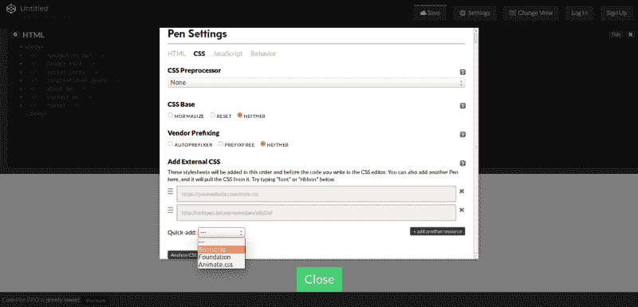
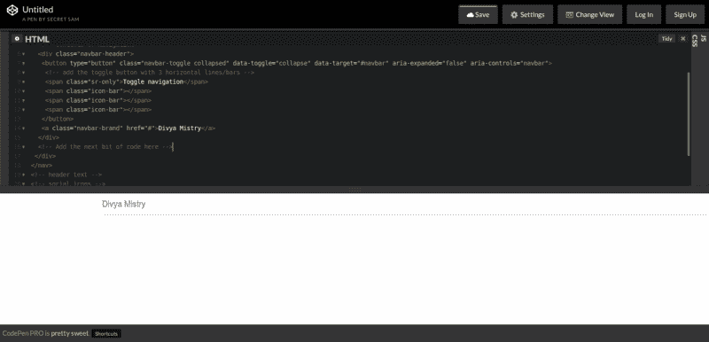
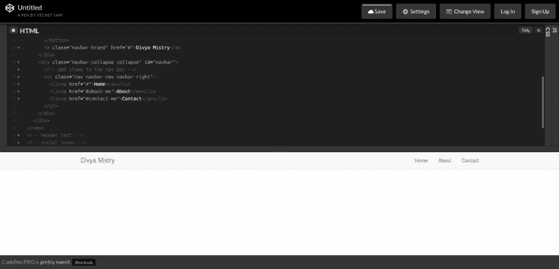
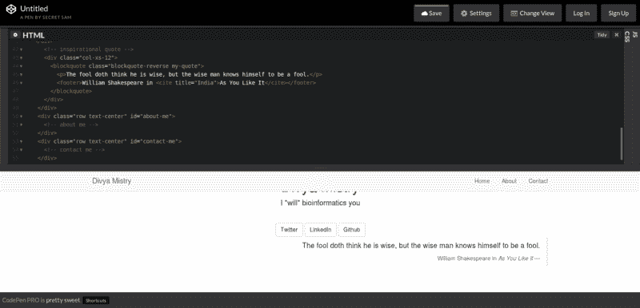
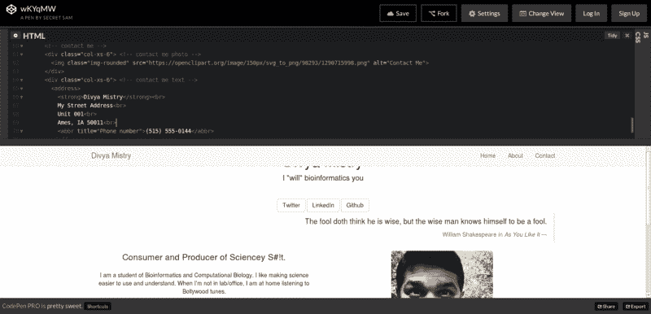
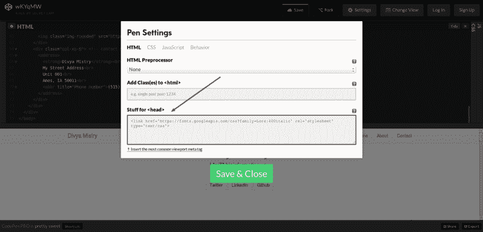
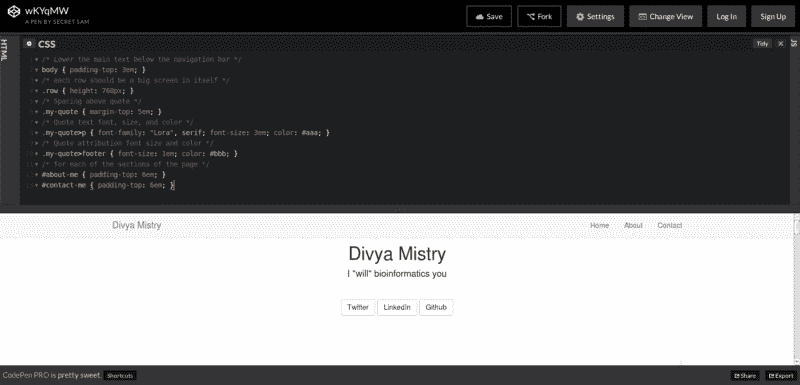
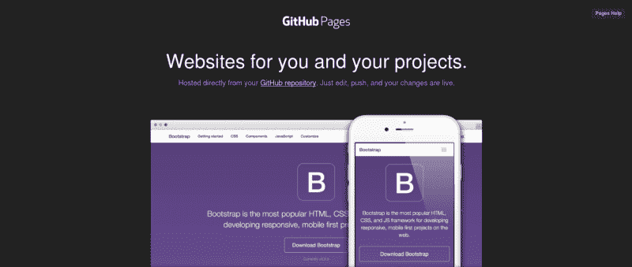
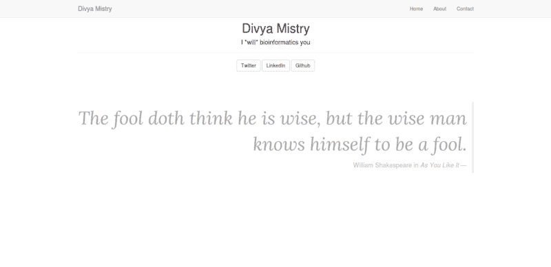

# MePage

> 原文：<https://www.freecodecamp.org/news/mepage-8b10e260d73/>

作者:达薇亚·米斯特里


# MePage

#### Web 上的单页目的地

在浏览了一些关于[自由代码营](https://www.freecodecamp.org/news/mepage-8b10e260d73/undefined)的前端开发教程后，我决定尝试一下这个简单的[滑索挑战](http://www.freecodecamp.com/challenges/zipline-build-a-personal-portfolio-webpage)创建作品集页面。在这篇文章中，我将这个单页目的地称为*页面*。

我们将分两步进行。首先，我们将使用 [CodePen](http://codepen.io/) 创建一个页面来迭代我们的设计和代码，然后可选地，当我们对结果满意时，我们将[将](https://help.github.com/articles/pushing-to-a-remote/)推送到 [Github 页面](https://pages.github.com)。请记住，所有这些都可以独立于 Codepen 和 Github 页面来完成。

考虑到这一点，我们开始吧。

### 密码笔


codepen.io Homepage

CodePen 提供了一种简单的方法来测试你的前端开发思想。您可以创建一组网页来学习和/或展示您的 web 开发技能，并与全世界分享。我们将使用它来建立一个单页个人网站(即 *MePage* )，访问者可以在这里了解您、您的社交媒体形象，并获取您的联系信息。

第一步:创建一个[+新笔](http://codepen.io/pen/)。

步骤 2:在 HTML 框中，编写以下内容。这显示了页面的一般结构。

```
<body>  <!-- navigation bar -->  <!-- header text -->  <!-- social icons -->  <!-- inspirational quote -->  <!-- about me -->  <!-- contact me --></body>
```

步骤 3:我们将为我们的站点使用 Bootstrap。让我们把它包括进来供我们使用。单击 CSS 块左上角的齿轮图标。在 CSS 设置窗口中，点击快速添加下拉菜单，并选择引导。



Add Bootstrap using Quick-add in CSS settings

同时，让我们添加 jQuery 和 Bootstrap JavaScript 库来帮助实现基于菜单的 navbar 的交互性。为此，转到 JavaScript 设置页面，快速添加 jQuery 和引导库。

现在我们开始填充页面的各个部分。

第 4 步:让我们首先创建导航栏。为此，我们将利用 Bootstrap 的[固定顶部导航栏](http://getbootstrap.com/examples/navbar-fixed-top/)。

虽然没有必要，你可以在这里阅读关于 Bootstrap navbar [的基本细节。这将有助于您以后自定义导航栏。](http://getbootstrap.com/components/#navbar)

*   在中创建一个元素和一个容器。这是导航栏内容的位置。

```
<!-- navigation bar -->  <nav class="navbar navbar-default navbar-fixed-top">    <div class="container">      <!-- contents of navigation -->      <!-- Add the next bit of code here -->    </div>  </nav>
```

*   当在较小的屏幕上查看网页时，我们还可以利用导航菜单的响应式设计。以下代码将在较小的屏幕上显示可折叠菜单中导航项的内容。我们还会展示品牌名称或标志。我选择保留我自己的名字作为这里的品牌名称。

```
<div class="navbar-header">  <button type="button" class="navbar-toggle collapsed"            data-toggle="collapse" data-target="#navbar"            aria-expanded="false" aria-controls="navbar">
```

```
 <!-- add the toggle button with 3 horizontal lines/bars -->    <span class="sr-only">Toggle navigation</span>    <span class="icon-bar"></span>    <span class="icon-bar"></span>    <span class="icon-bar"></span>  </button>  <a class="navbar-brand" href="#">Divya Mistry</a></div><!-- Add the next bit of code here -->
```



Navigation bar starting to shape up.

*   接下来，我们选择导航栏的导航项目。在这个练习中，我们将创建一个*主页*链接来跳转到默认视图，一个*关于*链接来跳转到“关于我”部分，一个*联系人*链接来跳转到合同信息。这些可能都是不同的页面；然而，我们将使用页面内书签和引导程序的魔力将所有内容保存在一个页面中，并跳过相关部分。在前面代码块中指示的位置添加以下代码。

```
<div class="navbar-collapse collapse" id="navbar">  <!-- add items to the nav bar -->  <ul class="nav navbar-nav navbar-right">    <li><a href="#">Home</a></li>    <li><a href="#about-me">About</a></li>    <li><a href="#contact-me">Contact</a></li>  </ul></div><!-- Add the next bit of code here -->
```



Navigation bar ready.

我们现在已经完成了导航栏。您会注意到，我们已经将*关于*和*联系人*链接锚定到#关于我和#联系我推荐人，但是如果您单击该链接，它们什么也不会做。让我们创建这些以及页面的一些基本结构。

```
<div class="container">  <div class="row text-center">    <!-- header text -->    <!-- ADD the header text bit of code HERE -->    <!-- social icons -->    <!-- ADD the Social buttons bit of code HERE -->    <!-- inspirational quote -->    <!-- ADD the inspirational quote bit of code HERE -->  </div>  <div class="row text-center" id="about-me">    <!-- about me -->    <!-- ADD the About text bit of code HERE -->  </div>  <div class="row text-center" id="contact-me">    <!-- contact me -->    <!-- ADD the Contact text bit of code HERE -->  </div></div>
```

让我们开始填写各个部分。在用指示的地方添加以下代码行——在上面的 HTML 代码中添加… HERE - - >注释。

*   标题文本

```
<div class="col-xs-12">  <!-- name title -->  <h1>Divya Mistry</h1>  <h4>I *will* bioinformatics you</h1>  <hr></div>
```

*   社交图标

```
<div class="col-xs-12">  <!-- social buttons -->  <a class="btn btn-default" href="https://twitter.com/divyamistry" target="_blank">Twitter</a>  <a class="btn btn-default" href="https://linkedin.com/in/divyamistry" target="_blank">LinkedIn</a>  <a class="btn btn-default" href="https://github.com/divyamistry" target="_blank">Github</a></div>
```

*   励志名言

```
<div class="col-xs-12">  <blockquote class="blockquote-reverse my-quote">    <p>The fool doth think he is wise, but the wise man knows himself to be a fool.</p>    <footer>William Shakespeare in <cite title="India">As You Like It</cite></footer>  </blockquote></div>
```



Content of the main page section.

你会注意到标题的一部分被截断了，引语看起来不太突出或对齐。我们马上就能解决这个问题。让我们继续在页面的剩余部分添加细节。

*   关于我的部分。我们将在左侧添加描述，在右侧添加照片。

```
<div class="col-xs-6"> <!-- About me - description -->  <p class="lead">Consumer and Producer of Sciencey S#!t.</p>  <p>I am a student of Bioinformatics and Computational Biology. I like making science easier to use and understand. When I'm not in lab/office, I am at home listening to Bollywood tunes.</p></div><div class="col-xs-6"> <!-- About me - photo -->  </div>
```

*   联系我

```
<div class="col-xs-6"> <!-- contact me photo -->  </div><div class="col-xs-6"> <!-- contact me text -->  <address>    <strong>Divya Mistry</strong><br>    My Street Address<br>    Unit 001<br>    Ames, IA 50011<br>    <abbr title="Phone number">515-555-0144</abbr>  </address></div>
```



All the content added. We still need to fix the spacing.

*   页脚。*啊！我把这个留给你练习。尝试阅读引导文档并创建自己的页脚。这里有一个想法:添加一个简单的* < d *iv >元素，并提供你自己的版权*注释。

第五步:让我们修改间距和一些观感，使页面看起来更干净。我们现在将进入 CSS。

*   放低身体，这样内容就不会隐藏在导航栏后面。Bootstrap [为此推荐大约 70px](http://getbootstrap.com/components/#navbar-fixed-top) 。我喜欢用 [em](https://en.wikipedia.org/wiki/Em_%28typography%29) 单位[各种原因](http://www.w3.org/Style/Examples/007/units.en.html#font-size)。

```
/* Lower the main text below the navigation bar */body { padding-top: 3em; }
```

*   现在，所有部分都靠得太近了。让我们把它们分开，在它们之间留出足够的空间。你可以随意摆弄这些填充物。我更喜欢 768 像素左右的典型笔记本电脑屏幕。

```
/* each row should be a big screen in itself */.row { height: 768px; }
```

*   让我们把莎士比亚的语录放在屏幕上更显著的位置。

```
/* Spacing above quote */.my-quote { margin-top: 5em; }
```

```
/* Quote text font, size, and color */.my-quote>p {   font-family: "Lora", serif;   font-size: 3em;   color: #aaa;}
```

```
/* Quote attribution font size and color */.my-quote>footer { font-size: 1em; color: #bbb; }
```

你会注意到我已经为我的报价选择了 [Lora](https://www.google.com/fonts/specimen/Lora) 字体系列。这种字体可通过谷歌字体。要使用它，你所要做的就是进入你的 HTML 设置(点击 HTML 编辑器左上角的齿轮图标)，并在**文本框中为<何** ad >添加下面一行。

```
<link href='https://fonts.googleapis.com/css?family=Lora:400italic' rel='stylesheet' type='text/css'>
```



Adding Google Fonts stylesheet to `<head>`.

*   最后，让我们在顶部给两个信息部分一些填充空间，这样当我们跳转到它们时，导航栏不会隐藏内容。

```
/* for each of the sections of the page */#about-me { padding-top: 6em; }#contact-me { padding-top: 6em; }
```

*注意，尽管填充了< body >元素，但这种填充是必要的，因为内联书签锚被引用到浏览器窗口视口的顶部，在那里< body >开始，而不是相对于 body section*内的内容开始。



CSS updated to correct the spacing and alignments.

步骤 6:为页脚做任何你想要的 CSS 修改。我决定呈现一个稍微小一点的文本。

这是我根据这个练习得到的[代码笔](http://codepen.io/anon/pen/wKYqMW)。你可以给主体和所有部分添加背景图片，给它一个[漂亮的视觉效果](http://codepen.io/ThiagoFerreir4/full/eNMxEp)。

### github pages-github 页面



Github 为你自己和你的项目提供了一个很好的方式来托管静态页面。我决定利用这次练习的结果创建一个 [Github 用户页面](http://divyamistry.github.io/)。该代码可在[这个资源库](https://github.com/divyamistry/divyamistry.github.io)中获得。随意分叉存储库。

有几个很好的教程可以教你 Github 是如何工作的。如果你对 [git](https://www.atlassian.com/git/) 和 [Github](https://try.github.io/levels/1/challenges/1) 不熟悉，试试看。这是一个值得学习的技能。



My Github Page using this tutorial.

### 最后的话

希望你喜欢这个练习，并且能够制作你自己的网页。在这里用你的 CodePen 或 Github URL 来评论，以显示你的结果。如果你最终修改了它，并制作了你自己的版本，请分享一下。我很想看看。最后，如果你想保持联系， [@divyamistry](https://twitter.com/divyamistry) 是一个很好的方式。