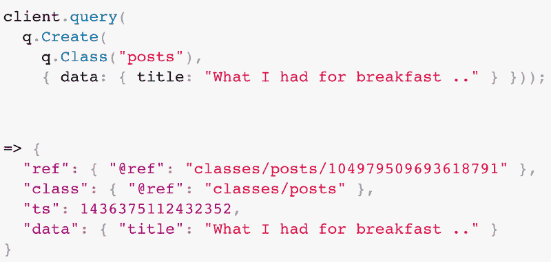
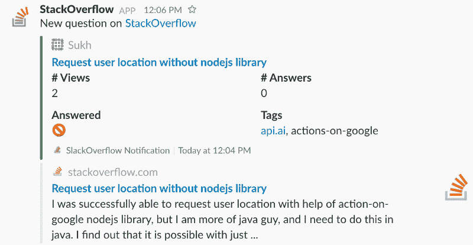

# 如何监控 Slack 中的堆栈溢出活动

> 原文：<https://www.freecodecamp.org/news/monitor-stack-overflow-activity-directly-into-slack-dc778913490f/>

尼古拉·格雷诺耶

# 如何监控 Slack 中的堆栈溢出活动

#### 由完整的无服务器堆栈提供支持


Group of Developer Advocates watching developers coding — Credits: [Pixabay](https://pixabay.com/en/meerkat-snout-baby-mammal-guard-275967/)

开发者拥护者或布道者经常被问到他们如何衡量成功。

有人可能会说，GitHub ⭐️'s 在存储库方面很棒。Ash Hathaway 在这里分享了她的想法。

其他人可能会说堆栈溢出问题很好地说明了 API 的受欢迎程度。我同意这种说法。

如果你的产品没有论坛，开发者可能会直接在 Stack Overflow 上提问。

我不鼓励公司把他们所有的支持问题都转到那里，或者推销他们的品牌标签，这很糟糕。你是为了自己的需要劫持了一个社区，而不是为它做贡献。

#### 但是:

当有人在那里发帖提问时会发生什么？
**怎么得到通知？**
**如何快速反应？**

根据我的经验，只有在特定标签上有新问题时，您才能收到通知。这可能没有涵盖所有关于你的 API 的问题。

也可以用[提](http://mention.net/)之类的工具。它涵盖的不仅仅是堆栈溢出，但它不是即时的。

为了反应更快，很久以前我在 [3scale](http://3scale.net/) 为我们的团队拼凑了一些东西。我最近用无服务器技术重写了它。它监控关于 **3scale** 的问题，并将其发布在我们的**支持** Slack 频道上。支持团队可以跳上去快速回答。

我想分享这个项目，这样你也可以直接在 Slack 中监控堆栈溢出。

### 工具呢？

为了适应 2017 年的趋势，我们将只使用无服务器技术，这将使这个工具可以免费使用:
- [AWS Lambda](https://aws.amazon.com/lambda/) 来托管我们的应用程序的逻辑
- [FaunaDB](http://faunadb.com) 来存储数据库
- [无服务器框架](http://serverless.com)来简化部署
- [Slack](http://slack.com) 在询问新问题时得到通知

### 逻辑上的

[栈交换 API](https://api.stackexchange.com/docs) 有一个端点来搜索问题。你可以在标签中、标题中、问题正文中或者同时在所有地方寻找一个术语。在本例中，我们将搜索所有属性。

你应该在这里创建一个访问栈交换 API [的密钥。](https://stackapps.com/apps/oauth/register)

我们的函数将定期调用这个端点来检查是否有新的问题发布。我们将使用 Lambda 本机提供的*调度事件*特性，这与 cron 作业的行为类似。

我们会将问题存储在数据库中，以跟踪我们已经发送给 Slack 的问题，并避免重复。

如果堆栈溢出问题不在我们的数据库中，我们会将其添加到数据库中，并将详细信息发送给 Slack。

### FaunaDB

几个月前，我在 [Gluecon](http://gluecon.com) 发现了 [FaunaDB](http://faunadb.com) 。他们自称是第一个**无服务器**数据库引擎。一切都在他们那边托管。FaunaDB 是一个全球分布式数据库，不需要任何配置。容量是按计量的，可按需提供，因此您只需为使用量付费。

如果你熟悉 [Firebase](http://firebase.com) ，你会发现类似的数据结构和访问资源的路径。但是它有更多的特性，这使得查询数据库变得更加容易。



Example: How to create an entry in FaunaDB

对于这个应用程序，你需要一个数据库，一个**问题**类。我们还将在术语**数据**和**问题 id 上添加一个索引**问题 id** 。**这将让我们通过堆栈溢出 id 查询问题类。

如果您担心数据库的使用，可以将 TTL 添加到 **questions** 类中。这将自动删除比 TTL 值旧的实例。

最后，您需要为 questions 类创建一个服务器密钥。该密钥将用于向 FaunaDB 服务器验证我们的功能。


Example: How to retrieve an entry in FaunaDB

### 松弛的

要发布到 Slack，我们只需要一个简单的传入 web 钩子。在这里创建一个。

### 配置项目

确保您已经安装了[无服务器](http://serverless.com)框架并配置了 [AWS CLI](https://aws.amazon.com/cli/) 工具。

现在，您可以在本地克隆这个项目。

```
git clone git@github.com:picsoung/stackOverflowMonitor.gitcd stackOverflowMonitor
```

在`serverless.yml`中，您将修改环境变量为您自己的值。

`FAUNADB_SECRET`是我们之前创建的用于访问 FaunaDB
`STACK_EXCHANGE_KEY`是用于访问堆栈交换 API 的 API 键
`SLACK_WEBHOOK_URL`是您创建的 Slack 传入 webhook 的 URL
`SLACK_CHANNEL`应该是您的 Slack 团队中现有的通道名称，如#support 或#stackoverflow
`SEARCH_KEYWORD`是您有兴趣监控的关键字，如 Node.js 或 Angular2

一旦你把所有的变量都改成你自己的值，我们就可以测试一切是否正常。我们使用以下命令在本地调用该函数:

```
serverless invoke local — function getStackOverflowQuestions
```

因为这是你第一次启动这个功能，它应该会在你的 Slack 频道上发布一条消息。它应该是这样的:



How the notification should look like in your Slack channel

如果您对结果满意，现在可以使用以下命令部署该函数:

```
serverless deploy
```

默认情况下，该函数每 20 分钟调用一次。您可以通过更改`serverless.yml` 文件中的 schedule 属性对其进行自定义。

### 扩展项目

目前，我们只监测一个任期。您可以启动该函数的多个实例来观察堆栈溢出时的更多术语或标签。

如果您对接近实时的解决方案感兴趣，我鼓励您查看 [Streamdata.io](http://streamdata.io/) 。他们的工具把拉 API 变成了流 API。

如果你想要一些漂亮的仪表盘来显示你的社区在堆栈溢出上有多活跃，我推荐 [Keen.io](http://keen.io/) 。您可以将所有堆栈溢出数据发送到那里。Keen 提供了各种[库](https://keen.github.io/dashboards/)来构建漂亮的仪表盘。

我们还可以在 Slack 中添加更多功能，比如按钮或菜单。所以人们可以提出一个问题或者被分配一个问题来回答。

### 结论

这是一个让我发现如何使用 FaunaDB 的小项目。使用 AWS Lambda 比我过去使用的 Heroku 实例效率更高。

我希望这个无服务器的例子对您有用。代码在 GitHub 上是[公开的](https://github.com/picsoung/stackoverflowmonitor),所以请随意贡献和添加新功能。

如果你在一家向开发者销售产品的公司工作，我相信你已经听说过“去开发者那里”

在网络世界中，你很有可能在黑客新闻、Stack Overflow 或 GitHub 等网站上找到开发者。衡量人们在这些网站上对你的产品或技术的评价是很重要的。

这是一个让我发现如何使用 FaunaDB 的小项目。使用 AWS Lambda 比我过去使用的 Heroku 实例更有效。

我希望这个无服务器的例子对您有用。代码在 GitHub 上是[公开的](https://github.com/picsoung/stackoverflowmonitor),所以请随意贡献和添加新功能。