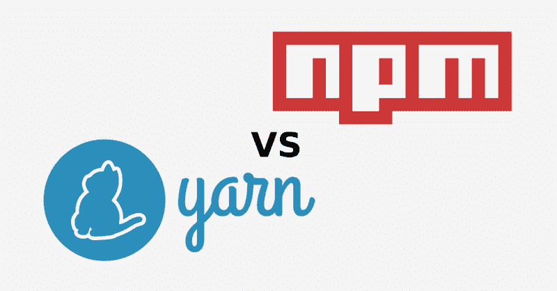

# 因此，我将 Yarn 与 4 种最流行的 CI 工具进行了对比。

> 原文：<https://www.freecodecamp.org/news/npm-vs-yarn-benchmark-9b456de4aa96/>

阿尔贝托·瓦雷拉

# 因此，我将 Yarn 与 4 种最流行的 CI 工具进行了对比。



Yarn 是最近发布的 npm 的替代产品，名为 Node.js 依赖管理器。它声称比它的前身更快更可靠。让我们看看这是不是真的。

如果你是一名 Javascript 开发人员——尤其是如果你使用 node . js——你可能在过去几天听到了一些关于 [Yarn](https://yarnpkg.com/) 的传言。来自脸书指数、谷歌和 Tilde [的工程师们一直在一起工作](https://code.facebook.com/posts/1840075619545360) [来为众所周知的](http://yehudakatz.com/2016/10/11/im-excited-to-work-on-yarn-the-new-js-package-manager-2/)[NPM](https://www.npmjs.com/)(node . js 的内置包管理器)构建这个替代方案

在过去的几年里，世界各地的开发人员开始抱怨 npm 有多慢。他们想要的另一件事是能够避免环境之间不一致的依赖系统。因此，Yarn 自称正是我们一直想要的:“快速、可靠、安全的依赖管理。”

很明显， [yarn.lock](https://yarnpkg.com/en/docs/yarn-lock) 文件和校验和验证的引入增加了我们的包在不同环境之间的一致性和完整性，但是……速度呢？纱[声称它超快](https://yarnpkg.com/en/compare)。因此，我开始在各种环境中对 npm 进行基准测试。

### 该方法

我用来测量两个包管理器速度的工具是简单的 Linux 命令`time`。我写了一个小小的 Bash 脚本——基于彼得·米切尔的《T2》。

脚本使用 npm 和 Yarn 为 [Angular](https://angular.io/) 、 [Ember](http://emberjs.com/) 和 [React](https://facebook.github.io/react/) 运行多个安装。它测量每次安装所花费的时间。然后，在最后，它显示了平均指标，按照包管理器和框架排序。它还将使用预缓存的包和空缓存来执行安装，以查看两种情况之间的差异。

你可以看到这里使用的脚本:[https://github.com/artberri/npm-yarn-benchmark](https://github.com/artberri/npm-yarn-benchmark)

### 环境

一旦我选择了基准测试工具，就该运行脚本了。

我开始在自己的电脑上运行它。然后，为了获得更标准的指标，我使用以下持续集成(CI)工具再次运行该脚本:Travis、Snap CI、Semaphore 和 Circle CI。

由于每个测试运行期间都要进行大量的安装，所以脚本需要一段时间才能完成。为了避免这些 CI 工具超时，我计算了三次运行的平均时间。

### 结果呢

在我自己的电脑中:

```
---------------------------------------------------------------------------------------------- RESULTS (seconds) -------------------------------------------------------------------------------------------|                       |     angular2 |        ember |        react |  npm_with_empty_cache |       15.687 |       56.993 |       93.650 |   npm_with_all_cached |        9.380 |       52.380 |       81.213 | yarn_with_empty_cache |        9.477 |       30.757 |       37.497 |  yarn_with_all_cached |        4.650 |       15.090 |       17.730 --------------------------------------------------------------------
```

在[特拉维斯](https://travis-ci.org/artberri/npm-yarn-benchmark):

```
------------------------------------------------------------------------------------------- RESULTS (seconds) ----------------------------------------------------------------------------------------------|                      |     angular2 |        ember |        react | npm_with_empty_cache |       19.720 |       55.090 |       76.233 |  npm_with_all_cached |       14.640 |       40.203 |       56.467 |yarn_with_empty_cache |       13.193 |       34.037 |       43.663 | yarn_with_all_cached |        5.830 |       15.923 |       40.420 --------------------------------------------------------------------
```

在[快照 CI](https://snap-ci.com/artberri/npm-yarn-benchmark/) 中:

```
--------------------------------------------------------------------------------------------- RESULTS (seconds) --------------------------------------------------------------------------------------------|                      |     angular2 |        ember |        react | npm_with_empty_cache |       20.640 |       57.030 |      120.470 |  npm_with_all_cached |       15.753 |       45.273 |       62.597 |yarn_with_empty_cache |       12.227 |       41.997 |       51.863 | yarn_with_all_cached |        7.693 |       23.607 |       24.490 --------------------------------------------------------------------
```

在[信号量](https://semaphoreci.com/artberri/npm-yarn-benchmark/)中:

```
------------------------------------------------------------------------------------------- RESULTS (seconds) ----------------------------------------------------------------------------------------------|                      |     angular2 |        ember |        react | npm_with_empty_cache |       11.057 |       35.287 |       54.203 |  npm_with_all_cached |        7.107 |       24.797 |       31.300 |yarn_with_empty_cache |        6.273 |       17.407 |       22.777 | yarn_with_all_cached |        2.790 |        8.150 |        9.380 --------------------------------------------------------------------
```

在 [CircleCI](https://circleci.com/gh/artberri/npm-yarn-benchmark) 中:

```
------------------------------------------------------------------------------------------- RESULTS (seconds) ----------------------------------------------------------------------------------------------|                      |     angular2 |        ember |        react | npm_with_empty_cache |       42.940 |      100.287 |      163.550 |  npm_with_all_cached |       16.990 |       50.083 |       67.000 |yarn_with_empty_cache |       15.907 |       45.547 |       58.113 | yarn_with_all_cached |        7.547 |       26.763 |       27.130 --------------------------------------------------------------------
```

### 结论

Yarn 速度超快，比 npm 快 2 到 3 倍。

纱线创造者说的是实话。看到 Yarn 速度更快真是太棒了，即使我们将 npm 缓存测试与未缓存的 Yarn 测试进行比较。

基于这一点，我认为 Yarn 将在几个月内成为 Node.js 的标准依赖管理器。

另一方面，这种比较的目的不是对 CI 工具进行基准测试，但是值得一提的是，Semaphore 的性能比我在这个例子中使用的其他工具要好。

我从第一天开始就一直在测试纱线，这是我很久以来一直想要的东西。

我目前在我的大多数项目中使用 [Puppet](https://puppet.com/) 进行软件供应。因此，我创建了一个安装纱线的木偶模块，你可以[在这里](https://forge.puppetlabs.com/artberri/yarn)试用。

感谢阅读，祝安装愉快！

*最初发表于[www.berriart.com](https://www.berriart.com/blog/2016/10/npm-yarn-benchmark/)。*