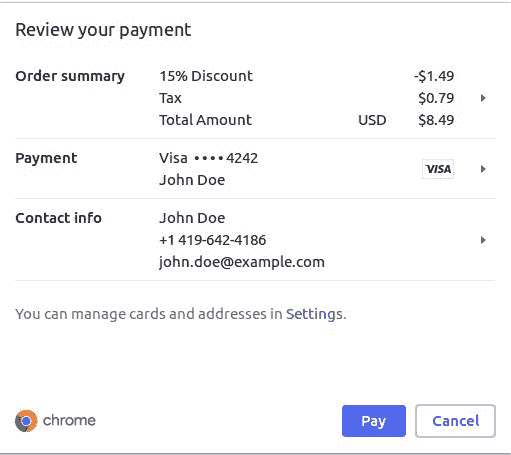

# 如何在 JavaScript 中使用付款申请 API

> 原文：<https://www.freecodecamp.org/news/payment-request-api-javascript/>

付款请求 API 提供了一个跨浏览器标准，允许您从客户处收集付款、地址和联系信息。然后，您可以使用这些信息来处理他们的订单。

它还促进了浏览器和网站之间的信息交换。这背后的根本思想是通过让用户方便地在浏览器中存储支付和联系信息来改善用户的在线购物体验。

## 付款申请 API 浏览器支持

支付请求 API 仍在积极开发中，仅受现代浏览器的最后几个版本的支持。

在开始提出支付请求之前，您应该启用检测功能，以确保浏览器支持该 API:

```
if (window.PaymentRequest) {
  // Yes, we can use the API
} else {
  // No, fallback to the checkout page
  window.location.href = '/checkout'
} 
```

请注意，您只能在超过`https`的站点上使用付款申请 API。

现在让我们看看这个有用的 API 是如何工作的。

## 如何创建 PaymentRequest 对象

付款请求总是通过创建一个新的对象`PaymentRequest`开始的——使用`PaymentRequest()`构造函数。构造函数采用两个强制参数和一个可选参数:

*   `paymentMethods`定义接受哪种支付方式。例如，您可能只接受 Visa 和 MasterCard 信用卡。
*   `paymentDetails`包含应付的总付款金额、税金、运费、展示物品等等。
*   `options`是一个可选参数，用于向用户请求额外的详细信息，如姓名、电子邮件、电话等。

接下来，我们将创建一个只包含必需参数的新付款申请。

### 如何使用`paymentMethods`参数

```
const paymentMethods = [
  {
    supportedMethods: ['basic-card']
  }
]

const paymentDetails = {
  total: {
    label: 'Total Amount',
    amount: {
      currency: 'USD',
      value: 8.49
    }
  }
}

const paymentRequest = new PaymentRequest(paymentMethods, paymentDetails) 
```

注意`paymentMethods`对象中的`supportedMethods`参数。当设置为`basic-card`时，将接受所有网络的借记卡和信用卡。

但是您可以限制支持的网络和卡的类型。例如，仅接受 Visa、MasterCard 和 Discover 信用卡:

```
const paymentMethods = [
  {
    supportedMethods: ['basic-card'],
    data: {
      supportedNetworks: ['visa', 'mastercard', 'discover'],
      supportedTypes: ['credit']
    }
  }
]
// ... 
```

### 如何使用`paymentDetails`对象

传递给`PaymentRequest`构造函数的第二个参数是付款细节对象。它包含订单总数和可选的显示项目数组。`total`参数必须包括一个`label`参数和一个带有`currency`和`value`的`amount`参数。

您还可以添加额外的显示项目，以提供总体的高级别细分:

```
const paymentDetails = {
  total: {
    label: 'Total Amount',
    amount: {
      currency: 'USD',
      value: 8.49
    }
  },
  displayItems: [
    {
      label: '15% Discount',
      amount: {
        currency: 'USD',
        value: -1.49
      }
    },
    {
      label: 'Tax',
      amount: {
        currency: 'USD',
        value: 0.79
      }
    }
  ]
} 
```

`displayItems`参数并不意味着显示一长串项目。由于移动设备上浏览器支付 UI 的空间有限，您应该使用此参数仅显示顶级字段，如小计、折扣、税收、运费等。

请记住，`PaymentRequest` API 不执行任何计算。因此，您的 web 应用程序负责提供预先计算的`total`金额。

### 如何使用`options`参数请求额外的细节

您可以使用第三个可选参数向用户请求附加信息，例如姓名、电子邮件地址和电话号码:

```
// ...
const options = {
  requestPayerName: true,
  requestPayerPhone: true,
  requestPayerEmail: true
}

const paymentRequest = new PaymentRequest(paymentMethods, paymentDetails, options) 
```

默认情况下，所有这些值都是`false`，但是将它们中的任何一个添加到值为`true`的`options`对象都会导致支付 UI 中的额外步骤。如果用户已经在浏览器中存储了这些详细信息，它们将被预先填充。

## 如何显示支付界面

在创建了一个`PaymentRequest`对象之后，您必须调用`show()`方法来向用户显示付款请求 UI。

如果用户已经成功地填写了详细信息，`show()`方法返回一个用`PaymentResponse`对象解析的[承诺](https://www.freecodecamp.org/news/javascript-promises-for-beginners/)。如果出现错误或用户关闭 UI，则承诺拒绝。

```
// ...
const paymentRequest = new PaymentRequest(paymentMethods, paymentDetails, options)

paymentRequest
  .show()
  .then(paymentResponse => {
    // close the payment UI
    paymentResponse.complete().then(() => {
      // TODO: call REST API to process the payment at the backend server
      // with the data from `paymentResponse`.
    })
  })
  .catch(err => {
    // user closed the UI or the API threw an error
    console.log('Error:', err)
  }) 
```

通过上面的代码，浏览器将向用户显示支付 UI。一旦用户填写了详细信息并点击“支付”按钮，您将在`show()`承诺中收到一个`PaymentResponse`对象。

当您调用`PaymentResponse.complete()`方法时，付款请求 UI 立即关闭。这个方法返回一个新的承诺，这样您就可以用收集到的信息调用后端服务器并处理付款。



如果您想在支付 UI 显示微调器时调用后端服务器来处理支付，您可以延迟对`complete()`的调用。

让我们为后端服务器的支付处理创建一个模拟函数。它将`paymentResponse`作为参数，并在 1.5 秒后返回一个承诺，该承诺解析为一个 [JSON 对象](https://www.freecodecamp.org/news/what-is-json-a-json-file-example/):

```
const processPaymentWithServer = paymentResponse => {
  return new Promise((resolve, reject) => {
    setTimeout(() => {
      resolve({ status: true })
    }, 1500)
  })
}

//...
paymentRequest
  .show()
  .then(paymentResponse => {
    processPaymentWithServer(paymentResponse).then(data => {
      if (data.status) {
        paymentResponse.complete('success')
      } else {
        paymentResponse.complete('fail')
      }
    })
  })
  .catch(err => {
    console.log('Error:', err)
  }) 
```

在上面的例子中，浏览器支付 UI 将显示一个处理屏幕，直到由`processPaymentWithServer()`方法返回的承诺被结算。我们还使用“成功”和“失败”字符串告诉浏览器交易结果。如果您调用`complete('fail')`，浏览器会向用户显示一条错误消息。

## 如何取消付款申请

如果由于没有活动或任何其他原因想要取消付款请求，可以使用`PaymentRequest.abort()`方法。它立即关闭付款请求 UI 并拒绝`show()`承诺。

```
// ...
setTimeout(() => {
  paymentRequest
    .abort()
    .then(() => {
      // aborted payment request
      console.log('Payment request aborted due to no activity.')
    })
    .catch(err => {
      // error while aborting
      console.log('abort() Error: ', err)
    })
}, 5000) 
```

## 结论

JavaScript 支付请求 API 的快速介绍到此结束。它提供了一种基于浏览器的方法来收集客户付款和联系信息，这些信息可以发送到后端服务器来处理付款。

目的是减少完成在线支付的步骤。它通过记住用户支付商品和服务的首选方式，使整个结账过程更加顺畅。

如果您想了解更多关于支付请求 API 的信息，这里有一个[好资源](https://developer.mozilla.org/en-US/docs/Web/API/Payment_Request_API)，它讨论了 API 的主要概念和用法。

## 感谢您的阅读！

如果你想了解更多关于 JavaScript 的知识，你可能想看看我的个人博客，在那里我发表了超过 235 篇关于 JavaScript 对象、数组、字符串、Web APIs 等等的教程。

我也是 [AcquireBase](https://acquirebase.com) 的创始人。你可以在 [Twitter](https://twitter.com/attacomsian) 上关注我，以便在我发布新教程或分享其他项目时接收更新。