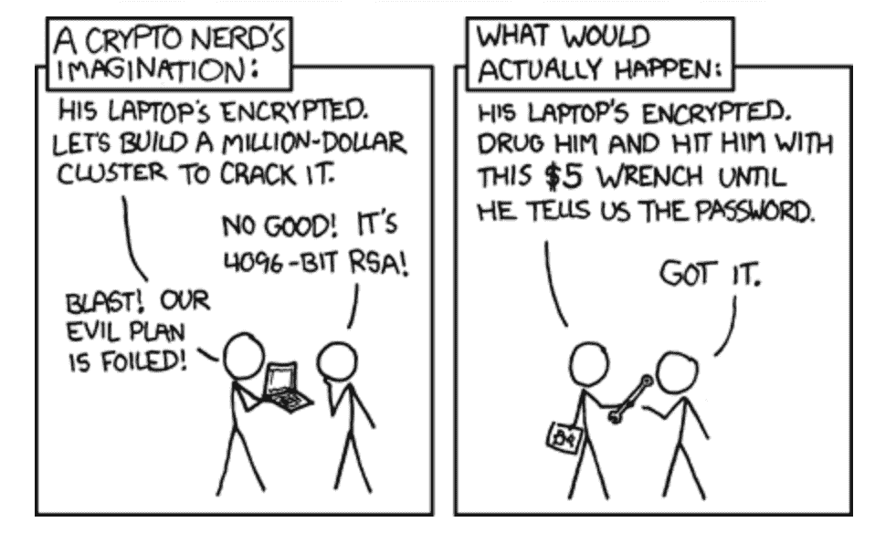

# 个人数字安全——初学者如何在线保护自己

> 原文：<https://www.freecodecamp.org/news/personal-digital-security-an-intro/>

如何在网上保护自己，而不必记住一百万个不可能的密码？

这是一个(实际上)容易实现的指南，它在数字上相当于当你离开时锁上你的房子。

采取这些步骤不会让你防黑客入侵(就像锁你的房子不会让你的房子防盗一样)，但它会让你在网上更安全。它也不会让你的数字生活变得比随身携带钥匙让你的日常生活变得更加困难。

如果你确信这是太多的工作，一次从一个项目开始。如果你真的坚持不读完整的清单，从这里的前 5 项开始。

## 如何在网上保护自己

### 在您的所有设备上设置密码

在所有设备上设置密码——如笔记本电脑、手机、平板电脑、路由器等——是首要任务。

对于任何仍然启用默认密码的设备，更改它们(想想你的 wifi 路由器，像亚马逊的 Blink 这样的家庭摄像系统，或者智能电视)。

不要重复使用您的密码。这可能非常困难，但像密码管理器这样的工具可以使这变得容易得多。这就把我们带到了...

### 使用密码管理器

密码管理器允许您创建一个“主密码”,然后为每个帐户安全地存储(并生成)强有力的唯一密码。它们为您提供了为每个帐户设置单独密码的安全性，但也提供了只需记住一个密码的便利性。

我喜欢[1 password](https://1password.com/sign-up/)(3 美元/月)，因为它有一个应用程序和一个浏览器扩展(所以它可以在应用程序和设备之间自动填充你的密码)，但 [KeePass](https://keepass.info/) 是一个安全的免费选项。

密码管理器还允许您安全地存储各种信息，如保险号、银行帐户数据等。你可以把它想象成一个装有你所有重要文件的防火箱。

第一次设置它(并把你所有的账户和密码放入其中)是一个巨大的痛苦。所以现在就去做吧。说真的，我会等的。

### 返回并执行步骤 2。

至少把你的银行和信用卡账户、电子邮件账户和社交媒体放入你的新密码管理器。每天花 5 分钟将新帐户添加到您的密码管理器中。随着时间的推移，这将为你节省大量的时间和压力。

为什么？通常，当密码泄露时，黑客会使用一种叫做“凭据填充”的方法。这意味着他们将获取该密码，并将其插入一个自动化工具，该工具将尝试在尽可能多的账户中使用该密码。如果你所有的账户都有相同的密码，要么你的账户会被攻破，要么每次你听到新的密码被攻破时，你都必须更改所有的密码。

跳过压力，获得一个密码管理器(另外，设置(免费！)提醒[这里](https://haveibeenpwned.com/)这样你就知道你的账户数据什么时候被泄露了)。

### 更新一切。

不要点击那些弹出更新的推迟或忽略。软件更新通常是为了应对报告的安全漏洞而发布的。让您的设备不打补丁会使它们容易受到攻击。

### 定期备份您的数据

万一你感染了恶意软件，你会想要备份你的数据。您可以使用 iCloud(但请确定您使用了安全密码！)，其他云服务，或者物理硬盘(我用的是[这个](https://www.amazon.com/Western-Digital-Elements-Portable-External/dp/B06W55K9N6/ref=sxin_16_mod_primary_new?asc_contentid=amzn1.osa.f1ae4c39-ef0f-4c9f-b46f-599439a8839a.ATVPDKIKX0DER.en_US&asc_contenttype=article&ascsubtag=amzn1.osa.f1ae4c39-ef0f-4c9f-b46f-599439a8839a.ATVPDKIKX0DER.en_US&creativeASIN=B06W55K9N6&crid=QOGPNSQKBZTP&cv_ct_cx=1tb+hard+drive&cv_ct_id=amzn1.osa.f1ae4c39-ef0f-4c9f-b46f-599439a8839a.ATVPDKIKX0DER.en_US&cv_ct_pg=search&cv_ct_we=asin&cv_ct_wn=osp-single-source-earns-comm&keywords=1+tb+harddrive&linkCode=oas&pd_rd_i=B06W55K9N6&pd_rd_r=79c6fe5b-c726-4bb9-9535-bd2d3e9d3f73&pd_rd_w=jI01U&pd_rd_wg=HwiQE&pf_rd_p=5846ecd6-3f37-4a28-8efc-9c817c03dbe9&pf_rd_r=7HWG05FMQXGZXSAC25KV&qid=1643406423&sbo=RZvfv%2F%2FHxDF%2BO5021pAnSA%3D%3D&sprefix=1+tb+hardrive%2Caps%2C126&sr=1-2-64f3a41a-73ca-403a-923c-8152c45485fe&tag=pcwosp-20))。

### 使用杀毒软件(并定期更新)。

如果你负担得起，杀毒是个好主意。它并不完美，但总比什么都没有好，对于普通用户来说通常是个好主意。我用的是[恶意字节](https://www.malwarebytes.com/lp/sem/en/?gclid=CjwKCAjw4MP5BRBtEiwASfwAL9UcYA_lZYmyPRvqH48JTttDU3vtu_mWGINP1KVObSrkMI7GnID_5xoC8dUQAvD_BwE)。

### 限制您拥有的联网设备的数量。

在购买具有互联网连接的设备之前，请三思。一个联网的水壶值得潜在的安全漏洞吗(剧透:通常不值得。)?

物联网设备很少更新，通常在设计时没有考虑安全性。这意味着它们经常漏洞百出。如果它们在你家的 wifi 网络上，黑客就很容易进入。

通常(但不总是)，更昂贵的设备会更好地保护您的安全。

### 定期检查你的社交媒体隐私设置。

你可能会对分享的信息量感到惊讶。创建新的社交媒体账户或帖子时，在发布之前要三思。黑客掌握的你的信息越多，他们的工作就越容易。

尽量避免在你的社交媒体页面上发布太多个人信息，也避免发布信用卡或登机牌照片之类的东西。

对于依赖社交媒体作为收入来源的人来说，在发布照片和视频之前，删除其中的元数据(元数据可以包括特定的位置和设备信息，任何查看照片/视频的人都可以访问这些信息)。

### 避免连接免费 Wifi 热点。

免费 wifi 热点经常成为黑客攻击的目标，会使您面临 MitM 攻击(中间人攻击)的风险，黑客会监视您的互联网流量，甚至可能在您不知情的情况下修改流量。

如果你不能避免连接到这些热点，购买 VPN 服务。

### 购买 VPN 服务。

VPN(虚拟专用网络)提供在线隐私和匿名。这可以保护您，即使您连接到公共 wifi 热点。

我建议使用一个可以安装在多个设备上的，启用自动连接(这样一旦你连接到互联网，你就会自动连接到 VPN)，并选择你希望你的流量来自哪个国家。

TOR 浏览器是一项免费服务，但是它不太方便，而且会降低你的连接速度。

### 在您的主要电子邮件帐户上启用多因素身份验证。

也称为 MFA，或 2 因素身份验证的 2FA。这意味着，即使有人有你的密码，他们也无法访问你的帐户。

多因素认证要求你有两样东西可以登录:你知道的东西(你的密码)和你拥有的东西(来自短信的代码，来自 Google Authenticator 等应用的代码，或 YubiKey 等硬件密钥)。

一个硬件钥匙最好，其次是 app，再其次是短信(还是聊胜于无)。

如果你感觉真的很有动力，也在你的其他客户上这样做，但至少在你最重要的客户上这样做。支持 2FA 的网站的完整列表，请点击[这里。](https://twofactorauth.org/)

### 使用端到端加密聊天应用程序。

端到端加密意味着您的数据在设备上被加密，并且没有人可以在传输过程中阅读或更改您的消息(不是您的互联网服务提供商(ISP)、黑客等)。

为了让某人阅读这种类型的消息，一般来说黑客必须已经能够访问您的设备。iMessage、WhatsApp、Wickr 和 Signal 都是免费选项，如果你在开始聊天时选择了“秘密”选项，Facebook Messenger 是安全的。

就我个人而言，我强烈推荐 Signal，因为它是开源的，免费的，并且不属于任何主要的技术公司。

### 查看 [MySudo](https://mysudo.com/mysudo-plans/) 和[隐私](https://privacy.com/)。

MySudo 通过一个应用程序提供电话号码，套餐起价为每月 0.99 美元。

这些真的非常适合在约会应用程序、送餐应用程序或任何其他你不想给出个人号码的时候使用(因为你的个人电话号码被用作密码重置选项或多因素身份验证的一种形式)。

他们还提供虚拟借记卡(尽管 Privacy 免费提供更好的虚拟卡选项)。可以把这想象成用预付费 Visa 卡支付的网络版。你可以为每一笔网上购物拥有一个唯一的借记卡号，这样你就不必担心下一次供应商被攻破，信用卡信息被盗。

### 最后，上网要小心。

警惕点击来自未知发件人的链接(在陌生的社交媒体请求、文本或电子邮件中)，避免运行 Adobe Flash 等程序(众所周知，这种程序不安全)，避免可能给你带来恶意软件的网站(成人视频流媒体网站经常加载恶意内容，免费流媒体或下载网站也是如此)。

如果您需要访问电子邮件中的链接(如来自银行或社交媒体帐户的提醒)，请直接导航到应用程序或网站，而不是点按电子邮件中的链接。

说到底，不要想太多。

[https://xkcd.com/538/](https://xkcd.com/538/)

想了解更多？

*   [如果您的信息遭到数据泄露，该怎么办](https://megankaczanowski.com/how-to-protect-yourself-online/)
*   [避免被黑的主板指南](https://motherboard.vice.com/en_us/article/d3devm/motherboard-guide-to-not-getting-hacked-online-safety-guide)
*   [数字安全有线指南](https://www.wired.com/2017/12/digital-security-guide/)