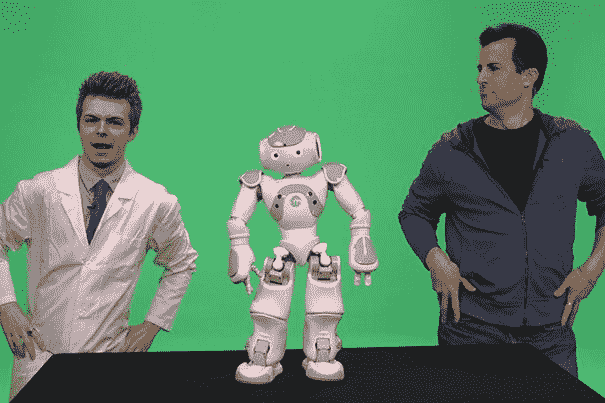

# 哈佛 CS50 的 David Malan 和 Colton Ogden 分享了他们的免费在线计算机科学课程-播客的历史

> 原文：<https://www.freecodecamp.org/news/podcast-harvard-cs50s-david-malan-and-colton-ogden-on-computer-science/>

大卫·马兰直到上大学才写过一行代码。

甚至当他被哈佛的计算机科学入门课程 CS50 录取时，他也以及格/不及格来对待这门课程，因为他担心自己无法处理这些材料。

一晃 20 年过去了——大卫现在已经获得了计算机科学的博士学位，并且正在教授这门课程。它已经变成了一门课程。

CS50 现在是哈佛最受欢迎的课程。多亏了大卫和他的同事们的努力，成千上万的人已经在网上免费学习了这门课程。

我们最近在 freeCodeCamp 的 YouTube 频道上发布了课程的讲座[——包括](https://www.youtube.com/watch?v=F0WoVEr0-44&list=PLWKjhJtqVAbmGw5fN5BQlwuug-8bDmabi) [CS50 游戏开发课程](https://www.youtube.com/watch?v=jZqYXSmgDuM&list=PLWKjhJtqVAbluXJKKbCIb4xd7fcRkpzoz)——全部免费且无商业广告。

我就这些课程及其背后的历史采访了大卫和科尔顿·奥格登。

他们分享了如何有效学习计算机科学的技巧，以及给老师和社区领袖的一些建议。

科尔顿分享了他最喜欢的游戏开发技巧之一，大卫告诉我们 CS50 标语背后的故事:“这是 CS50”

我很清楚大卫·马兰和科尔顿·奥格登非常关心他们的学生和整个计算机科学领域。

本周，在你的一次通勤或锻炼中，抽出时间来听听这个采访。这是两个小时的实景采访-没有介绍，结尾，或广告休息-所以我们能够进入丰富的细节。

你可以在你最喜欢的播客播放器应用程序中收听——只需搜索“freecodecamp”，你应该会找到它。

如果你有亚马逊 Echo，你可以直接说“Alexa -播放 freeCodeCamp 播客”

或者你可以在你的浏览器里听它[。](https://podcast.freecodecamp.org/ep-71-harvard-cs50s-david-malan-and-colton-ogden-on-computer-science)

## 显示注释:

在 Twitter 上关注 CS50:[https://twitter.com/cs50](https://twitter.com/cs50)

订阅 CS50 播客:[https://podcast . apple . com/us/podcast/CS50-podcast/id 1459708246](https://podcasts.apple.com/us/podcast/cs50-podcast/id1459708246)

测试 CS50 的集成开发环境:[https://ide.cs50.io/](https://ide.cs50.io/)

还有 CS50 的沙盒:[https://sandbox.cs50.io/](https://sandbox.cs50.io/)

考顿在 N64 上提到的关于生化危机 2 的文章(PDF):[https://tw video 01 . ubm-us . net/O1/vault/GD _ Mag _ Archives/GDM _ 2000 年 9 月 _ PDF](https://twvideo01.ubm-us.net/o1/vault/GD_Mag_Archives/GDM_September_2000.pdf)

史蒂夫·鲍尔默 CS50 嘉宾演讲:[https://www.youtube.com/watch?v=7lhlKF6MECs](https://www.youtube.com/watch?v=7lhlKF6MECs)

史蒂夫·鲍尔默对 CS50 本身的推销:[https://www.youtube.com/watch?v=El2mr5aS8y0](https://www.youtube.com/watch?v=El2mr5aS8y0)

有趣的事实:Brian Kernighan，David 提到他是 CS50 的老师，也是 C 编程语言的共同创造者。他甚至在 freeCodeCamp 程序员扑克牌里有自己的牌:[https://www . freeCodeCamp . org/news/introducing-Programmer-Playing-Cards-D3 eeeffe 9a 11/](https://www.freecodecamp.org/news/introducing-programmer-playing-cards-d3eeeffe9a11/)