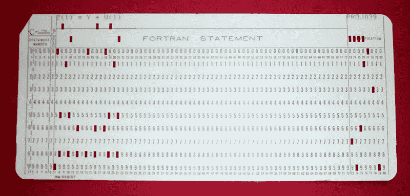

# 实用数据科学:修补匠、裁缝、士兵、间谍

> 原文：<https://www.freecodecamp.org/news/practical-data-science-tinker-tailor-soldier-spy-5c23401999fe/>

作者:米歇尔·琼斯

# 实用数据科学:修补匠、裁缝、士兵、间谍

我是作为一个失败者来到数据科学和统计学的。获得心理学硕士学位后，我申请了大约 30 份与心理学相关的工作，但都没有成功。我甚至都没进入面试阶段。后来，我看到了一则招聘研究人员的广告，从此开始了我在政府部门 21 年的应用统计职业生涯。一路走来，我获得了统计学研究生资格。

**我的编码历史**

我的第一个代码是在 SPSS PC 版做硕士论文的时候。回到 1995 年，当我在写论文的时候，统计软件的用户界面非常简单。我使用菜单系统创建了我需要的第一组代码。接下来，我将这段代码复制粘贴到下一批对其他变量的分析中，只修改了与变量名相关的部分。

At least it wasn’t punch cards. [Image credit](https://en.wikipedia.org/wiki/Fortran#/media/File:FortranCardPROJ039.agr.jpg).

使用代码直接让我了解了代码是如何工作的:命令、命令选项和行尾标记。这让我努力思考我在分析中需要哪些选项，因为我输入了它们。这就是我接触编码的方式。它也比使用菜单系统更快。

大约在同一时间，我对 SAS 第 6 版有了一个温和的介绍，以帮助一位教授进行数据分析。代码已经写好了，我只是修改它来更新分析。这个版本的 SAS 只有一个程序编辑器，我读了许多硬拷贝的 SAS 用户指南。这是我对没有菜单系统的编码的介绍，一开始我犯了很多错误。我的特殊技能是不能关闭字符串的引号。

从这里开始，在接下来的 21 年里，我在政府的各个岗位上使用统计软件。我用过 SPSS，SAS，R，Stata。我学过 VBA，主要用于 Excel，也用于 Access。对于我的博士学位，这是我目前的重点，我正在使用 R、VBA、Java 和 Latex。

**修补匠**

数据科学家的主要角色是修补东西。我大约 90%的时间都花在将数据转换成适合分析的格式上。有时这是一个简单但耗时的任务，例如在多个数据仓库提取之间匹配数据，因为第四范式对数据分析没有用。有时，转换可以简单而快速。一个例子是，由于软件中的数据结构假设，将数据从宽格式改为长格式，反之亦然。

更复杂的修补包括将详细数据重新编码成对分析有用的不太详细的格式。例如，人们在调查中回答“其他”回答选项有许多不同的方式，但这些都需要编码以便分析。

Sometimes it’s important to compare apples and oranges, and sometimes we just want to know about fruit. [Image credit](https://www.flickr.com/photos/microassist/7268711202).

**裁缝**

对你如何在一个组织中编码影响最大的是文化。文化控制着使用什么软件，可以引入什么软件，以及您的代码将如何与其他人员交互。有时你的同事会想要报告。有时你的同事是主题专家，会帮助你重新编码。有时，你需要为同事提供一个编码解决方案。你可能是许多使用软件做分析的职员之一。

您必须定制您的解决方案来满足这些需求。为报告分析数据是标准的数据科学家任务，可以用任何统计软件来完成。您是唯一使用该软件的人，编码的复杂性只有您自己看得见。您的限制是可以使用的软件。

与员工一起定制数据也很容易做到。一个例子是将开放式回答重新编码为综合类别进行分析。我倾向于使用 Excel，因为大多数组织都有这个软件，所有员工都可以访问它，但是任何可以处理数据行的软件都是有用的。在与同事讨论了问题和解决方案后，我将数据转储到 Excel 中的一个单独的列中，带有一个标题行，然后传递出去。

有时，在第一次分析完成之前，定制数据的需求并不明显。一个变量可以用相对较少的子类来收集。例如，关系状态，并且您发现一个子类别的结果将在误差范围内。您可能希望重新编码数据，以便将该子类别与另一个逻辑子类别合并。这个新的、合并的子类别将被重命名为更合适的名称，以反映新的内容。

剪裁代码供同事使用可能很容易。如果你的同事使用相同的统计软件，提供带有注释和说明的软件代码可能是所有需要的。员工通常没有统计软件，只需要他们使用的软件中的解决方案。那个软件很可能是 Excel。您的任务范围从检查公式到在启用宏的 Excel 工作簿中提供 VBA 宏。

**士兵**

大多数员工不理解你的工作。他们看到你生产什么，但他们对你如何生产没有知识和兴趣。正如我前面所说的，您大约 90%的角色是繁重的工作，因为数据很少以适合分析的形式出现。如果是这样，另一个数据科学家已经替你做了繁重的工作。

其他繁重的工作是试图让代码工作，也许是实现一个不同的解决方案。例如，我曾经犯过一个错误，试图在 R 中对几百万条记录使用 for-next 循环。这是在我发现 R 使用矢量化之前，矢量化使解决方案成为一行程序。

The data fairy who actually does all of the hard work for me. [Image credit](https://pixabay.com/en/angel-feathers-female-magic-wand-1298818/).

**间谍**

在你开始做任何事情之前，确保你知道你的同事客户想要什么，尤其是那些需要很多时间的事情。人们可以不具体，例如简单地说他们需要一份报告。

你用间谍的伎俩。将如何使用该报告？他们需要详细的分析还是只需要高层次的分析？比如你是不是分别按性别和年龄分析，而不是按性别和年龄综合分析？人们想要数据的细目分类吗？用桌子。人们想要一张粗线条的图片吗？使用图表。如果报告很长，每章应该关注什么？哪些分析最适合该报告？员工希望强调什么类型的结论？

**提示**

保存临时数据集，不要覆盖它们。例如，如果我从另一个文件类型中读取。csv，我总是保存新导入的数据集。我在那个数据集上进行数据操作，但是保存到不同的数据集。这样，当操作出错时(它们会出错)，您不需要再次从头开始引入数据。如果分析结果中有些地方很奇怪，比如有一个类别是空白的，你可以看看是原始数据的问题还是你做的什么。

记住注释你的代码，为了清晰而不是效率而编码。很多次，我不得不回到 6 个月、1 年、2 年前写的代码，找出我做了什么，为什么要那样做。

当处理多行代码时，我使用注释标题块来划分代码。当您只需要再次运行部分代码，并且您正在试图找到需要重新运行的代码时，这很有用。

当处理大量用于编写报告章节的代码时，我将每一章的分析分成不同的代码文件。每个代码文件在文件名中都有相关的章节号。

假设没有人会对你的工作进行同行评议。在分析之前，检查数据，确保其合理。我用频率表来做这个。这是一种快速查看是否存在意外类别或包含太少数据而无法准确报告的类别的方法。

**最后**

作为一名数据科学家，你是软件专家。根据组织的需要和资金，你可以建议应该使用什么软件。你可能需要进行或帮助进行正式的员工培训。当人们在使用软件时遇到问题时，你很可能是那个打电话和发邮件的人。你将与 ICT 部门有很多互动。

**我工作的一些例子**

这篇报道的第四章是关于警方追捕的。我用了特种空勤团。

关于新西兰公共服务部门[性别薪酬差距](http://www.ssc.govt.nz/wp15)的工作论文，是我被引用次数最多的出版物之一。数据用 SPSS 软件进行分析。

我唯一的独立作者[发表了文章](http://onlinelibrary.wiley.com/doi/10.1111/nbu.12075/abstract)(在付费墙后面)，并且使用了其他人的数据。我只用了 Excel。

一篇发表的文章(不在付费墙后面)中，我用图表获得了[乐趣，这些是在 r 中完成的。我在编码之前在纸上画出了草图。](https://www.sciencedirect.com/science/article/pii/S0273230016302276?via%3Dihub#fig1)

这个[研究和报告](http://www.foodstandards.gov.au/publications/Pages/consumerlabelsurvey2015.aspx)花了 2 年多时间。大部分分析是在 Stata 中执行的，并由 R 补充用于决策树分析。这些图表是使用 Stata 的结果在 Excel 中生成的。