# 如何使用 Python 和 Pandas 绘制重大风暴、悲观情绪和硬数据

> 原文：<https://www.freecodecamp.org/news/python-pandas-major-storms-hard-data/>

有时候，回想现在的情况比过去的好时光糟糕了多少，多少会让人感到安慰。

“孩子们没有尊重。”

“所有东西都太贵了。”

“公职人员不会激发信任。”

“天气怎么样？我们从来没有使用过这么多毁灭性的飓风，不是吗？”

嗯，我已经够老了，在这个街区逛过几次，但我不确定。我小时候并不完全是天使，东西总是比我们想要的要贵，政府官员从来都不是这个星球上最受欢迎的人。但是大风暴呢？我不知道。

事实证明，有很多优秀的风暴数据，所以我们没有理由不至少搜索一些线索。我试图将数据分析添加到我现有的专业工具中可能会有所帮助。

不过，首先，我们应该仔细定义一些术语，并补充一些背景细节。

## 什么是大风暴？

飓风--或者更准确地说，热带气旋--是“热带的”,因为它们在热带地区的海洋上形成。术语“热带”是指地球表面位于赤道以南和以北 23 度以内的区域。

风暴被称为“旋风”，因为它们的风的运动是周期性的(南半球是顺时针方向，北半球是逆时针方向)。

龙卷风是由蒸发的海水形成的，并在其身后留下猛烈的雷暴——尤其是在经过有人居住的陆地区域后。

从广义上讲，持续风速在 34 到 63 海里/小时(或 39 到 72 英里/小时)的风暴被认为是热带风暴。风速超过 64 节(73 英里/小时)的风暴是飓风(或者，在西太平洋或北印度洋，是台风)。

飓风分为一到五级，其中五级飓风最为猛烈和危险。

## 主要的风暴数据来自哪里？

在过去的一个半世纪里，至少在美国，存在可靠且大体一致的历史风暴数据。但是，要正确理解这些数据的背景，需要了解这些年来是如何进行观察的。

直到 20 世纪 40 年代，大多数观测都是由远洋船舶的船员进行的。但是船员只能观察和报告他们所看到的，他们所看到的将由他们去的地方决定。

在 1914 年巴拿马运河开通之前，航行于欧洲和太平洋之间的船只会沿着一条绕过南美洲南端的路线航行，这条路线基本上没有经过美国沿海地区。因此，很可能很大一部分天气事件只是被忽略了。

类似地，20 世纪 40 年代飞机侦察的出现会让科学家们捕捉到更多以前可能被遗漏的事件。自 20 世纪 60 年代以来，气象卫星的使用使我们能够捕捉到几乎所有的海洋活动。

这些变化及其对风暴数据的影响，在本页中得到了简洁的总结[，来自美国政府国家海洋和大气管理局(NOAA)网站，基于为地球物理流体动力学实验室(GFDL)进行的](https://www.gfdl.noaa.gov/historical-atlantic-hurricane-and-tropical-storm-records/)[数据分析研究](https://www.gfdl.noaa.gov/wp-content/uploads/files/user_files/gav/publications/vk_08_recount.pdf)。

## 历史记录显示了什么？

那么，在所有这些背景之后，这些数据实际上说明了什么呢？现在严重的飓风比过去更常见吗？根据美国国家海洋和大气管理局的网站，答案是:“不”。

> “持续 2 天以上的大西洋热带风暴数量没有增加。持续时间不到两天的风暴急剧增加，但这可能是由于更好的观测...我们不知道气候变化信号会导致持续时间最短的风暴增加，而这种增加在质量上与人们对观测实践改进的预期一致。”

通过阅读研究本身，你会了解整个故事，包括对他们所做的数据处理选择的一个很好的解释。事实上，我鼓励你去阅读那项研究，因为它是专业人士处理数据问题的一个很好的例子。

然而，从现在开始，你将会陷入我的业余和简化的尝试中，去可视化原始的、未调整的数据记录。

## 美国飓风数据:1851-2019 年

我们“美国大陆飓风影响/登陆”数据的来源是【NOAA 网页。

为了下载数据，我简单地通过点击左上方的鼠标(“年份”标题字段)并一直拖到右下方来复制它。然后，我将它粘贴到本地计算机上的纯文本编辑器中，并保存到一个扩展名为`.csv`的文件中。

### 如何清理飓风数据

如果你快速浏览网页，你会看到一些需要清理的格式。每一个十进制都有一行，除了一个类似于`1850s`的字符串之外什么也不包含。我们只想删除那些行。没有事件的年份在第二列中包含字符串`none`。这些也需要取消。

有些事件显然没有最大风速的数据。这些事件的速度值由五个破折号(`-----`)表示，而不是一个数字(以节为单位)。我们必须把它转换成我们能使用的东西。

最后，虽然月份通常由三个字母的缩写表示，但有几个事件跨越了两个月。所以我们将能够正确地处理它们，因此我将把`Sp-Oc`和`Jl-Au`分别转换成`Sep`和`Jul`。

事实是，我们实际上不会使用 month 列，所以这实际上没有什么区别。但这是一个很好的工具。

以下是我们在 Jupyter 的设置:

```
import pandas as pd
import matplotlib as plt
import matplotlib.pyplot as plt 
import numpy as np

df = pd.read_csv('all-us-hurricanes-noaa.csv') 
```

让我们看看每一列的数据类型。我们可以忽略 States 和 Name 列中的字符串——反正我们对它们不感兴趣。但是我们需要对日期和最大风速列做些什么——它们不会像`object`那样给我们带来任何好处。

```
df.dtypes

Year                                         object
Month                                        object
States Affected and Category by States       object
Highest\nSaffir-\nSimpson\nU.S. Category    float64
Central Pressure\n(mb)                      float64
Max Wind\n(kt)                               object
Name                                         object
dtype: object 
```

因此，我将在`Year`列中过滤出字母`s`的所有行，并简单地删除它们(`== False`)。这将处理所有的十进制标题(也就是说，那些包含作为类似于`1850s`的一部分的`s`的行)。

类似地，我将删除在`Month`列中包含字符串`None`的行，以排除没有风暴事件的年份。

虽然平静的年份可能会对我们的可视化产生一些影响，但我怀疑将它们与某种空值包含在一起可能会使事情向相反的方向发展。它们也会使我们的视觉化变得非常复杂。

最后，我将替换这两个多月行。

```
df = df[(df.Year.str.contains("s")) == False]
df = df[(df.Month.str.contains("None")) == False]
df = df.replace('Sp-Oc','Sep')
df = df.replace('Jl-Au','Jul') 
```

接下来，我将使用简便的 Pandas `to-datetime`方法将三个字母的月份缩写转换为 1 到 12 之间的数字。格式代码`%b`是 Python 合法的与日期相关的名称之一，它告诉 Python 我们正在使用三个字母的缩写。完整的名单，见[这一页。](https://www.w3schools.com/python/gloss_python_date_format_codes.asp)

```
df.Month = pd.to_datetime(df.Month, format='%b').dt.month 
```

我想把标题收紧一点，这样它们在我们的代码中更容易阅读和引用。`df.columns`会将所有列标题值更改为我在此处指定的列表:

```
df.columns =['Year', 'Month', 'States', 'Category', 
             'Pressure', 'Max Wind', 'Name'] 
```

我必须将年份数据从字符串对象转换成整数，否则 Python 不知道如何恰当地处理它们。这是使用`astype`完成的。

正如宣传的那样，我还将把`Max Wind`中的空值(`-----`)转换成`NaN`——NumPy 将把它读作“不是一个数字”然后我会将`Max Wind`中的数据从`object`转换到`float`。

```
df = df.astype({'Year': 'int'})
df = df.replace('-----',np.NaN)
df = df.astype({'Max Wind': 'float'}) 
```

让我们看看现在的情况:

```
df.dtypes

Year          int64
Month         int64
States       object
Category    float64
Pressure    float64
Max Wind    float64
Name         object
dtype: object 
```

好多了。

### 如何呈现飓风数据

现在，看看我们的数据，我将建议我们分解三个指标:飓风类别、气压和最大风速。

我的想法是，把它们混为一谈，从增加的复杂性中不会获得什么好处，而且我们可能会忽视较轻和较严重风暴事件之间的重要差异。

当然，我总是可以分离出单个的指标来看看它们的分布情况。例如，用`value_counts`对`Category`列，我发现较轻的 1 级和 2 级飓风比更危险的事件更频繁。

```
df['Category'].value_counts()

1.0    121
2.0     83
3.0     62
4.0     25
5.0      4
Name: Category, dtype: int64 
```

绘制完整数据集的单一直方图确实给我们提供了历史上事件数量(在 y 轴上表示)的一个很好的概览，但是在这个过程中我们可能会丢失一些更好的细节。

从这张柱状图中，很明显，风暴的频率并没有随着时间的推移而发生明显的变化。为了确保我对我们使用的箱数的选择不会无意中掩盖重要的趋势，请尝试 25 以外的其他值。

```
df.hist(column='Year', bins=25) 
```

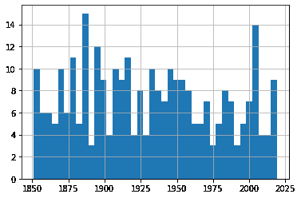

All Hurricane Events

但是为了让我们关注每个指标，我将绘制三个单独的图表。为此，我将创建三个新的数据帧，并用`Year`列和相应的数据列的内容填充每个数据帧。

```
df_category = df[['Year','Category']]
df_wind = df[['Year','Max Wind']]
df_pressure = df[['Year','Pressure']] 
```

将每一个数据帧直接发送到绘图中将会忽略要点，因为它不会区分风暴的严重程度。因此，我将向您展示我们如何按类别(1-5)分解数据。这个`for`循环将遍历数字 1-6(这是返回 1 到 5 之间的数字的“Python ”),并依次使用这些数字来搜索该类别的飓风。

其类别与数字相匹配的行将被写入一个名为`df1`的新(临时)数据帧，该数据帧将依次用于绘制直方图。`plt.title`行为打印的图形应用了一个标题，该标题将包括类别号(`converted_num`的当前值)。

该循环将遍历该过程五次，每次都将当前类别的事件数写入`df1`。所有五个直方图将被一个接一个地打印出来。

```
for x in range(1, 6):
    cat_num = x
    converted_num = str(cat_num) 
    dfcat = df_category['Category']==(x)
    df1 = df_category[dfcat]
    df1.hist(column='Year', bins=20)
    plt.title("Total Category " + (converted_num) + " Events") 
```

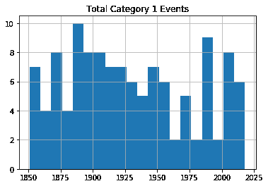

Category 1 Hurricanes

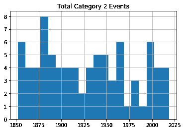

Category 2 Hurricanes

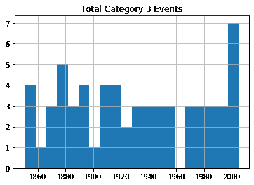

Category 3 Hurricanes

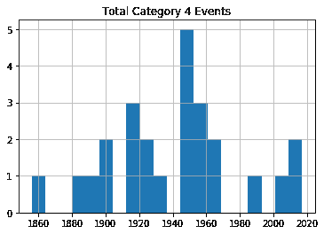

Category 4 Hurricanes

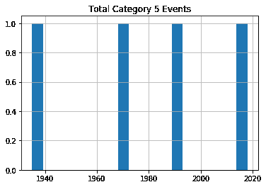

Category 5 Hurricanes

正如你所看到的，没有明显的证据表明风暴频率会随着时间的推移而显著上升。

像往常一样，扫描你的数据(使用像`value_counts()`这样的工具)以确认这些图在现实世界中是有意义的。

## 美国热带风暴数据:1851-1965 年，1983-2019 年

当然，飓风只是故事的一部分。破坏性热带风暴频率的上升也是令人担忧的原因。

幸运的是，NOAA 提供的相关数据与飓风数据的格式基本相同。[这是](https://www.aoml.noaa.gov/hrd/hurdat/uststorms.html)的网页，你可以在这里找到图表。像以前一样将数据复制到一个`.csv`文件中。

但是，请注意，没有 1966-1982 年的数据。不要问我为什么。就是没有。有趣的是，天气。

我将为项目的这一部分创建一个新的 Jupyter 笔记本，因为我们不需要飓风版本的任何东西。因此，您将像往常一样进行设置:

```
import pandas as pd
import matplotlib as plt
import numpy as np
df = pd.read_csv('all-us-tropical-storms-noaa.csv') 
```

### 让我们整理一下热带风暴的数据

代表无事件年份的行应再次删除:

```
df = df[(df.Date.str.contains("None")) == False] 
```

这个数据集中的`Date`列有指向五个脚注的字符:$、*、#、%和&。脚注包含了重要的信息，但如果我们不删除它们，这些字符会给我们带来悲伤。

这些命令将完成这一任务，将`Date`列中的所有此类字符串替换为空:

```
df['Date'] = df.Date.str.replace('\

接下来，我将重置列标题。首先，因为使用好听、简短的名字会更容易。但主要是因为，作为一名 Linux 系统管理员，我发现文件名或标题中的空格是不道德的。

```
df.columns =['Storm#', 'Date', 'Time', 'Lat', 'Lon', 
             'MaxWinds', 'LandfallState', 'StormName'] 
```

列数据类型需要做一些工作:

```
df.dtypes

Storm#            object
Date              object
Time              object
Lat               object
Lon               object
MaxWinds         float64
LandfallState     object
StormName         object
dtype: object 
```

让我们看看我们的数据是什么样的:

```
df.head()

Storm#	Date		Time	Lat	Lon	MaxWindsLandfallState	StormName
6	10/19/1851	1500Z	41.1N	71.7W	50.0	NY	NaN
3	8/19/1856	1100Z	34.8	76.4	50.0	NC	NaN
4	9/30/1857	1000Z	25.8	97	50.0	TX	NaN
3	9/14/1858	1500Z	27.6	82.7	60.0	FL	NaN
3	9/16/1858	0300Z	35.2	75.2	50.0	NC	NaN 
```

实际上，我不确定那些`Storm #`价值观是关于什么的，但是它们没有伤害任何人。日期的格式比飓风数据的格式好得多。但是我需要把它们转换成新的格式。让我们做对了，用`datetime`走。

```
df.Date = pd.to_datetime(df.Date) 
```

### 如何呈现热带风暴数据

就我们的目的而言，唯一真正重要的数据列是 max winds——因为它定义了风暴的强度。该命令将创建一个由`Date`和`MaxWinds`列组成的新数据帧:

```
df1 = df[['Date','MaxWinds']] 
```

没有理由推掉它:我们还不如马上做一个柱状图。你会立即看到 1970 年左右没有数据的差距。你还会看到，同样，似乎没有太多的上升趋势。

```
df1['Date'].hist() 
```

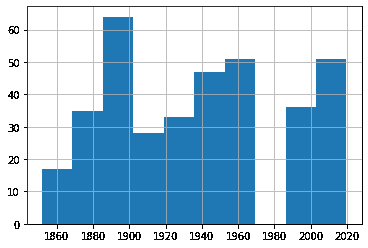

Histogram of All Tropical Storms

但是我们真的应该在这里钻得更深一点。毕竟，这个数据只是把 30 节和 75 节风暴混在一起。我们肯定想知道它们是否以相似的速度发生。

让我们看看我们有多少行数据。告诉我们总共有 362 个事件。

```
print(df1.shape)

(362, 2) 
```

打印我们的数据帧显示出`MaxWinds`值都是 5 的倍数。如果你自己浏览这些数据，你会发现它们的范围在 30 到 70 之间。

```
df1

	Date		MaxWinds
1	1851-10-19	50.0
6	1856-08-19	50.0
7	1857-09-30	50.0
8	1858-09-14	60.0
9	1858-09-16	50.0
...	...	...
391	2017-09-27	45.0
392	2018-05-28	40.0
393	2018-09-03	45.0
394	2018-09-03	45.0
395	2019-09-17	40.0
362 rows × 2 columns 
```

因此，让我们将数据分成四个更小的组，作为不同强度的风暴的合理代表。我创建了四个数据帧，并在它们中填充了较窄范围内的事件(即 30 至 39 节，40 至 49 节，50 至 59 节，60 至 79 节)。这将为我们的活动提供一个合理的参考框架。

```
df_30 = df1[df1['MaxWinds'].between(30, 39)]
df_40 = df1[df1['MaxWinds'].between(40, 49)]
df_50 = df1[df1['MaxWinds'].between(50, 59)]
df_60 = df1[df1['MaxWinds'].between(60, 79)] 
```

让我们确认一下我们选择的分界点是否有意义。这段代码将非常吸引人地打印出四个数据表单的索引中的行数。

```
st1 = len(df_30.index)
print('The number of storms between 30 and 39: ', st1)
st2 = len(df_40.index)
print('The number of storms between 40 and 49: ', st2)
st3 = len(df_50.index)
print('The number of storms between 50 and 59: ', st3)
st4 = len(df_60.index)
print('The number of storms between 60 and 79: ', st4)

The number of storms between 30 and 39:  51
The number of storms between 40 and 49:  113
The number of storms between 50 and 59:  142
The number of storms between 60 and 79:  56 
```

可能有一种优雅的方式将这四个命令合并成一个。但是我的哲学是，我花一个小时去理解的语法永远不会超过五秒钟剪切和粘贴的简单性。永远不会。

我们还可以使用我们的老朋友`value_counts()`更深入地研究数据。这将显示在我们的时间范围内有 71 个 40 节事件和 42 个 45 节事件。

```
df_40['MaxWinds'].value_counts()

40.0    71
45.0    42
Name: MaxWinds, dtype: int64 
```

我们可以绘制一个单线图来显示我们所有的四个子集。此图添加了轴和图标签以及图例，以使数据更容易理解。`subplot(111)`值控制图形的大小。

```
import matplotlib.pyplot as plt
fig = plt.figure()
ax = plt.subplot(111)
df_30['MaxWinds'].plot(ax=ax, label='df_30')
df_40['MaxWinds'].plot(ax=ax, label='df_40')
df_50['MaxWinds'].plot(ax=ax, label='df_50')
df_60['MaxWinds'].plot(ax=ax, label='df_60')
ax.set_ylabel('Wind Speed In Knots')
ax.set_xlabel('Time Between 1851 and 2019')
plt.title('Tropical Storms by Maximum Wind Speeds (knots)')
ax.legend() 
```

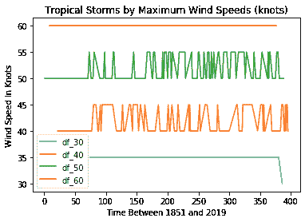

All Tropical Storms

这有助于确认我们没有弄乱数据本身。例如，视觉检查将显示，在我们的数据集中确实只有一个 30 节的事件，并且它发生在 2016 年我们的时间框架的末尾。但这并不是一个展示事件频率变化的好方法。

为此，我们将查看每个数据帧中保存的数据。

```
df_30['Date'].hist(bins=20) 
```

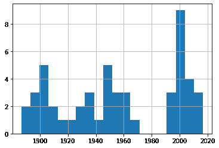

30-39 Knot Events

```
df_40['Date'].hist(bins=20) 
```

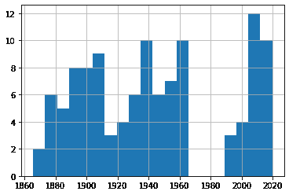

40-49 Knot Events

```
df_50['Date'].hist(bins=20) 
```

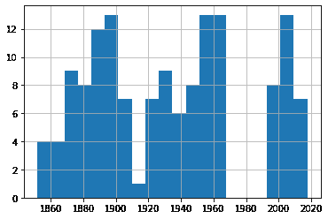

50-59 Knot Events

```
df_60['Date'].hist(bins=20) 
```

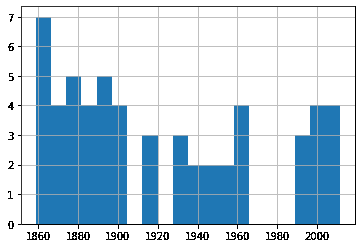

60-79 Knot Events

快速浏览这四幅图，我们会发现在 150 年左右的数据中，事件发生的频率相当一致。再一次，使用不同数量的箱子自己尝试，以确保我们没有错过一些重要的趋势。

****你可以通过****[****大卫·克林顿的网站找到更多的科技含量。****](https://bootstrap-it.com/davidclinton)****特别值得一提的是，你可能会喜欢他的新书，****[****跟上:背景介绍到所有的大技术趋势你都不能忽视****](https://www.amazon.com/gp/product/B08HL9WQ1H/)****。****, '')
df['Date'] = df.Date.str.replace('\*', '')
df['Date'] = df.Date.str.replace('\#', '')
df['Date'] = df.Date.str.replace('\%', '')
df['Date'] = df.Date.str.replace('\&', '') 
```

接下来，我将重置列标题。首先，因为使用好听、简短的名字会更容易。但主要是因为，作为一名 Linux 系统管理员，我发现文件名或标题中的空格是不道德的。

[PRE14]

列数据类型需要做一些工作:

[PRE15]

让我们看看我们的数据是什么样的:

[PRE16]

实际上，我不确定那些`Storm #`价值观是关于什么的，但是它们没有伤害任何人。日期的格式比飓风数据的格式好得多。但是我需要把它们转换成新的格式。让我们做对了，用`datetime`走。

[PRE17]

### 如何呈现热带风暴数据

就我们的目的而言，唯一真正重要的数据列是 max winds——因为它定义了风暴的强度。该命令将创建一个由`Date`和`MaxWinds`列组成的新数据帧:

[PRE18]

没有理由推掉它:我们还不如马上做一个柱状图。你会立即看到 1970 年左右没有数据的差距。你还会看到，同样，似乎没有太多的上升趋势。

[PRE19]


Histogram of All Tropical Storms

但是我们真的应该在这里钻得更深一点。毕竟，这个数据只是把 30 节和 75 节风暴混在一起。我们肯定想知道它们是否以相似的速度发生。

让我们看看我们有多少行数据。告诉我们总共有 362 个事件。

[PRE20]

打印我们的数据帧显示出`MaxWinds`值都是 5 的倍数。如果你自己浏览这些数据，你会发现它们的范围在 30 到 70 之间。

[PRE21]

因此，让我们将数据分成四个更小的组，作为不同强度的风暴的合理代表。我创建了四个数据帧，并在它们中填充了较窄范围内的事件(即 30 至 39 节，40 至 49 节，50 至 59 节，60 至 79 节)。这将为我们的活动提供一个合理的参考框架。

[PRE22]

让我们确认一下我们选择的分界点是否有意义。这段代码将非常吸引人地打印出四个数据表单的索引中的行数。

[PRE23]

可能有一种优雅的方式将这四个命令合并成一个。但是我的哲学是，我花一个小时去理解的语法永远不会超过五秒钟剪切和粘贴的简单性。永远不会。

我们还可以使用我们的老朋友`value_counts()`更深入地研究数据。这将显示在我们的时间范围内有 71 个 40 节事件和 42 个 45 节事件。

[PRE24]

我们可以绘制一个单线图来显示我们所有的四个子集。此图添加了轴和图标签以及图例，以使数据更容易理解。`subplot(111)`值控制图形的大小。

[PRE25]


All Tropical Storms

这有助于确认我们没有弄乱数据本身。例如，视觉检查将显示，在我们的数据集中确实只有一个 30 节的事件，并且它发生在 2016 年我们的时间框架的末尾。但这并不是一个展示事件频率变化的好方法。

为此，我们将查看每个数据帧中保存的数据。

[PRE26]


30-39 Knot Events

[PRE27]


40-49 Knot Events

[PRE28]


50-59 Knot Events

[PRE29]


60-79 Knot Events

快速浏览这四幅图，我们会发现在 150 年左右的数据中，事件发生的频率相当一致。再一次，使用不同数量的箱子自己尝试，以确保我们没有错过一些重要的趋势。

****你可以通过****[****大卫·克林顿的网站找到更多的科技含量。****](https://bootstrap-it.com/davidclinton)****特别值得一提的是，你可能会喜欢他的新书，****[****跟上:背景介绍到所有的大技术趋势你都不能忽视****](https://www.amazon.com/gp/product/B08HL9WQ1H/)****。****