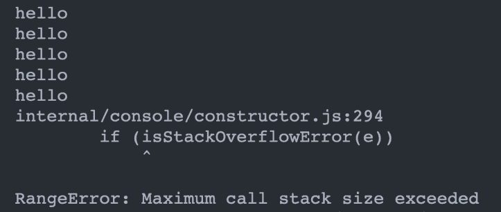

# 递归是如何工作的？用 JavaScript 简化并附有示例

> 原文：<https://www.freecodecamp.org/news/recursion-in-javascript-simplified/>

递归的工作方式类似于 JavaScript 中的循环。只要条件为真，循环就允许您多次执行一组代码。

在本文中，我将解释什么是递归以及它在 JavaScript 中是如何工作的。

在循环中，当条件变为假时，执行停止。如果执行的条件永远保持为真，你会得到一个**无限循环**，这会使你的应用程序崩溃。

递归也是一样——只要递归的条件保持为真，递归就会一直发生，直到某个条件停止它，否则，就会得到一个无限递归。

如果你喜欢的话，这里有这个教程的视频版本:[JavaScript 中的递归，简化的](https://www.youtube.com/watch?v=wCPU8iYiTbE)

所以，现在让我们开始吧...

## 什么是递归？

递归是一个函数调用自己的概念，并且一直调用自己，直到被告知停止。

让我们看一个例子:

```
function printHello() {
  console.log("hello")
}

printHello() 
```

这里，我们声明一个`printHello`函数，它将“hello”记录到控制台。然后，我们在定义之后调用函数。

在递归的情况下，我们也可以像这样从`printHello`函数中调用`printHello`函数:

```
function printHello() {
  console.log("hello")

  printHello()
}

printHello()

// hello - first function call
// hello - second function call
// hello - third function call
// and it goes on infinitely 
```

这就是递归。所以当 JavaScript 执行`printHello()`时，“hello”被打印到控制台，之后，`printHello()`再次被调用。递归是这样发生的:

*   `printHello()`是执行了**的第一个**时间，“你好”被打印到控制台上，而就在这个函数中，`printHello()`被再次调用
*   `printHello()`执行到第**秒**，再次运行`console.log("hello")`，再次调用`printHello()`
*   `printHello()`执行到第三个时间**，再次运行`console.log("hello")`，再次调用`printHello()`**
*   它一直持续下去，直到调用堆栈达到最大值，应用程序崩溃:



Maximum Call Stack Size Exceeded Error

让我们来理解这个错误的含义。

## 什么是调用栈？

调用堆栈是 JavaScript 用来跟踪当前正在执行的函数的一种机制。

当调用一个函数时，它被添加到调用堆栈中。例如，上面的这个函数:

```
function printHello() {
  console.log("hello")
}

printHello() 
```

当要执行这个函数时，它被添加到调用堆栈中:

```
// printHello()
// ----
// call stack 
```

执行后(当所有代码运行时，或者当遇到一个`return`语句时)，函数从堆栈中弹出:

```
// ----
// call stack 
```

例如，如果`printHello`函数像这样调用另一个函数:

```
function printHi() {
  console.log("hi")
}

function printHello() {
  console.log("hello")

  printHi()
}

printHello() 
```

在这种情况下，当调用`printHello`时，调用堆栈将如下所示:

```
// printHello()
// ----
// call stack 
```

运行完`console.log("hello")`行后，下一行是`printHi()`，这个调用被添加到栈顶:

```
// printHi()
// printHello()
// ----
// call stack 
```

`printHi()`调用执行完毕后，弹出堆栈:

```
// printHello()
// ----
// call stack 
```

在`printHello()`执行完毕后，它也被弹出堆栈:

```
// ----
// call stack 
```

那么递归是如何处理调用堆栈的呢？

## 递归和调用堆栈

回到我们上面的递归代码:

```
function printHello() {
  console.log("hello")

  printHello()
}

printHello() 
```

这里发生的是，当执行`printHello()`时，它被添加到调用堆栈中:

```
// printHello()
// ----
// call stack 
```

执行`console.log("hello")`,然后再次执行`printHello()`,并将其添加到调用堆栈的顶部:

```
// printHello()
// printHello() -- "hello"
// ----
// call stack 
```

现在，我们在调用栈中有两个函数:第一个`printHello`和从第一个调用的第二个`printHello`。

在第二个`printHello`执行期间，执行`console.log("hello")`，再次调用`printHello`。现在堆栈看起来像这样:

```
// printHello()
// printHello() -- "hello"
// printHello() -- "hello"
// ----
// call stack 
```

目前的情况是，我们没有任何停止递归的条件，所以`printHello`继续调用自己并填充堆栈:

```
// ...
// printHello() -- "hello"
// printHello() -- "hello"
// printHello() -- "hello"
// printHello() -- "hello"
// printHello() -- "hello"
// printHello() -- "hello"
// ----
// call stack 
```

然后，我们得到调用堆栈大小错误:


Maximum Call Stack Size Exceeded Error

为了避免这种无限递归导致调用栈最大化，我们需要一个条件来停止递归。

## 递归中的一般情况和基本情况

递归中的一种一般情况(也叫递归情况)是导致函数不断递归(调用自身)的情况。

递归的一个基本情况是递归函数的停止点。这是您指定的停止递归的条件(就像停止循环一样)。

这里有一个例子:

```
let counter = 0

function printHello() {
  console.log("hello")
  counter++
  console.log(counter)

  if (counter > 3) {
    return;
  }

  printHello()
}

printHello() 
```

在这里，我们的一般情况并没有显式地陈述，而是隐式地陈述:**如果计数器变量不大于 3，那么函数应该一直调用自己**。

而基本情况，明确地说，是，**如果计数器变量大于 3，函数应该结束执行**。这种情况将导致调用堆栈上的所有递归函数弹出，因为递归已经结束。

这是第一次调用`printHello()`时调用堆栈的样子:

```
// printHello()
// ----
// call stack 
```

然后“hello”被记录，`counter`变量增加 1(这使得 **1** )，并且`counter`变量也被记录。检查基本情况。“`counter`不大于 **3** ，所以条件还不满足。

函数中的下一行是`printHello()`，在调用堆栈中:

```
// printHello()
// printHello() -- "hello" -- 1
// ----
// call stack 
```

“hello”再次被记录，并且`counter`变量被递增并且也被记录。不满足基本情况为“`counter`仍不大于 **3** ”。然后，调用第二个函数中的`printHello()`,调用堆栈如下所示:

```
// printHello()
// printHello() -- "hello" -- 2
// printHello() -- "hello" -- 1
// ----
// call stack 
```

同样的循环发生，再次调用`printHello()`:

```
// printHello()
// printHello() -- "hello" -- 3
// printHello() -- "hello" -- 2
// printHello() -- "hello" -- 1
// ----
// call stack 
```

在“你好”被记录到控制台后，`counter`增加 1(使其成为 **4** )。“4 大于 3”符合我们的基本情况，因此执行`return`语句。

我们返回什么并不重要，但是`return`停止了一个函数的执行。这意味着调用堆栈中的第四个`printHello()`将不能再次调用`printHello()`，因为没有到达那一行。

接下来发生的是，当第四个`printHello()`完成执行时，它被弹出调用堆栈:

```
// printHello() -- "hello" -- 3
// printHello() -- "hello" -- 2
// printHello() -- "hello" -- 1
// ----
// call stack 
```

对于第三个`printHello()`，在它调用自己的那一行之后，在要执行的函数中没有留下任何东西。所以这意味着第三个`printHello()`也已经完成了它的执行，并将被弹出调用堆栈:

```
// printHello() -- "hello" -- 2
// printHello() -- "hello" -- 1
// ----
// call stack 
```

第二个和第一个`printHello()`也是如此，从而使调用堆栈为空:

```
// ----
// call stack 
```

所以你可以看到我们是如何通过提供一个基本案例来避免无限递归的。一个递归函数应该有至少一个基本用例(你可以有任意多个)来确保递归不会永远运行。

有不同的方法可以编写基本案例。在这里，一般情况是显式的，而基本情况是隐式的:

```
let counter = 0

function printHello() {
  console.log("hello")
  counter++
  console.log(counter)

  if (counter < 4) {
      printHello()
  }

  return;
}

printHello() 
```

这里，我们有一个告诉函数保持递归的一般情况。这里的情况是**如果计数器小于 4** 。所以如果遇到这种情况，递归会一直发生。

但是不像前一个例子那样明确的基本情况是**如果计数器不再小于 4** ，则继续下一行。这执行`return`并且功能结束。然后，调用堆栈上的所有东西都开始弹出，因为它们已经完成执行。

## 包扎

递归并不能完全取代循环。但是在某些情况下，递归可能更有效，并且用更少的代码行更容易阅读。

在本文中，您已经学习了递归的概念，即函数在遇到一般情况时调用自己，直到一个基本情况停止它。您还看到了它与循环的比较，以及它如何与调用堆栈一起工作。

作为一个现实生活中的例子，看看我在这里的帖子，我解释了[如何在 JavaScript](https://dillionmegida.com/p/factorial-with-recursion-in-js) 中使用递归找到一个数的阶乘