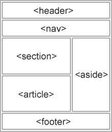

# 语义 HTML5 元素解释

> 原文：<https://www.freecodecamp.org/news/semantic-html5-elements/>

语义 HTML 元素是那些以人类和机器可读的方式清楚地描述其含义的元素。

像`<header>`、`<footer>`和`<article>`这样的元素都被认为是语义性的，因为它们准确地描述了元素的用途和其中的内容类型。

### 什么是语义元素？

HTML 最初是作为一种标记语言创建的，用来描述早期互联网上的文档。随着互联网的发展和被越来越多的人采用，它的需求也发生了变化。

互联网原本是用来分享科学文献的，现在人们也想分享其他东西。很快，人们开始想让网络看起来更漂亮。

因为 web 最初并不是为设计而构建的，所以程序员使用不同的技巧以不同的方式来布局。程序员不用`<table></table>`来描述表格信息，而是用它们来定位页面上的其他元素。

随着可视化设计布局的使用，程序员开始使用通用的“非语义”标签，如`<div>`。他们通常会给这些元素一个`class`或`id`属性来描述它们的用途。例如，这通常被写成`<div class="header">`，而不是`<header>`。

由于 HTML5 仍然相对较新，这种非语义元素的使用在今天的网站上仍然很常见。

### 新语义元素列表

HTML5 中添加的语义元素有:

*   `<article>`
*   `<aside>`
*   `<details>`
*   `<figcaption>`
*   `<figure>`
*   `<footer>`
*   `<header>`
*   `<main>`
*   `<mark>`
*   `<nav>`
*   `<section>`
*   `<summary>`
*   `<time>`

诸如`<header>`、`<nav>`、`<section>`、`<article>`、`<aside>`和`<footer>`等元素的行为或多或少类似于`<div>`元素。它们将其他元素组合成页面部分。然而，如果一个`<div>`标签可以包含任何类型的信息，那么很容易识别哪种类型的信息会进入语义`<header>`区域。

****w3schools 的语义元素布局示例****



## 为什么要使用语义元素？

为了了解语义元素的好处，这里有两段 HTML 代码。第一块代码使用了语义元素:

```
<header></header>
<section>
	<article>
		<figure>
			
			<figcaption></figcaption>
		</figure>
	</article>
</section>
<footer></footer>
```

而第二个代码块使用了非语义元素:

```
<div id="header"></div>
<div class="section">
	<div class="article">
		<div class="figure">
			
			<div class="figcaption"></div>
		</div>
	</div>
</div>
<div id="footer"></div>
```

首先， ****更容易读成**** 。这可能是您在查看第一个使用语义元素的代码块时注意到的第一件事。这是一个小例子，但是作为一个程序员，你可以阅读成百上千行代码。代码越容易阅读和理解，您的工作就越容易。

它有 ****更大的可达性**** 。你不是唯一一个发现语义元素更容易理解的人。搜索引擎和辅助技术(如为有视力障碍的用户提供的屏幕阅读器)也能够更好地理解网站的上下文和内容，这意味着为用户提供更好的体验。

总体来说，语义元素也导致更多的 ****一致码**** 。当使用非语义元素创建一个头时，不同的程序员可能会把它写成`<div class="header">`、`<div id="header">`、`<div class="head">`，或者简称为`<div>`。创建 header 元素的方法有很多种，它们都取决于程序员的个人偏好。通过创建一个标准的语义元素，它使每个人都更容易。

自 2014 年 10 月以来，HTML4 升级到了 HTML5，并加入了一些新的“语义”元素。直到今天，我们中的一些人可能仍然困惑，为什么这么多不同的元素似乎没有显示出任何重大变化。

#### **`<section>`和`<article>`**

“有什么区别？”，你可能会问。这两个元素都用于对内容进行分段，是的，它们肯定可以互换使用。这是在什么情况下的问题。HTML4 只提供了一种容器元素，那就是`<div>`。虽然这仍然在 HTML5 中使用，但 HTML5 在某种程度上为我们提供了`<section>`和`<article>`来替代`<div>`。

`<section>`和`<article>`元素在概念上是相似的，可以互换。要决定您应该选择哪一个，请注意以下几点:

1.  文章旨在独立分发或可重复使用。
2.  节是内容的主题分组。

```
<section>
  <p>Top Stories</p>
  <section>
    <p>News</p>
    <article>Story 1</article>
    <article>Story 2</article>
    <article>Story 3</article>
  </section>
  <section>
    <p>Sport</p>
    <article>Story 1</article>
    <article>Story 2</article>
    <article>Story 3</article>
  </section>
</section>
```

#### **`<header>`和`<hgroup>`**

`<header>`元素通常位于文档、章节或文章的顶部，通常包含主标题和一些导航和搜索工具。

```
<header>
  <h1>Company A</h1>
  <ul>
    <li><a href="/home">Home</a></li>
    <li><a href="/about">About</a></li>
    <li><a href="/contact">Contact us</a></li>
  </ul>
  <form target="/search">
    <input name="q" type="search" />
    <input type="submit" />
  </form>
</header>
```

当你希望一个主标题带有一个或多个子标题时，应该使用`<hgroup>`元素。

```
<hgroup>
  <h1>Heading 1</h1>
  <h2>Subheading 1</h2>
  <h2>Subheading 2</h2>
</hgroup>
```

请记住，`<header>`元素可以包含任何内容，但`<hgroup>`元素只能包含其他头，即`<h1>`到`<h6>`并包括`<hgroup>`。

#### **T2`<aside>`**

`<aside>`元素用于不属于它出现的文本流的内容，但是仍然以某种方式相关。这是你主要内容的侧边栏。

```
<aside>
  <p>This is a sidebar, for example a terminology definition or a short background to a historical figure.</p>
</aside>
```

在 HTML5 之前，我们的菜单是用`<ul>`和`<li>`创建的。现在，有了这些，我们可以用`<nav>`分隔菜单项，以便在页面之间导航。一个页面上可以有任意数量的`<nav>`元素，例如，通常在顶部有全局导航(在`<header>`中)，在侧边栏有局部导航(在`<aside>`元素中)。

```
<nav>
  <ul>
    <li><a href="/home">Home</a></li>
    <li><a href="/about">About</a></li>
    <li><a href="/contact">Contact us</a></li>
  </ul>
</nav>
```

#### **T2`<footer>`**

有`<header>`就一定有`<footer>`。一个`<footer>`通常出现在文件、章节或文章的底部。就像`<header>`一样，内容通常是元信息，比如作者详细信息、法律信息和/或相关信息的链接。在页脚中包含`<section>`元素也是有效的。

```
<footer>&copy;Company A</footer>
```

#### **T2`<small>`**

`<small>`元素经常出现在`<footer>`或`<aside>`元素中，这些元素通常包含版权信息或法律免责声明，以及其他类似的细则。但是，这并不是要缩小文本。它只是描述它的内容，而不是规定呈现方式。

```
<footer><small>&copy;Company A</small> Date</footer>
```

#### **T2`<time>`**

元素允许将明确的 ISO 8601 日期附加到该日期的人类可读版本上。

```
<time datetime="2017-10-31T11:21:00+02:00">Tuesday, 31 October 2017</time>
```

何必纠结于`<time>`？虽然人类可以通过正常方式阅读时间，消除上下文的歧义，但计算机可以阅读 ISO 8601 日期，并看到日期、时间和时区。

#### **`<figure>`和`<figcaption>`**

`<figure>`用于将图像内容环绕在它周围，`<figcaption>`用于为图像添加标题。

```
<figure>
  
  <figcaption>Cover art for Middle-earth: Shadow of Mordor</figcaption>
</figure>
```

### **了解 HTML5 新元素的更多信息:**

*   w3schools 提供了许多新闻元素的简单明了的描述，以及如何/在哪里使用它们。
*   MDN 还为所有 HTML 元素提供了很好的参考，并对每个元素进行了深入研究。