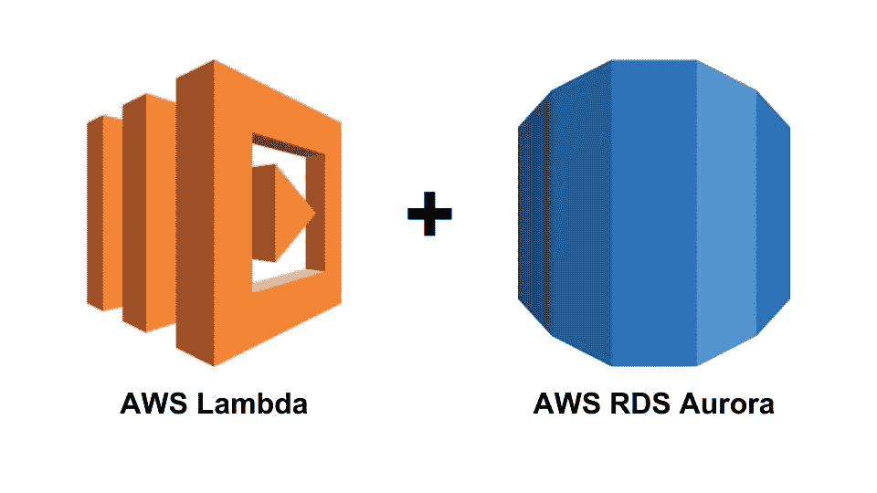

# 无服务器服务与完全托管服务:有何区别？

> 原文：<https://www.freecodecamp.org/news/serverless-fully-managed-service-difference/>

如果您是云技术的新手，您可能会对无服务器技术和托管服务之间的区别感到困惑。

因此，在本文中，您将了解这些术语的含义以及主要区别。

## 什么是托管服务？

托管服务让最终用户专注于使用服务，而不是由 T2 来设置服务。

现在，这并不意味着云提供商能读懂你的想法。相反，服务需要的任何输入都是通过用户友好的表单进行的。

托管服务属于 PaaS 产品类别(平台即服务)。

最著名的托管服务之一是亚马逊的弹性豆茎。在 ElasticBeanstalk 中，你可以
a)设置一些参数
b)提供一个 Docker 图像

服务人员会帮你安排剩下的。它将处理如下事情:

*   虚拟计算机
*   网络服务器(如果需要)
*   向公众公开您的应用程序
*   监控和日志记录基础设施
*   半自动配置
*   负载平衡
*   缩放比例

还有更多。

作为结果，您将能够看到 Elastic Beanstalk 操作的结果，例如被引导的虚拟机。

通常，你不能访问和摆弄它们。否则，它就不是托管服务，您才是管理者。

因此，托管服务本质上是...非托管服务。抽象通常通过 web 表单进行交互。在作为用户的托管服务中，您不需要担心更新、补丁等问题。

这是因为您无法访问这些机器。总得有人洗衣服。通常，您在底层系统上只有有限的选择，如果有的话。这可能是操作系统或所用软件的版本。

相当简单，对吧？让我们来看看更复杂一点的无服务器。

## 无服务器是什么意思？

对于“无服务器”这个词，我们指的是一种不同的计算模型，它不同于面向服务器的“传统”模型。

在面向服务器的计算中(如果你喜欢更复杂的词汇，也可以称之为 serverfull)，我们使用虚拟机或物理机来设置和执行我们的应用程序。

应用程序的可用性和性能等品质与机器的健康密切相关。

随着时间的推移，我们已经完善了集群化解决方案(和其他工具),使机器健康状况的下降变得越来越不重要。

但是，成本如何呢？为什么我们仍然要为闲置或未充分利用的服务器付费(无论是金钱还是 CPU 周期损失)？如果我们需要扩展一个机器集群，为什么这需要时间？

无服务器来了。无服务器符合 FaaS 产品的类别(功能即服务)。

不过，这个名字有点误导——运行代码的服务器实际上是存在的。

你只是不需要关心它，就像在托管服务中一样。然而，Serverless 更进一步——您的应用程序可以在您需要的时候运行，并且运行的时间长短不受限制。没有空闲时间。

您永远无法在虚拟机控制面板中看到服务器，当然，您也不知道关于服务器的任何细节。

无服务器实现通常是事件驱动的。除非发生事件，否则实例是空闲的。

> 需要注意的是:可能有这样一种情况，您已经指示您的服务器不要空闲，这就是所谓的“一对一”。他们变得忙碌，当他们完成时，他们又变得无所事事。如果他们太忙，他们会从其他克隆人那里获得支持(也称为水平扩展)。

## 无服务器的优势

无服务器实现的好处很少。一个很大的问题是它们可以轻松有效地扩展。这是因为它们通常基于轻量级安装介质，如 Docker 映像/容器，并且您不需要提供额外的机器。

理论上，通过无服务器计算，您将拥有提供商的整个云基础设施。当然是各自的成本。:)

说到成本，无服务器代码是按秒计费的，比机器租赁的费用要高。因此，建议您针对相对较短的工作负载运行它。

一些提供商对无服务器代码可以运行多长时间设置了严格的限制。这也是为了避免你的账单上出现不愉快的惊喜。

全栈无服务器及其带来的成本优势的一个显著例子是 acloud.guru。

我记得使用他们的一门课程学习 AWS 架构师认证(顺便说一下，非常棒的内容，强烈推荐)，讲师提到“我们每月支付 400 美元，使用服务器大约 100，000 美元”。

### 无服务器的缺点呢？

无服务器架构的缺点之一与时间关键型应用程序有关。

通常，新部署的无服务器功能会经历某种延迟，也称为“冷启动”。有一些缓解措施可以帮助你处理冷启动，叫做“惊喜，惊喜”的“热启动”。但是您可能希望检查其他体系结构是否有这样的需求。

顺便说一下，云提供商提供的无服务器解决方案(如 AWS Lambda、Azure Functions)实际上也是托管的。这意味着您可以使用高级抽象设置您的无服务器架构，并使用它们提供的表单输入您的首选项/配置。

## 托管服务+无服务器

您现在可能已经发现，无服务器服务和托管服务有一些有趣的相似之处。我们可以这样总结它们:不要担心基础设施，专注于你的商业价值。

有一个非常有趣的公共服务，它有两种风格，托管的和无服务器的。这是 AWS 极光。Aurora 是一个托管数据库，兼容 MySQL 和 Postgresql。

极光有两种口味。有一个托管选项，您可以使用一个表单设置一个数据库，它会启动一些虚拟机并负责它们的运行状况。在这种情况下，您可以专注于部署一个好的数据库模式。

在这种受管方法中，数据库全天候运行。或者至少这是我们的目标，因为它提供了非常高的可用性，并且以与您过去使用的任何数据库服务器相同的方式工作。

还有一种无服务器风格，Aurora 是以无服务器的方式建立的。在这种情况下，您拥有如上所述的全天候“部署”的存储。你不能有无服务器存储，这是矛盾的(至少根据我目前的知识)。:)

但是对数据执行数据操作的过程，比如获取和更新，可以很容易地转换成无服务器函数。

Aurora serverless 的成本通常要低得多，因为数据操作是按需运行的。但是，如果数据库相当繁忙，成本可能会高于全服务器架构。

也就是说，当您的工作负载断断续续且不可预测时，最好使用 Aurora serverless。

## 什么是 Openfaas？

在本文中，我在公共云提供商的背景下解释了这些技术。

如果您想在不依赖公共提供商的情况下运行无服务器计算/ FaaS，可以使用 OpenFaas(以后的文章)。

这项技术不仅能让你更好地控制你的架构。它还将帮助您认识到无服务器模型依赖于像 Kubernetes 这样的集群技术。此外，您将了解如何设置缩放规则和冷/热启动。

## 结论

谢谢你一直读到最后。我们讨论了无服务器技术，并将它们与托管服务进行了比较。

它们有一些严重的重叠，但也涵盖了不同的需求。如果你需要补充什么，我很想听听你的想法。