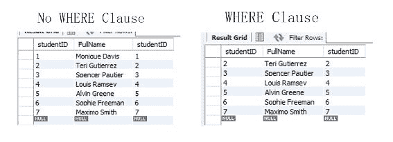

# 运算符之间的 SQL 用语法示例解释

> 原文：<https://www.freecodecamp.org/news/sql-between-operator/>

由于 SQL 查询优化器，BETWEEN 运算符非常有用。尽管 BETWEEN 在功能上与:x <= element <= y 相同，但 SQL 查询优化器将更快地识别该命令，并优化了运行该命令的代码。

该运算符用于 WHERE 子句或 GROUP BY HAVING 子句中。

选择值大于最小值且小于最大值的行。

重要的是要记住，在命令中输入的值被从结果中排除。我们得到了他们之间的东西。

以下是在 WHERE 子句中使用该函数的语法:

```
select field1, testField
from table1
where testField between min and max 
```

下面是一个使用 student 表和 WHERE 子句的示例:

```
-- no WHERE clause
select studentID, FullName, studentID
from student;

-- WHERE clause with between
select studentID, FullName, studentID
from student
where studentID between 2 and 7; 
```



下面是一个使用活动资金表和 having 子句的示例。根据 GROUP BY part 语句中的 HAVING 子句，这将返回候选人捐款总额在 300 万美元到 1800 万美元之间的行。指南中关于聚合更多内容。

```
select Candidate, Office_Sought, Election_Year, format(sum(Total_$),2)
from combined_party_data
where Election_Year = 2016
group by Candidate, Office_Sought, Election_Year
having sum(Total_$) between 3000000 and 18000000
order by sum(Total_$) desc; 
```

