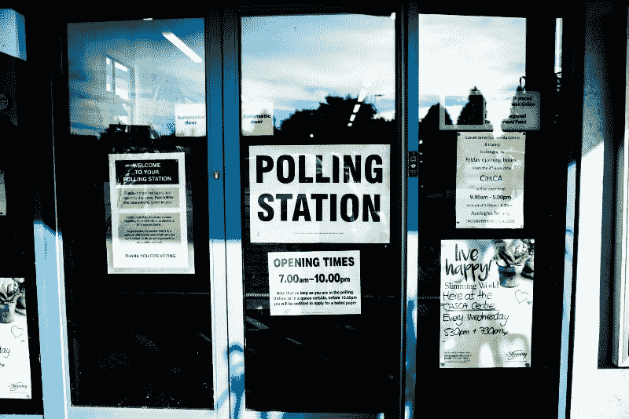
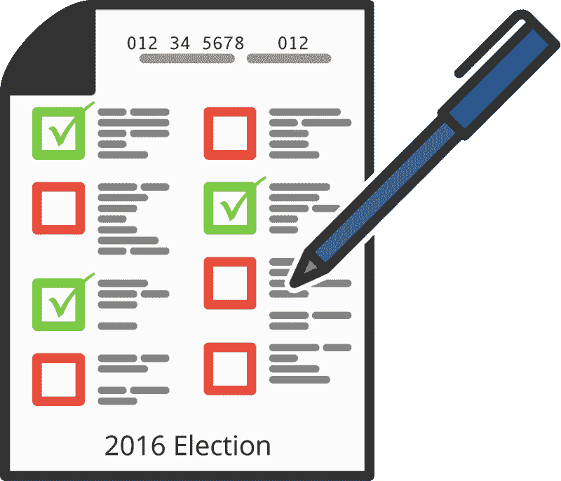
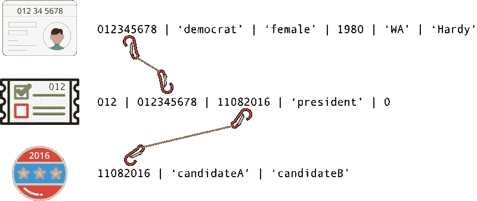

# 选举投票解释的 SQL 表

> 原文：<https://www.freecodecamp.org/news/sql-tables-explained-by-voting-in-the-infamous-2016-election-de638dd9db7/>

凯文·科诺年科

# 选举投票解释的 SQL 表

#### 如果您以前投票过，那么您可以使用这个奇妙的非政治类比来理解 SQL 表。

在这场特别有争议的选举之后，你可能比你想的更了解美国的投票系统。

但是我敢打赌，你从来没有想过它会帮助你学习如何组织一个关系数据库。

幸运的是，总统选举的基本规则实际上是组织 SQL 表和理解 [**键**](https://en.wikipedia.org/wiki/Relational_database) 概念的伟大指南。键是建立可伸缩和高效的 SQL 数据库的最重要的工具。它们也是你刚起步时最困惑的部分！

在阅读本文之前，您需要知道的只是 SQL 的基本知识——主要是如何按行和列组织表。

#### 倒回到选举日

你刚刚手里拿着选票离开了投票站。你走向加工机，把它放进槽里。

但是接下来会发生什么呢？你认为储存你的总统选票的最好方法是什么？请记住，仅在这次选举中，就有大约 1.36 亿人投了票！

看看上面的投票。您可以看到，我们需要跟踪选票上的三个关键标识符:

1.  与此投票相关联的选举(2016)
2.  投票号码(012)
3.  选民 ID，在本例中是社会保险号(012 34 5678)

您最初的想法可能是将整个内容存储为一个条目，如下所示:

但是让我们想清楚，考虑到还有超过 1 亿的其他选民！我们真的需要在数据库的每个条目中存储选票上的每一条信息吗？比如，我们真的需要把“candidateA”和“candidateB”列为一亿次的两个选择吗？肯定不是！

而且这还不考虑多次选举。想象一下，如果我们想查看詹妮弗·哈迪在过去 3 次选举中的投票活动。即使这样，在我们的数据库中有 3 个条目，包括她的全名、SSN、性别等，也是没有意义的。每一票。例如，当您更新数据库以更改她的党派关系时，这会导致错误和不一致的信息。

让我们退一步考虑一下投票系统的一些基本原则。

1.  一次**选举**有很多**选票** (1 亿+)
2.  一个**选民**在其一生中拥有许多**选票**
3.  一个**选民**可以参加多个**选举**(多达 20 个)

我们的三个唯一的 IDs 选票号、社会保险号、选举日期——表明这个系统实际上有三个组成部分。如果我们把所有三个组件放在一个条目中，就像我们上面做的那样，我们不能捕捉它们之间的关系。而且我们会重复很多信息。

#### 连接多个表格

有了这三个关键标识符，我们现在已经列出了正确存储这些信息所需的三个表。

1.  **选举**表，上面有日期，甲方提名人和乙方提名人。日期是唯一的标识符，因为有些候选人可能竞选总统两次，但两次选举从来不会在同一天发生。
2.  **投票**表，包括投票号码、与之相关的投票人的 SSN、与投票相关的选举、正在投票的问题(总统)以及候选人被选中的 0 或 1。按字母顺序，0 代表甲方，1 代表乙方。
3.  **选民**表，包括选民的名、姓、社会保险号、出生年份、党派、性别和登记投票的州。

这更好地描述了投票系统的不同部分。实际上有三个不同的事件。

*   你必须在投票日之前的某个时候登记投票！你被加入了选民数据库。您的 SSN 是**主键，在本例中是**。这意味着它是该行的唯一标识符。

*   每个政党都在 2016 年 7 月举行全国代表大会，为 11 月 8 日的选举确定候选人。这在选举表中创建了一个新条目。日期是**主键**。

现在我们又回到了最初的场景。现在是 2016 年 11 月 8 日。你只要把你的选票放进处理机器里。那么，这台机器应该如何处理你的选票呢？首先，你的选票应该包含最少的必要信息。

然后，机器需要回答几个问题，以确定选票是否有效。

*   你已经在这次选举中投票了吗？
*   这张选票与 2016 年的选举有关吗，或者你从过去的选举中保存了一张选票？
*   你是登记选民吗？

其中的每一个都是单独的 SQL 查询。我想把重点放在上面选票的前三条信息上。选票 ID 是**选票**表的**主键**。SSN 和日期实际上是**外键。**这意味着它们引用了另外两个表中的主键。

如果我们想检查选票是否来自注册选民，我们将需要使用一个**表连接**。一个联接使用主键/外键系统引用多个表中的信息。这意味着我们的投票表必须存储投票人和整个选举的唯一标识符。但这也意味着我们不需要在那一行中存储所有的投票者信息或选举信息！我们只需要引用相应的表。

**主键/外键**系统在表之间形成连接。

我们希望在提交带有 Hardy 名字的选票后，检查 Jennifer Hardy 是否是注册选民。我们只需要确认她在**选民**表中有一个条目。我们使用选票表中的 SSN **外键**和选民表中的**主键**来链接这两个记录。我们可能还需要检查她记录中登记的州是否与处理投票的州相匹配。

就是这样！如果你想练习，试着建立一个最近 4 次美国总统选举的数据库。在 4 次选举过程中，添加来自 10 位选民的 20 张样本投票。看看您是否可以编写查询来检查某个投票人是否试图在一次选举中提交第二张选票！

如果你喜欢这篇文章，你可能也会喜欢我对挑战 CSS 和 JavaScript 主题的其他解释，比如定位、模型-视图-控制器和回调。

如果你认为这可能会帮助和你处境相同的人，那就给它一颗“心”吧！