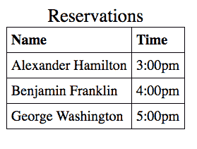

# 偏见和 HTML 排外

> 原文：<https://www.freecodecamp.org/news/table-prejudice-and-html-xenophobia-30704984785e/>

作者安东尼·吴

# 偏见和 HTML 排外


*A Gentleman’s Table by Claude Raguet Hirst*

前几天我和一个学生一起查看一些 HTML，我们偶然发现了一个。

它显示带有餐馆预订信息的数据。第一列包含预订的名称。第二列是预订的时间。

它看起来像这样:



Table with reservation information

> “哦哇，我真不敢相信这段代码实际上是在使用表格。这是什么年代，90 年代？”——我的学生

在 90 年代，桌子风靡一时。开发人员会在整个 HTML 中使用表格来格式化非表格内容。

但是钟摆又摆了回来。桌子不再流行了。并且它们作为用户界面元素的声誉再也没有恢复。

因此，我的学生开始头脑风暴，想办法以“正确”的方式对预订信息进行编码。

> “我知道——我们将使用列表。”

> “好的。”我说。“所以你会用两张单子？一个是名字，一个是时间？”

> “是的。我将使用 CSS 将其样式化为表格。”

他对表格以及过去滥用表格的方式的厌恶导致他滥用不同的 HTML 元素。

这让我想到:其他开发人员是否也在竭尽全力避免使用表格？

### 为什么使用表格？它们是干什么用的？

根据 Mozilla 开发者网络(Mozilla Developer Network)的文档，表格提供了表格数据。

我喜欢把表格数据看作是内部有关系的数据。每个预订之间有关系吗？是的，每个预约时间都有一个特定的名字。

使用表格来表示表格数据是完全合适的，也是符合语义的。像 [Bootstrap](http://getbootstrap.com/css/#tables) 这样的 CSS 框架甚至支持样式化的表格。桌子是用来用的！

那么所有这些仇恨从何而来？

过去，表格用于格式化和布局。看看这个例子(或者在 [Codepen](http://codepen.io/newyork-anthonyng/pen/Obyowm?editors=1010) 上交互查看):

```
<table align=”center”>  <tbody>    <tr><td>Welcome to this email</td></tr>  </tbody></table><table>  <tbody>    <tr>      <td>        Lorem ipsum dolor sit amet, consectetur adipiscing elit.    Vestibulum aliquet velit at lectus sodales, sit amet consequat odio eleifend. Fusce accumsan sed eros convallis imperdiet. Donec at dignissim nibh.       </td>      <td>        Lorem ipsum dolor sit amet, consectetur adipiscing elit. Vestibulum aliquet velit at lectus sodales, sit amet consequat odio eleifend. Fusce accumsan sed eros convallis imperdiet. Donec at dignissim nibh.       </td>    </tr>  </tbody></table><table align=”center”>  <tr><td>Thank you for reading this email</td></tr></table>
```

这三个表格为我们创建了这个两列布局。


2 column layout

随着 CSS 的现代进步，我们不需要使用表格作为页面布局的工具。看看这个使用 CSS 重写的例子，它产生了相同的 2 列布局(查看 [Codepen](http://codepen.io/newyork-anthonyng/pen/yVYxRq?editors=1100) ):

```
// html file<header>  Welcome to this email</header>
```

```
<div>  <p>     Lorem ipsum dolor sit amet, consectetur adipiscing elit. Vestibulum aliquet velit at lectus sodales, sit amet consequat odio eleifend. Fusce accumsan sed eros convallis imperdiet. Donec at dignissim nibh.  </p>  <p>    Lorem ipsum dolor sit amet, consectetur adipiscing elit. Vestibulum aliquet velit at lectus sodales, sit amet consequat odio eleifend. Fusce accumsan sed eros convallis imperdiet. Donec at dignissim nibh.   </p></div>
```

```
<footer> Thank you for reading this email</footer>
```

```
// css fileheader,footer {  text-align: center;}
```

```
div {  display: flex;}
```

### 表格布局不会消失

当看到使用表格进行布局的代码时，您可能会反胃。但是这种技术不会很快消失。

许多开发人员发现跨浏览器测试很困难，但是考虑一下有多少不同的电子邮件客户端。

电子邮件客户端缺乏对某些 CSS 样式的强大、一致的支持。表格提供了一种可靠的方式来实现跨多个电子邮件客户端和设备的一致布局。

### 学习你的 HTML

我的建议是先了解一下哪些工具对你有用。最重要的是，使用正确的工具。当然，你可以用锤子把螺丝敲进墙里。但是螺丝刀不是更好吗？

我们许多开发人员会很乐意投资时间学习高级 JavaScript 特性、算法优化和新框架。但是当谈到 HTML 元素时，我们大多数人都坚持使用已经很舒服的元素。

你有没有考虑过学习旧的备用 HTML 元素:

、、

# 和

？ 

例如，有一个

元素，在编写 gl ossary 时，它可能是有用的。

然后是元素。它将允许 browse [rs 为你的用户的 ca](https://developer.mozilla.org/en-US/docs/Web/HTML/Element/time) lendar 安排事件。

你是否打算使用**元素通过加粗让某件事看起来很重要？考虑使用**gt；改为 eleelement。屏幕阅读器不会向用户传达样式。但是它们会传达`<strong>`元素的语义。****

你正在导入一个库以便在你的屏幕上得到一个颜色选择器或者日历吗？考虑用或者来使用浏览器给你的。

花点时间让自己熟悉一些可用的 HTML 元素。

下一次你处理 HTML 的时候，问问你自己你是否找到了正确的工具。