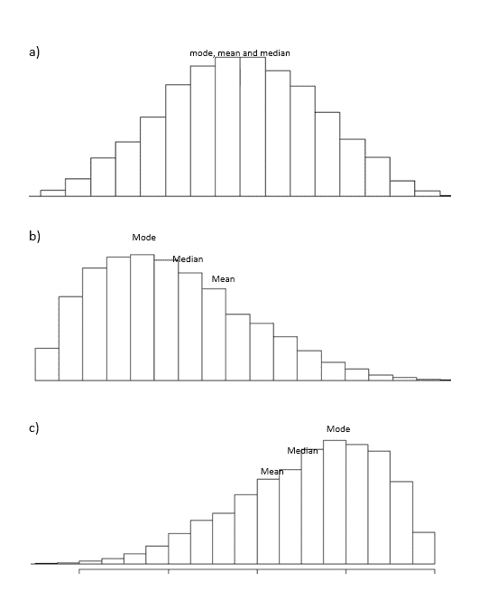
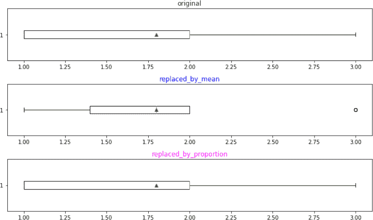

# 数据科学中缺失值的惩罚

> 原文：<https://www.freecodecamp.org/news/the-penalty-of-missing-values-in-data-science-91b756f95a32/>

作者:坦维尔·赛义德

# 数据科学中缺失值的惩罚

#### 并使用“软”方法来估算。

这篇文章更侧重于概念层面，而不是编码技巧，分为两部分。第一部分描述了缺失值的问题，以及何时以及为什么我们应该使用均值/中值/众数。第二部分**否定了第一部分**，并论证了为什么我们不应该使用它们，而应该使用*软*方法——随机但比例代表制。


Photo by [Rakicevic Nenad](https://www.pexels.com/@rakicevic-nenad-233369?utm_content=attributionCopyText&utm_medium=referral&utm_source=pexels) from [Pexels](https://www.pexels.com/photo/silhouette-photo-of-man-throw-paper-plane-1262304/?utm_content=attributionCopyText&utm_medium=referral&utm_source=pexels)

### 第一部分:为什么我们要删除丢失的值？何时使用均值、中值、众数？为什么呢？

缺失数据的问题是没有固定的处理方法，这个问题是普遍的。缺失值会影响我们的绩效和预测能力。它们有可能改变我们所有的统计参数。他们与异常值互动的方式再次影响了我们的统计数据。因此，结论可能会产生误导。

不同的缺失值可能是:

1.南
2。无
3。
4。【空】5
。【T4 失踪】⑥。【不可用】7。“那”

虽然最后四个是字符串值，但默认情况下，熊猫标识 NaN(未分配编号)和 None。然而，两者并不相同；下面的代码片段说明了原因。

问题是，如果我们不移除 NaNs，我们将面临双重危险。首先，我们已经遭受了真实数据丢失的痛苦，其次，如果不小心处理，NaNs 会开始“*吞噬*我们的真实数据，并可能随着我们的处理在整个数据集中传播。我们来实例化两个系列看看。

现在让我们看看当我们对这些列表执行某些操作时会发生什么。

我们可以看到在执行操作(Out: 21，22)时真实数据(整数 1，2)是如何丢失的。另一件要注意的事情是，由于 nan(Out:23，24)的存在，内置 python 方法和 series 方法中的结果是冲突的。

现在，让我们创建一个数据帧，它包含上述所有缺失值以及一个垃圾值(' #$% ')。我们将通过与这个小玩具数据集争论来删除丢失的值。

数据帧有一个完整的行(i1)和一个完整的列(c2 ),其中仅填充了 nan。其他缺失的值标识符也被故意分散。

上面我们可以看到 c3 中的最后一项应该是“真”(表示“不可用”)。为了做到这一点，我们必须再次读取数据帧。这次我们将 [*强制*](https://towardsdatascience.com/data-cleaning-with-python-and-pandas-detecting-missing-values-3e9c6ebcf78b) 熊猫将“失踪”/“不在”/“那”识别为 NaNs。

所有丢失的值都被识别出来了，我们是不是把它们一起丢弃掉呢？

看起来我们失去了所有的价值！*。dropna()* 删除完整的行(索引),即使缺少“单个”值。因此有了*。dropna()* 伴随着可能有价值的数据丢失的代价。

#### 如何进行？

现在，我们可以假定所有缺失值都是-0。但是这种方法有一个基本问题:*我们的数据失去了神圣性/准确性，因为在现实世界中，一个缺失项可以取任何值。但是我们强迫它只取一个刚性值，即 0。*

sklearn 的 [*公文*](https://scikit-learn.org/stable/modules/impute.html) 提到:(重点我的)

> …从数据的**已知**部分推断出它们(缺失值)。

那么我们现在该怎么办呢？一个更好的选择是使用**平均值**,因为它至少比零更好地“代表”一个特征。为什么？因为对于连续/数字特征，无论我们加多少次平均值，它仍然保持不变。以下是方法:

> 三个数字——2、6、7——的平均值= (2 + 6 + 7)/3 = 5

> 假设这个列表有无限多的缺失值，让我们用均值来估算它:— 2，6，7，5，5，5，5…..不管我们加多少次，平均值还是 5！

但是 mean 也有问题。首先，它受到异常值的严重影响，平均值(2 + 6 + 7+ **55** ) = 17.5！其次，虽然“*确实代表了“*这一特征，但在反映一个正常数据的集中趋势方面，它也是最差的*(见下面的项目符号 **b & c** 【分别针对右偏和左偏数据】)。*

*

[commons.wikimedia](https://commons.wikimedia.org/wiki/File:Measures_of_Central_Tendency.png)* 

*我们可以在 bullets b & c 中清楚地观察到，该模式最能反映中心趋势。 **Mode** 是我们数据集中出现频率最高的值。但是当涉及到连续数据时，模式就会产生 T2 模糊度。可能有一个以上的模式，或者(很少)根本没有模式，如果没有值重复的话。因此，Mode 用于估算本质上属于**分类**的列中的缺失值。*

*众数之后，是最能反映中心倾向的中位数。这暗示着对于**连续的**数据，使用中位数 [*比均值*](https://creativemaths.net/blog/median/) 更好！**中位数**是数据点按顺序排列时的中间分数。与平均值不同，中位数不受数据集异常值的影响——已经排列好的数字(2，6，7， **55** )的中位数是 6.5！*

> *因此，对于分类数据，使用模式更有意义，对于连续数据，使用中位数更有意义。那么为什么我们仍然对连续数据使用均值呢？*

#### *遗产*

*以前在没有计算机的世界里，计算平均值比计算中位数容易。在那个时候，每次数据集更新时，手动重新排列成千上万的条目肯定是有意义的，然后找到中间值确实是一项繁琐的任务。但是，今天，当我们的指尖拥有计算能力时，我们应该继续这一遗产吗？不，，那将意味着没有充分利用我们的潜力。*

*但是，刚性仍然存在，因为我们仍然使用单个值——平均值/中值/众数。我们将在下一节中详细讨论这一点。现在让我们用平均值(在 c0 中)、中值(在 c1 中)和众数(在 c3 中)来代替这些值。之前，我们先来处理一下(' i2 '，' c3 ')处的垃圾值' #$% '。*

*相应的值是:*

*我们将使用 3 种不同的方法来替换 NaNs。*

*看起来我们将不得不完全删除 c2 列，因为它不包含任何数据。*注意*在开始时，一行和一列完全被 nan 填充，但是我们只能成功地操作行而不能操作列。丢弃 c2。*

*我们终于摆脱了所有缺失的值！*

### *第二部分:随机但按比例替换(RBPR)*

*

Photo by [Rakicevic Nenad](https://www.pexels.com/@rakicevic-nenad-233369?utm_content=attributionCopyText&utm_medium=referral&utm_source=pexels) from [Pexels](https://www.pexels.com/photo/silhouette-of-person-holding-glass-mason-jar-1274260/?utm_content=attributionCopyText&utm_medium=referral&utm_source=pexels)* 

*上述方法，*我认为是*，可以描述为 ***硬插补方法*** ，因为它们严格地只接受一个值。现在让我们关注一种"*软"*插补方法。软是因为它利用了 ***概率*** 。这里我们*没有强制*选择单个值。我们将按照与没有 nan**的人口“成比例”的比例随机替换 nan*(该比例是使用概率计算的，但带有一点随机性)。****

***有例子的解释会更好。假设一个列表有 15 个元素，其中*有三分之一的数据丢失*:***

***[1，1，1，1，2，2，2，2，3， ***楠，楠，楠，楠，楠***————(*原创****

***现在注意到在*原来的*列表中有几组**4**1、**4**2、**2**3、 **5** 男。因此，1&2 属于多数*而 3 属于少数*。现在让我们从计算概率和期望值开始。*****

*   ******prob* (1 个出现在 NaNs)
    =(1s 的数量)/(没有 NaNs 的人群)
    = 4/10
    = 2/5*****
*   ****1 的预期值/计数
    =(prob)*(nan 总数)
    = (2 / 5) * (5)
    = **2******

****类似地，prob(NaNs 中出现 2 个)的期望值是 **2** ，prob(NaNs 中出现 3 个)的期望值是 **1** (注意 **2+2+1=5** ，等于 NaNs 的个数)。因此，我们的列表现在看起来像这样:****

****[1，1，1，1，2，2，2，2，2，3， ***1，1，2，2，3***————(*被比例取代*****

****因此，一、二、三替换 NaNs 的比例是 **2 : 2 : 1** 。也就是说，当我们没有*时， ***极有可能是*** “一”和“二”比“三”构成了它的主要部分，而不是*一个单一的硬的*均值/众数/中位数。*****

****如果我们简单地用平均值(1.8)估算 NaNs，那么我们的列表看起来像:****

****[1，1，1，1，2，2，2，2，3，**，T1]1.8，1.8，1.8，1.8 ，1.8**————(*替换 _by_mean* )****

****让我们*框出*这三个列表，并从中得出**结论**:****

****

[Box-plot code (NaN-12.py)](https://gist.github.com/Vernal-Inertia/e8d95749416b2df6b8f63ee124b7b73b)**** 

******首先**，比例替换的列表比均值替换的列表有更好的*数据分布*。**第二个**，用‘3’观察均值如何影响分布*(少数):*它原本是*而不是*一个离群值，在 plot-2 中突然变成这样但在 plot-3 中又恢复了原来的状态。这说明 plot-3 分布较少 [*偏向*](https://towardsdatascience.com/is-your-machine-learning-model-biased-94f9ee176b67) 。**第三个**，这个方法也更公平，它给了‘3’(*少数派*)一个*机会*在缺失的值中，否则*永远不会*得到。这种方法的第四个优点是我们仍然成功地保持了平均值！****

******第五个**，毫无疑问，分布(基于概率)确保这种方法过度拟合模型的机会肯定小于用*硬*方法进行估算的机会。**第六个**，如果 NaNs 被替换*【随机】*那么运用一点逻辑我们很容易计算出有:5 个！/(2!*2!*1!)= 30，可能的不同排列:****

****… 1，1，2，2，3]，
… 1，1，2，3，2]，
… 1，1，3，2，2]，
… 1，3，1，2，2]，
… 3，1，1，2，2]还有 25 个！****

****为了让这种动态更加清晰和直观，请看这张有 4 个 nan 的 gif 图。每种颜色代表不同的 NaN 值。****

********

****请注意，每次运行代码时，不同的排列会在列之间生成不同的*交互*。本质上，我们在这里并没有“生成”新的数据，因为我们只是资源性地利用了已经可用的数据。我们只会产生越来越多的互动。*而这些波动的互动才是真正的**南人**的惩罚。*****

#### ****代码:****

****现在让我们将这个概念编码并绑定。用于处理数字特征的代码可以在这里找到[](https://gist.github.com/Vernal-Inertia/e49fc188e25d76f86df8a19874439b91)*，用于分类特征的代码可以在这里找到[](https://gist.github.com/Vernal-Inertia/0a56f6b8b5aa5b6b175522dfc188b34f)*。(我有意避免在这里显示代码，因为重点是概念，而且这将不必要地使文章冗长。如果你确实发现代码有用，并且【算法上】*足够贪婪*去进一步优化它，我会*很高兴*你能回复)。如何使用代码？******

```
**`random.seed = 0 np.random.seed = 0# important so that results are reproducible`**
```

```
**`# The df_original is free of impurities(eg. no '

```
**`1\. df = df_original.copy()2\. Call the CountAll() function given in the code3\. categorical list = [all categorical column names in df]4\. numerical list = [all numerical column names in df]5\. run a for loop to fill NaNs through numerical list, using the   Fill_NaNs_Numeric() function6\. run a for loop to fill NaNs through categorical list, using the Fill_NaNs_Catigorical() function7\. perform a train test split and check for the accuracy(do not specify the random_state)`**
```

```
**`(After step 7 we require a bit of imputation tuning. Ensuring steps 1-7 are in a single cell, repeatedly run it 15-20 times manually to get an idea of the 'range' of accuracies as it'll keep fluctuating due to randomness. 7th step helps one get an estimate of the limits of accuracies and helps us to boil down to the "best accuracy")`**
```

```
**`8.("skip" this step if df is extremely huge) run a conditioned while loop again through 1 to 7 this time to directly get our desired(tuned) accuracy.`**
```

```
**`(One may want to write down and save this 'updated'-df for future use to save oneself from repeating this process).`**
```

****[***这里的***](https://gist.github.com/Vernal-Inertia/bf2e75e23ea0a508bbebfeadb0aafabe) 是一个完整的例子，用刚才提到的所有步骤，在 sklearn 库中包含的著名虹膜数据集上。每列中 20%的值(包括目标值)已被随机删除。然后使用*这种*方法估算该数据集中的 NaNs。通过第 7 步，很容易确定，在插补后，我们可以*调整*我们的*召回*至少≥ 0.7，对于*每一类鸢尾植物，第 8 步中的条件也是如此。运行几次后，几个报告如下:*****

*****

Soft Imputation on Iris Dataset***** 

*****接下来，为了进行第二次确认，我们绘制了调整后的 PR 曲线，这次使用的是 RandomForestClassifier(n _ estimators = 100)。【这些*类*是{0 :'setosa '，1: 'versicolor '，2: 'virginica'}】。*****

****

**Measuring the RBPR’s quality through the area under the curve****** 

****这些数字看起来不错。现在把我们的注意力转移到硬估算上。*众多分类报告中的一个*如下所示:【观察*精度*中的 1s(稍后讨论)和*召回*以及*支持*中的**等级不平衡******

```
 **`precision  recall   f1-score   support`**
```

```
**`setosa           1.00      0.52      0.68        25versicolor       0.45      1.00      0.62         9virginica        0.67      0.73      0.70        11`**
```

#### ****大数定律****

****现在让我们使用*大数定律*使用决策树分类器来执行 500 次迭代，每次使用不同的随机移除的一组值，在相同的虹膜数据集 ***上，不调整*** 插补；也就是说，我们跳过调优阶段，以“*刻意*获得**最差** *软*的分数。这里的代码是[](https://gist.github.com/Vernal-Inertia/45cfda9c4fe06243d70a6a5b66b55b7e)*。硬插补法和软插补法在精确度和召回分数方面的最终比较如下:*****

*****

**RECALLS******* *****

**PRECISIONS******* 

******精度*和*召回*主要在我们观察阶级不平衡的时候派上用场。虽然最初，我们确实有一个平衡的目标，但是 ***硬*** 加上模式使它不平衡。观察到大量的*硬*召回和*硬*精度值= 1。这里使用词语*“过度适应”*是不正确的，因为这些是测试分数，而不是训练分数。因此，正确的方式应该是:预言性的*硬*模型已经知道要预测什么，或者 mode 的使用确保了两个分数超调。*****

****现在观察*的软分数。尽管有任何*调整*以及少得多的值= 1，但是*软*分数*仍然*能够**赶上/收敛**硬分数(除了两种情况——*versicolor-recall*和*stetosa-precision*——原因很明显，大量预言 1 强行拉高了平均值)。此外，观察*软-静态-召回*(尽管在*硬对应物中存在大的 1)*和增加的 s *软-动态-精确*。最后要注意的是在*软*方法中总体上减少了变异和标准偏差。*****

****作为参考，f1 分数和准确度分数如下:(再次注意*软*方法中减少的变化和标准偏差)****

****

**F1-SCORE****** ****

**ACCURACY SCORES****** 

> ****因此，我们可以观察到，从长远来看，即使**没有**软插补**调整**，我们也已经获得了与硬插补策略的性能相匹配的结果。因此**在**调整后我们可以获得更好的结果。****

### ****结论****

****我们为什么要这么做？唯一的原因就是提高我们 [*处理*](https://www.technologyreview.com/s/612764/giving-algorithms-a-sense-of-uncertainty-could-make-them-more-ethical/) 不确定性的几率。*我们从不因为缺失价值观而惩罚自己！*每当我们发现一个缺失的值，我们就简单地把船停泊在大海的“中央”,错误地认为我们的锚已经成功地找到了“不确定性”的最深处。这里的尝试是通过利用手边可用的资源来保持船只航行——风速和风向、星星的位置、波浪和潮汐的能量等。为了得到最好的*多样化的*渔获，为了更好的*回报。*****

****

Photo by Simon Matzinger from Pexels**** 

****(如果您发现任何错误/不正确的地方，请回复。欢迎批评)。**** or ',' in price   # field) and df_original.dtypes are all set.`**
```

[PRE2]

[PRE3]

[PRE4]

[PRE5]

****[***这里的***](https://gist.github.com/Vernal-Inertia/bf2e75e23ea0a508bbebfeadb0aafabe) 是一个完整的例子，用刚才提到的所有步骤，在 sklearn 库中包含的著名虹膜数据集上。每列中 20%的值(包括目标值)已被随机删除。然后使用*这种*方法估算该数据集中的 NaNs。通过第 7 步，很容易确定，在插补后，我们可以*调整*我们的*召回*至少≥ 0.7，对于*每一类鸢尾植物，第 8 步中的条件也是如此。运行几次后，几个报告如下:*****

*****

Soft Imputation on Iris Dataset***** 

*****接下来，为了进行第二次确认，我们绘制了调整后的 PR 曲线，这次使用的是 RandomForestClassifier(n _ estimators = 100)。【这些*类*是{0 :'setosa '，1: 'versicolor '，2: 'virginica'}】。*****

****

**Measuring the RBPR’s quality through the area under the curve****** 

****这些数字看起来不错。现在把我们的注意力转移到硬估算上。*众多分类报告中的一个*如下所示:【观察*精度*中的 1s(稍后讨论)和*召回*以及*支持*中的**等级不平衡******

[PRE6]

[PRE7]

#### ****大数定律****

****现在让我们使用*大数定律*使用决策树分类器来执行 500 次迭代，每次使用不同的随机移除的一组值，在相同的虹膜数据集 ***上，不调整*** 插补；也就是说，我们跳过调优阶段，以“*刻意*获得**最差** *软*的分数。这里的代码是[](https://gist.github.com/Vernal-Inertia/45cfda9c4fe06243d70a6a5b66b55b7e)*。硬插补法和软插补法在精确度和召回分数方面的最终比较如下:*****

*****

**RECALLS******* *****

**PRECISIONS******* 

******精度*和*召回*主要在我们观察阶级不平衡的时候派上用场。虽然最初，我们确实有一个平衡的目标，但是 ***硬*** 加上模式使它不平衡。观察到大量的*硬*召回和*硬*精度值= 1。这里使用词语*“过度适应”*是不正确的，因为这些是测试分数，而不是训练分数。因此，正确的方式应该是:预言性的*硬*模型已经知道要预测什么，或者 mode 的使用确保了两个分数超调。*****

****现在观察*的软分数。尽管有任何*调整*以及少得多的值= 1，但是*软*分数*仍然*能够**赶上/收敛**硬分数(除了两种情况——*versicolor-recall*和*stetosa-precision*——原因很明显，大量预言 1 强行拉高了平均值)。此外，观察*软-静态-召回*(尽管在*硬对应物中存在大的 1)*和增加的 s *软-动态-精确*。最后要注意的是在*软*方法中总体上减少了变异和标准偏差。*****

****作为参考，f1 分数和准确度分数如下:(再次注意*软*方法中减少的变化和标准偏差)****

****

**F1-SCORE****** ****

**ACCURACY SCORES****** 

> ****因此，我们可以观察到，从长远来看，即使**没有**软插补**调整**，我们也已经获得了与硬插补策略的性能相匹配的结果。因此**在**调整后我们可以获得更好的结果。****

### ****结论****

****我们为什么要这么做？唯一的原因就是提高我们 [*处理*](https://www.technologyreview.com/s/612764/giving-algorithms-a-sense-of-uncertainty-could-make-them-more-ethical/) 不确定性的几率。*我们从不因为缺失价值观而惩罚自己！*每当我们发现一个缺失的值，我们就简单地把船停泊在大海的“中央”,错误地认为我们的锚已经成功地找到了“不确定性”的最深处。这里的尝试是通过利用手边可用的资源来保持船只航行——风速和风向、星星的位置、波浪和潮汐的能量等。为了得到最好的*多样化的*渔获，为了更好的*回报。*****

****

Photo by Simon Matzinger from Pexels**** 

****(如果您发现任何错误/不正确的地方，请回复。欢迎批评)。****