# 如何利用图论建立一个更可持续的世界

> 原文：<https://www.freecodecamp.org/news/the-value-of-graph-theory-within-sustainability/>

离散数学是一个基于形式结构研究的数学领域，形式结构的本质是完全独立和独特的。

这意味着它专注于整数和自然数、形状以及其他你可以有限计数或区分的对象。它以一种特别适合某些现实世界应用的方式来模拟现实。

从工业和物流到计算机科学和电信，对我们周围的一切进行量子化表示，已经使我们对物理世界的理解和控制取得了巨大的进步。

重要的是至少对离散性和连续性之间的主要区别有一个粗略的概念，以解决**图论**的问题。但是对于数学世界之外的人来说，这些概念并不广为人知。

首先，连续数学是教育系统中主要教授的一门课程，因为它在大多数领域都具有通用性、有用性和实用性。

它基于对实数和函数的分析，封装了这些量之间的映射，以及变量微小变化的概念。这就产生了一系列工具，如构成**微积分*的极限或导数。***

另一方面，除了少数情况之外，离散范式更加直接和直观。而它的有限性是由构成它的原始元素所赋予的——[**集合**](https://www.mathsisfun.com/sets/sets-introduction.html) ***。***

最臭名昭著的使用领域是那些主要组件暗示算法和数据结构的领域。虽然数学的用例并不是大多数人认为的那样。

在现实世界中，我们不会像在教育系统中那样经常面对问题。事实上，处理谜题和建模输入数据的离散方式比连续方式更常见，尤其是在系统优化问题上。

因此，我们应该重新考虑这种数学方法的作用，因为它涉及到**批判/** [**计算思维**](https://en.wikipedia.org/wiki/Computational_thinking) 的发展。这对于当前我们被技术包围的时代至关重要。它还涉及解决问题技能的提高，使我们有可能面对任何新的挑战。

通过这样做，我们可以看到将坚实的数学基础应用于与日俱增的常见全球威胁(如错误信息、处理技术不流畅、地缘政治不稳定甚至气候变化)是多么相关。

尽管后一个问题和图论本身有明显的距离，我们应该思考我们的生活方式和我们所知道的维持我们文明的系统。

## 本文的目标

本文旨在以直观、简单和可视化的方式解释图论，它是所有离散数学中最重要的组成部分之一。我还将努力引导其用于开发新的突破性技术，这些技术适用于环境保护、保护和再生我们的自然(T2、T4、T5)等领域。

有效地实现这一点不仅会培养好奇心或激发可能打算继续学习的读者，还将有助于进一步提高社会对可持续发展问题的认识。由于科学知识，特别是图论的贡献，这将增加未来科学家预测的威胁我们的生存和地球上生命存在的问题将被遏制的可能性。

尽管如此，考虑到图论的广阔范围，在本文中完全解释它是不可能的。因此，我将把重点放在任何解释的视觉方面，而不是正式的，因为你可以很容易地在任何教科书中查阅。这也将提供不同于某些定义的观点。

此外，我们必须尽可能全面地看待图形的概念。我们将集中于它的历史，表现，和最具描述性的性质，而不是像奇异循环这样的高级概念。这将帮助你掌握图论的核心，并为你更容易地学习这些高级概念做好准备。

### 以下是我们将要介绍的内容:

1.  [图论的基本要素](#basic-elements-of-graph-theory)
2.  [图论的历史](#history-of-graph-theory)
3.  [图形的定义](#definition-of-a-graph)
4.  [图形的表示法](#representations-of-graphs)
5.  [图的性质](#properties-of-graphs)
6.  [算法和图论](#algorithms-and-graph-theory)
7.  [为什么图表对实现可持续发展很重要？](#why-are-graphs-important-in-achieving-sustainability)
8.  [结论](#conclusion)

## 图论的基本要素

不管你是图论的新手还是已经了解了一些，回顾一下基础知识总是值得的。

首先，让我们介绍一个*“图形”*的概念，它有一个你可能见过的常见表示:

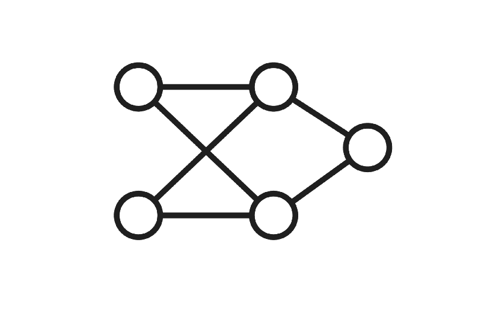

Example of an arbitrary graph

上图中，我们可以在最基本的层面上看到两个不同的构建模块:顶点(显示为圆圈)和边(显示为连接圆圈的线条)。

你可以用这些元素创建一个结构，它可以封装我们生活中许多我们甚至没有意识到的系统的功能。

但是，最令人惊讶的是，作为一个整体，图论来源于这样一个简单的概念，即**对象相互链接。**

## 图论的历史

要了解这种想法的由来，我们得回溯到 18 世纪，当时**的莱昂哈德·欧拉解决了著名的 [**的柯尼斯堡七桥**](https://mathworld.wolfram.com/KoenigsbergBridgeProblem.html#:~:text=The%20K%C3%B6nigsberg%20bridge%20problem%20asks,that%20the%20trip%20ends%20in) 的问题*。***

**那时，Pregel 河穿过城市，形成了四块土地，通过七座桥梁相互连接，如下图所示:**

**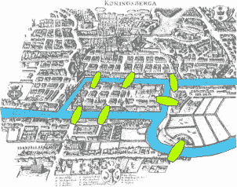

Image extracted from [**here**](https://en.wikipedia.org/wiki/File:Konigsberg_bridges.png)** 

**这项任务包括找到一条穿过所有桥梁的路径，不经过同一座桥两次，起点和终点都在同一点。**

**起初，由于桥很少，通过尝试路径的组合，可能很容易找到强力解决方案。但是，由于我们不知道是否存在可行的解决方案，在开始任何过程之前，形式化问题元素并正确地证明其可解性是有帮助的。**

**此外，如果桥梁的数量增加，解决起来将变得更加复杂，因为组合的增加速度非常快。**

**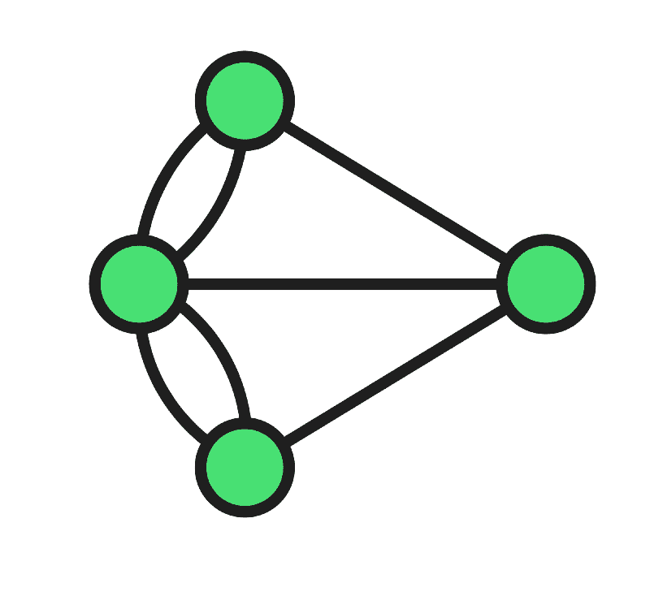

Königsberg problem displayed as a graph** 

**如上所述，欧拉用图的顶点(也称为节点)表示陆地，用边表示桥梁，得出的结论是不可能遍历整个图。**

**简而言之，如果我们观察与每个顶点关联的边的数量，我们将会看到对于每个节点，每个值都是奇数，这意味着该图没有欧拉圈。这意味着它不是欧拉图，我们不能肯定地证明这个问题。**

**尽管如此，这种方法代表了对尚无法解决的各种问题的数学概念的突破。欧拉对这一理论阐述的贡献使他成为他那个时代最有影响力的数学家之一，多年来这一理论得到了完善和扩展。**

## **图的定义**

**现在你已经知道了一个图形在图上的样子，让我们回顾一下官方的正式定义:**

> **图 **G** 是一对集合【T2(V，E)】，其中 **V** 是包含图的顶点的非零集合， **E** 是由属于 **V.** 的元素对组成的集合**

**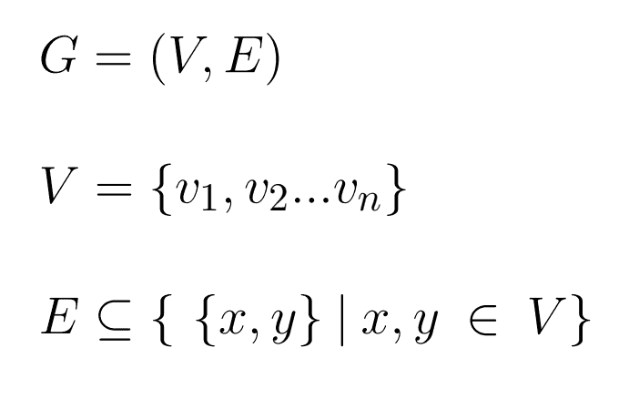

Formal definition of a graph with its corresponding sets** 

**上面，我们在两个相应的集合中表示了一个图的两个主要部分，一个是顶点 **V** ，另一个是边 **E** 。所以，我们的图 **G** 最终是这些集合的有序对。但是在我们继续之前，我们必须看看这些集合的内部，看看它们是什么样子，并理解为什么。**

**一方面， **V** 是项目 **v** 的集合，其中每个元素都包含定义一个顶点所需的数据。抽象地说，它们被称为字母 **v** 和一个数字子索引。**

**但是实际上，它们可以是包含参数、概要文件等的复杂对象。**

**另一方面，边组 **E** 的定义有点复杂，因为它需要确定顶点之间的连接。在这种情况下，元素是来自集合 **V** 的无序顶点对，使得每一对都具有 **{x，y}** 的形式。**

**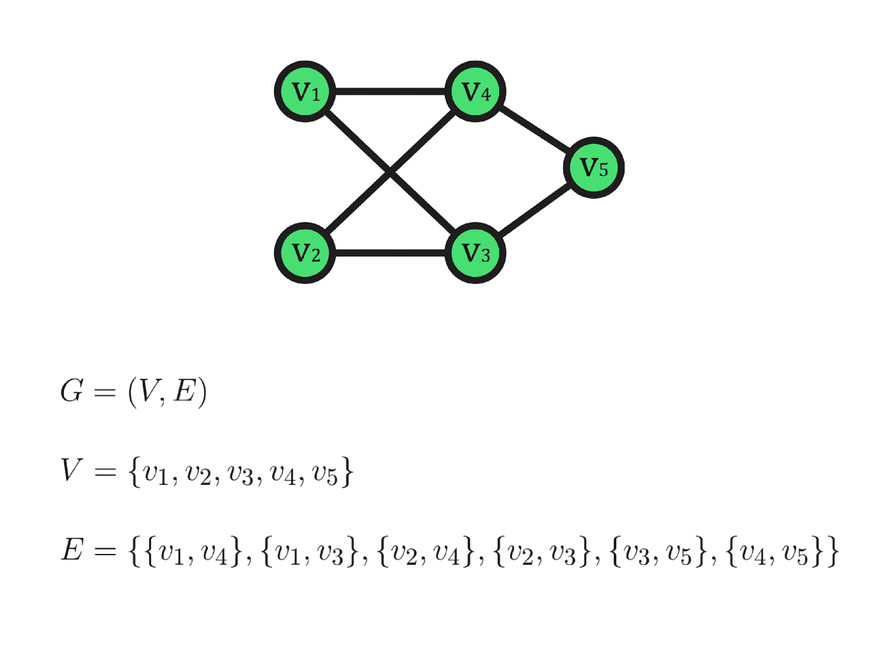

Both formal and graphical representations of a graph** 

**为了熟悉上面的这些结构，您有了一个任意的、完全定义的图及其相应的集合。在 **V，**你可以看到从 1 到 5 编号的所有顶点，以特定的分布放置在上图中，但是你可以根据自己的需要进行排列。**

**同时，在 **E，**中，你可以观察到在顶点之间建立互连链接的所有边(线)。**

**处理这种联系的适当术语如下:例如，如果我们有边{v1，v4}，我们称之为 v1 和 v4 的**事件**。同样，这些顶点被表示为与相邻的**，因为有一条边将它们连接起来。****

**正如你可能注意到的，在 **E** 中没有边{v4，v1}。但是为了找到这种现象的解释，我们必须介绍产生两类图形的主要区别。**

**第一个**(无向)**，上面的例子都属于它，包括了所有边可以双向遍历的图。这使得它们成为**无序的**对顶点。**

**另一方面，我们可以有这样一个图，它的所有边只能在一个方向上遍历，也就是说，只能从一个顶点到另一个顶点。因此，它在 **E** 集合上的顶点对必须是**有序的，**意味着从 v1 到 v4 不同于从 v4 到 v1。这第二类被称为**有向图。****

**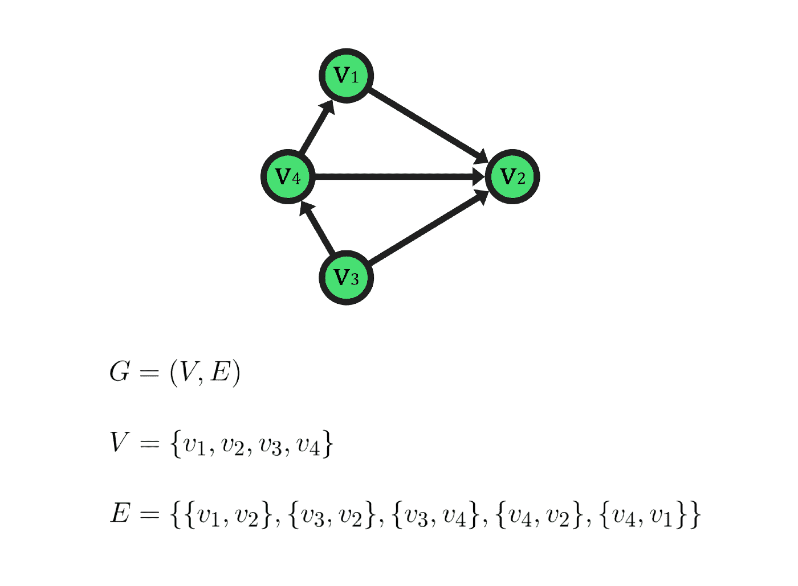

Example of a directed graph.** 

**在学习如何通过计算表示一个图来对其执行操作之前，您需要理解顶点**度**的概念。**

**在无向图中，顶点的度数是指与它关联的边的数量，考虑到自连接边(回路)在总分中计为 2。**

**相比之下，在有向图中，我们为每个顶点设置了**入度**和**出度**值，分别代表传入和传出边的数量。**

## **图的表示**

**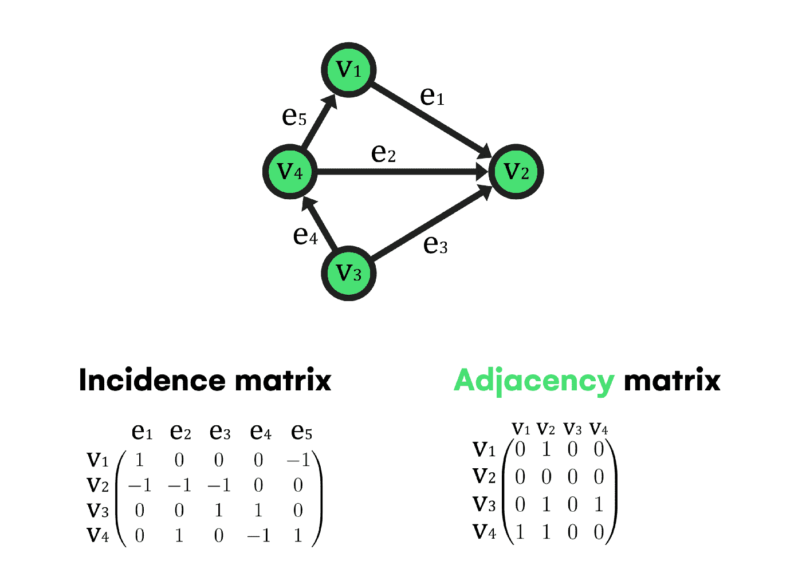

The 2 most popular ways to computationally store a graph** 

**有时候，对一个问题最直观的解决方案在计算机科学中并不总是最有效的。在这种情况下，它根据问题的性质生成不同的图形表示方法。**

### **什么是邻接矩阵？**

**邻接矩阵是在计算机上存储图形的最流行的方法之一。但是它的主要缺点是未使用的内存消耗。**

**对于像上面这样的**有向**图，有一个矩阵大小 **|V|x|V|** (是|V|顶点集的基数，因此是图上的顶点数)，其中如果顶点之间没有连接，每个元素可以是 0，如果行元素通过输出边连接列，则每个元素可以是 1。同样，如果图形是 [**加权的**](https://www.baeldung.com/cs/weighted-vs-unweighted-graphs) ，必要时，1 值被替换为与每条边相关联的**权重**参数。**

**然而，如果图是**无向*，*** 的，则应用相同的标准，不同之处在于这次在输出和输入边之间没有区别。因此，如果行和列元素之间存在边缘，则值为 1。**

**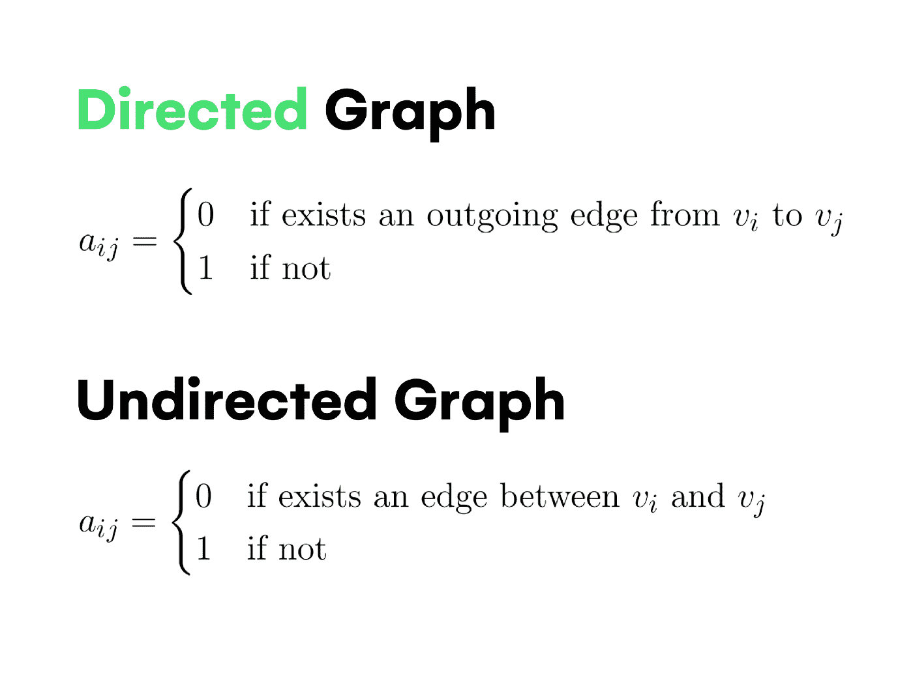

Adjacency matrix element definition for each type of graph.** 

### **什么是关联矩阵？**

**与前面的方法类似，有一个矩阵大小 **|V|x|E|** ，其中满足相同的规则。不同的是，如果一个边 **e** 进入一个顶点 **v** ，对应的元素将是 a -1 而不是 0。**

### **如何使用邻接表**

**当使用矩阵时，如果图有很多顶点但很少边**(稀疏图)，**矩阵将包含大量的零。这浪费了大量内存，并使表示在空间方面效率低下。**

**为了解决这个问题，**邻接表**作为一种替代方案出现，用不同数据结构的组合——数组和链表——代替矩阵。**

**这个方法的核心是一个包含图的所有节点的数组。每个数组元素都有一个链表来保存每个前导节点的相邻顶点(相邻顶点)。在有向图的情况下，只有由来自引导节点的输出边连接的邻居元素才会在链表内。**

**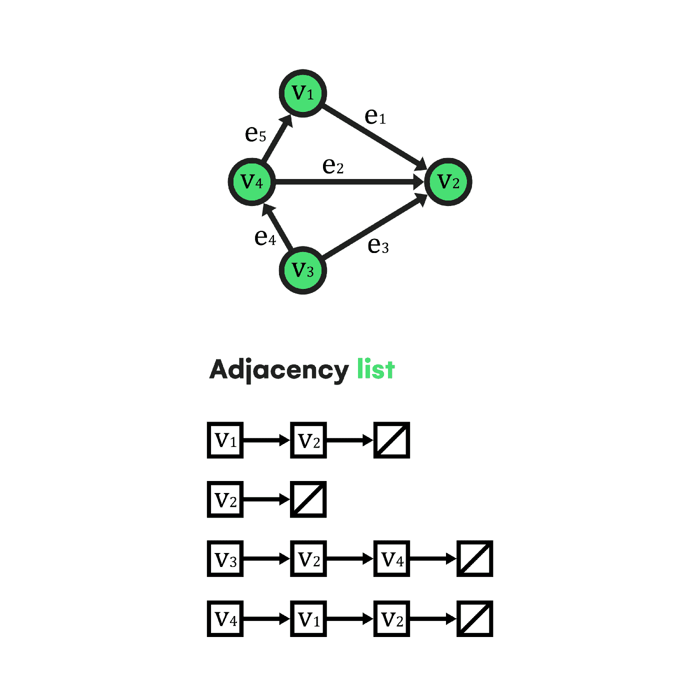

Example of a graph depicted as an adjacency list** 

**因此，如果我们有一个**密集的**图，它有很多边，我们应该以**矩阵**的形式存储它。当检查无向图中沿着主对角线的顶点连接和矩阵对称性时，这具有 O(1)时间复杂度的优点。**

**但是，如果我们的图是**稀疏的，**低密度的边使得**邻接表**成为计算描述它的最佳选择。**

## **图的性质**

**像任何其他数学对象一样，图形具有特定的属性，这些属性使它们具有独特的功能。有些与它们的组成有关，有些与拓扑有关，甚至与可访问性有关。**

**毫无疑问，最相关的属性与遍历有关，因为它们允许我们对真实世界的场景进行建模和优化。**

### **什么是图的遍历？**

**首先，我们需要一个起始节点 v1 和一个结束节点 v2 来遍历一个图。然后，我们可以将从 v1 到 v2 的**行走**定义为顶点和边的交替序列。在那里，我们可以根据需要遍历这些元素，在一个顶点之后总会有一条边(最后一条除外)。**

**在 v1 等于 v2 的情况下，步道将**关闭**。**

**不过，我们可以添加重复限制。因此，如果我们想要一个没有重复边缘的行走，它被重命名为**“trail”**。因此，如果步道是封闭的，则表示为**【电路】**。**

**如果我们限制顶点重复，也会发生同样的情况——行走重命名为**“路径”、**，一个封闭的路径被称为**“循环”。****

**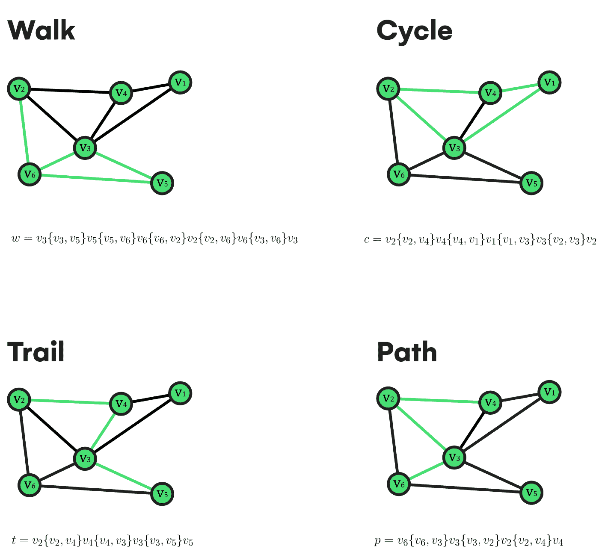

Formal and graphical examples of network traversal types.** ****

**这种遍历能力伴随着一个有趣的特性，对所有现有的无向图/有向图都有效。它的形式如下:**

**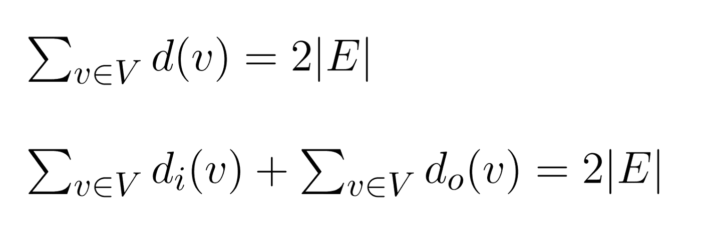

Formalization of the degree sum property.** 

**这确定了所有顶点度数的总和等于无向图中边集的基数的两倍。如果有方向，总和分成两项，每一项指每个节点的入度和出度。**

**这很容易证明，因为每次你给图添加边，你需要两个顶点来构建存储在 **E.** 上的一对元素，所以如果你添加一个循环(连接一个节点和它自己的边)，你无论如何都需要定义来自 **V，**的一对元素，不管它们是否相同。**

**这一特性在解决以下问题时为我们提供了支持:**

> **给定一个 6- **正则**图(所有顶点度数都设为 6)**n**顶点的*，它有多少条边？***

**因为它的解决是直接的，当思考类似的问题时更深入会增进你对它的本质和为什么会这样的理解。**

### **什么是连通性？**

**现在，让我们继续讨论与图的链接能力相关的属性。从无向图开始，如果有一条从 **v** 到 **u** 的路径，我们可以保证顶点 **v** 到达 **u** 。同样，我们可以观察整个图，如果图中的每一对顶点都是连通的，那么我们可以将它定义为**连通的**。**

**被连接通常与其组件的唯一性相关联。也就是说，如果我们最终得到一个**不连通的**图，那么它的分量数将总是大于 1。**

**你可以把一个组件想象成图中的一个区域，这个区域与其余的顶点是分离的。如果我们考虑一个图，它将是连通的，并且只有一个连通分量，就好像它是一个连通图一样。**

**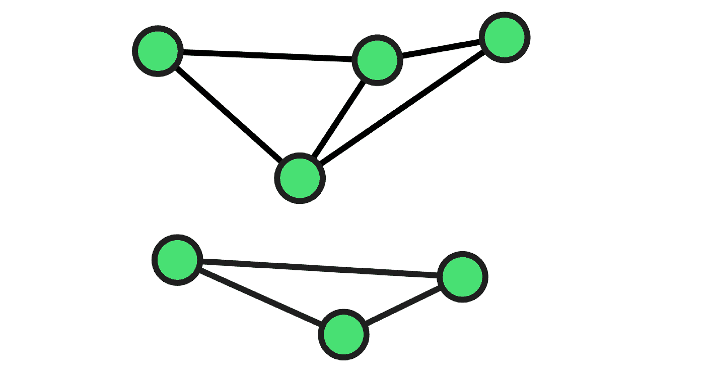

Example of a 2 component made graph.** 

**相比之下，在处理**有向**图时，两个顶点 **u** 和 **v** 如果能相互到达，则称其为**强**连通，如果连接在**底层**图的**弱**连通(所有边都被无向边代替)。**

**可以想象，这些属性产生了许多可能性和新的特性需要考虑。**

**简单地说，我们可以利用图的离散特性来删除图中的节点和边。因此，像连接点或桥这样的概念成为研究图的弱点的最简单的方法之一。**

**一个**关节点**是一个顶点，如果我们把它和它所有的关联边一起从图上去掉，这个图将增加它的连接部分。**

**同样地，**桥**只是满足相同的先前条件的边，不同之处在于没有顶点从图中移除。**

**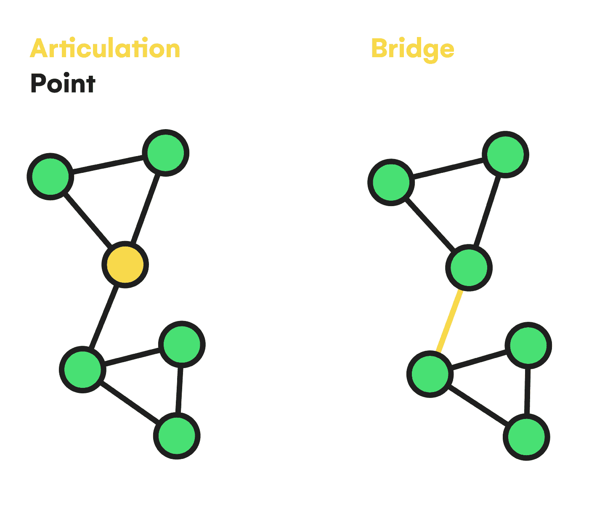

Visual example of an articulation point and a bridge.** 

**作为属性部分的扩展，值得一提的是一些工具和图的特征，它们将帮助我们认识到我们稍后将看到的算法的关键:**

### **什么是子图？**

**它们的名字是子图是什么的恰当指示，因为它很能说明问题。一个**子图**是顶点和边的集合，我们可以从一个任意的图 **G** 中提取这些顶点和边来形成另一个图，通常是尺寸过小的图。**

**形式上，如果一个图 **H** 由 **G** 的顶点子集和**G**的边子集构成，并且每条边都是有效的节点对，那么它就是 **G** 的子图。**

**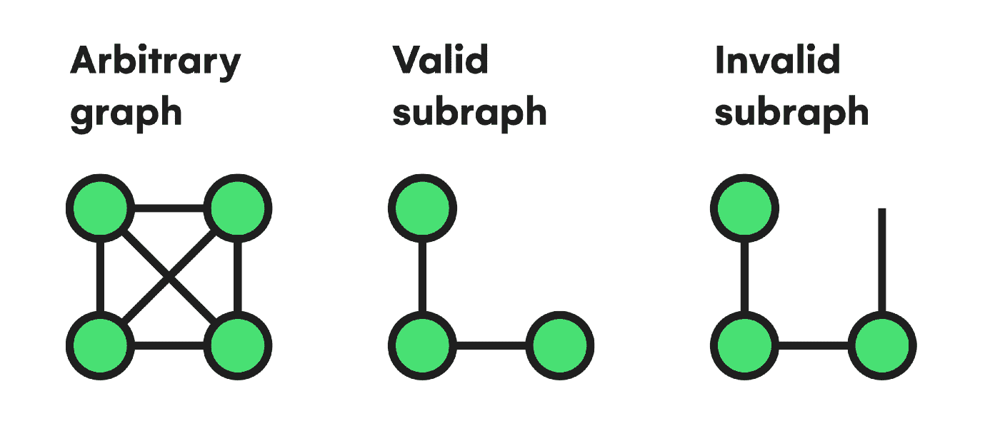

Example of a subgraph validity** 

**我们可以对子图进行的分类和研究的数量使得我们不可能在这里面面俱到。但是进一步学习的基础我们将从以下关于它的形态、拓扑和组成的想法开始。**

**如果子图 **H** 和图 **G** 都有相同的顶点存储在 **V** 集合上，那么子图**H**就跨越了图【】G 。在这种情况下，子图 **H** 被称为 [**生成子图**](https://youtu.be/Kh9LiX2farU) 。**

**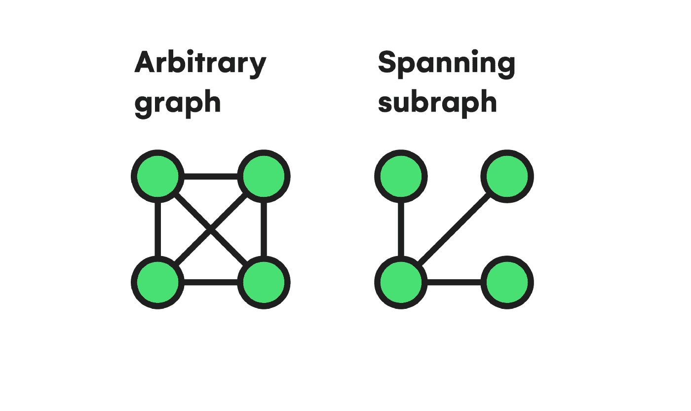

Example of a spanning subgraph.** 

**给定一个图 **G，**如果我们用 n 个< |V|进行 n 次顶点移除操作，那么得到的图将是一个 [**诱导图**](https://youtu.be/1HXbz09Bipw) **。****

**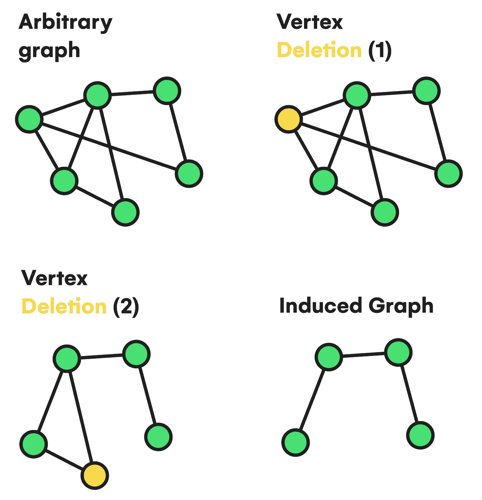

Steps taken to reach an induced graph.** 

**拓扑学不仅仅关注子图。也主要是用一般的图来研究。因此，回顾一些广泛的分类和特征将使图论更容易管理。**

**如果一个图是无向的，没有回路，并且每一对不同的节点仅用一条边连接，则称该图是完全的。同样，根据顶点的数量，我们可以得到一个**n-完全**图 **Kn** 。**

**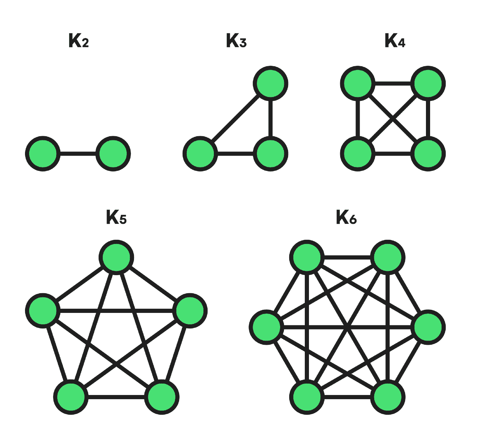

Example of the first 5 complete graphs.** 

**我们还应该谈谈图着色的领域。当一个图的节点可以分成两个不相交的集合**时，这个图是二分的，这两个集合的并产生整个初始顶点集，条件是每条边在这两个集合上同时有其极值。这使得用不同的颜色给每个顶点集着色成为可能。****

****同样，如果两个集合都是稠密连通的(一个集合的每个顶点都与另一个集合的所有顶点相连)，则它可以是一个 [**完全二分图**](https://youtu.be/VvCytJvd4H0) 。****

****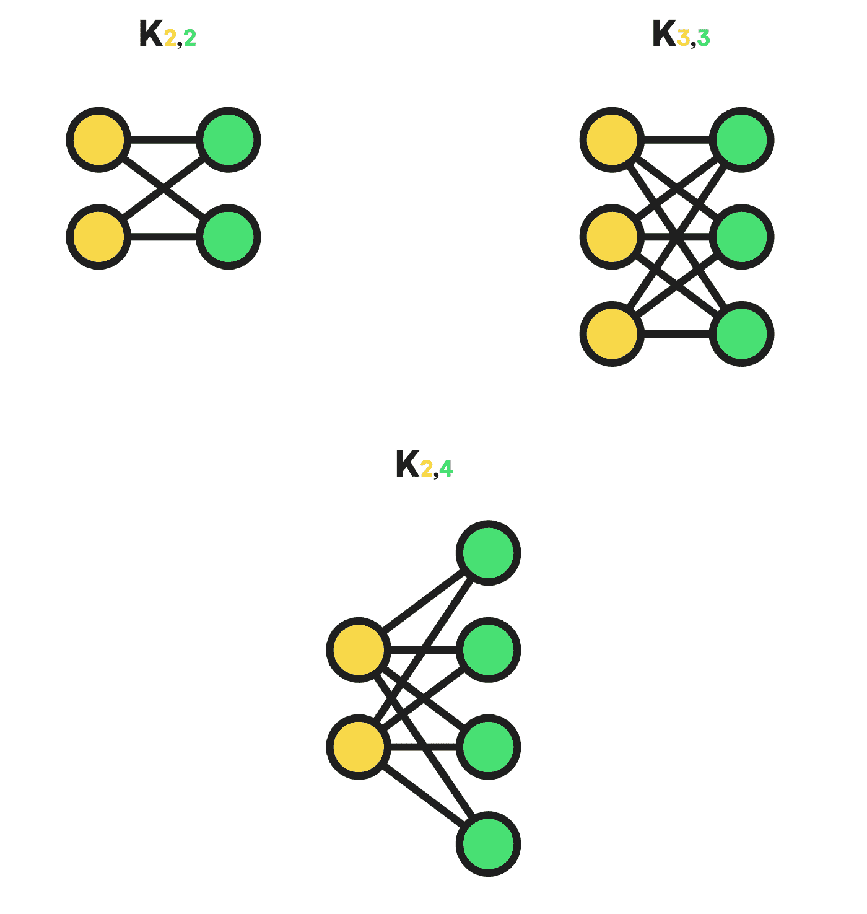

Some examples of arbitrary complete-bipartite graphs.**** 

****你可能还需要在一个平面中表示一个图，它的任何一条边**都不与**相交。然后，如果可能的话，图形将是**平面**。为了更好地理解这个特性的状态，我们可以用 [**库拉托夫斯基定理**](https://en.wikipedia.org/wiki/Kuratowski%27s_theorem) 。涉及到 k5 完全和 k3，3 完全二部图的 [**同构**](https://youtu.be/z-GfKbzvtBA) 和 [**同态**](https://youtu.be/RatkBWHUSqo) 等高级概念。****

****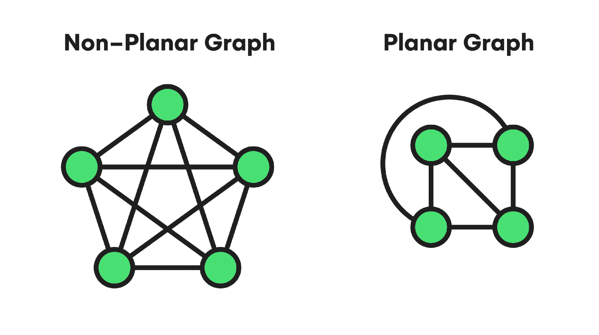

Visual difference between planar and non-planar graphs.**** 

### ****什么是特定的周期？****

****最后，一些图形特性值得特别注意。例如，当它是一个寻找循环的问题时，它与顶点度数、整图拓扑和可通过性有很深的关系。****

****为了形象化这种关系，我们将回到**柯尼斯堡**问题。在这个模型中，我们需要遍历图的所有边，并且不重复任何边，在同一个顶点开始和结束。****

****由于图形在当时是新的，欧拉通过定义一种只有在满足精确条件的图形中才能找到的独特类型的循环开发了一种解决方案——比如所有节点的均匀程度。****

****这些循环根据它们的创造者被命名为**欧拉**，并且每个有一个循环的图也被称为**欧拉图**。****

****还有**欧拉路径**。这消除了必须在同一个顶点上开始和结束的条件，并要求图正好有两个奇数度节点，这将是路径的极端。****

****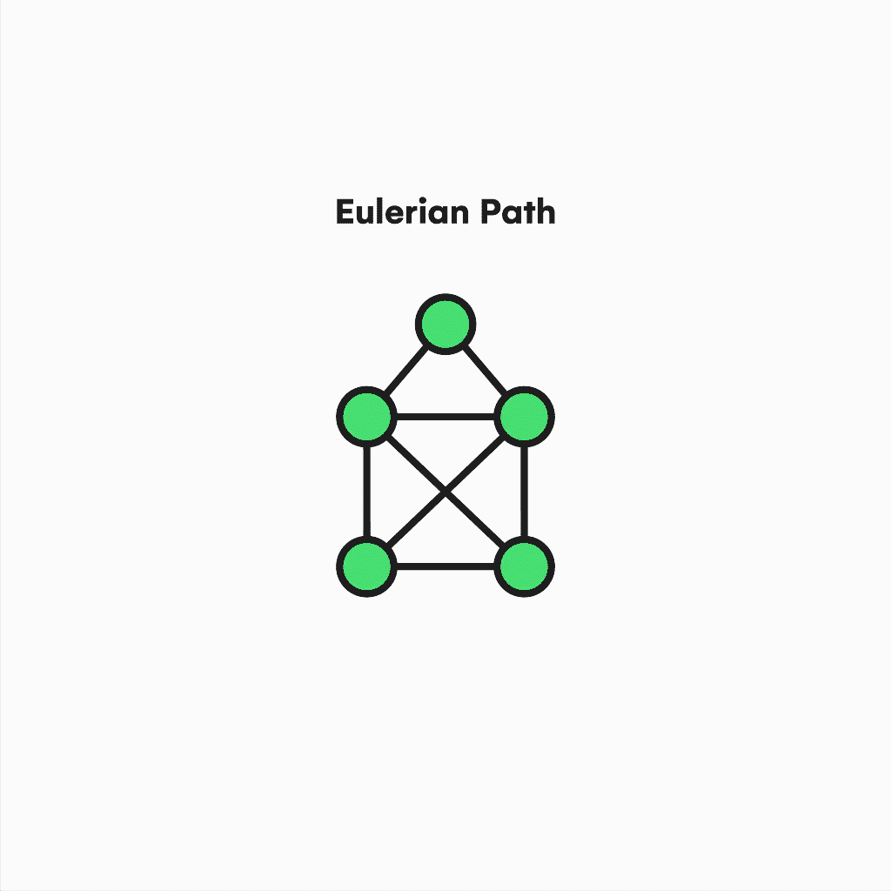

Visualization of an eulerian path.**** 

****此外，假设我们关注当代问题，如旅行推销员问题([**)TSP**](https://en.wikipedia.org/wiki/Travelling_salesman_problem))，一个主要由交付和物流公司使用的 **NP-Hard** 问题。****

****在这种情况下，我们将认识到**哈密顿圈**和路径的相关性，以支持类似问题的实际解决方案。与欧拉相似，如果一个图包含一个圈，其中每个顶点都被用来代替边，那么这个图就是**哈密顿图**。****

****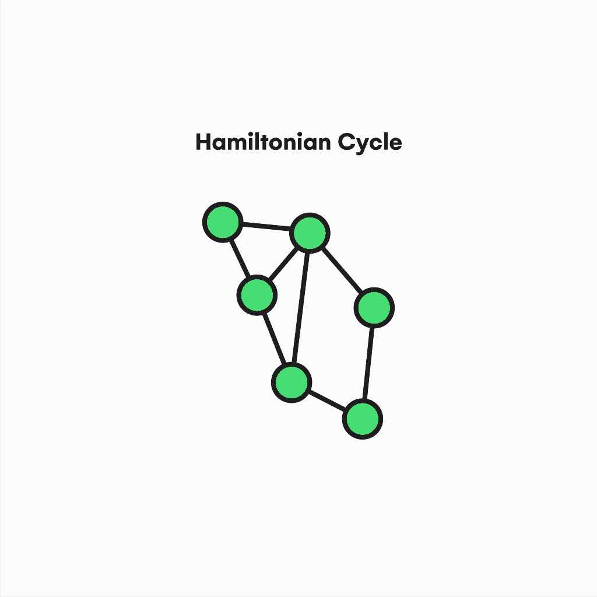

Visualization of a hamiltonian cycle.**** 

****考虑到所涉及问题的复杂性，后一种特性变得难以处理。尽管如此，了解支持他们周围一切的关键基础允许我们以合理的信心继续探索。****

## ****算法和图论****

****一旦你牢固掌握了图论，它的元素，属性和工具，我们也应该回顾一些基本算法，包括几乎所有其他图形处理的原理。然后我们可以继续讨论图论在气候保护项目中的应用。****

### ****广度优先搜索算法****

****在这里，我们将只考虑 3 种算法，因为有许多类型和非常专门的任务。****

****从一些简单直观的东西开始，我们将解读 [**广度优先搜索**](https://youtu.be/oDqjPvD54Ss) 。这是一种图形遍历算法，用于横向遍历图形。****

****简单来说，它从任意顶点开始，迭代地访问它的相邻顶点，重复这个步骤，直到不再有未访问的顶点。****

****此行为充当所有图形节点的最短路径查找器，尽管您可以在访问特定顶点时停止执行。****

****

Representation of breadth-first search algorithm**** 

### ****深度优先搜索算法****

****第二种算法是前一种的变种，称为 [**深度优先搜索**](https://youtu.be/7fujbpJ0LB4) **。**它的目标是相似的，但在检测循环、连接组件、 [**拓扑排序**](https://youtu.be/eL-KzMXSXXI) 或检查图的二分性时也很有用。****

****但是它的工作方式在某些方面有所不同，比如深度**的优先级**高于宽度**的优先级**——也就是说，在每一步中并不是所有的相邻节点都被访问。相反，它们中的一个被选择用于进一步的**深化**，并且该过程被重复，直到该路径到达一个死胡同并且递归地回到开始节点，访问每个顶点。****

****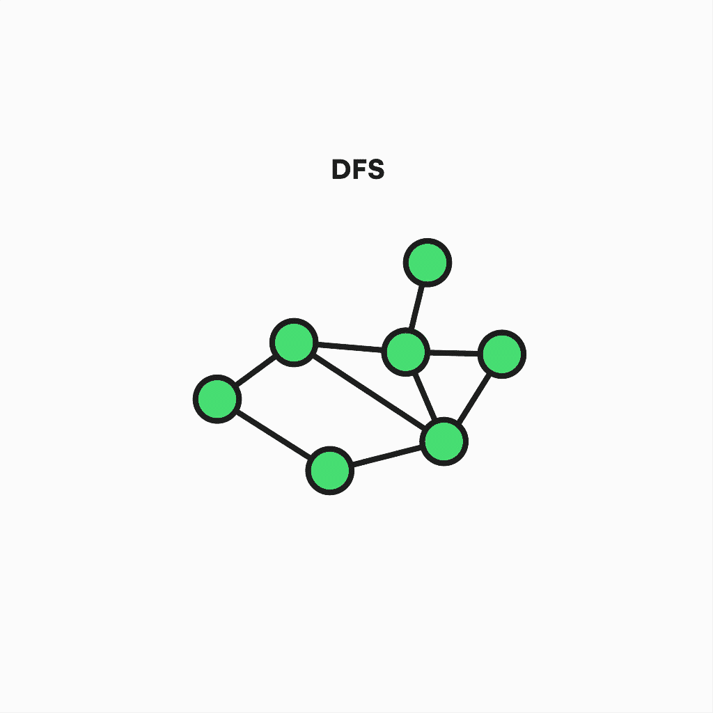

Representation of depth-first search algorithm**** 

### ****Dijkstra 最短路径算法****

****最后，我们要处理的最后一个是 [**Dijkstra 的算法**](https://youtu.be/pSqmAO-m7Lk) ，有史以来最广泛的**单源最短路径**问题求解器。****

****它被设计成在具有非负权重的加权图中操作，并试图在两个选择的节点之间找到最有效的路径。****

****与以前的算法相比，这一变化增加了完成前的步骤数。然而，其背后的关键思想很简单:****

****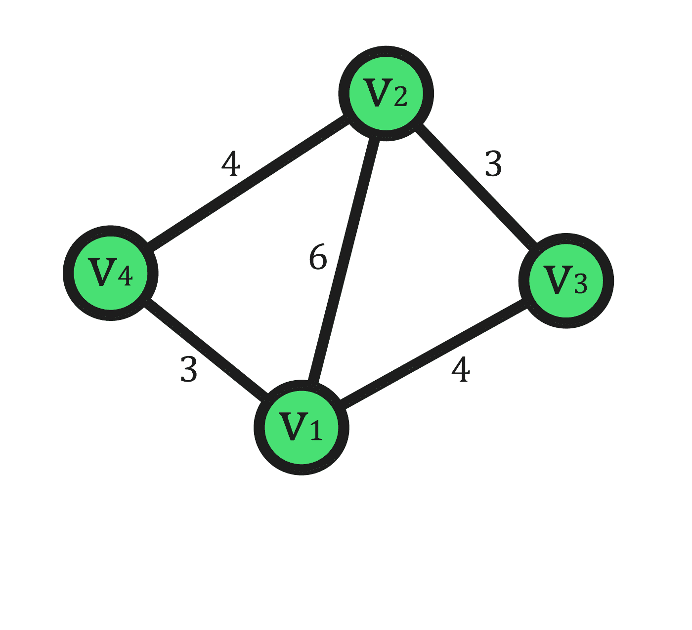

Example Graph used to explain Dijkstra's algorithm**** 

****正如你在上面的例子中看到的，如果我们想从 v1 到 v2，我们可以选择它们之间的边，并在穿越六个距离单位后到达我们的目的地。****

****另一方面，如果我们选择通过 v3 或 v4 路径，我们将走过七个单元。因此，我们需要做出**决定**是否选择一条特定的道路。****

****在大型图上，该算法计算沿着每个节点的临时最短路径。然后，它更新这些值，并通过完整的图遍历来最小化“距离”(由权重给出)，正如您在 [**这个**](https://youtu.be/EFg3u_E6eHU) 动画中看到的。****

## ****为什么图表对实现可持续发展很重要？****

****在这一点上，你可能意识到图论是有价值的，因为它可以封装和抽象地建模本质上有细微差别的问题。特别是那些起源于社会需要追求一定程度的全球化，给每个人的生活带来健康标准的问题。****

****然而，我们许多人都没有意识到，我们目前享受的由通讯、交通、营养和娱乐进步带来的舒适需要复杂系统的协调运作。****

****因此，自二十世纪以来经历的人口过剩导致这些系统如此庞大，以至于它们带来了严重的环境影响，这是基于 CO2 排放和向自然环境中系统地倾倒废物。****

### ****图表有助于货物运输****

****在这种情况下，所有涉及货物运输和物流的事情都会向大气中排放大量的二氧化碳。这就是使用图表对环境有明显好处的地方。他们可以找到城市或世界各地之间的最佳路径，减少从事此类运输的车辆的排放。****

****例如，你可以通过追踪遥远地方之间的路线来尝试谷歌地图。你会注意到它可以自动选择一条合适的路线，将相应的环境成本降到最低。****

****谷歌地图是基于像 Dijkstra 这样的 [**单源最短路径**](https://en.wikipedia.org/wiki/Parallel_single-source_shortest_path_algorithm) 算法或者像 [**A 星**](https://youtu.be/ySN5Wnu88nE) 这样的高级算法。A-star 是 Dijkstra 的启发式变体。这些与其他用于向算法添加某些约束的最新图形机制结合使用。****

### ****图表有助于废物管理****

****通过模拟或直接管理***制造流程和时间表，图在全球产业中也占有一席之地。它们可能会减少不正确处理/浪费的能源和资源。*******

*****还值得一提的是，当我们处理过度废物积累的问题时，图表提供了许多可能性。*****

*****如今，人们普遍认为，由于光合作用，植物和树木是大气中氧气的主要贡献者。但我们必须考虑到，每年释放到大气中的氧气有 50%到 85%是在海底产生的**。*******

*****具有讽刺意味的是，随着消费社会的及时进步，关于扔进海洋的废物的数据不断增加，对我们星球的实际肺部以及它所庇护的动物物种造成了巨大影响。*****

*****为了避免必须决定将垃圾倾倒在哪里，我们可以使用图论来模拟分子物理系统、原子结构和化学反应，以开发新的可回收或可生物降解的材料。这将减少我们使用的产品对环境的影响。*****

*****此外，这些模拟有可能在生物学中有用，在生物学中，破译 **DNA** 的最终工作方式可以带来更好的食品质量，以及更有效的大规模生产方法。*****

### *****图表可以帮助机器学习和人工智能*****

*****最后，图最广为人知的应用是在**机器学习**领域。*****

*****尽管图形在计算机科学中有其他重要用途(如通信网络、分布式系统或数据结构)，但机器学习以其在过去十年中的指数演变向我们表明，在应对气候变化时，它是一项非常有前途的技术。*****

*****简单地说，**机器学习**是**人工智能**的子集，专注于使机器能够学习和检测大型数据集上的模式。有时，这种学习受到自然现象的启发，如人类神经元上的突触，从而产生了新的技术，如 [**人工神经网络**](https://en.wikipedia.org/wiki/Artificial_neural_network) **。*******

*****关于环境保护，这些技术分析大量数据的能力使得更好地衡量我们对地球的影响成为可能。*****

*****作为一个真实的工作例子， [**Joinus4theplanet**](https://joinus4theplanet.org/) 是一项专注于利用社交媒体来提高对可持续发展价值的认识的倡议。它开发了一个机器学习系统，能够在设计用于处理多维数据的 [**卷积模型**](https://youtu.be/YRhxdVk_sIs) 的帮助下进行垃圾分类，以减轻不正确回收的影响。*****

*****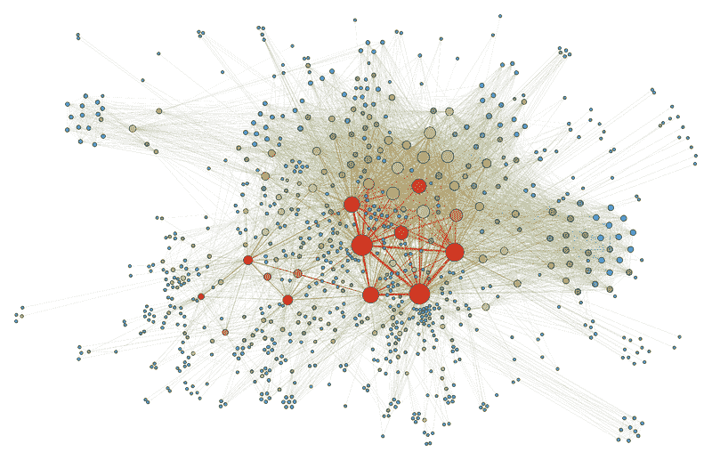

Example of a social network is represented as a graph. Image from [**Wikipedia.**](https://en.wikipedia.org/wiki/File:SocialNetworkAnalysis.png)***** 

## *****结论*****

*****如果我们想在我们的文明中保持相当大的进步，并为下一代提供一个繁荣的未来，当我们重新思考我们的技术和经济系统的工作方式时，我们必须将图表视为一个重要的工具。*****