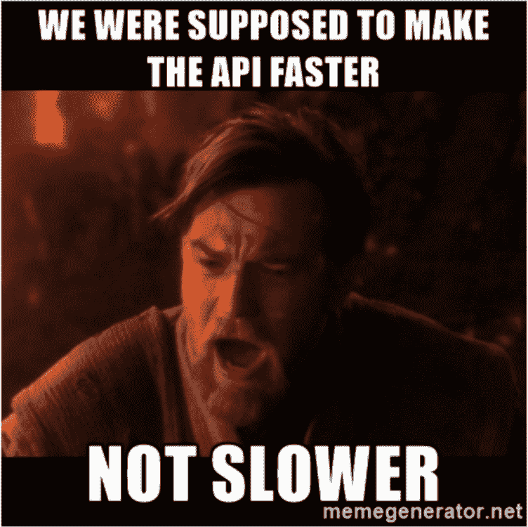

# 在设计 REST API 时，如何平衡笨拙和喋喋不休

> 原文：<https://www.freecodecamp.org/news/three-ways-to-balance-between-chunkiness-and-chattiness-of-your-rest-api-67e60b7bcca7/>

作者:苏哈斯·查提尔

# 在设计 REST API 时，如何平衡笨拙和喋喋不休


构建任何 API 的挑战之一是，你不知道谁将使用你的 API，或者他们将如何使用它。

您可能有一个内部消费者，他通过 LAN 连接调用您的 API。这个消费者不介意进行大量的 API 响应(chunky)，或者进行几次 API 调用来获得他们想要的所有不同的数据块(chatty)。

或者您可能有一个通过互联网连接的外部消费者。这位消费者想打几个网络电话。这些消费者也希望 API 返回足够的数据。



通过移动网络连接的消费者对网络通话非常挑剔。对他们来说，网络通话会导致运营商向他们的用户收费。API 返回的大量数据对他们来说并不理想，因为在处理这些数据时可能会消耗大量的电池。

作为一个 API 开发者，你不能决定你的 API 应该是健谈的还是笨拙的或者没有。你的 API 的消费者想要决定。事实是，大多数 API 都有来自两个阵营的消费者。那么你如何处理这些需求呢？简单的答案是给 API 的消费者更多的权力。让消费者坐在驾驶座上，让他们告诉你的 API 他们想要什么。

在这篇文章中，我将谈论让你做到这一点的三个技巧。

### 技巧 1:使用 Lazy Get 来控制有效负载的大小

大多数对象关系映射器(ORM)工具都有一个称为延迟加载的特性。ORM 使用这个特性在执行 SQL 脚本时只返回顶级实体。不会完全加载任何关联的实体，而只会加载它们的标识符。当应用程序试图访问关联的实体时，ORM 就会启动。它使用先前加载的标识符来加载该实体。这很聪明，因为 ORM 不会猜测应用程序何时需要什么。相反，它赋予应用程序按需获取所需内容的能力。

懒 Get 也类似。使用 Lazy Get，默认情况下不会返回链接的资源。相反，您返回一个仅填充了顶级属性的浅层版本。API 消费者可以

1.  指示服务器在同一响应中返回链接的资源
2.  稍后使用原始响应中返回的链接检索链接的资源

最好用一个例子来解释。假设我们正在构建一个 meetup 平台。人们可以利用我们的平台创建兴趣小组和主持会议。平台成员可以

1.  加入他们喜欢的团体
2.  与平台的其他成员联系
3.  各种团体主办的活动的回复

这是任何 meetup 平台都可以拥有的一系列基本功能。

这个平台支持 API，我们有一个 API 方法来检索一个`member`资源，如下所示。

为了简洁起见，上面的代码没有显示`memberships`、`rsvps`和`friends`资源的完整表示。实际上，这些资源将比我在这里展示的有更多的属性。他们甚至可以拥有自己的链接资源。

这个 API 的消费者可能并不总是需要所有这些数据。通过局域网连接的消费者会很乐意接受大量返回的数据。但是，通过慢速互联网连接的移动应用程序开发人员不希望这样。你猜怎么着？您可以在这个 API 方法上实现 Lazy Get，让使用者决定他们想要返回什么数据。您可以通过支持名为`expand`的新查询参数来实现这一点。此参数接受消费者希望服务器返回的链接资源的逗号分隔名称。例如，如果检索上述成员资源的 URL 是

`[https://myapi.com/v1/member/34234](https://myapi.com/v1/member/34234)`

如果消费者只想返回会员信息，他们可以向以下 URL 发送请求

```
https://myapi.com/v1/member/34234?expand=memberships
```

这很好。现在，消费者可以控制数据服务器返回的内容。但是其他资源，即`rsvps`和`friends`会发生什么呢？服务器会将它们排除在响应之外吗？如果服务器将它们排除在外，消费者如何在需要时获得这些资源？

相反，服务器所做的和任何 ORM 使用它的延迟加载特性所做的完全一样。服务器返回资源的标识符来代替完整的资源。

这样，如果消费者决定获取`rsvps`或`friends`资源，他们需要做的就是在相应的 URL 上发出 GET 请求。

#### 用超媒体来让这一切变得更好

在前面的例子中，客户端如何获取 id 为 5678 的`friend`资源？它将从哪里获得获取该资源的实际 URL 呢？我们可以使用[超媒体](https://en.wikipedia.org/wiki/HATEOAS)来帮助我们。如果你以前用过超媒体，那么你可能已经猜到我在说什么了。

您可以使用超媒体规范之一，如 [Siren](https://github.com/kevinswiber/siren) 、 [HAL](https://tools.ietf.org/html/draft-kelly-json-hal-08) 或 [Collection+JSON](http://amundsen.com/media-types/collection/) 来返回资源的实际 URL，而不仅仅是 id。如果你还处于[理查森成熟度模型——2 级或低于](https://martinfowler.com/articles/richardsonMaturityModel.html)，不要担心。在这种情况下，你可以做我们已经做过的事情。我们不返回链接资源的标识符。对于我们的客户来说，这没有任何意义。相反，我们返回一个属性化的`href`。此属性包含客户端可以发送 GET 请求以获取资源的 URL。下面是返回了`href`属性的`member`资源的样子。

默认情况下，我们为所有资源返回这个属性。

### 技术#2:使用哈希 API 方法变得不那么啰嗦

Lazy Get 有利于控制响应的有效负载大小。不必一次又一次地调用 API 不是很好吗？如果消费者缓存了收到的响应，就是这样。

缓存的一个明显缺点是您不知道您的缓存何时过期。服务器可以在响应头中返回缓存过期信息。消费者可以根据这些信息来清空缓存。但是你在这里所做的只是将问题从客户端转移到服务器端。服务器仍在猜测缓存必须过期的最晚时间。更糟糕的是，大多数实现会将其设置为默认值。

哈希 API 方法为应用程序提供了另一种选择

1.  不能依赖缓存，因为他们总是需要处理数据的新拷贝
2.  由于他们所处的环境，即移动应用程序，不能频繁和大量调用 API。

哈希 API 方法实现将具有以下内容

1.  每个需要支持哈希 API 方法的资源都必须包含哈希属性
2.  该属性的值是资源的字符串(JSON/XML)表示的散列值
3.  每当资源状态改变时，服务器重新计算散列。
4.  一个新的 API 方法，用于返回每个资源的最新哈希值

比方说，我们想要为前面例子中的成员资源支持 hash API 方法。所以首先我们添加一个哈希属性如下

服务器使用自己选择的机制来计算散列属性的值。它也可以是随机的字符串。每当资源状态改变时，服务器必须更新它的值。

接下来，我们添加以下新的 API 方法，该方法返回成员资源的最新哈希值

```
https://myapi.com/v1/member/{memberid}/hash
```

这个 API 方法返回一个状态为`200 OK`的响应。响应体包含成员资源的 hash 属性的值。这里的关键是使这个 API 尽可能快。服务器可以缓存资源 id 和哈希值的映射，以减少响应时间。

有带宽意识的消费者现在要做的就是调用 Hash API 方法。然后，它可以将返回的哈希值与它从以前的资源检索中获得的哈希值进行比较。如果哈希值相同，那么可以有把握地认为，自从消费者上次检索资源以来，资源没有发生变化。如果哈希值不同，那么是时候获取资源的最新值了。

#### 保持哈希一直更新

随着越来越多的消费者开始使用散列 API 方法，确保散列总是保持更新变得很重要。这需要适当的思考和优化设计。考虑以下情况

1.  当资源得到部分/全部更新时，散列必须被更新
2.  如果您的哈希包括链接的资源，则每次资源更新时，链接该资源的所有其他资源都必须更新它们的哈希。
3.  当一个资源被删除时，该资源的 hash 方法必须返回一个`404 Not Found`,每个消费者应用程序都应该处理这个响应来删除资源的缓存副本

如果您决定使用 Hash API 方法，从第一天开始就考虑这些情况。事后处理这些情况可能会很昂贵。

### 技巧 3:使用 GraphQL 获取您需要的东西

GraphQL 是脸书的一个开源项目。几年前它只是一个想法，但现在已经发展成为一个定义良好的规范。有一些支持 GraphQL 的主要编程平台的库。根据 GraphQL 的网站:

> “GraphQL 是一种用于 API 的查询语言，也是用现有数据完成这些查询的运行时。GraphQL 为您的 API 中的数据提供了完整且易于理解的描述，使客户能够准确地要求他们需要的东西，使 API 更容易随着时间的推移而发展，并支持强大的开发工具。”

这看起来类似于 Lazy Get，但实际上，它甚至比它更强大。我们一会儿就会看到。GraphQL 还可以轻松支持 Hash API 方法，而无需添加特殊的端点。在我们深入这些细节之前，让我们先看一个 GraphQL 提供的快速示例。

如果一个 API 消费者需要一个没有任何链接资源的成员资源的浅层拷贝，那么它应该发送下面的 GraphQL 查询

让我们忽略一些细节，比如这个查询的目标 URL 和服务器上查询的处理。该查询返回 id 为 34342 的成员资源的指定属性。

如果另一个消费者只想要`firstname`和`lastname`，那么他们在查询中指定这两个属性。服务器将返回这些属性。你看这有多强大。使用 Lazy Get，您可以获得所有链接的资源，要么完全水合，要么没有水合。但是不可能去掉一些属性。

GraphQL 精确指定我们想要返回哪些属性的能力，让我们能够支持现成的 Hash API 方法。在上面的例子中，想要获得成员资源的最新散列值的消费者只需发送下面的查询

记住，它仍然是服务器上处理这些查询的同一个 API 端点。这为 API 的消费者提供了非常精细的控制。消费者可以自己在笨拙的响应和喋喋不休的 API 调用之间取得平衡。

**值得一提的是使用 GraphQL** 的 Hash API 方法的性能。Hash API 方法的一个核心前提是需要尽快返回。如果我们有自己的 Hash API 方法的实现，那么我们就可以完全控制我们所需要的任何微调。对于 GraphQL，我们受到我们使用的 GraphQL 库所提供的限制。如果您使用 GraphQL 版本的 Hash API 方法，那么请确保它针对用例进行了性能调整。

#### GraphQL 就是将控制权交给 API 的消费者

我展示了两个简单的例子来说明 GraphQL 的可能性。但是 GraphQL 并不局限于简单的查询。你能做到

1.  在属性上指定附加过滤器，如前 10 个、后 30 个或包含
2.  在多个属性上指定过滤器
3.  将通常返回的属性分组在[片段](http://facebook.github.io/graphql/#sec-Language.Fragments)中
4.  [查询验证](http://facebook.github.io/graphql/#sec-Validation)
5.  [使用变量参数化查询](http://facebook.github.io/graphql/#sec-Language.Variables)
6.  使用[指令](http://facebook.github.io/graphql/#sec-Language.Directives)动态改变查询行为
7.  [获取后数据突变](http://facebook.github.io/graphql/#OperationType)

一个完全支持 GraphQL 的 API，让用户可以完全控制在什么时候获取什么数据。

### `Happy API consumer == Happy API developer == Great API`

提供良好的开发人员体验的方法之一是给他们一些与他们交互的 API 的控制权。Lazy Get、Hash API 方法和 GraphQL 提供了一种机制，通过这种机制，API 开发人员可以将控制权交给他们的消费者。

如果你喜欢我的文章，请不要忘记点击❤推荐给别人。

另外，如果你想了解我的新文章和故事，请在[媒体](https://medium.com/@suhas_chatekar)和[推特](https://twitter.com/suhas_chatekar)上关注我。你也可以在 LinkedIn 上找到我。干杯！

[**为什么在设计 REST APIs 时要使用标准的 HTTP 方法？**](https://medium.com/@suhas_chatekar/why-you-should-use-the-recommended-http-methods-in-your-rest-apis-981359828bf7)
[*一个好的 REST API 的特征之一是它使用标准的 HTTP 方法，以一种它们应该使用的方式…*medium.com](https://medium.com/@suhas_chatekar/why-you-should-use-the-recommended-http-methods-in-your-rest-apis-981359828bf7)[**使用 API 映射可视化复杂的 API**](https://medium.com/@suhas_chatekar/visualising-complex-apis-using-api-map-f09f617acb32)
[*一张图片胜过千言万语…*medium.com](https://medium.com/@suhas_chatekar/visualising-complex-apis-using-api-map-f09f617acb32)