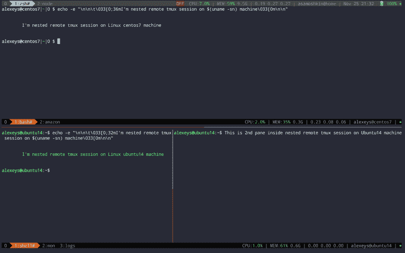

# 实践中的 tmux:与系统剪贴板的集成

> 原文：<https://www.freecodecamp.org/news/tmux-in-practice-integration-with-system-clipboard-bcd72c62ff7b/>

阿列克谢·萨莫什金

# 实践中的 tmux:与系统剪贴板的集成

#### 如何在 tmux 复制缓冲区和系统剪贴板之间建立一个桥梁，并在 OSX 或 Linux 系统剪贴板上存储选定的文本，以解决本地和远程使用场景

这是我的 [tmux 实践](https://medium.com/@alexeysamoshkin/tmux-in-practice-series-of-posts-ae34f16cfab0)系列文章的第 4 部分。



You can copy text from local or remote, or even nested remote session to your system clipboard

在“tmux in practice”系列的[前一部分中，我们谈到了诸如回卷缓冲区、复制模式之类的东西，并略微谈到了将文本复制到 tmux 的复制缓冲区的主题。](https://medium.com/@alexeysamoshkin/tmux-in-practice-scrollback-buffer-47d5ffa71c93)

迟早你会意识到，无论你在 tmux 中复制什么，都只能存储在 tmux 的复制缓冲区中，而不能与系统剪贴板共享。复制和粘贴是如此常见的操作，尽管有其他好处，但这种限制本身就足以使 tmux 变成无用的砖块。

在这篇文章中，我们将探索如何在 tmux 复制缓冲区和系统剪贴板之间建立一座桥梁，在系统剪贴板上存储复制的文本，以解决本地和远程使用场景。

我们将讨论以下技术:

1.  仅限 OSX，使用“pbcopy”与剪贴板共享文本
2.  仅限 OSX，使用“重新附加到用户名称空间”包装器使 pbcopy 在 tmux 环境中正常工作
3.  仅限 Linux，使用`xclip`或`xsel`命令与 X 选择共享文本

上面的技术只解决了局部场景。
**为了支持远程场景，有两个额外的方法:**

1.  使用 [ANSI OSC 52](https://en.wikipedia.org/wiki/ANSI_escape_code#Escape_sequences) 转义[序列](https://blog.vucica.net/2017/07/what-are-osc-terminal-control-sequences-escape-codes.html)与控制/父终端对话，以管理和存储本地机器剪贴板上的文本。
2.  设置一个本地网络监听器，通过管道将输入传输到`pbcopy`或`xclip`或`xsel`。管道通过 SSH 远程隧道将选定的文本从远程机器复制到本地机器上的监听器。这个比较复杂，我会专门出一个帖子来描述。

### OSX。pbcopy 和 pbpaste 命令

`pbcopy`和`pbpaste`命令允许你从命令行交互和操作系统剪贴板。

`pbcopy` 从`stdin`读取数据，并将其存储在剪贴板中。`pbpaste`反其道而行之，将复制的文本放在`stdout`上。

这个想法是挂钩到各种 tmux 命令，在复制模式下管理复制文本。

让我们列出它们:

```
$ tmux -f /dev/null list-keys -T copy-mode-vi
```

```
bind-key -T copy-mode-vi Enter send-keys -X copy-selection-and-cancelbind-key -T copy-mode-vi C-j send-keys -X copy-selection-and-cancelbind-key -T copy-mode-vi D send-keys -X copy-end-of-linebind-key -T copy-mode-vi MouseDragEnd1Pane send-keys -X copy-selection-and-cancelbind-key -T copy-mode-vi A send-keys -X append-selection-and-cancel
```

`copy-selection-and-cancel`和`copy-end-of-line`是特殊的 tmux 命令，当 pane 处于复制模式时，tmux 理解这些命令。复制命令有两种风格:`copy-selection`和`copy-pipe`。

让我们用 copy-pipe 命令重写`Enter` keybinding:

```
bind -T copy-mode-vi Enter send-keys -X copy-pipe-and-cancel "pbcopy"
```

`copy-pipe`命令将选中的文本存储在与`copy-selection`相同的 tmux 缓冲区中，并通过管道将选中的文本传输到给定命令`pbcopy`。因此，我们将文本存储在两个地方:tmux 复制缓冲区和系统剪贴板。

### OSX。重新附加到用户名称空间包装器

到目前为止一切顺利。但是，在 OSX 的某些版本上，`pbcopy`和`pbpaste` 在 tmux 下运行时无法正常工作。

阅读 Chris Johnsen 关于为什么会这样的更多细节:

> tmux 在启动其服务器进程时使用 daemon(3)库函数。在 Mac OS X 10.5 中，Apple 更改了 daemon(3)以将结果进程从其原始引导命名空间移动到根引导命名空间。这意味着 tmux 服务器及其子服务器将自动且不可控制地失去对其原始引导命名空间(即可以访问粘贴板服务的名称空间)的访问。

一个常见的解决方案是使用[重附属到用户名称空间](https://github.com/ChrisJohnsen/tmux-MacOSX-pasteboard)包装器。这允许我们启动一个进程，并将该进程附加到每个用户的引导命名空间，这使得程序的行为符合我们的预期。您需要适当地更改键绑定:

```
bind -T copy-mode-vi Enter send-keys -X copy-pipe-and-cancel “reattach-to-user-namespace pbcopy”
```

另外，您需要通过设置`default-command`选项来告诉 tmux 在包装器中运行您的 shell (bash、zsh、…):

```
if -b "command -v reattach-to-user-namespace > /dev/null 2>&1" \    "run 'tmux set -g default-command \"exec $(tmux show -gv default-shell) 2>/dev/null & reattach-to-user-namespace -l $(tmux show -gv default-shell)\"'"
```

**注意**:一些 OSX 版本即使没有这个黑客也能正常工作(OSX 10.11.5 El Capitan)，而 OSX Sierra 用户[报告仍然需要这个黑客](https://github.com/ChrisJohnsen/tmux-MacOSX-pasteboard/issues/56)。

### Linux。通过 xclip 和 xsel 与 X 选择进行交互

我们可以利用 Linux 上的`xclip`或`xsel`命令将文本存储到剪贴板中，就像 OSX 上的`pbcopy`一样。在 Linux 上，X 服务器维护的[剪贴板选择](https://wiki.archlinux.org/index.php/Clipboard)有几种:主、从、剪贴板。我们只关心主要的和剪贴板。二级是为了替代一级。

```
bind -T copy-mode-vi Enter send-keys -X copy-pipe-and-cancel "xclip -i -f -selection primary | xclip -i -selection clipboard"
```

或者使用`xsel`时:

```
bind -T copy-mode-vi Enter send-keys -X copy-pipe-and-cancel "xsel -i --clipboard"
```

[如果你好奇，可以在这里阅读](https://askubuntu.com/questions/705620/xclip-vs-xsel)关于`xclip`和`xsel`的比较。另外，看看[这篇关于`xclip`用法和例子](https://www.cyberciti.biz/faq/xclip-linux-insert-files-command-output-intoclipboard/)的帖子。不要忘记安装这些实用程序中的一个，因为它们可能不是您的发行版的一部分。

### 使用 ANSI OSC 52 转义序列使终端将文本存储在剪贴板中

到目前为止，我们只讨论了本地场景。当您 SSH 到远程机器，并在那里启动 tmux 会话时，您不能使用`pbcopy`、`xclip`或`xsel`，因为文本将存储在远程机器的剪贴板中，而不是您的本地剪贴板中。您需要某种方式将复制的文本传输到本地机器的剪贴板。

[ANSI 转义序列](https://en.wikipedia.org/wiki/ANSI_escape_code)是发送到终端的字节序列，与常规可打印字符交错，用于控制终端的各种方面:如文本颜色、光标位置、文本效果、清除屏幕。终端能够检测这种控制字节序列，使其触发特定的动作，并且不将这些字符打印到输出端。

ANSI 转义序列可以被检测到，因为它们以`ESC` ASCII 字符开始(0x1b 十六进制，027 十进制，\033 八进制)。比如终端看到`\033[2A`序列，会把光标位置上移 2 行。

真的有[很多](https://www.xfree86.org/4.8.0/ctlseqs.html)那些已知的序列。其中一些在不同的终端类型中是相同的，而另一些可能会有所不同，并且非常特定于您的终端仿真器。使用`infocmp`命令在`terminfo`数据库中查询不同类型终端支持的转义序列。

好的，很好，但是它对剪贴板有什么帮助呢？原来有一类特殊的转义序列:“操作系统控件”(OSC)和“OSC 52”转义序列，它允许应用程序与剪贴板进行交互。

如果你使用 iTerm，试着执行下面的命令，然后按“`⌘V`”来查看系统剪贴板的内容。确保打开 OSC 52 转义序列处理:“首选项- >常规- >终端中的应用程序可以访问剪贴板”。

```
printf "\033]52;c;$(printf "%s" "blabla" | base64)\a"
```

结论是，通过向我们的终端发送特制的 ANSI 转义序列，我们可以将文本存储在系统剪贴板中。

让我们编写 shell 脚本`yank.sh`:

```
#!/bin/bash
```

```
set -eu
```

```
# get data either form stdin or from filebuf=$(cat "$@")
```

```
# Get buffer lengthbuflen=$( printf %s "$buf" | wc -c )
```

```
maxlen=74994
```

```
# warn if exceeds maxlenif [ "$buflen" -gt "$maxlen" ]; then   printf "input is %d bytes too long" "$(( buflen - maxlen ))" >&2fi
```

```
# build up OSC 52 ANSI escape sequenceesc="\033]52;c;$( printf %s "$buf" | head -c $maxlen | base64 | tr -d '\r\n' )\a"
```

因此，我们从`stdin`读取要复制的文本，然后检查它的长度是否超过 74994 字节的最大长度。如果为真，我们就裁剪它，最后将数据转换为 base64 格式，并封装在 OSC 52 转义序列中:`\033]53;c;${data_in_base64}\a`

然后让我们用 tmux 键绑定来连接它。这非常简单:只需将选定的文本通过管道传输到我们的`yank.sh`脚本，就像我们将它传输到`pbcopy`或`xclip`一样。

```
yank="~/.tmux/yank.sh"
```

```
bind -T copy-mode-vi Enter send-keys -X copy-pipe-and-cancel "$yank"
```

然而，还剩下一块来完成拼图。我们应该把转义序列发送到哪里？显然，仅仅发送到`stdout`是不行的。目标应该是我们的父终端模拟器，但是我们不知道正确的`tty`。因此，我们将它发送到 tmux 的活动窗格`tty`，并告诉 tmux 进一步将其重新发送到父终端仿真器:

```
# build up OSC 52 ANSI escape sequenceesc="\033]52;c;$( printf %s "$buf" | head -c $maxlen | base64 | tr -d '\r\n' )\a"esc="\033Ptmux;\033$esc\033\\"
```

```
pane_active_tty=$(tmux list-panes -F "#{pane_active} #{pane_tty}" | awk '$1=="1" { print $2 }')
```

```
printf "$esc" > "$pane_active_tty"
```

我们使用`tmux list-panes`命令来查询活动窗格，它是`tty`。我们还将 OSC 52 序列放在一个附加的包装转义序列(设备控制字符串，ESC P)中，因此 tmux 打开这个信封并将 OSC 52 传递给父终端。

在 tmux 的新版本中，您可以让 tmux 为您处理与剪贴板的交互。参见`set-clipboard` tmux 选项。`on` — tmux 将创建一个内部缓冲区，并尝试使用 OSC 52 设置终端剪贴板。`external` —不创建缓冲区，但仍尝试设置终端剪贴板。

只要确保它是`external`或`on`:

```
set -g set-clipboard on
```

所以，如果 tmux 已经有这个功能，为什么我们还需要手动布线 OSC 52 呢？这是因为当远程 tmux 会话嵌套在本地会话中时,`set-clipboard`不起作用。并且它只在那些支持 OSC 52 转义序列处理的[终端中工作。](https://askubuntu.com/questions/621522/use-tmux-set-clipboard-in-gnome-terminal-xterms-disallowedwindowops/621646)

嵌套远程会话的技巧是绕过远程会话，将我们的 OSC 52 转义序列直接发送到本地会话，这样它就命中了我们的本地终端仿真器(iTerm)。

为此，使用`$SSH_TTY`:

```
# resolve target terminal to send escape sequence# if we are on remote machine, send directly to SSH_TTY to transport escape sequence# to terminal on local machine, so data lands in clipboard on our local machinepane_active_tty=$(tmux list-panes -F "#{pane_active} #{pane_tty}" | awk '$1=="1" { print $2 }')target_tty="${SSH_TTY:-$pane_active_tty}"
```

```
printf "$esc" > "$target_tty"
```

就是这样。现在我们有了一个完全可行的解决方案，无论是本地会话、远程会话还是两者都嵌套在一起。[感谢这篇伟大的文章](https://sunaku.github.io/tmux-yank-osc52.html)，在那里我第一次读到了这种方法。

使用 OSC 转义序列的主要缺点是，尽管在规范中声明了，但实际上只有少数终端支持这一点:iTerm 和 xterm 支持，而 OSX 终端、Terminator 和 Gnome 终端不支持。因此，一个很好的解决方案(尤其是在远程场景中，当你不能仅仅从`pipe`到`xclip`或者`pbcopy`)缺乏更广泛的终端支持。

你可能想要[签出`yank.sh`脚本的完整版本](https://github.com/samoshkin/tmux-config/blob/af2efd9561f41f30c51c9deeeab9451308c4086b/tmux/yank.sh)。

还有另一种解决方案来支持远程场景，这相当疯狂，我将在另一篇[专用帖子](https://medium.com/@alexeysamoshkin/tmux-in-practice-copy-text-from-remote-session-using-ssh-remote-tunnel-and-systemd-service-dd3c51bca1fa)中描述它。这个想法是建立一个本地网络监听器，它通过 SSH 远程隧道将输入传输到`pbcopy`或`xclip`或`xsel;`，并将选择的文本从远程机器复制到本地机器上的监听器。敬请关注。

### 资源和链接

ANSI 转义码—维基百科—[https://en . Wikipedia . org/wiki/ANSI _ Escape _ code # Escape _ sequences](https://en.wikipedia.org/wiki/ANSI_escape_code#Escape_sequences)

什么是 OSC 终端控制序列/转义码？| ivu CICA blog—[https://blog . vu CICA . net/2017/07/what-are-OSC-terminal-control-sequences-escape-codes . html](https://blog.vucica.net/2017/07/what-are-osc-terminal-control-sequences-escape-codes.html)

使用终端编程器 OSC 52 从 tmux 和 Vim 复制到剪贴板[https://sunaku.github.io/tmux-yank-osc52.html](https://sunaku.github.io/tmux-yank-osc52.html)

将 Shell 提示符输出直接复制到 Linux / UNIX 剪贴板—nix craft—[https://www . cyber Citi . biz/FAQ/X clip-Linux-insert-files-command-Output-into Clipboard/](https://www.cyberciti.biz/faq/xclip-linux-insert-files-command-output-intoclipboard/)

软件推荐—‘xclip’vs .‘xsel’—问 Ubuntu—[https://askubuntu.com/questions/705620/xclip-vs-xsel](https://askubuntu.com/questions/705620/xclip-vs-xsel)

关于 Tmux 复制粘贴 rushiagr—[http://www . rushiagr . com/blog/2016/06/16/everything-you-need-know-on-Tmux-copy-pasting/](http://www.rushiagr.com/blog/2016/06/16/everything-you-need-to-know-about-tmux-copy-pasting/)

macos —在远程 tmux 会话和本地 macos 粘贴板之间同步粘贴板—超级用户—[https://Super User . com/questions/407888/Synchronize-pasteboard-between-remote-tmux-session-and-local-Mac-OS-pasteboard/408374 # 408374](https://superuser.com/questions/407888/synchronize-pasteboard-between-remote-tmux-session-and-local-mac-os-pasteboard/408374#408374)

linux —从远程 SSH 会话获取本地剪贴板上的项目—堆栈溢出—[https://Stack Overflow . com/questions/1152362/Getting-Items-on-the-Local-Clipboard-from-a-Remote-SSH-Session](https://stackoverflow.com/questions/1152362/getting-items-on-the-local-clipboard-from-a-remote-ssh-session)

在 gnome-terminal 中使用 tmux set-clipboard(XTerm 的 disallowedwindwops)-Ask Ubuntu—[https://askubuntu . com/questions/621522/use-tmux-set-clipboard-in-gnome-terminal-XTerm-disallowedwindwops/621646](https://askubuntu.com/questions/621522/use-tmux-set-clipboard-in-gnome-terminal-xterms-disallowedwindowops/621646)