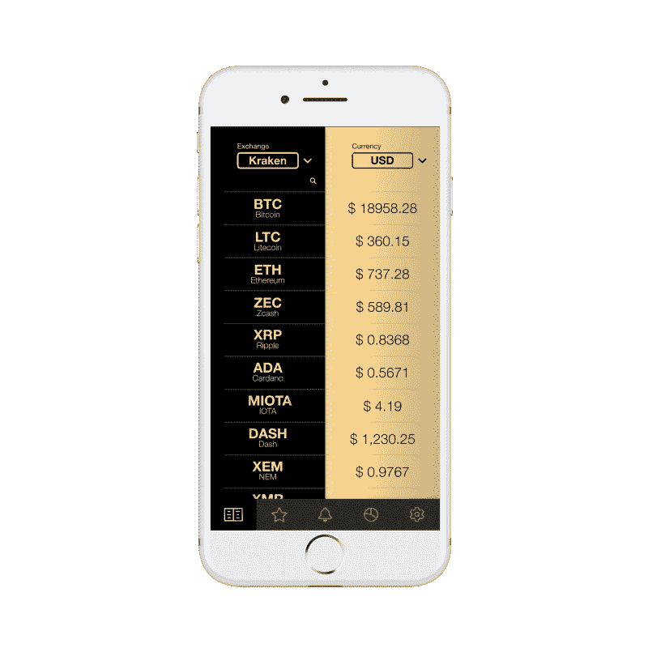

# 今天我发布了我的第一个手机应用。以下是我学到的

> 原文：<https://www.freecodecamp.org/news/today-i-launched-my-first-mobile-app-heres-what-i-learned-6fc25c14eee6/>

作者 Harshita Arora

# 今天我发布了我的第一个手机应用。以下是我学到的

我最近在 Medium 上写了不少东西，分享我在开发我的第一个应用程序 [Crypto Price Tracker](https://itunes.apple.com/us/app/crypto-price-tracker/id1333696099?ls=1&mt=8) 时获得的宝贵的设计和开发知识，我今天 1 月 28 日刚刚发布了这个应用程序。

我想分享我从开始使用这个应用到今天的故事。我希望这篇文章能帮助和激励其他年轻的程序员(或者任何对制造技术产品感兴趣的人！)获得有价值的技术技能，确定市场需求，用他们的技能制造出满足这些市场需求的优秀产品。

我的一点背景:我是一名 16 岁的在家上学的学生。我从 13 岁开始学习数字设计和编程。2016 年冬天我是班加罗尔 Salesforce 最年轻的实习生。

我在 2017 年夏天参加了麻省理工学院的启动夏季项目，在那里我和我的团队启动了[大学](http://universeatyapp.com/)。那是我第一次尝试 iOS 应用程序，我喜欢在开发移动应用程序时，开发有形产品和查看工作成果的速度有多快。将我的想法带到软件中变得更加容易和有趣！

我从 [Treehouse](https://teamtreehouse.com/tracks/beginner-ios-development) 、 [Udemy、](https://www.udemy.com/ios-11-app-development-bootcamp/)上的在线课程开始学习 Swift 和 iOS 应用开发，在 YouTube 上看视频，练习构建基本应用。奠定了我的编程基础。经过几周的学习和实践，我开始构建更严肃、更复杂的应用程序。

大约在 2017 年 11 月 20 日，我决定要开发一个加密货币价格跟踪器、警报和投资组合管理应用程序。我在这里分享了一些关于我的动机的故事。我最近意识到，分享我的故事和我在旅途中学到的一些教训确实对他人有帮助！

### 入门指南

这很难开始:不确定性，未知的未知，要考虑的事情，要做的决定。不知道从哪里开始。但我知道我的第一步是进行一些市场调查，以准确了解我的目标受众想要什么——功能、设计，以及我将在应用程序中构建的所有东西。

我在 Reddit、脸书集团、Quora 上发帖，并询问了一些对 cryptos 感兴趣的朋友。我在这个想法上得到了一些可靠的反馈，并且对我的目标用户的需求有了更多的了解。

下一步是设计应用程序。我从绘制用户流程图和线框开始。然后，我开始使用设计软件来创建模型和原型。我已经写了一个关于从头开始设计移动应用的不同的[故事](https://medium.freecodecamp.org/designing-beautiful-mobile-apps-from-scratch-1a3441ebd604)，并且我已经分享了加密价格追踪器应用的每个设计阶段的图片。

这个过程的最终结果是这样的:

A delightful design :)

### 开发加密价格跟踪器

我非常害怕达到这个阶段，因为我是(现在仍然是)编程初学者。我对 Swift 了解不多，也不知道如何设置通知服务器，还有许多其他技术障碍。我有这么多的东西要做，几乎没有技术技能的应用程序。但是我有信心在构建每一个特性的过程中，我能够弄清楚事情并从中学习。事后看来，我可以说我做到了:)

我开始在 Xcode 中导入所有的设计，并为每个屏幕设置一个原始版本。我根据我在应用程序中需要的功能来划分我的编码工作。很多次，我不得不从我的规范中删除一些东西(并编辑设计)，因为它们开发起来似乎很耗时(尤其是如果它们似乎没有提供什么功能的话)。

我编写了网络代码来显示来自我正在使用的 API 的数据，并构建了我的应用程序的主界面。然后我转向了应用程序的“愿望清单”功能。现在，要在用户的手机上本地保存数据，你需要创建核心数据模型——这是我以前从未做过的事情。更多的技术差距和挑战出现了。

但是我一直在学习。当我需要什么的时候，我会用谷歌搜索。通常，几乎所有内容都有有用的答案、代码片段或视频教程。每当我遇到困难时，我会在 StackOverflow 上请求帮助，或者给我的导师发电子邮件寻求帮助。慢慢地，我开始越来越适应跳入未知的事物。

在我花了三周时间编写应用程序的最后，作为一名程序员，我进步了很多。我学到了一些概念，并通过构建一个真正的应用程序来进行实践。我接触了许多有趣的 iOS 技术、库和框架。

我作为一个开发者还需要提高很多。我的应用程序有时加载很慢。它不是最优化或最快的应用程序。但我仍然很高兴我能够建立一些有用的和有价值的东西。

我计划的下一步是将我的应用程序本地化为 10 种语言。我认为这很简单，因为我的应用程序没有太多的文本。伙计，我错了！对于应用程序来说，本地化是一个非常耗时的过程。我写一个单独的故事来解释技术上如何本地化。

在 8 周结束时(从我开始市场研究的那天起)，我已经完全设计和开发了一个应用程序，它显示了来自 18 个交易所的 32 种法定货币的 1000 多种加密货币的实时价格。有价格图表(显示 1 天、1 周、1 个月、3 个月和 1 年的历史价格)、投资组合管理、基于时间和基于阈值的警报。它被本地化为 10 种语言。我还为 iPhone X 优化了我的应用程序。

一旦我的版本准备好了，下一步就是邀请用户测试并给出反馈。

### 测试和提交应用程序

我对我的应用程序感到非常自豪，非常兴奋地把它放在 TestFlight 上，并邀请我所有的朋友和用户来测试它！经过两天的漫长等待，beta 版 app 审核终于获批。我邀请我的朋友来测试它，他们喜欢这个应用程序。所有人都分享了反馈、对未来更新中的功能的想法等等。该应用程序零崩溃！

1.0 版本已经准备好提交了。我的 100 张截图(每种语言的 iPhone 5.5 英寸和 iPhone 5.8 英寸各 5 张)准备好了，我的元数据也本地化了，我的视频预览也完成了。

上传视频预览时遇到了一些意想不到的挑战，因为 fps(每秒帧数)太高。此时，我已经开始接受意想不到的挑战，并能够有效地应对它们。我能够按时完成所有工作并提交应用程序进行审查。

两天后，凌晨 4 点，我收到了拒绝邮件。

这让我极度焦虑。在我读到拒绝的理由之前，很多想法在我的脑海中闪过。苹果拒绝了这款应用，因为这个设计在 iPad 上看起来并不好看。我不知道 iPhone 专用应用程序也必须兼容 iPads。在接下来的几个小时里，我阅读了一些指南，解决了所有的限制和自动布局问题，在 iPad 模拟器上测试了应用程序，它工作了。我再次提交构建进行评审。

一天后，我终于拿到批文了！这是一种解脱，现在我可以专注于产品。我从测试人员那里得到了大量的反馈和错误报告。我修复了一些小错误，编辑了一些翻译，并上传了最终版本。仅仅 12 个小时就获批了！我的应用程序现在好了很多，我很高兴这么多人测试了它，并报告了一些错误，否则这些错误会被愤怒的客户写入应用程序评论。

在发布前的几天，我把我的笔记和日记整理成了这个故事，这样我就可以和大家分享这些经验。

### 我学到的一些教训

1.  本地化是个好主意。直到现在，我都在后悔把我的应用程序本地化为 10 种语言的决定。我写了一些 Quora 的回答，关于这是我为我的应用程序做的最耗时的事情，我不会建议任何没有预算的独立开发者外包本地化。但是现在我的看法变了。使用谷歌翻译将你的应用程序本地化为 10-12 种语言，并让朋友校对，这是让你的应用程序获得更多受众的好方法。苹果也更爱本地化应用。你不可能总是把所有事情都做对，并且把所有可能的字符串都本地化。但是你可以用 20%的工作获得 80%的成果(即翻译的文本)。
2.  人们比你想象的更愿意帮助你。我很感激有很多朋友和导师在这段旅程中给了我很多帮助。但我只是惊讶，当我向他们伸出援手时，有这么多陌生人回应我。在我旅程的早期，当我刚刚有了我的应用程序主界面的一个小原型时，在我读了 Carla White 的书后，我联系了她。她指导我，并帮助我为这个应用提供建议。当我在本地化我的应用程序时，我需要每种语言的校对人员来确保翻译(使用谷歌翻译)是好的和上下文相关的。 [Pascal](https://twitter.com/DJCalled) 对我在 Medium 上的故事发表了评论，并提供了德语翻译方面的帮助。我联系了他，在很短的时间内，他真的编辑了我的德语翻译！更多完全陌生的人提供了帮助。
    从中可以得出一个重要的关键信息:人们愿意帮助你。向他们伸出援助之手，真诚一点，他们会尽其所能帮助你！:D
3.  早期的用户反馈非常重要。不仅来自你的粉丝或信徒的友好话语会激励你，而且你的许多早期用户会给你关于功能、设计改进的想法，以及更多有价值的反馈。我犯的一个错误是测试很晚。我在计划发布前大约 1 周上传了我的测试版本，当时应用程序已经准备好了，我不能做太大的改动。如果我在几周前就让我的用户开始测试，当我有主界面的时候，我会得到很多反馈，并且会有所改进。并反复强调，对于每一个主要功能，我的应用程序都会好得多。相当多的测试人员提到，如果我更早地将构建版本发送出去进行测试，那么这些问题可能会在 2-3 天内得到解决。所以我给每个人的建议是:把你的应用拿到用户手中，让他们尽快测试并获得反馈！

### 我用过的一些有用的工具

1.  [鼓掌板](https://theapplaunchpad.com/)用于更快地创建多组截图(适用于许多本地化版本)。
2.  [椰子](https://cocoapods.org/)。 [SwiftyJSON](https://cocoapods.org/pods/SwiftyJSON) 和 [Alamofire](https://cocoapods.org/?q=alamofire) 用于编写更好的网络代码， [Charts](https://cocoapods.org/pods/Charts) 用于创建价格图表。几乎所有的东西都有一个椰子！
3.  [Firebase](https://firebase.google.com/) 用于推送通知服务器和缓存服务器，每 5 分钟存储一次价格，以更新价格图表。
4.  价格的两个 API:[cryptowatch](https://cryptowat.ch/docs/api)和 [CoinCap](https://github.com/CoinCapDev/CoinCap.io) 。此 [API](http://fixer.io/) 用于对货币汇率进行转换。

能够与众多观众分享我学到的教训和我的旅程，感觉棒极了。我希望这能激励其他人尝试学习编程和构建应用程序，或者任何他们感兴趣的事情。我个人打算在我的应用程序之后开始学习 ML 和数据科学——所以不要害怕尝试不同的领域！尝试一些困难的和让你不舒服的事情。最难做的事情通常最后是最有趣和最有收获的。:)

如果你喜欢读这篇文章，并有反馈或任何想法分享，不要犹豫给我发电子邮件在 harshita@harshitaapps.com。如果你喜欢我的应用，你可以从 App Store [这里](https://itunes.apple.com/us/app/crypto-price-tracker/id1333696099?ls=1&mt=8)下载。:)