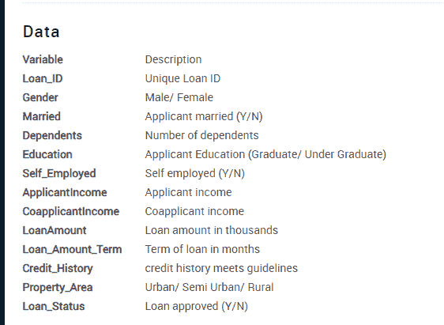

# m2cgen 教程——如何将机器学习模型转化为零依赖的原生代码

> 原文：<https://www.freecodecamp.org/news/transform-machine-learning-models-into-native-code-with-zero-dependencies/>

大多数训练好的机器学习模型都保存为 [pickle 文件](https://machinelearningmastery.com/save-load-machine-learning-models-python-scikit-learn/)。这种文件类型是 Python 中序列化和反序列化对象的标准方式。

为了进行预测，您需要加载已保存的定型模型，然后根据提供的输入执行预测。

在本文中，您将学习如何使用 **m2cgen** Python 库将经过训练的机器学习模型转换成零依赖性的本机代码(例如 Python、PHP 或 JavaScript)。然后你会根据它做出预测。

## 什么是 m2cgen Python 库？

m2cgen (Model 2 Code Generator)是一个简单的 Python 库，可以将经过训练的机器学习模型转换成不同的编程语言。

例如，您可以从 Scikit-learn 库中训练您的机器学习模型，然后将其转换为您选择的编程语言。

如果要将模型部署到无法安装 Python 堆栈来支持模型预测的环境中，这个库非常有用。

### m2cgen 库支持的语言

[M2cgen](https://github.com/BayesWitnesses/m2cgen) 支持 14 种不同的编程语言:

*   C
*   C#
*   镖
*   F#
*   去
*   哈斯克尔
*   Java 语言(一种计算机语言，尤用于创建网站)
*   Java Script 语言
*   服务器端编程语言（Professional Hypertext Preprocessor 的缩写）
*   PowerShell
*   计算机编程语言
*   稀有
*   红宝石
*   Visual Basic(与 VBA 兼容)

### m2cgen 库支持的模型

该库支持来自 Scikit-learn 的不同回归和分类模型，以及 XGBoost 和 LightGBM(轻梯度增强机)等不同的梯度增强框架。

如果您想了解其他受支持的型号，请查看这里:[https://github.com/BayesWitnesses/m2cgen#supported-models](https://github.com/BayesWitnesses/m2cgen#supported-models)。

## 如何安装 m2cgen Python 库

要安装 m2cgen，请在终端中运行以下命令:

```
pip install m2cgen
```

注意，Python 版本> = **3.6** 支持 m2cgen 。

## 如何使用 m2cgen Python 库

在以下示例中，我们将使用贷款数据集，通过 LogisticRegression 算法创建一个简单的机器学习模型。该算法将能够预测客户是否有资格获得贷款金额。

然后我们会用 m2cgen 库把训练好的模型转换成 Python，PHP，JavaScript。你可以在这里下载数据集[。](https://github.com/Davisy/Convert-Trained-ML-Models-To-Native-Code/tree/main/data)

我们开始吧！🚀

为此用例导入以下重要包:

```
import pandas as pd
import numpy as np                     
from sklearn.preprocessing import StandardScaler, LabelEncoder
from sklearn.model_selection import train_test_split 
from sklearn.linear_model import LogisticRegression
import m2cgen as m2c 
import warnings                        # To ignore any warnings
warnings.filterwarnings("ignore")
```

通过以下命令使用 Pandas 加载贷款数据集:

```
data = pd.read_csv("data/loans_data.csv")
```

然后显示数据集中所有列的列表:

```
list(data.columns)
```

这些是我们感兴趣的列:

Loan_ID
性别
已婚
家眷
学历
个体户
申请人收入
共同申请人收入
贷款金额
贷款 _ 金额 _ 期限
信用 _ 历史
房产 _ 面积
贷款 _ 状态

我们有 12 个独立的特性和一个目标( **Loan_Status)** 。您可以在此处阅读每个功能的描述:



Column descriptions

以下是数据集中的前 5 行:

```
#show the first 5 rows of the dataset
data.head() 
```


First 5 Rows

如您所见，数据集有一些缺失数据和分类特征需要转换为数值。下面是一个简单的 Python 函数，它将帮助我们处理缺失数据和特征工程。然后它将返回处理过的特征和目标。

```
# preprocessing the dataset.

def preprocessing(data):

    # replace with numerical values
    data['Dependents'].replace('3+', 3,inplace=True)
    data['Loan_Status'].replace('N', 0,inplace=True)
    data['Loan_Status'].replace('Y', 1,inplace=True)

    # handle missing data 
    data['Gender'].fillna(data['Gender'].mode()[0], inplace=True)
    data['Married'].fillna(data['Married'].mode()[0], inplace=True)
    data['Dependents'].fillna(data['Dependents'].mode()[0], inplace=True)
    data['Self_Employed'].fillna(data['Self_Employed'].mode()[0], inplace=True)
    data['Credit_History'].fillna(data['Credit_History'].mode()[0], inplace=True)
    data['Loan_Amount_Term'].fillna(data['Loan_Amount_Term'].mode()[0], inplace=True)
    data['LoanAmount'].fillna(data['LoanAmount'].median(), inplace=True)

    # drop ID column
    data = data.drop('Loan_ID',axis=1)

    #split features and target 
    X = data.drop('Loan_Status',axis=1)
    y = data.Loan_Status.values

    #scale the  features 
    X  = pd.get_dummies(X,columns=["Gender","Married","Education","Self_Employed","Property_Area"])
    X = StandardScaler().fit_transform(X)

    return X,y 
```

让我们对贷款数据集进行预处理。它将返回已处理的要素和目标。

```
X,y = preprocessing(data) 
```

然后，我们使用 Scikit-learn 的 **`train_test_split`** 函数将处理后的数据分成训练和测试数据集。

```
# split into train and test set 
X_train, X_test, y_train, y_test = train_test_split(X, y, test_size=0.1)
```

现在，我们创建 LogisticRegression 模型并将其训练到我们的训练集中。

```
# create and train the classifier 

classifier = LogisticRegression()

classifier.fit(X_train,y_train)
```

## 如何将训练好的模型转换成 Python 代码

m2cgen 库提供了将训练好的模型转换成上述任何一种支持的语言的方法。在这个例子中，我们将通过使用来自 m2cgen 的 **`export_to_python()`** 方法将训练好的模型转换成 Python。

```
# convert model to pure python code  
model_to_python = m2c.export_to_python(classifier) 
```

以下是用 Python 代码表示的训练模型:

```
#pure python code 

def score(input):

    return (((((((((((((((((0.7929123964945446) + ((input[0]) * (0.07801862594632314))) + ((input[1]) * (-0.014853900985478468))) + ((input[2]) * (-0.15783041201914427))) + ((input[3]) * (-0.05222073553791883))) + ((input[4]) * (-0.0787403404504791))) + ((input[5]) * (1.3714807410150505))) + ((input[6]) * (0.015077765348160292))) + ((input[7]) * (-0.015077765348160353))) + ((input[8]) * (-0.12161041350915254))) + ((input[9]) * (0.12161041350915253))) + ((input[10]) * (0.09387440269562626))) + ((input[11]) * (-0.09387440269562626))) + ((input[12]) * (-0.0047109053878701835))) + ((input[13]) * (0.004710905387870008))) + ((input[14]) * (-0.14569247529698154))) + ((input[15]) * (0.19858601990225683))) + ((input[16]) * (-0.06417592734444703))
```

它生成的 Python 函数代码将接收输入数据，然后执行预测。现在让我们测试生成的 Python 代码。

我们将首先根据实际训练的模型进行预测。以下是我们将从测试集中使用的样本测试数据:

```
test_data = X_test[6]
print(test_data)
```

数组([ 1.24474546，1.9817189，-0.55448733，3.02536229，0.2732313，0.41173269，-0.47234264，0.47234264，-0.72881553，0.72881553，0.52836225，-0.525。

现在我们用实际训练好的模型进行预测。

```
pred = classifier.predict(test_data.reshape(1,-1))  
print("prediction result: {}".format(pred))
```

预测结果:[1]

模型预测为 **1** ，表示客户符合贷款额度。

我们将使用相同的测试数据在生成的纯 Python 代码中执行预测，并评估它是否会给出相同的预测。

```
# test prediction in pure python code 
input = [ 1.24474546,  1.9817189 , -0.55448733,  3.02536229,  0.2732313 ,
        0.41173269, -0.47234264,  0.47234264, -0.72881553,  0.72881553,
        0.52836225, -0.52836225, -2.54711697,  2.54711697,  1.55889948,
       -0.7820157 , -0.70020801]

pred = score(input) 
print("prediction result: {}".format(int(pred)))
```

预测结果:1

纯 Python 代码也提供了相同的预测结果。

## 如何将训练好的模型转换成 PHP 代码

我们将使用 m2cgen 的 **`export_to_php()`** 方法将训练好的模型转换成纯 PHP 代码。

```
# convert model to pure PHP code  
model_to_php = m2c.export_to_php(classifier) 
```

以下是用 PHP 代码表示的经过训练的模型:

```
function score(array $input)
{
    return (((((((((((((((((0.8166973302490392) + (($input[0]) * (0.035269518507829584))) + (($input[1]) * (0.05203333118549156))) + (($input[2]) * (-0.13217178253938103))) + (($input[3]) * (-0.13136526173536608))) + (($input[4]) * (-0.024875019809902837))) + (($input[5]) * (1.2864103414352563))) + (($input[6]) * (-0.005259373701309709))) + (($input[7]) * (0.005259373701309715))) + (($input[8]) * (-0.11512289603368371))) + (($input[9]) * (0.11512289603368378))) + (($input[10]) * (0.06905305123713898))) + (($input[11]) * (-0.06905305123713898))) + (($input[12]) * (0.021080906307735767))) + (($input[13]) * (-0.02108090630773594))) + (($input[14]) * (-0.14491490189610398))) + (($input[15]) * (0.2189862115713242))) + (($input[16]) * (-0.08599736364921017));
}
```

我们将使用相同的测试数据在生成的纯 PHP 代码中执行预测，并评估它是否会给出相同的预测:

```
# test prediction in pure PHP code
$input = [1.24474546, 1.9817189, -0.55448733, 3.02536229, 0.2732313,
    0.41173269, -0.47234264, 0.47234264, -0.72881553, 0.72881553,
    0.52836225, -0.52836225, -2.54711697, 2.54711697, 1.55889948,
    -0.7820157, -0.70020801];

// perform predition with pure php code
$pred = score($input);

echo "Predicton result: ". round($pred);
```

预测结果:1

纯 PHP 代码也提供了相同的预测结果。

## 如何将训练好的模型转换成 JavaScript 代码

在我们最后的例子中，我们将使用 m2cgen 的 **`export_to_javascript()`** 方法将训练好的模型转换成纯 JavaScript 代码。

```
# convert model to pure Javascript code  
model_to_javascript = m2c.export_to_javascript(classifier) 
```

以下是用 JavaScript 代码表示的经过训练的模型:

```
function score(input)
{
    return (((((((((((((((((0.8166973302490392) + ((input[0]) * (0.035269518507829584))) + ((input[1]) * (0.05203333118549156))) + ((input[2]) * (-0.13217178253938103))) + ((input[3]) * (-0.13136526173536608))) + ((input[4]) * (-0.024875019809902837))) + ((input[5]) * (1.2864103414352563))) + ((input[6]) * (-0.005259373701309709))) + ((input[7]) * (0.005259373701309715))) + ((input[8]) * (-0.11512289603368371))) + ((input[9]) * (0.11512289603368378))) + ((input[10]) * (0.06905305123713898))) + ((input[11]) * (-0.06905305123713898))) + ((input[12]) * (0.021080906307735767))) + ((input[13]) * (-0.02108090630773594))) + ((input[14]) * (-0.14491490189610398))) + ((input[15]) * (0.2189862115713242))) + ((input[16]) * (-0.08599736364921017));
}
```

我们将使用相同的测试数据在生成的纯 JavaScript 代码中执行预测，并评估它是否会给我们相同的预测。

```
// perform predition with pure Javascript code
let input =  [1.24474546, 1.9817189, -0.55448733, 3.02536229, 0.2732313,
    0.41173269, -0.47234264, 0.47234264, -0.72881553, 0.72881553,
    0.52836225, -0.52836225, -2.54711697, 2.54711697, 1.55889948,
    -0.7820157, -0.70020801];

let pred = score(input);

console.log("Prediction results:",Math.round(pred));
```

"预测结果:"，1

纯 JavaScript 代码也提供了相同的预测结果。

## 包扎

有时，与原始的 Python 训练的 ML 模型相比，由 m2cgen 库生成的本机代码可以提供不同的结果。以下是该库开发者的简要解释:

> “一些模型在其原生 Python 库中的预测阶段强制输入数据为特定类型。目前，m2cgen 只能处理`float64` ( `double`)数据类型。您可以尝试手动将输入数据转换为另一种类型，然后再次检查结果。此外，由于目标语言中浮点运算的具体实现，可能会出现一些小的差异。”( [**来源:Github 资源库**](https://github.com/BayesWitnesses/m2cgen) )

在上面提到的例子中，我用 **`int()`** 表示 **Python** ， **`round()`** 表示 **PHP** ，用 **`Math.round()`** 表示 **JavaScript** ，将预测结果从 *float* 数据类型转换为 *integer* 数据类型。

恭喜你，你已经完成了这篇文章的结尾！

您可以在这里下载本文中使用的数据集、笔记本和脚本文件:[https://github . com/Davisy/Convert-Trained-ML-Models-To-Native-Code](https://github.com/Davisy/Convert-Trained-ML-Models-To-Native-Code)

如果你学到了新的东西或者喜欢阅读这篇文章，请分享给其他人看。在那之前，下期帖子再见！也可以通过 Twitter [@Davis_McDavid](https://twitter.com/Davis_McDavid) 联系到我。