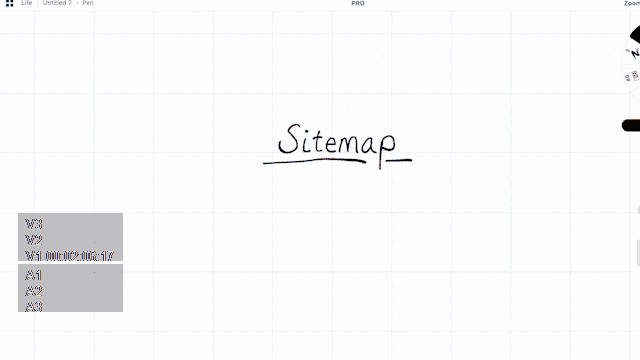
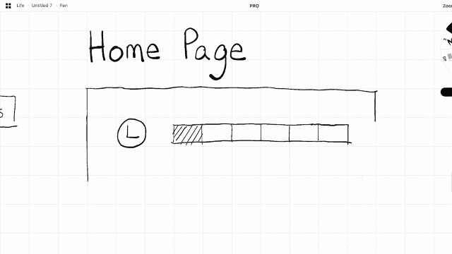
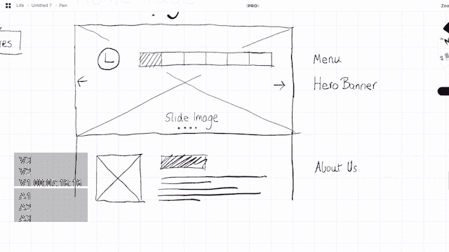
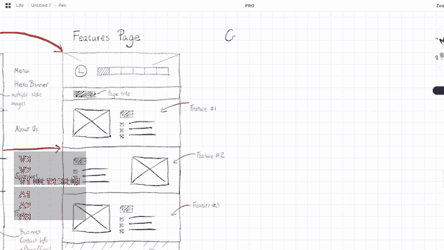
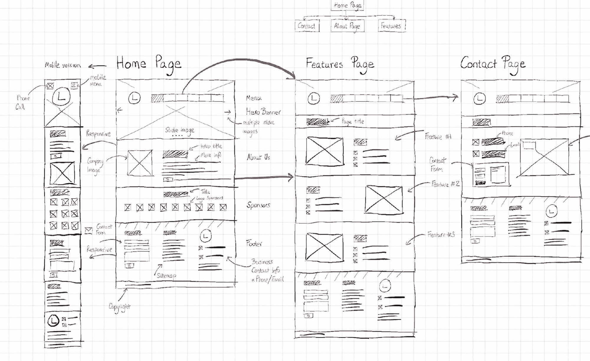

# 什么是线框？这篇 UX 设计教程将向你展示。

> 原文：<https://www.freecodecamp.org/news/what-is-a-wireframe-ux-design-tutorial-website/>

设计一个网站的第一步:画一个线框。

一个好的线框可以让你对网站的整体布局和功能有所了解。它也可以作为设计的第一阶段。

线框让你对页面的整体结构和导航流程有一个概念。

[https://www.youtube.com/embed/pN92rnO_n5U?feature=oembed](https://www.youtube.com/embed/pN92rnO_n5U?feature=oembed)

Watch me build a wireframe for a website step-by-step (30 minute watch)

如果你正在考虑建立一个网站，你可以快速简单地做一个线框。你甚至不需要成为一个平面设计师来做到这一点。

开始时，你只需要一支铅笔和一些纸。(或者，如果你想变得有趣，就像我在上面的视频教程中使用的 iPad 和 iPencil。)

我们将创建一个线框，并展示它如何允许快速，迭代的设计过程。这将创建一个活的文档，你可以为自己和客户使用。你可以用它来推理你的计划——所有这些都在你投入时间实际编码之前。

以下是我们将在本文(以及附带的视频教程)中介绍的一些步骤:

1.  网站地图规划
2.  创建主页线框
3.  在线框中使用标记
4.  线框组件(页眉、菜单、页脚)
5.  给你的特征页和联系页画线框
6.  移动响应线框

Sketching out a sitemap

## 步骤 1:网站地图规划

开始使用线框图从一个好的网站地图开始。在你创建一个页面线框之前，一个网站地图会给你一些结构。通过这种方式，您将了解要构建哪些页面，以及它们将如何相互连接。

大多数小网站可能不需要网站地图。他们通常只有一个登录页面，或者几个普通页面，如功能、关于和联系我们。

也就是说，一旦你的网站或应用变得更大更复杂，你就会想要一个网站地图。

网站地图为你提供了一个项目存在的位置以及它们如何相互连接的简要概述。

在我们的例子中，我们将创建一个简单的站点地图，它只包含主页、功能页面和联系我们页面。

你不必在这上面花太多时间。只需添加几个框来显示每个页面，下面的线来显示子页面，就这样。

Creating a homepage wireframe

## 步骤 2:创建主页线框

我们将创建我们的第一个线框页面。如果你以前没有线框，这个过程很简单。网站的每个方面都用一个形状或简单的图形来表示，例如:

*   用斜线穿过的盒子来代表图像
*   代表文本段落的水平线
*   还有一个带 L 的圆圈代表你的标志。

对于主页，我们将建立一个滑块图像，菜单和标志。我们还会给它一些标签来显示每个项目是什么。

这也有助于将每个部分组织成矩形，以便我们稍后复制粘贴到其他页面上(尤其是页眉和页脚)。

Creating a wireframe for the body of our home page

让我们再创建一个介绍公司的部分(关于我们)和一个赞助商部分(有我们赞助商的标志和图片)。

随着设计的进展，我们还可以在主页中实现其他项目，比如在适当的区域设置行动号召按钮。

我们最终确定了页脚部分的设计，我们添加了常见的元素，如联系方式，联系信息，并再次重用标志。

Creating additional page elements in our wireframe

## 步骤 3:在线框中使用标记

线框不仅经常被设计师看到，也经常被开发人员、客户和管理层看到。所以在内容的每个部分添加一些标记是很有用的。这可以帮助引导人们第一次查看你的线框。我通常在完成一页后这样做。

在我们的示例中，让我们标记主页，并用红色文本标记内容的每个部分。

您想要标记的方面包括诸如部分、标题、联系表单和可能的图像之类的项目。

请注意，标记不必逐字解释内容最终会是什么——只需解释它代表什么。因此，你可以将标题标记为“介绍标题”，而不是放入实际的“介绍标题示例”

How to Markup a wireframe

## 步骤 4:添加其他线框组件，如页眉、菜单和页脚

既然我们已经创建了页眉和页脚，我们可以在其他页面中重用它们。如果您正在以数字方式工作，您可以将页眉、页脚和其他重复元素复制粘贴到新的页面线框中。(而如果你只是用纸和笔，你总是可以用剃须刀和复印机来达到同样的效果。)

这使得你的线框设计保持一致。像 Figma 这样的工具将允许您创建资产组件，您还可以在整个设计中复制粘贴这些资产组件。当你改变你的根组件时，你甚至可以配置它们来动态更新你的线框的其他部分。

在我们的例子中，我们将重用组件来构建一个功能页面。通过创建我们的第一个功能部分组件，我们可以将它复制并粘贴到下面几次，在几分钟内构建出我们的整个功能页面。

Adding wireframe components and reusing them on different pages

## 第 5 步:功能页面和联系页面

一旦你开始使用线框图和构建一些组件，构建额外的页面会变得越来越容易。完成功能页面后，我们可以创建一个联系我们页面。我们真正要做的只是添加一些常见的元素，比如谷歌地图、联系我们表单和一些基本的联系信息，比如电话号码和电子邮件地址。

在这个例子中，我用小图标代表电话和电子邮件，用大块图标代表它们在页面上的位置。

联系方式将位于下面(没有方框轮廓)，以及在右手边的谷歌地图。

Wireframing the Contact Us Page

## 步骤 6:制作一个移动响应线框

没有手机版，现在就没有好的线框了。这是因为今天的大部分网络是在移动设备上浏览的。

了解设计如何收缩到更小的视口是有好处的。如果你有更多的时间，你也可以构建一个响应线框的平板版本。

在我们的例子中，我们一节一节地构建主页设计线框。大多数行和列都是折叠的。由于我们在移动视窗中，许多图像、文本和区块的尺寸都减小了。

因此，某些部分可能仍然与它们各自的桌面版本具有相同的高度。另一方面，一些有很多图片的部分(比如赞助商部分)可能会有更多的滚动高度。

因此，我还经常添加额外的标记来显示哪些桌面版本部分对应于哪些移动版本的相应部分。

The final wireframe with several pages designed, the sitemap, and markup

## 结论

线框图是一种快速的方法，可以让你对你的网站或应用程序有一个更好的视觉概念。我建议您在下一个项目中尝试使用它，以帮助您规划它的功能和外观。

线框是实现这一点的理想方法，因为它比让设计师做一个完整的用户界面原型花费的时间要少得多。

作为一名开发人员，多年来我一直在为我的网站构建线框。我几乎从来没有开发过一个网站，而没有至少勾画出一些我对它的视觉外观的想法。

快乐的线框。

我希望你喜欢这篇文章。如果你不知道我是谁，我是澳大利亚的阿德里安？我在 Twitter & YouTube 上有一个小小的频道，所以如果你想了解我更多或者喜欢我的内容，有空可以来看看我？

*   ****Youtube:****【https://youtube.com/adriantwarog】T4
*   ****推特:****【https://twitter.com/adrian_twarog】T4