# 什么是编程？初学者手册

> 原文：<https://www.freecodecamp.org/news/what-is-programming-tutorial-for-beginners/>

欢迎来到神奇的编程世界。这是最有用和最强大的技能之一，你可以学习并利用它来实现你的梦想。

在这本手册中，我们将深入了解为什么编程是重要的，它的应用，它的基本概念，以及成为一名成功的程序员所需要的技能。

### 您将了解到:

*   [什么是编程，为什么编程很重要](#-what-is-programming)。
*   [什么是编程语言，它为什么重要](#-what-is-a-programing-language)。
*   [编程与二进制数的关系](#-programming-and-binary-numbers)。
*   [编程的现实应用](#-real-world-applications-of-programming)。
*   [成为一名成功的程序员所需的技能](#-skills-of-a-successful-programmer)。
*   [学习如何编码的技巧](#-tips-for-learning-how-to-code)。
*   [基本编程概念](#-basic-programming-concepts)。
*   [编程语言的种类](#-types-of-programming-languages)。
*   [如何为开源项目做贡献](#-how-to-contribute-to-open-source-projects)。
*   更多...

你准备好了吗？我们开始吧！✨

## 🔹什么是编程？

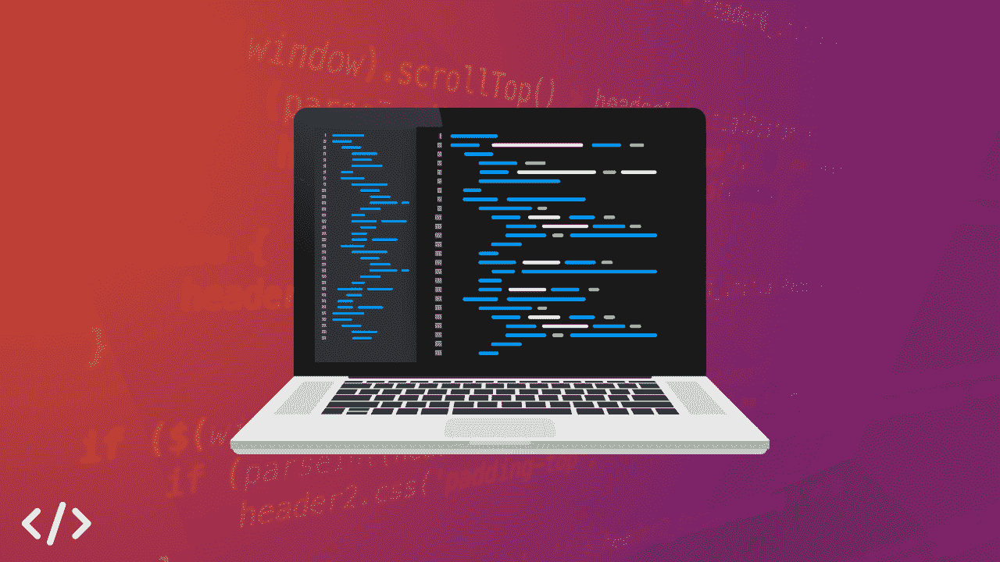

Programming is essential for our everyday lives.

你知道计算机编程已经是你日常生活的一个基本部分吗？我们来看看为什么。我相信你会大吃一惊的。

每当你打开智能手机、笔记本电脑、平板电脑、智能电视或任何其他电子设备时，你都在运行由开发人员规划、开发和编写的代码。这段代码创建了最终的交互式结果，您可以在屏幕上看到。

这正是**编程**的意义所在。它是编写代码来解决特定问题或实现特定任务的过程。

编程就是让你的电脑运行你每天使用的程序，让你的智能手机运行你喜欢的应用程序。正如我们所知，这是我们世界的一个重要组成部分。

每当你查看日历、参加虚拟会议、浏览网页或编辑文档时，你都在使用开发人员编写的**代码**。

"什么是代码？"你可能会问。

代码是程序员编写的一系列指令，用来告诉一个设备(比如电脑)做什么。

该设备不能自己知道如何处理特定情况或如何执行任务。因此，开发人员负责分析情况，并编写明确的指令来实现所需的内容。

为此，他们遵循特定的语法(一组编写代码的规则)。

一个**开发者**(或者程序员)是分析一个问题并且用代码实现一个解决方案的人。

听起来很神奇，对吧？它非常强大，通过学习如何编码，你也可以成为这个美好世界的一部分。让我们看看怎么做。

### 你作为一个开发者。

让我们暂时把你放在一个开发者的位置上。想象一下，你正在开发一个移动应用程序，就像你现在可能已经安装在智能手机上的那些程序一样。

你会做的第一件事是什么？

想一想这个问题。

答案是...

分析问题。你想建造什么？

作为一名开发人员，你首先要设计应用程序的布局、工作方式、不同的屏幕和功能，以及让你的应用程序成为全世界用户的绝佳工具的所有小细节。

只有在你仔细计划好一切之后，你才能开始写你的代码。要做到这一点，你需要选择一种**编程语言**来工作。让我们看看什么是编程语言，为什么它们超级重要。

## 🔸什么是编程语言？

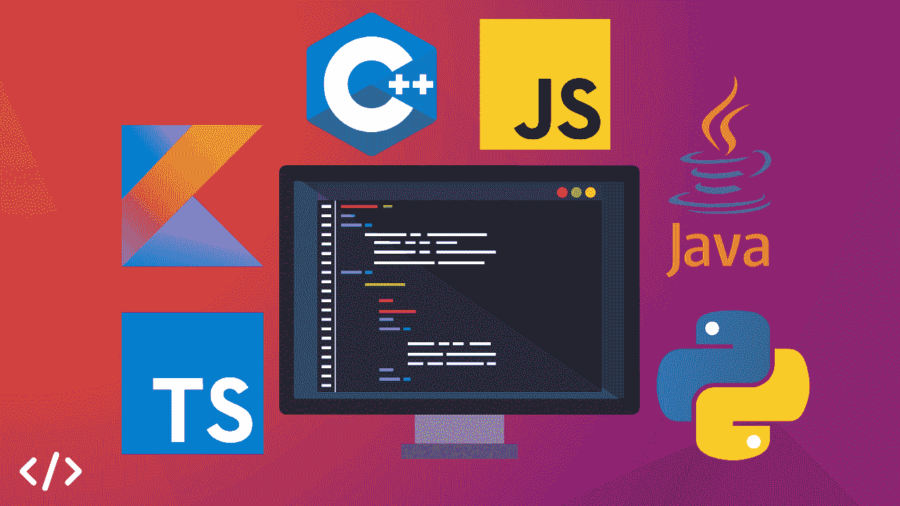

Logos of popular programming languages.

一种**编程语言**是计算机可以理解的语言。

我们不能像这样在程序中只写英语单词:

> “电脑，解决这个任务！”

并希望我们的电脑能理解我们的意思。我们需要遵循一定的规则来编写说明书。

每种编程语言都有自己的一套规则来决定一行代码是否有效。因此，您用一种编程语言编写的代码会与其他语言略有不同。

**💡提示:**有些编程语言比其他语言更复杂，但大多数都有共同的核心概念和功能。如果你学会了如何用一种编程语言编码，你可能会更快地学会另一种语言。

在你开始编写令人惊叹的程序和应用之前，你需要学习你为这项任务选择的编程语言的基本规则。

💡**提示:****程序**是用编程语言编写的一组指令，供计算机执行。我们通常在一个或多个文件中编写程序代码。

例如，这是 Python(一种非常流行的编程语言)中的一行代码，显示了消息`"Hello, World!"`:

```
print("Hello, World!")
```

但是如果我们用 JavaScript(一种主要用于 web 开发的编程语言)写同一行代码，就会得到一个错误，因为它不会有效。

要用 JavaScript 做一些非常类似的事情，我们应该改为编写这行代码:

```
console.log("Hello, World!");
```

视觉上，他们看起来很不一样，对吧？这是因为 Python 和 JavaScript 有不同的语法和一组不同的内置函数。

**💡提示** : **内置函数**基本上都是已经在编程语言中定义好的任务。这让我们可以通过写下它们的名字和指定它们需要的值，直接在代码中使用它们。

在我们的例子中，`**print()**`是 Python 中的一个内置函数，而`**console.log()**`是一个函数，如果我们在浏览器中运行我们的代码，我们可以在 JavaScript 中使用它来查看控制台(一个交互式工具)中的消息。

编程语言的例子包括 Python、JavaScript、TypeScript、Java、C、C#、C++、PHP、Go、Swift、SQL 和 r。有许多编程语言，其中大多数可以用于许多不同的目的。

💡**提示:**这些是 2022 年[堆栈溢出开发者调查中最受欢迎的编程语言](https://survey.stackoverflow.co/2022/#most-popular-technologies-language):

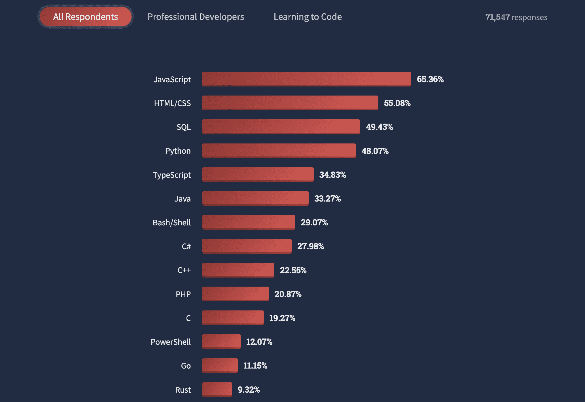

The 14 most popular programming languages among all respondents of the [StackOverflow Developer Survey 2022](https://survey.stackoverflow.co/2022/#most-popular-technologies-language). It's a yearly survey that collects information about popular technologies and trends in the developer community.

还有很多其他的编程语言(几百甚至几千！)但通常情况下，你会和一些最受欢迎的人一起学习和工作。其中一些有更广泛的应用，如 Python 和 JavaScript，而其他的(如 R)有更具体的(甚至是科学的)目的。

这听起来很有意思吧？我们才刚刚开始谈论编程语言。关于它们有很多东西要学，我向你保证，如果你更深入地钻研编程，你的时间和努力是完全值得的。

厉害！现在你已经知道了什么是编程，编程语言是什么，让我们来看看编程和二进制数有什么关系。

## 🔹编程和二进制数

当你想到编程的时候，也许你首先想到的是下图这样的东西，对吗？您计算机上的一系列`0`和`1`。

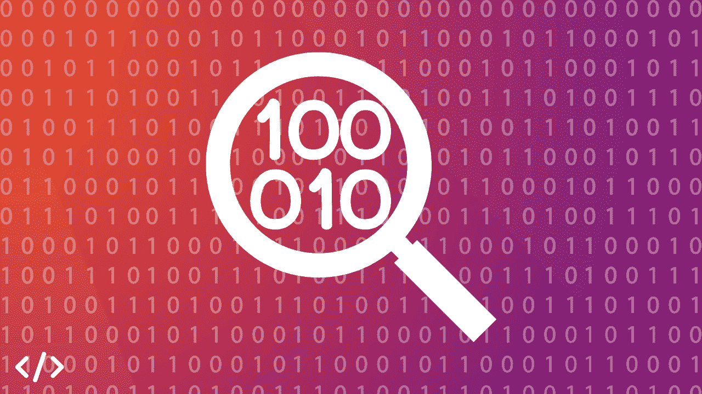

Binary numbers are 0 and 1.

编程确实与二进制数(`0`和`1`)有关，但是是以间接的方式。开发人员实际上并不使用 0 和 1 编写他们的代码。

我们通常用高级编程语言编写程序，这种编程语言的语法可以识别特定的单词(称为关键字)、符号和不同数据类型的值。

基本上，我们以人类可以理解的方式编写代码。

例如，这些是我们可以在 Python 中使用的关键字:

```
False               class               from                or
None                continue            global              pass
True                def                 if                  raise
and                 del                 import              return
as                  elif                in                  try
assert              else                is                  while
async               except              lambda              with
await               finally             nonlocal            yield
break               for                 not 
```

List of Python keywords.

每种编程语言都有自己的一套关键词(用英语写的词)。这些关键字是编程语言的语法和核心功能的一部分。

但是关键词只是英语中的常用词，就像我们在书里找到的一样。

这就引出了两个非常重要的问题:

*   计算机如何理解和解释我们想要说的话？
*   二进制数字系统在这里起什么作用？

计算机不能直接理解这些单词、符号或数值。

当程序运行时，我们用人类可以理解的高级编程语言编写的代码会自动转换为计算机可以理解的二进制代码。

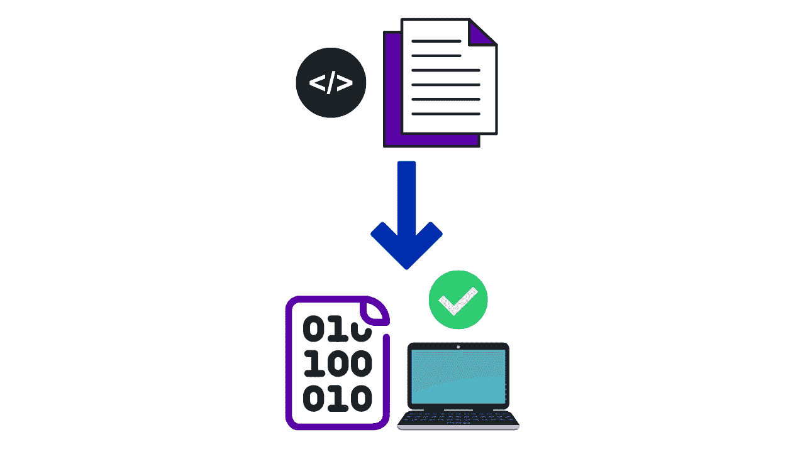

Process of transforming a program into binary code.

这种把人类能理解的源代码转换成计算机能理解的二进制代码的过程叫做**编译**。

根据[大英百科全书](https://www.britannica.com/technology/compiler)，一个**编译器**被定义为:

> 将高级语言(如 C++)编写的源代码翻译(编译)成数字计算机 CPU 可以理解的一组机器语言指令的计算机软件。

《大英百科全书》还提到:

> 术语*编译器*是由美国计算机科学家[格蕾丝·赫柏](https://www.britannica.com/biography/Grace-Hopper)创造的，他在 20 世纪 50 年代早期设计了第一批编译器。

一些编程语言可以被分类为**编译的**编程语言，而另一些可以根据它们如何被转换成机器语言指令被分类为**解释的**编程语言。

然而，它们都必须经过一个过程，将它们转换成计算机可以理解的指令。

太棒了。现在你知道为什么二进制代码对计算机科学如此重要了。没有它，基本上编程就不会存在，因为计算机不能理解我们的指令。

现在，让我们深入了解编程的应用以及您可以探索的不同领域。

## 🔸编程的实际应用

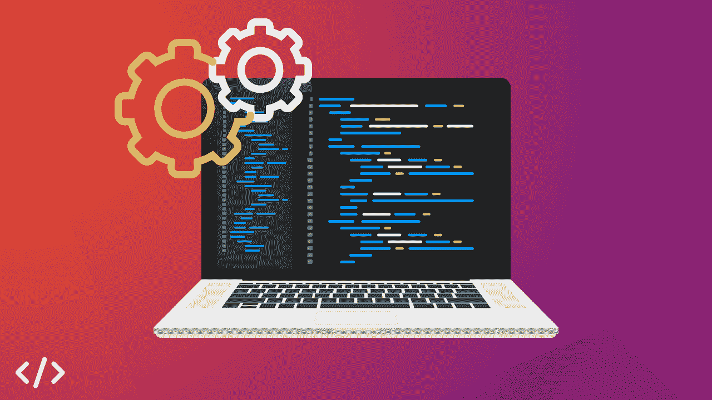

Programming has many real-world applications in basically every industry that you can imagine. 

编程在许多不同的行业中有许多不同的应用。这真的很神奇，因为你可以在任何你感兴趣的行业中应用你的知识。

从工程到农业，从游戏开发到物理，如果你学会如何编码，可能性是无穷无尽的。

让我们看看其中的一些。(我答应你。他们太棒了！⭐) .

### 前端 Web 开发

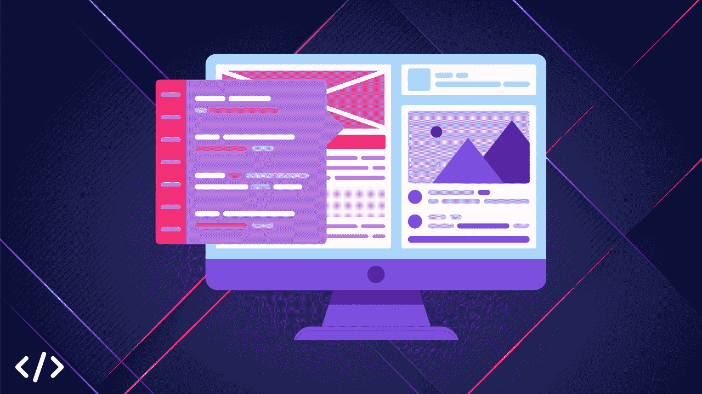

Front-End Web Developers develop the parts of websites and web applications that users can see and interact with.

如果你学会了如何编码，你可以用你的编程技能来设计和开发网站和在线平台。前端 Web 开发人员创建用户可以直接看到并与之交互的网站部分。

例如，现在你正在阅读一篇关于 [freeCodeCamp](https://www.freecodecamp.org/) 出版的文章。该出版物看起来是这样的，它的工作原理是这样的，这要归功于前端 web 开发人员逐行编写的代码。

**💡提示:**如果你是学前端 web 开发的，这个也可以。

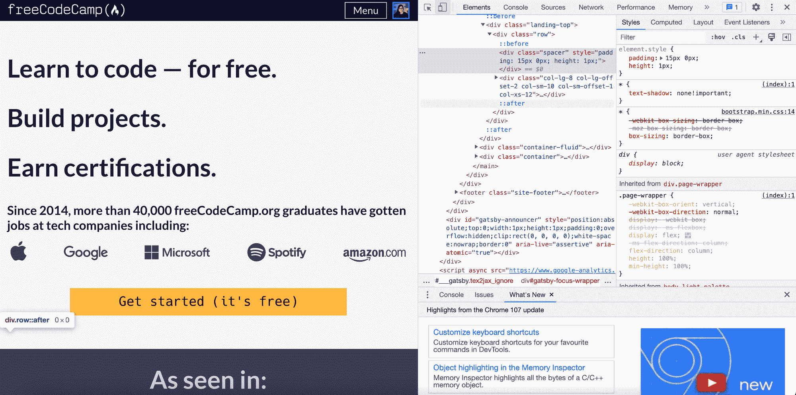

The HTML and CSS code for freeCodeCamp's Home Page (This is a preview of the code in Chrome Developer Tools).

前端 Web 开发人员使用 HTML 和 CSS 来创建网站的结构(这些是标记语言，用于呈现信息)，他们编写 JavaScript 代码来添加功能和交互性。

如果你对学习前端 web 开发感兴趣，可以通过 freeCodeCamp 的 YouTube 频道上的这些免费课程学习 HTML 和 CSS:

*   [从头开始学习 HTML5 和 CSS3 完整课程](https://www.youtube.com/watch?v=mU6anWqZJcc)
*   [学习 HTML&CSS——初学者完全教程](https://www.youtube.com/watch?v=a_iQb1lnAEQ)
*   [前端 Web 开发训练营课程(JavaScript、HTML、CSS)](https://www.youtube.com/watch?v=zJSY8tbf_ys)
*   [响应式网页设计入门- HTML & CSS 教程](https://www.youtube.com/watch?v=srvUrASNj0s)

您还可以通过这些免费的在线课程免费学习 JavaScript:

*   [学习 JavaScript -初学者全教程](https://www.youtube.com/watch?v=PkZNo7MFNFg)
*   [JavaScript 编程-全教程](https://www.youtube.com/watch?v=jS4aFq5-91M)
*   [JavaScript DOM 操作——面向初学者的完整课程](https://www.youtube.com/watch?v=5fb2aPlgoys)
*   [通过构建 7 个游戏学习 JavaScript 完整课程](https://www.youtube.com/watch?v=ec8vSKJuZTk)

**💡提示:**当你在 freeCodeCamp 上通过互动练习学习时，你还可以获得一个[响应式网页设计认证](https://www.freecodecamp.org/learn/2022/responsive-web-design/)。

### 后端 Web 开发

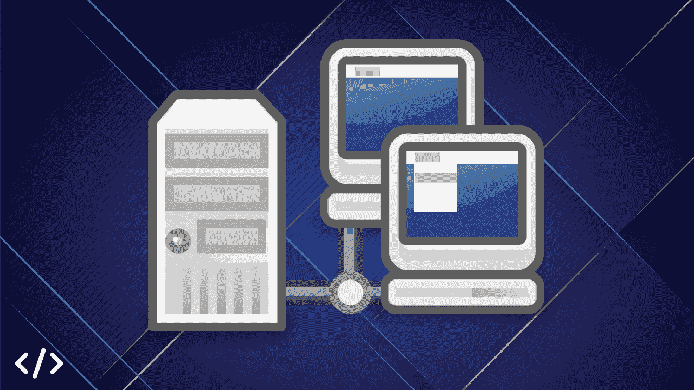

Back-End Web Developers develop servers and databases to handle everything that runs behind the scenes to make more complex web applications work correctly.

处理用户数据的更加复杂和动态的 web 应用程序也需要一个**服务器**。这是一个接收请求并发送适当响应的计算机程序。他们还需要一个**数据库**，一个以结构化方式存储的数值集合。

后端 Web 开发人员负责为这些服务器开发代码。他们决定如何处理不同的请求，如何发送适当的资源，如何存储信息，以及基本上如何使在幕后运行的一切顺利而有效地工作。

后端 web 开发的一个真实例子是当你在 freeCodeCamp 上创建一个帐户并完成一个挑战时会发生什么。您的信息存储在数据库中，您可以在以后使用您的电子邮件和密码登录时访问这些信息。

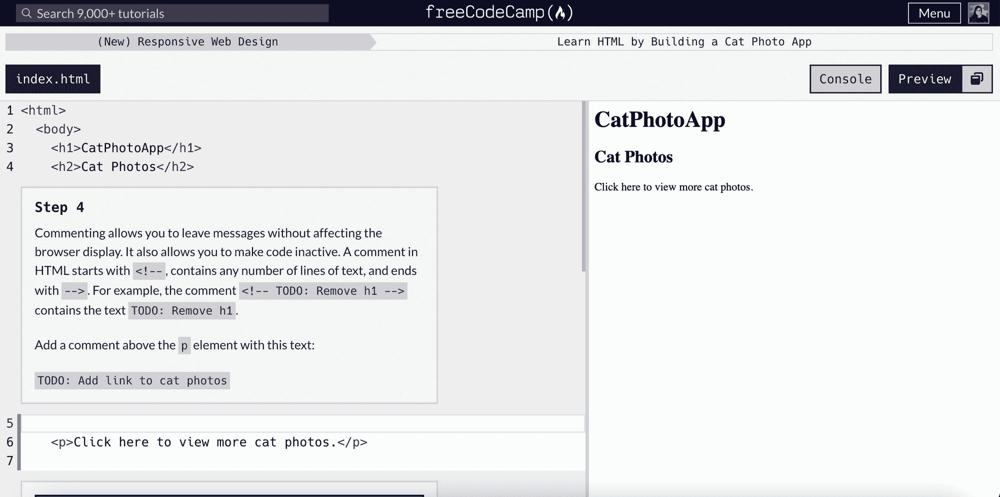

A freeCodeCamp interactive challenge.

这个惊人的交互功能是由后端 web 开发人员实现的。

**💡提示:**全栈 Web 开发人员负责前端和后端 Web 开发。他们在这两个领域都有专业知识。

您每天使用的所有复杂平台，如社交媒体平台、在线购物平台和教育平台，都使用服务器和后端 web 开发来增强其惊人的功能。

Python 是用于此目的的强大编程语言的一个例子。这是最受欢迎的编程语言之一，并且它的受欢迎程度每年都在上升。这部分是因为它简单易学，而且功能强大，用途广泛，足以用于现实世界的应用程序。

**💡提示:**如果你对 Python 的具体应用很好奇，这是[我写的一篇关于这个话题的文章](https://www.freecodecamp.org/news/what-is-python-used-for-10-coding-uses-for-the-python-programming-language/)。

得益于 Node.js，JavaScript 还可以用于后端 web 开发。

用于开发 web 服务器的其他编程语言有 PHP、Ruby、C#和 Java。

如果你想学习后端 Web 开发，freeCodeCamp 的 YouTube 频道上有这些免费课程:

*   [Python 后端 Web 开发课程(与 Django 一起)](https://www.youtube.com/watch?v=jBzwzrDvZ18)
*   [Node.js 和 Express.js -全程](https://www.youtube.com/watch?v=Oe421EPjeBE)
*   [面向初学者的全栈 Web 开发(关于 HTML、CSS、JavaScript、Node.js、MongoDB 的完整课程)](https://www.youtube.com/watch?v=nu_pCVPKzTk)
*   [node . js/Express Course-Build 4 项目](https://www.youtube.com/watch?v=qwfE7fSVaZM)

💡**提示:** freeCodeCamp 还有免费的[后端开发和 API](https://www.freecodecamp.org/learn/back-end-development-and-apis/)认证。

### 移动应用程序开发

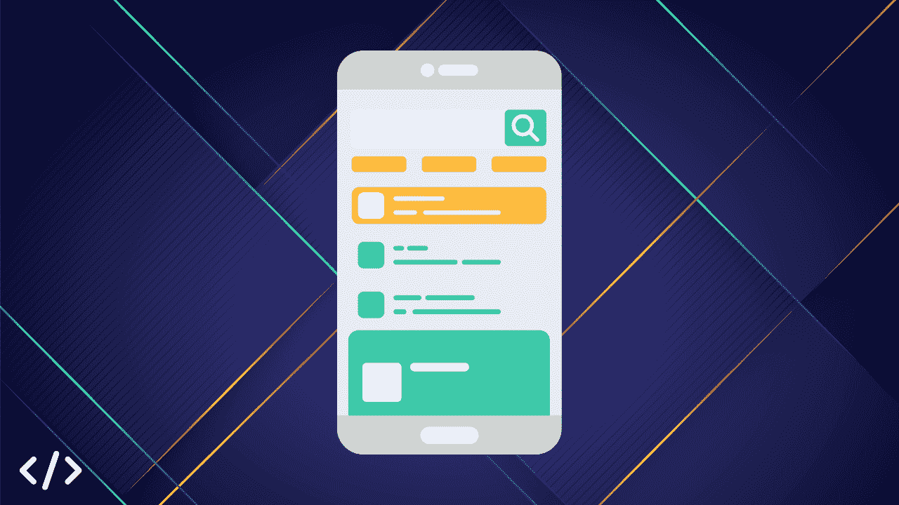

Mobile app developers design and develop the mobile apps we use every day.

移动应用已经成为我们日常生活的一部分。我相信你无法想象没有它们的生活。

想想你最喜欢的手机应用。你喜欢它的什么？

我们最喜欢的应用程序帮助我们完成日常任务，娱乐我们，解决问题，帮助我们实现目标。他们总是在我们身边。

这就是移动应用的力量，如果你学习移动应用开发，你也可以成为这个神奇世界的一部分。

专注于移动应用开发的开发人员负责规划、设计和开发这些应用的用户界面和功能。他们发现了现有应用程序中的差距，并试图创建一个工作产品来改善人们的生活。

**💡提示:**无论你选择哪个领域，作为开发者，你的目标应该永远是让人们的生活变得更好。应用不仅仅是应用，它们有可能改变我们的生活。当你计划你的项目时，你应该永远记住这一点。你的代码可以让别人的生活变得更好，这是一个非常重要的责任。

移动应用程序开发人员使用 JavaScript、Java、Swift、Kotlin 和 Dart 等编程语言。像 [Flutter](https://flutter.dev/) 和 [React Native](https://reactnative.dev/) 这样的框架对于构建跨平台的移动应用程序(即在 Android 和 iOS 等多个不同操作系统上流畅运行的应用程序)有着超级大的帮助。

根据 [Flutter](https://flutter.dev/) 的官方文档:

> Flutter 是 Google 的一个开源框架，用于从单个代码库构建漂亮的本地编译的多平台应用程序。

如果你想学习移动应用程序开发，你可以在 freeCodeCamp 的 YouTube 频道上学习这些免费课程:

*   [初学颤振课程——37 小时跨平台 App 开发教程](https://www.freecodecamp.org/news/p/98a1b5a8-101b-4993-8a76-e70d833bd91e/Flutter%20Course%20for%20Beginners%20%E2%80%93%2037-hour%20Cross%20Platform%20App%20Development%20Tutorial)
*   [Flutter 课程——初学者全教程(构建 iOS 和 Android 应用)](https://www.youtube.com/watch?v=pTJJsmejUOQ)
*   [React Native -初学者入门课程](https://www.youtube.com/watch?v=frvXANSaSec)
*   [学习 React 原生手势和动画-教程](https://www.youtube.com/watch?v=wEVjaXK4sYQ)

### 游戏开发

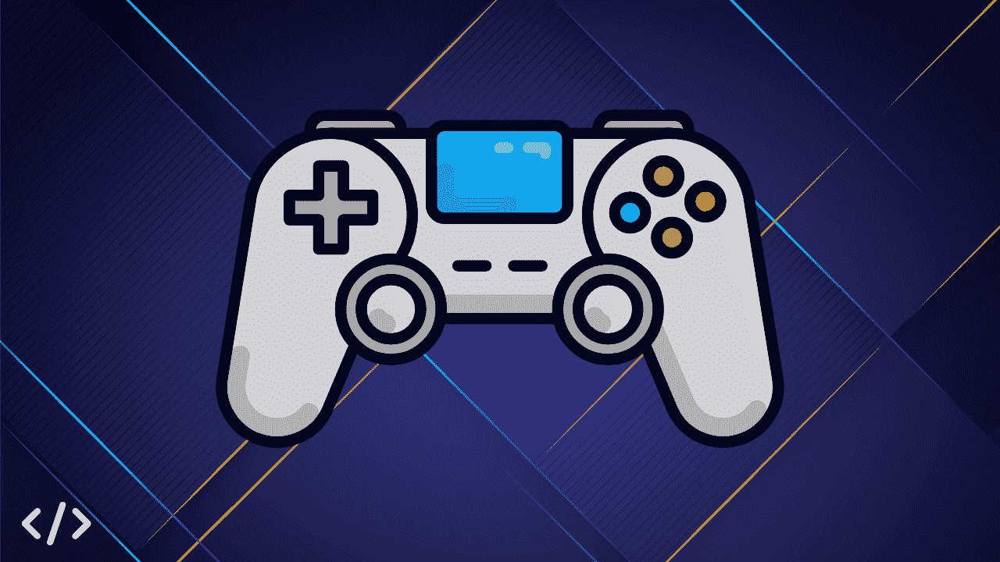

游戏创造持久的记忆。我相信你仍然记得你最喜欢的游戏，以及你为什么如此喜欢(或喜爱)它们。成为一名游戏开发者意味着有机会为全世界的玩家带来欢乐和娱乐。

游戏开发者设想、设计、计划和实现游戏的功能。他们还需要找到或创建诸如角色、障碍物、背景、音乐、音效等资产。

**💡提示:**如果你学会了如何编码，你就可以创建自己的游戏。想象一下，创建一个世界各地的用户都会喜欢的令人敬畏和引人入胜的游戏。这就是我个人喜欢编程的原因。你只需要你的电脑，你的知识，和一些基本的工具，就能创造出令人惊叹的东西。

用于游戏开发的流行编程语言包括 JavaScript、C++、Python 和 C#。

如果你对学习游戏开发感兴趣，你可以在 freeCodeCamp 的 YouTube 频道上学习这些免费课程:

*   [面向初学者的 JavaScript 游戏开发课程](https://www.youtube.com/watch?v=GFO_txvwK_c)
*   [通过构建 7 个游戏学习 JavaScript 完整课程](https://www.youtube.com/watch?v=ec8vSKJuZTk)
*   [学习 Unity -初学游戏开发教程](https://www.youtube.com/watch?v=gB1F9G0JXOo)
*   [通过构建五个游戏学习 Python 全程](https://www.youtube.com/watch?v=XGf2GcyHPhc)
*   [使用 JavaScript、HTML 和 CSS(免费游戏资源)编写一个 2D 游戏——教程](https://www.youtube.com/watch?v=7BHs1BzA4fs)
*   [用 GDevelop 开发 2D 游戏-速成班](https://www.youtube.com/watch?v=iHF5fwsqu4I)
*   [神奇宝贝编码教程- CS50 游戏开发入门](https://www.youtube.com/watch?v=gx_qorHxBpI)

### 生物、物理和化学

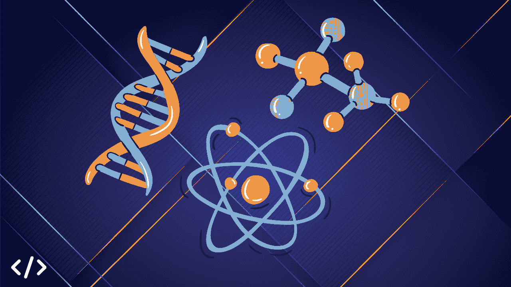

编程可以应用于你能想象到的每一个科学领域，包括生物学、物理学、化学，甚至天文学。是啊！科学家一直使用编程来收集和分析数据。他们甚至可以运行模拟来测试假设。

#### 生物

在生物学中，计算机程序可以模拟群体遗传学和群体动力学。甚至有一整个领域叫做**生物信息学**。

根据曼彻斯特大学综合基因组医学研究中心成员 Ardeshir Bayat 的这篇文章“生物信息学”:

> 生物信息学被定义为计算和分析工具在获取和解释生物数据方面的应用。

Bayat 博士提到生物信息学可以用于基因组测序。他还提到，它的发现可能会导致药物发现和个性化治疗。

生物信息学常用的编程语言包括 Python、R、PHP、PERL 和 Java。

💡**提示:** R 是一个编程“统计计算和图形的语言和环境”([来源](https://www.r-project.org/about.html))。

科学家可以用于生物学的伟大工具的一个例子是 [Biopython](https://biopython.org/wiki/Documentation) 。这是一个 Python 框架，带有“生物计算的免费工具”

如果你想了解更多关于如何在科学中应用编程技能的知识，你可以在 freeCodeCamp 的 YouTube 频道上学习这些免费课程:

*   [用于生物信息学的 Python 使用机器学习和数据分析的药物发现](https://www.youtube.com/watch?v=jBlTQjcKuaY)
*   [R 编程教程-学习统计计算的基础知识](https://www.youtube.com/watch?v=_V8eKsto3Ug)
*   [学习 Python -初学者全教程【教程】](https://www.youtube.com/watch?v=rfscVS0vtbw)

#### 物理学

物理学需要运行许多模拟，而编程非常适合这样做。通过编程，科学家可以根据现实生活中难以复制的特定场景编写和运行模拟程序。这样效率高多了。

通常用于物理模拟的编程语言包括 C、Java、Python、MATLAB 和 JavaScript。

#### 化学

化学也依赖于模拟和数据分析，所以编程在这个领域是非常有用的工具。

在慕尼黑工业大学有机化学研究所的 Ivar Ugi 博士及其同事的这篇科学文章中，他们提到:

> 全新合成的设计，结构、子结构和反应的分类和记录都是计算机在化学中新应用的例子。

科学实验也产生详细的数据和结果，可以用科学家开发的计算机程序进行分析。

想想看:编写一个程序来生成箱线图或散点图或任何其他类型的图，以可视化成千上万次测量的趋势，可以节省研究人员大量的时间和精力。这让他们专注于工作中最重要的部分:分析结果。


Example of data visualizations that you can create with [Seaborn](https://seaborn.pydata.org/#), a Python data visualization library. This is be very helpful to analyze data, right?

**💡小贴士:**如果你有兴趣深入研究，这是美国化学学会的[化学模拟列表](https://www.acs.org/content/acs/en/education/students/highschool/chemistryclubs/activities/simulations.html)。这些模拟是由开发人员编程的，他们正在帮助世界各地成千上万的学生和教师。

想想看...你可以构建下一个伟大的模拟。如果你对某个科学领域感兴趣，我完全推荐学习如何编码。你的工作会更有成效，你的结果也更容易分析。

如果你对学习科学应用编程感兴趣，freeCodeCamp 的 YouTube 频道上有这些免费课程:

*   [用于生物信息学的 Python 使用机器学习和数据分析的药物发现](https://www.youtube.com/watch?v=jBlTQjcKuaY)
*   [面向数据科学的 Python-初学者课程(学习 Python、Pandas、NumPy、Matplotlib)](https://www.youtube.com/watch?v=LHBE6Q9XlzI)

### 数据科学与工程

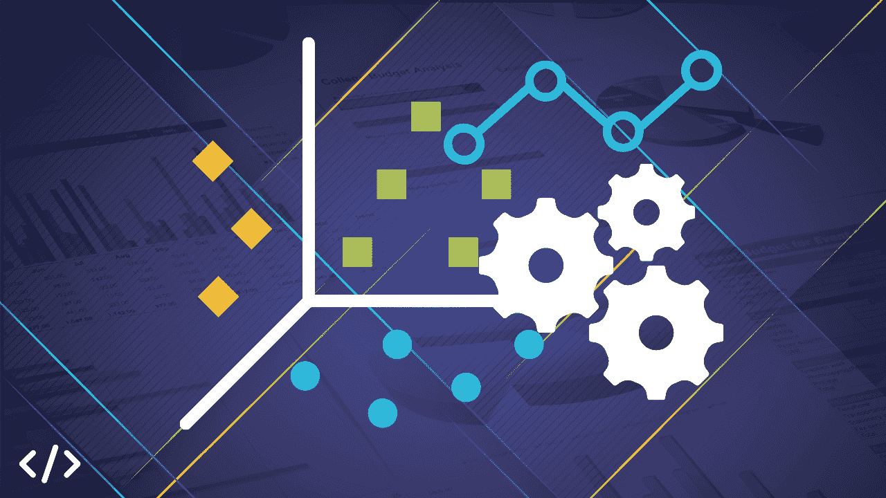

谈论数据...编程对于一个叫做**数据科学**的领域也是必不可少的。如果你对通过数据和统计回答问题感兴趣，这个领域可能正是你正在寻找的，拥有编程技能将帮助你实现你的目标。

数据科学家收集和分析数据，以回答许多不同领域的问题。根据加州大学伯克利分校在文章“[什么是数据科学？](https://ischoolonline.berkeley.edu/data-science/what-is-data-science/)":

> 高效的数据科学家能够识别相关问题，从大量不同的数据源收集数据，组织信息，将结果转化为解决方案，并以积极影响业务决策的方式交流他们的发现。

有许多功能强大的编程语言可以用来分析和可视化数据，但最常用的一种可能是 Python。

这是一个可以用 Python 创建的数据可视化类型的例子。它们非常有助于直观地分析数据，您可以根据自己的需要定制它们。

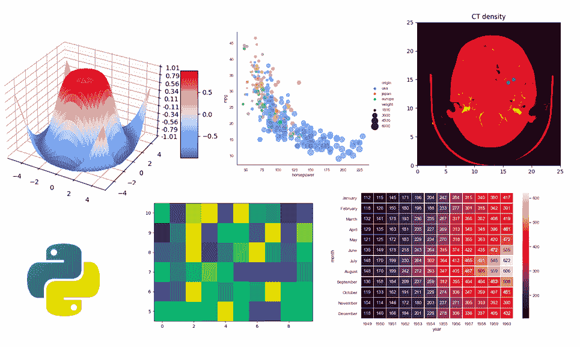

Sample data visualizations from the [Matplotlib](https://matplotlib.org/) and [Seaborn](https://seaborn.pydata.org/examples/index.html) galleries

如果你对学习数据科学编程感兴趣，freeCodeCamp 的 YouTube 频道上有这些免费课程:

*   [学习数据科学教程-初学者的完整课程](https://www.youtube.com/watch?v=ua-CiDNNj30)
*   [数据科学入门-初学者速成班](https://www.youtube.com/watch?v=N6BghzuFLIg)
*   [面向数据科学的 Python-初学者课程(学习 Python、Pandas、NumPy、Matplotlib)](https://www.youtube.com/watch?v=LHBE6Q9XlzI)
*   [用 Python 构建 12 个数据科学应用并简化整个课程](https://www.youtube.com/watch?v=JwSS70SZdyM)
*   [使用 Python 进行数据分析-初学者的完整课程(Numpy、Pandas、Matplotlib、Seaborn)](https://www.youtube.com/watch?v=r-uOLxNrNk8)

💡**提示:**您也可以在 freeCodeCamp 上获得这些免费认证:

*   [数据可视化](https://www.freecodecamp.org/learn/data-visualization/)
*   [用 Python 进行数据分析](https://www.freecodecamp.org/learn/data-analysis-with-python/)

### 工程

工程是编程可以帮助你成功的另一个领域。能够编写自己的计算机程序可以使你的工作更有效率。

有许多工具是专门为工程师设计的。例如，R 编程语言专门用于统计应用，Python 在这一领域也非常流行。

另一个伟大的工程编程工具是 [MATLAB](https://www.mathworks.com/products/matlab.html) 。根据其官方网站:

> MATLAB 是一个编程和数值计算平台，被数百万工程师和科学家用来分析数据、开发算法和创建模型。

真的，可能性是无穷的。

你可以在 freeCodeCamp YouTube 频道上用[这个速成班学习 MATLAB。](https://www.freecodecamp.org/news/learn-matlab-with-this-crash-course/)

如果你有兴趣学习与编程相关的工程工具，这是 freeCodeCamp 的 YouTube 频道上的一门免费课程，涵盖了工程师使用的 2D 和 3D 计算机辅助设计软件 AutoCAD:

*   [面向初学者的 AutoCAD 大学全教程](https://www.youtube.com/watch?v=VtLXKU1PpRU)

### 医学和药理学


Programming has helped scientists to develop new medical techniques and devices.

医学和药理学通过发现新的治疗方法和程序而不断发展。让我们看看你如何在这些领域应用你的编程技能。

#### 医学

编程真的无处不在。如果你对医学领域感兴趣，学习如何编码对你也很有帮助。即使你想专注于计算机科学和软件开发，你也可以在这两个领域应用你的知识。

专业开发人员负责开发和编写为现代医学使用的设备和机器提供动力和控制的代码。

想想看...所有这些机器和设备都是由软件控制的，必须有人来编写软件。医疗记录也由开发人员创建的专门系统存储和跟踪。如果你决定走这条路，那可能就是你。听起来很刺激，对吧？

根据科技文章[计算机技术在医学中的应用](https://www.sciencedirect.com/science/article/abs/pii/S0377123717310651):

> 计算机在医学中的主要用途包括医院信息系统、医学数据分析、医学成像实验室计算、计算机辅助医疗决策、危重病人护理、计算机辅助治疗等。

#### 药理学

编程和计算机科学也可以应用于开发药理学领域的新药。

麻省理工学院新闻的这篇文章展示了一个通过学习如何编码可以在这个领域取得成就的显著例子。它描述了麻省理工学院的一名大四学生克里斯蒂·卡彭特(Kristy Carpenter)如何在 2019 年利用计算机科学开发“新的、更实惠的药物”。克里斯蒂提到:

> 人工智能可以帮助计算对特定药物更好的化合物组合，可以减少试错时间，并在理想情况下加快新药设计过程。

编程在药理学中的另一个实际应用的例子与 Python 有关(是的，Python 有很多应用！).在它的[成功故事](https://www.python.org/success-stories/)中，我们发现阿斯利康选择 Python 来开发可以帮助科学家更快更有效地发现新药的技术和程序。

[文档](https://www.python.org/success-stories/python-for-collaborative-drug-discovery/)解释道:

> 为了节省实验室工作的时间和金钱，实验化学家使用计算模型来缩小良好候选药物的范围，同时还验证要测试的候选药物不是彼此基本化学结构的简单变体。

如果您对学习医学或健康相关领域的编程感兴趣，这是 freeCodeCamp 的 YouTube 频道上关于医疗成像编程的免费课程:

*   [PyTorch 和 Monai 的人工智能医疗成像- Python 机器学习课程](https://www.youtube.com/watch?v=M3ZWfamWrBM)

### 教育

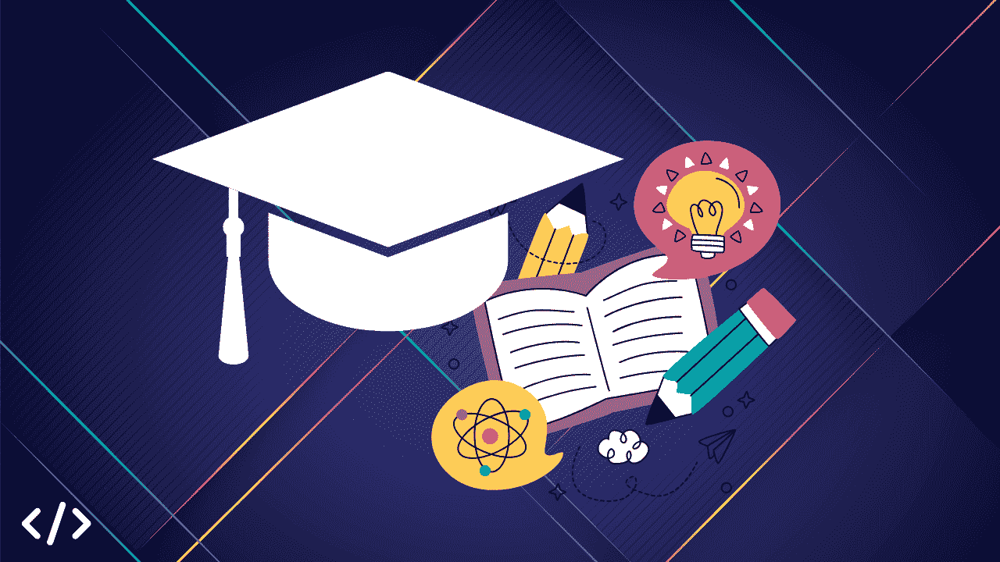

Programming can be used to create tools that help teachers and students to have a more productive and engaging learning experience. Teaching students to code also develops their problem-solving skills.

你有没有想过编程对教育有帮助？好吧，让我告诉你，这是非常重要的。为什么？因为现在学生和老师使用的数字化学习工具都是开发者编程的。

每当学生打开一个教育应用程序，浏览 freeCodeCamp 这样的教育平台，在数字白板上写字，或者通过在线会议平台上课，编程都在使这些成为可能。

作为一名程序员或知道如何编码的教师，您可以创建下一个伟大的应用程序，它将增强世界各地学生的学习体验。

也许它会是一个笔记应用程序，一个在线学习平台，一个演示应用程序，一个教育游戏，或者任何其他对学生有帮助的应用程序。

重要的是，如果你的目标是做出令人惊叹的东西，创造出持久的记忆，那么在创造它的时候要考虑到学生。

如果你想象它，那么你可以用代码来创造它。

教师也可以教他们的学生如何编码，以发展他们解决问题的技能，并教他们未来的重要技能。

💡**提示:**如果你正在教学生如何编码， **Scratch** 是一种教授编程基础的非常棒的编程语言。它特别专注于教孩子们如何以互动的方式编码。

根据官方 [Scratch](https://scratch.mit.edu/about) 网站:

> Scratch 是世界上最大的儿童编码社区，是一种具有简单视觉界面的编码语言，允许年轻人创建数字故事、游戏和动画。

如果你对学习如何为教育目的编码感兴趣，你可能会在 freeCodeCamp 的 YouTube 频道上找到一些有用的课程:

*   [给初学者的 Scratch 教程——做一个 Flappy Bird 游戏](https://www.youtube.com/watch?v=x14G4DCk4nY)
*   [计算思维& Scratch -计算机科学导论-哈佛 CS50 (2018)](https://www.youtube.com/watch?v=F0WoVEr0-44)
*   [面向初学者的 Android 开发-完整课程](https://www.youtube.com/watch?v=fis26HvvDII)
*   [初学颤振课程——37 小时跨平台 App 开发教程](https://www.youtube.com/watch?v=VPvVD8t02U8)
*   [学习 Unity -初学游戏开发教程](https://www.youtube.com/watch?v=gB1F9G0JXOo)

### 机器学习、人工智能和机器人技术

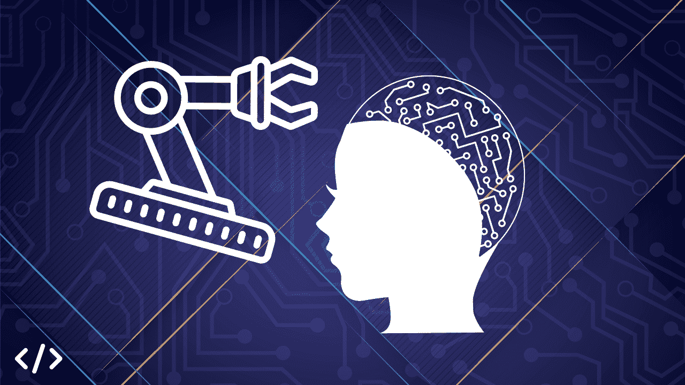

Machine Learning and Artificial Intelligence are very popular nowadays because platforms can learn how users engage with their content in order to suggest them relevant information and products.

与编程直接相关的一些最令人惊叹的领域是机器学习、人工智能和机器人技术。我们来看看为什么。

**人工智能**被[大英百科全书](https://www.britannica.com/technology/artificial-intelligence)定义为:

> 开发具有人类特有的智力过程的系统的项目，如推理、发现意义、归纳或从过去的经验中学习的能力。

**机器学习**是人工智能领域的一个分支或子集，其中系统可以基于数据进行自主学习。这个学习过程的目标是预测预期的输出。这些模型不断地学习如何“思考”以及如何基于他们之前的训练来分析情况。

这些领域最常用的编程语言是 Python、C、C#、C++和 MATLAB。

人工智能和机器学习在各个行业都有惊人的应用，比如:

*   图像和对象检测。
*   根据模式做出预测。
*   文本识别。
*   推荐引擎(比如当一个在线购物平台向你展示你可能喜欢的产品，或者当 YouTube 向你展示你可能喜欢的视频时)。
*   电子邮件的垃圾邮件检测。
*   欺诈检测。
*   个性化订阅等社交媒体功能。
*   更多的...几乎每个行业都有数以百万计的应用。

如果你有兴趣学习如何为人工智能和机器学习编码，freeCodeCamp 的 YouTube 频道上有这些免费课程:

*   [面向所有人的机器学习——完整课程](https://www.youtube.com/watch?v=i_LwzRVP7bg)
*   [面向初学者的机器学习课程](https://www.youtube.com/watch?v=NWONeJKn6kc)
*   [深度学习 py torch&机器学习——全程](https://www.youtube.com/watch?v=V_xro1bcAuA)
*   [TensorFlow 2.0 完整教程- Python 神经网络初学者教程](https://www.youtube.com/watch?v=tPYj3fFJGjk)
*   [带有 JavaScript 课程的自动驾驶汽车——神经网络和机器学习](https://www.youtube.com/watch?v=Rs_rAxEsAvI)
*   [用于机器学习的 Python TensorFlow 神经网络文本分类教程](https://www.youtube.com/watch?v=VtRLrQ3Ev-U)
*   [程序员实用深度学习——来自 fast.ai 和杰瑞米·霍华德的完整课程](https://www.youtube.com/watch?v=0oyCUWLL_fU)
*   [初学者深度学习速成班](https://www.youtube.com/watch?v=VyWAvY2CF9c)
*   [Python 高级计算机视觉-完整课程](https://www.youtube.com/watch?v=01sAkU_NvOY)

**💡提示:**你还可以在 freeCodeCamp 上用 Python 获得一个[机器学习认证。](https://www.freecodecamp.org/learn/machine-learning-with-python/)

### 机器人学

编程对机器人来说也很重要。是的，机器人也是被编程的！

[大英百科全书](https://www.britannica.com/technology/robotics)将机器人定义为:

> 设计、建造和使用机器(机器人)来完成传统上由人类完成的任务。

机器人就像电脑一样。他们不知道该做什么，直到你通过在你的程序中写指令来告诉他们该做什么。如果你学会了如何编码，你就可以给制造工厂里的机器人和工业机械编程。

如果你有兴趣学习如何为机器人、电子和相关领域编码，这是 freeCodeCamp 的 YouTube 频道上关于 Arduino 的免费课程:

*   [Arduino 初学者课程——开源电子平台](https://www.youtube.com/watch?v=zJ-LqeX_fLU)

### 其他应用

几乎在每个领域都有许多其他令人着迷的编程应用。以下是一些亮点:

*   **农业:**在[麻省理工学院新闻的这篇文章](https://news.mit.edu/2015/mitx-mooc-helps-farmer-develop-autonomous-tractor-app-1201)中，一个农民在学会如何编码后开发了一个自动拖拉机应用程序。
*   **自动驾驶汽车:**自动驾驶汽车依靠软件来分析周围环境，并在路上做出快速准确的决策。如果你对这个领域感兴趣，[这是 freeCodeCamp 的 YouTube 频道上关于这个主题的课程](https://www.youtube.com/watch?v=Rs_rAxEsAvI)。
*   **金融:**编程也可以帮助开发预测金融指标和趋势的程序和模型。例如，这是 freeCodeCamp 的 YouTube 频道上的一个关于算法交易的[课程](https://www.youtube.com/watch?v=xfzGZB4HhEE)。

可能性是无限的。我希望这一节能让你明白为什么学习如何编码对你的现在和未来如此重要。在你选择的任何领域，这都是一项有价值的技能。

太棒了。现在让我们深入了解成为一名成功的程序员所需要的软技能。

## 🔹成功程序员的技能

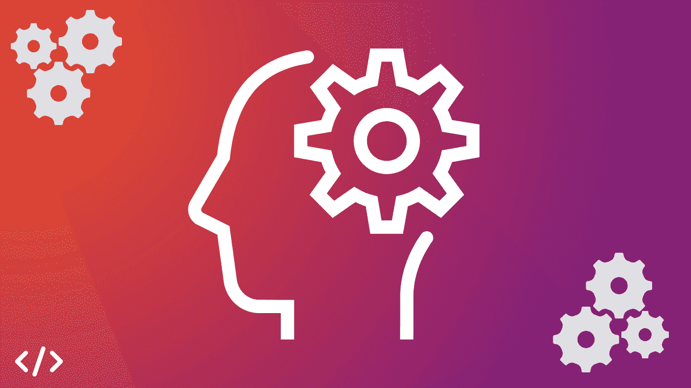

在经历了编程的各种应用之后，你一定很想知道在这个领域取得成功需要哪些技能。

### 好奇心

一个程序员应该好奇。无论你是刚刚开始学习如何编码，还是已经有 20 年的经验，编码项目总是会给你带来新的挑战和学习机会。如果你抓住这些机会，你会不断提高你的技能并取得成功。

### 热情

热情是成功程序员的一个关键特征，但如果你想成功，这通常适用于任何领域。热情会让你保持快乐，对你正在创造和学习的东西充满好奇。

**💡小贴士:**如果你曾经觉得自己没有以前那么热情，是时候去寻找或学习一些新的东西，重新点燃你内心的火花，让你充满希望和梦想。

### 耐心

程序员必须有耐心，因为将最初的想法转化为工作产品需要时间、精力和许多不同的步骤。耐心会让你专注于你的最终目标。

### 弹性

编程可能具有挑战性。这是真的。但定义你的不是你面临多少挑战，而是你如何面对挑战。如果你克服了这些挑战而茁壮成长，你将成为一名更好的程序员，你可以创造出改变世界的东西。

### 创造力

程序员必须有创造力，因为尽管每种编程语言都有一套特定的编写代码的规则，但编码就像用乐高积木一样。您已经有了构建模块，但是您需要决定创建什么以及如何创建它。编写代码的过程需要创造性，同时遵循既定的最佳实践。

### 问题解决和分析

编程基本上就是用代码分析和解决问题。根据你选择的领域，这些问题可能会更简单或更复杂，但它们都需要一定程度的解决问题的技巧和对形势的透彻分析。

像这样的问题:

*   我应该建立什么？
*   我如何能建立它？
*   构建这个的最佳方式是什么？

是程序员日常工作的一部分。

### 能够长时间集中注意力

当你从事一个编码项目时，你需要长时间专注于一项任务。从创建设计，到计划和编写代码，到测试结果，再到修复 bug(代码问题)，你会为一个特定的任务投入很多时间。这就是为什么能够集中注意力并牢记你的最终目标是至关重要的。

### 做详细的笔记

这项技能对程序员来说非常重要，尤其是当你正在学习如何编码的时候。做详细的笔记可以帮助你理解和记住你所学的概念和工具。这也适用于有经验的程序员，因为成为一名程序员需要终生学习。

### 沟通

最初，你可能会认为编程是一项孤独的活动，并想象一名程序员独自坐在桌子上花费数百个小时。

但现实是，当你找到第一份工作时，你会发现沟通对于与其他团队成员协调任务以及交流想法和反馈是超级重要的。

### 欢迎反馈

在编程中，通常有多种方法来实现相同的功能。不同的备选方案可能工作方式相似，但有些可能更容易阅读，或者在时间或资源消耗方面更有效。

当你学习如何编码时，你应该总是把建设性的反馈作为学习的工具。同样，当你在一个团队中工作时，积极接受同事的反馈，并不断努力改进。

### 终身学习

编程等于终身学习。如果您对学习如何编码感兴趣，您必须知道，随着新技术的出现和现有技术的更新，您将始终需要学习新的东西。想想看...这很好，因为总有一些有趣的新东西要学！

### 乐于尝试新事物

最后，成为一名成功程序员的基本技能是乐于尝试新事物。走出你的舒适区，接受新技术和新产品。在科技行业，事物发展非常迅速，适应变化至关重要。

## 🔸学习如何编码的技巧

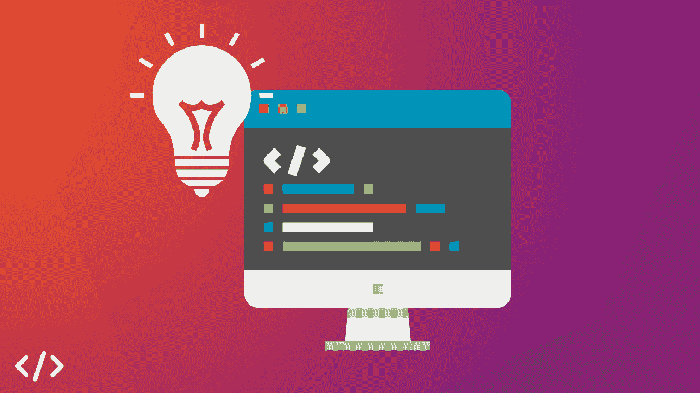

现在，您已经了解了更多关于编程、编程语言以及成为一名成功的程序员所需的技能，让我们来看一些学习如何编码的技巧。

💡**提示:**这些提示是根据我个人的经验和看法。

*   选择一种编程语言先学习。当你在学习如何编码时，很容易被众多的选择和进入途径所淹没。我的建议是先专注于理解基本的计算机科学概念和一门编程语言。Python 和 JavaScript 是开始学习基础知识的绝佳选择。
*   **做详细的笔记。**笔记技能对于记录和分析你所学的主题至关重要。您可以添加自定义注释和批注来解释您正在学习的内容。
*   **不断练习。只有通过实践和学习新的技术和工具，你才能提高解决问题的能力。尽量每天练习。**

**💡提示:**有一种挑战叫做 [#100DaysOfCode](https://www.100daysofcode.com/) 挑战，你可以每天加入练习。

*   总是再试一次。如果你第一次尝试不能解决一个问题，那就休息一下，然后一次又一次地回来，直到解决为止。这是学习的唯一途径。从你的错误中学习，学习新的方法。
*   学会如何研究，如何找到答案。编程语言、库和框架通常都有官方文档，解释它们的内置元素和工具，以及如何使用它们。这是你绝对应该参考的宝贵资源。
*   **浏览[堆栈溢出](https://stackoverflow.com/)。**这是一个令人惊叹的平台。它就像一个在线百科全书，回答了常见的编程问题。您可以找到现有问题的答案，并提出新问题以从社区获得帮助。
*   **设定目标。**动机是成功最重要的因素之一。设定目标对保持你的专注、动力和热情非常重要。一旦你达到了你的目标，设定一个你觉得有挑战性和令人兴奋的新目标。
*   **创建项目。当你正在学习如何编码时，运用你的技能将有助于你扩大知识面和更好地记忆。创建项目是练习和创建你可以展示给潜在雇主的作品集的完美方式。**

## 🔹基本编程概念

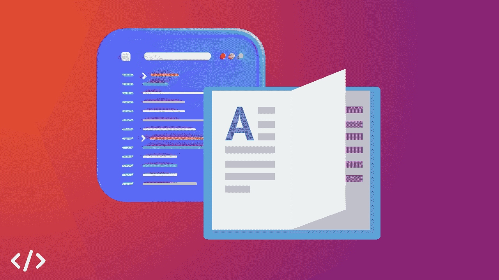

太好了。如果阅读这篇文章已经帮助你确认你想要学习编程，让我们迈出你的第一步。

这些是您应该知道的一些基本编程概念:

*   **变量:**变量是我们在计算机程序中赋给一个值的名字。当我们定义一个变量时，我们给它的名字赋值，并在内存中分配一个空间来存储这个值。变量值可以在程序中更新。
*   **常数:**常数类似于变量。它存储一个值，但不能修改。一旦你给一个常量赋值，你就不能在整个程序中改变它。
*   条件性的:条件性的是一种编程结构，让开发者根据条件选择计算机应该做什么。如果条件为真，就会发生一些事情，但是如果条件为假，就会发生一些不同的事情。
*   **循环:**循环是一种编程结构，它让我们多次运行一个代码块(一系列指令)。它们对于避免代码重复和实现更复杂的功能非常有帮助。
*   **函数:**函数帮助我们避免代码重复，重用我们的代码。它就像一个代码块，我们给它命名，但它也有一些特殊的特征。我们可以写函数的名字来运行指令序列，而不需要再写一遍。

**💡提示:**函数可以与主程序通信，主程序可以通过**参数**、**自变量**、**返回**语句与函数通信。

*   **类:**一个类作为一个蓝图，定义一类对象的特性和功能。就像我们在现实世界中有对象一样，我们可以在程序中表示对象。
*   **Bug:**Bug 是一个程序的逻辑或实现中的错误，它会导致意外或不正确的输出。
*   **调试:**调试是发现并修复程序中 bug 的过程。
*   IDE: 这个缩写代表集成开发环境。它是一个软件开发环境，拥有编写计算机程序所需的最有用的工具，如文件编辑器、浏览器、终端和有用的菜单选项。

💡**提示:**一个常用的免费 IDE 是 [Visual Studio Code](https://code.visualstudio.com/) ，由微软创建。

厉害！现在你知道了一些编程的基本概念。正如您所学的，每种编程语言都有不同的语法，但它们都共享大部分编程结构和概念。

## 🔸编程语言的类型

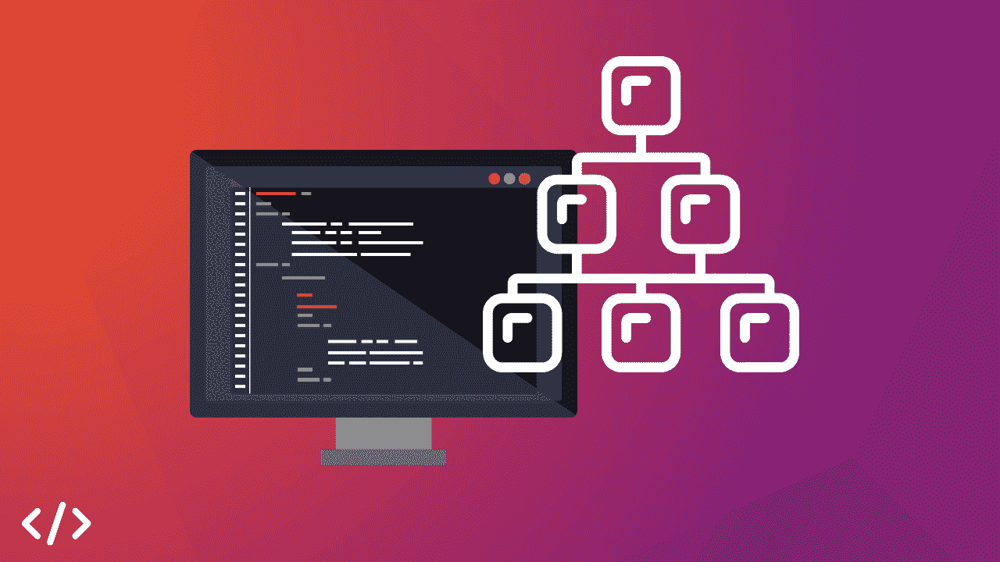

编程语言可以根据不同的标准进行分类。如果你想学习如何编码，学习这些基本分类是很重要的:

### 复杂性

*   高级编程语言:它们是为人类理解而设计的，在计算机能够理解它们之前，它们必须被转换成机器代码。它们是我们常用的编程语言。比如:JavaScript，Python，Java，C#，C++，Kotlin。
*   **低级编程语言:**它们更难理解，因为它们不是为人类设计的。它们被设计成能被机器理解和有效处理。

### 转换成机器代码

*   **编译型编程语言:**用这类编程语言编写的程序，通过编译器直接转换成机器代码。例子包括 C、C++、Haskell 和 Go。
*   **解释编程语言:**用这种编程语言编写的程序依赖于另一个叫做**解释器的程序，**负责逐行运行代码。例子包括 Python、JavaScript、PHP 和 Ruby。

**💡提示:**根据[这篇文章](https://www.freecodecamp.org/news/compiled-versus-interpreted-languages/)在 freeCodeCamp 上的发表:

> 大多数编程语言都有编译和解释的实现——语言本身不一定是编译或解释的。然而，为了简单起见，它们通常是这样称呼的。

还有基于不同标准的其他类型的编程语言，例如:

*   过程编程语言
*   函数式编程语言
*   面向对象的编程语言
*   脚本语言
*   逻辑编程语言

编程语言类型的列表还在继续。这非常有趣，因为您可以分析一种编程语言的特征，以帮助您为您的项目选择正确的语言。

## 🔹如何为开源项目做贡献


GitHub's Home Page.

最后，你可能认为编码意味着坐在办公桌前几个小时看着你的代码，没有任何人的参与。但是让我告诉你，这不一定是真的。您可以是学习社区或开发社区的一部分。

最初，当你正在学习如何编码时，你可以参加像 freeCodeCamp 这样的学习社区。这样，你就可以和其他像你一样正在学习编码的人分享你的旅程。

然后，当你对自己的知识有足够的技能和信心时，你就可以通过贡献开源项目和加入开发者社区来实践了。

[Opensource.com](https://opensource.com/resources/what-open-source)将开源软件定义为:

> 任何人都可以检查、修改和增强带有源代码的软件。

**[GitHub](https://github.com/)** 是一个带有版本控制的托管项目的在线平台。在那里，你可以找到许多开源项目(如 [freeCodeCamp](https://github.com/freeCodeCamp/freeCodeCamp) ),你可以参与其中并练习你的技能。

💡**提示:**许多开源项目欢迎第一次的贡献和所有技能水平的贡献。这些都是实践你的技能和为现实世界项目做贡献的好机会。


freeCodeCamp's [GitHub repository](https://github.com/freeCodeCamp/freeCodeCamp).

为 GitHub 上的开源项目做贡献可以获得与其他开发者合作和交流的新经验。这是在这个领域找工作的另一个重要技能。


GitHub tracks your [contributions](https://docs.github.com/en/account-and-profile/setting-up-and-managing-your-github-profile/managing-contribution-settings-on-your-profile/viewing-contributions-on-your-profile) and shows them on your profile. These are shown as interactive gray and green squares that represent days of the current year. A darker shade of green means that more contributions were made on that day. Image taken from [this GitHub article](https://docs.github.com/en/account-and-profile/setting-up-and-managing-your-github-profile/managing-contribution-settings-on-your-profile/viewing-contributions-on-your-profile).

在团队中工作是很棒的经历。一旦你对自己的技能和知识感到足够满意，我完全推荐它。

你做到了！您已到达这篇文章的结尾。干得好。现在你知道编程是怎么回事了。我们来看一个简要的总结。

## 🔸概括起来

*   编程是一项非常强大的技能。如果你学会了如何编码，你就能实现你的梦想。
*   编程在许多不同的领域有许多不同的应用。你可以在你选择的任何领域找到编程的应用。
*   编程语言可以根据不同的标准进行分类，它们共享一些基本概念，如变量、条件、循环和函数。
*   总是设定目标并做详细的笔记。作为一名成功的程序员，你需要充满热情并且始终如一。

非常感谢您阅读我的文章。我希望你喜欢它，并发现它很有帮助。现在你知道为什么你应该学习如何编码了。

🔅我邀请你在 Twitter ( [@EstefaniaCassN](https://twitter.com/EstefaniaCassN) )和 YouTube ( [用 Estefania](https://www.youtube.com/codingwithestefania) 编码)上关注我，寻找编码教程。