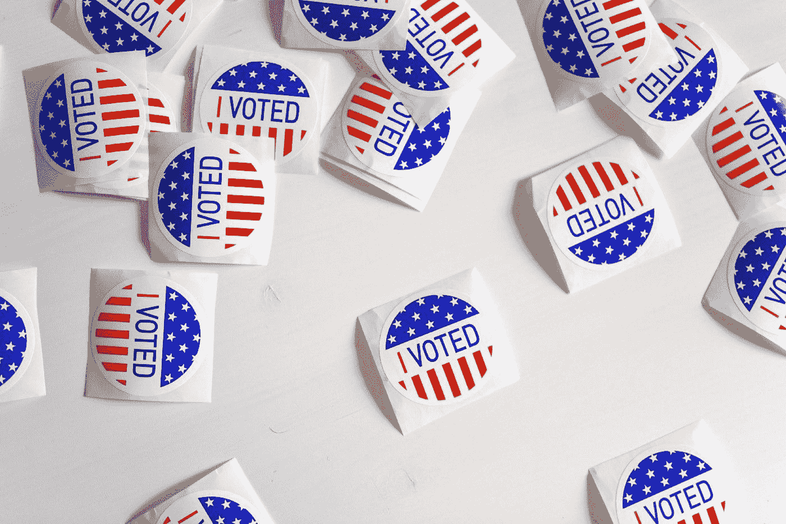
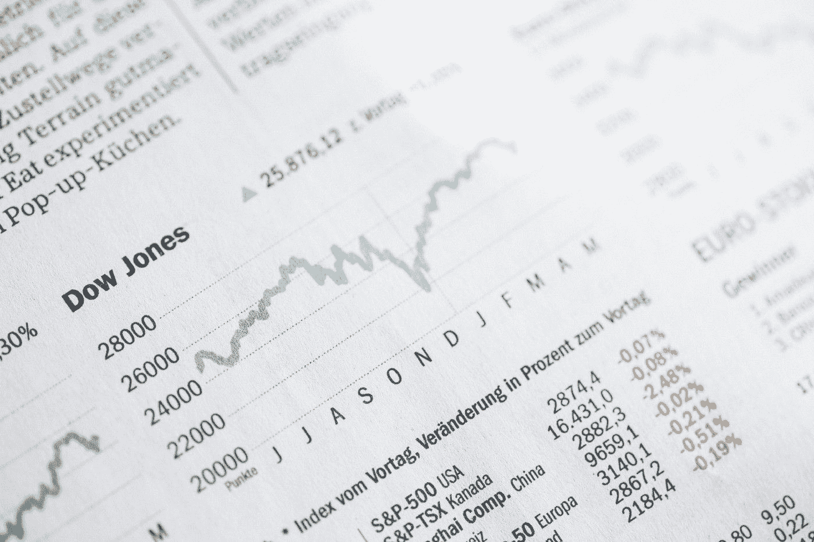

# 什么是情感分析？初学者完全指南

> 原文：<https://www.freecodecamp.org/news/what-is-sentiment-analysis-a-complete-guide-to-for-beginners/>

情感分析让你分析给定文本背后的情感。在本文中，我们将通过几个实际应用来看看它是如何工作的。

# 什么是情感分析？

情感分析是一种技术，通过这种技术，你可以分析一段文本，以确定其背后的情感。它结合了机器学习和自然语言处理(NLP)来实现这一点。

使用基本的情感分析，程序可以理解一段文本背后的情感是积极的、消极的还是中性的。

这是人工智能中一项强大的技术，具有重要的商业应用。

例如，您可以使用情感分析来分析客户反馈。通过 Twitter 和脸书等各种媒体收集反馈后，你可以对这些文本片段运行情感分析算法，以了解客户对你产品的态度。

# 情感分析如何工作

情感分析的最简单的实现是使用评分单词列表。

例如， [AFINN](https://gist.githubusercontent.com/damianesteban/06e8be3225f641100126/raw/a51c27d4e9cc242f829d895e23b4435021ab55e5/afinn-111.txt) 是用负五和正五之间的数字评分的单词列表。你可以把一段文字拆分成单个的单词，和单词列表进行比较，得出最终的情感评分。

假设我们有这样一句话，“我喜欢猫，但我对它们**过敏**”。

在 AFINN 单词列表中，你可以找到两个单词，“爱”和“过敏”，它们的得分分别为+3 和-2。剩下的话可以忽略(还是那句话，这是很基础的情感分析)。

将这两者结合起来，你得到的总分是+1。所以你可以把这句话归为轻度肯定。

如今，行业中使用的情感分析有很多复杂的实现。那些算法可以为你提供长文本的准确分数。除此之外，我们还有不断完善的强化学习模型。

对于复杂的模型，可以结合使用 NLP 和机器学习算法。有三种主要类型的算法用于情感分析。让我们来看看它们。

## 自动化系统

情感分析的自动方法依赖于机器学习模型，如聚类。

长文本被输入到分类器中，它返回否定、中性或肯定的结果。自动化系统由两个基本过程组成，我们现在来看看。

## 基于规则的系统

与自动化模型不同，基于规则的方法依赖于自定义规则来分类数据。流行的技术包括标记化、解析、词干分析和其他一些技术。您可以将我们之前看到的示例视为基于规则的方法。

基于规则的系统的一个好处是能够定制它们。通过开发更智能的规则，这些算法可以基于上下文量身定制。

请记住，您必须定期维护这些基于规则的模型，以确保一致和改进的结果。

## 混合系统

混合技术是最现代、最有效、最广泛使用的情感分析方法。设计良好的混合系统可以提供自动化系统和基于规则的系统的优点。

混合模型享受机器学习的力量以及定制的灵活性。混合模型的一个例子是基于 [Word2Vec](http://jalammar.github.io/illustrated-word2vec/) 的自更新单词表。您可以跟踪这些单词表，并根据您的业务需求进行更新。

# 情感分析的用例

### 分析客户反馈

客户反馈分析是情感分析最广泛的应用。直接的客户反馈对企业来说是黄金，尤其是初创企业。准确的受众定位对于任何类型的企业的成功都是至关重要的。

制作精良的情感分析算法可以捕捉到核心市场对产品的情感。

您还可以将这个用例扩展到更小的子部分，比如分析亚马逊商店上的产品评论。一家公司越是以客户为导向，情感分析就越有用。

### 活动监控

由于剑桥分析公司的丑闻，操纵选民情绪已经成为现实。

情感分析的另一个用例是影响力的测量。以 2016 年美国大选为例，许多民调都认为唐纳德·特朗普(Donald Trump)会输。

但是专家指出，人们普遍对现行制度感到失望。他们通过情感分析用强有力的证据支持他们的主张。

我开发了一个叫做情绪的工具(咄！)在我以前的公司担任软件工程师期间，该公司负责监督美国大选。我们注意到一些趋势表明，特朗普正在赢得选民的强烈支持。

这应该证明，正确的数据结合人工智能可以产生准确的结果，即使它与流行的观点相悖。

### 品牌监控

品牌监测是另一个很好的情感分析用例。公司可以使用情感分析来检查观众对其品牌的社交媒体情感。

肯德基是一个利用情感分析来追踪、建立和提升品牌的完美例子。肯德基的社交媒体活动是其成功的一个重要因素。他们定制营销活动，以吸引年轻人群，并在社交媒体上“现身”。

像 Brandwatch 这样的工具可以告诉你关于你品牌的负面信息是否正在传播。其他利用社交媒体提升正面品牌情绪的品牌包括亚马逊、网飞和多米诺骨牌。

### 股票市场分析

如果你是交易者或投资者，你会理解新闻对股市的影响。每当有重大新闻爆出，必然会对股市产生强烈的正面或负面影响。

情绪分析是交易者的强大工具。你可以实时分析市场对一支股票的情绪，通常只需几分钟。这可以帮助你计划你对某一特定股票的多头或空头头寸。

最近，Moderna 宣布完成其新冠肺炎疫苗临床试验的第一阶段。这一消息导致 Moderna 的股价大幅上涨。

但今天，在失去一项专利后，Moderna 的股票暴跌。使用情绪分析，你可以实时分析这些类型的新闻，并用它们来影响你的交易决策。

### 合规监控

法规遵从性可以成就或摧毁大型组织。通常，这些合规文件被藏在大型网站上，如[金融行为监管局](https://www.fca.org.uk/)。

大型组织将很大一部分预算用于法规遵从性。在这些情况下，传统的数据分析无法提供完整的解决方案。

像 [ScrapingHub](https://www.scrapinghub.com/) 这样的工具可以帮助从这些网站获取文档。但公司需要智能分类，才能在数百万网页中找到合适的内容。

情绪分析可以使合规性监控更容易、更具成本效益。它可以帮助构建标记引擎，分析随时间的变化，并为您的组织提供 24/7 的看门狗。

# 结论

情感分析是一个强大的工具，你可以用它来解决从品牌影响到市场监控的问题。围绕情感分析建立的新工具可以帮助企业变得更有效率。

顺便说一句，如果你喜欢语法，你可以继续感谢情感分析。

**喜欢这篇文章？** [******加入我的简讯******](http://tinyletter.com/manishmshiva)***每周一获取我的文章和视频汇总***