# 我在 Twitter 的一年里学到了什么

> 原文：<https://www.freecodecamp.org/news/what-ive-learned-in-1-year-at-twitter-65150f5d4af2/>

一年前，在面试了西雅图地区的许多顶级科技公司后，我作为 Ads 测量团队的软件工程师加入了 Twitter。你可以在这里阅读更多关于我的故事。

在我的脑海里，我有一张清单，上面列有我要找的东西。它是按降序排列的:

*   作为一个单位工作的相互支持的团队
*   工作生活平衡
*   按市场价值计算的经济补偿
*   公司支持并为员工提供充足的学习和成长机会
*   该公司正在加速发展

当时我有幸从许多顶级科技公司中进行选择。在评估了所有选项并与我的朋友和家人讨论后，我决定加入 Twitter。

这篇文章浓缩了我在 Twitter 工作一年后的想法，我作为一名软件工程师学到的东西，我如何度过我的时间，等等。最重要的是，这是一种自我反省，让自己对自己的职业和决定负责。

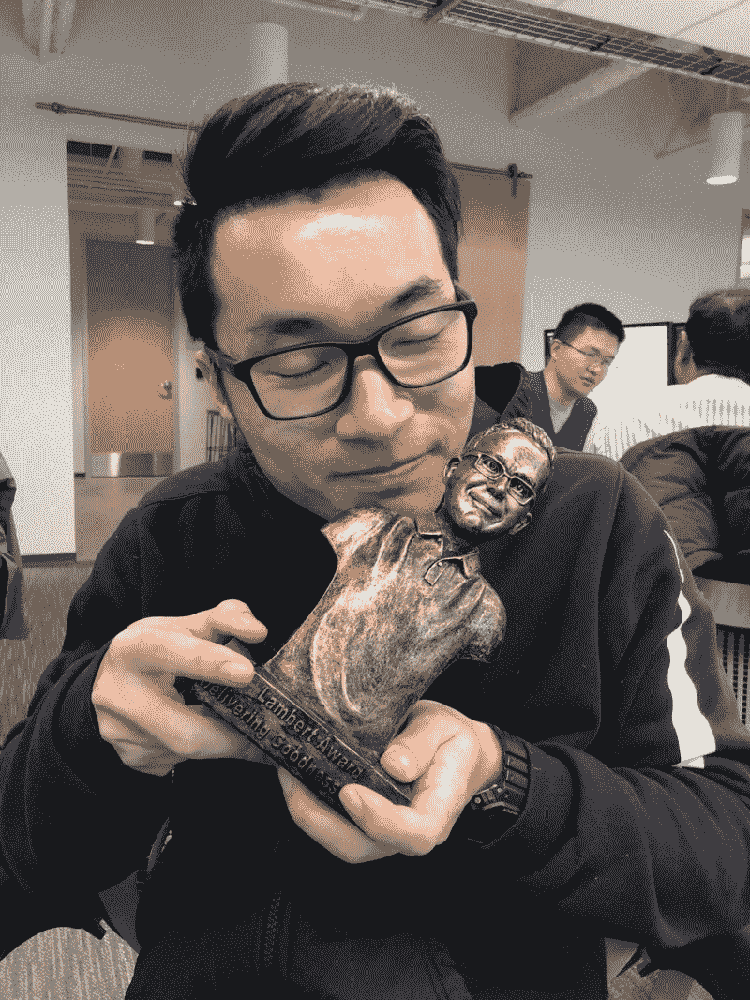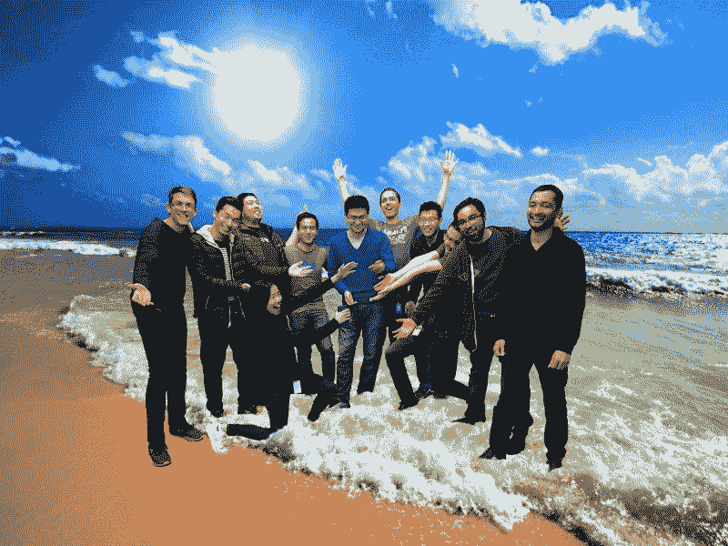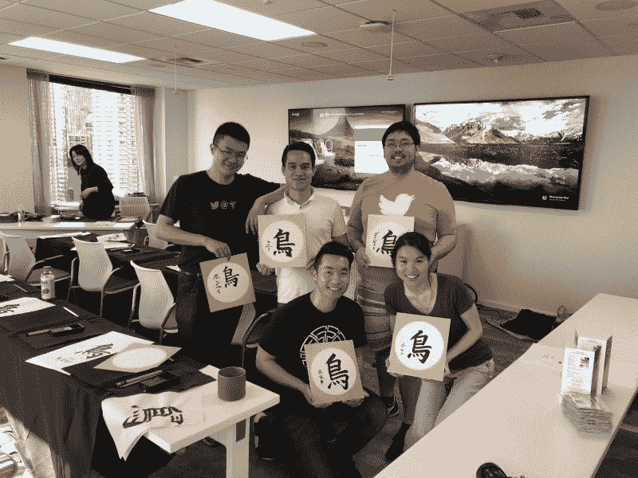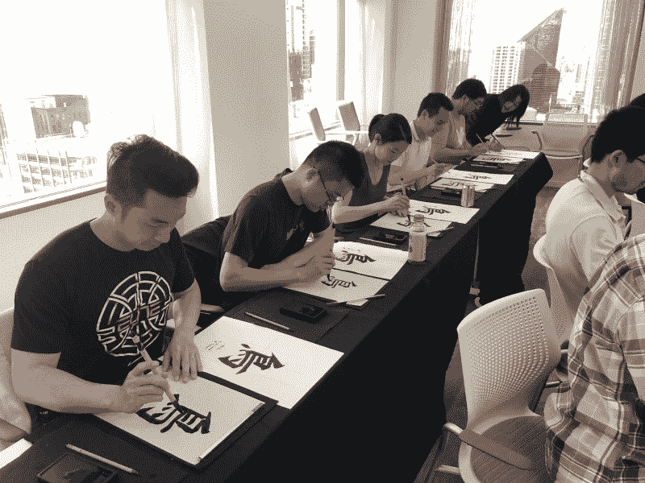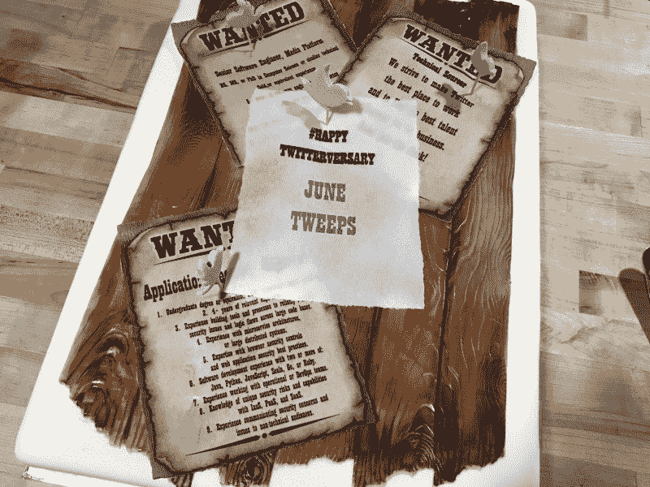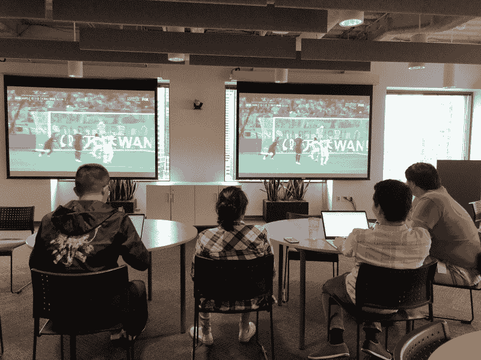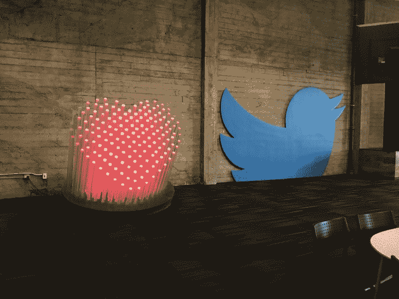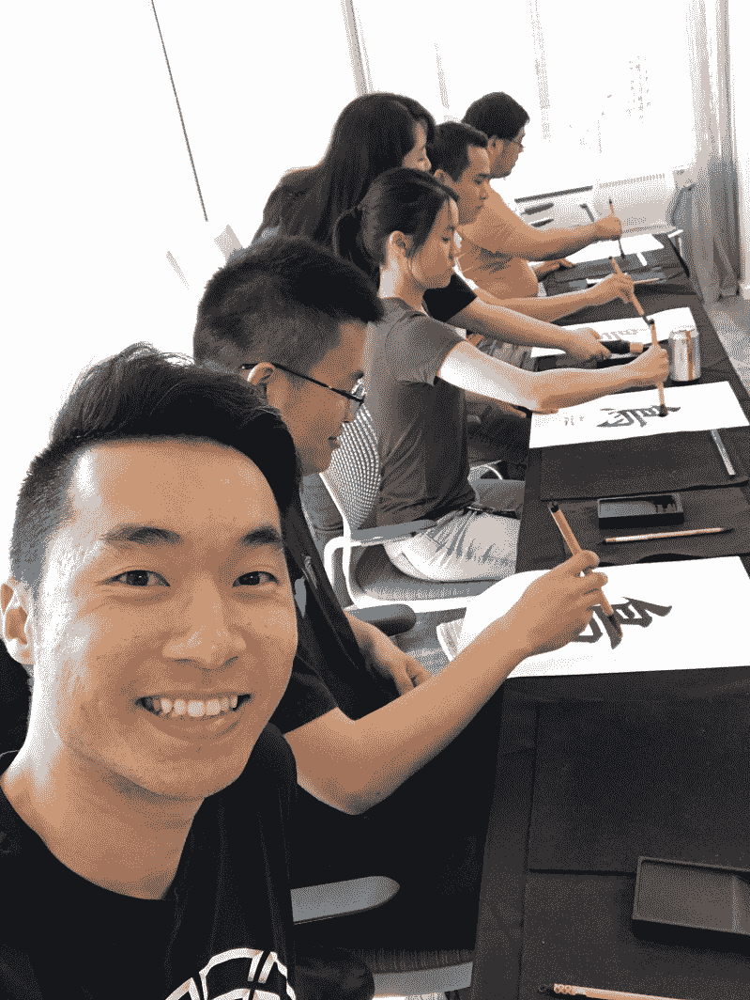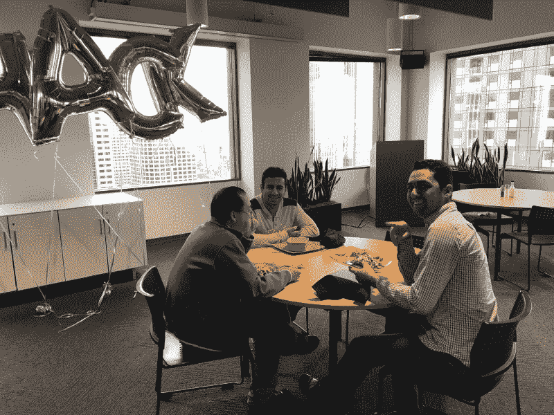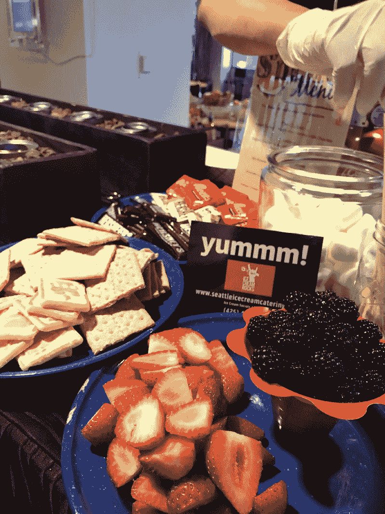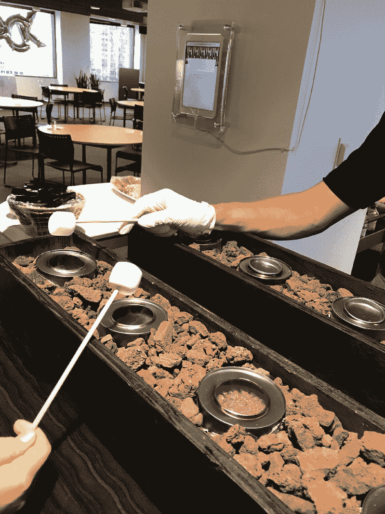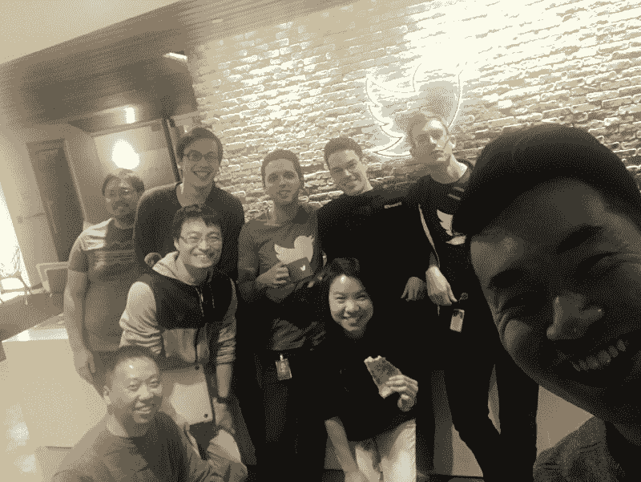

### 过去一年我学到了什么

#### 强大的工程文化确保卓越

作为一名工程师，我亲眼目睹了 Twitter 拥有强大的工程文化，推动工程师们追求卓越。Twitter 非常注重促进成长心态——以至于他们在新员工上班的第一天就送了一本名为 [**心态**](https://amzn.to/2uKEiq1) 的书。因为我们是一个重 Scala 的团队，所以也有一个副本 [**Scala 给没有耐心的人**](https://amzn.to/2mBS4qn) :)

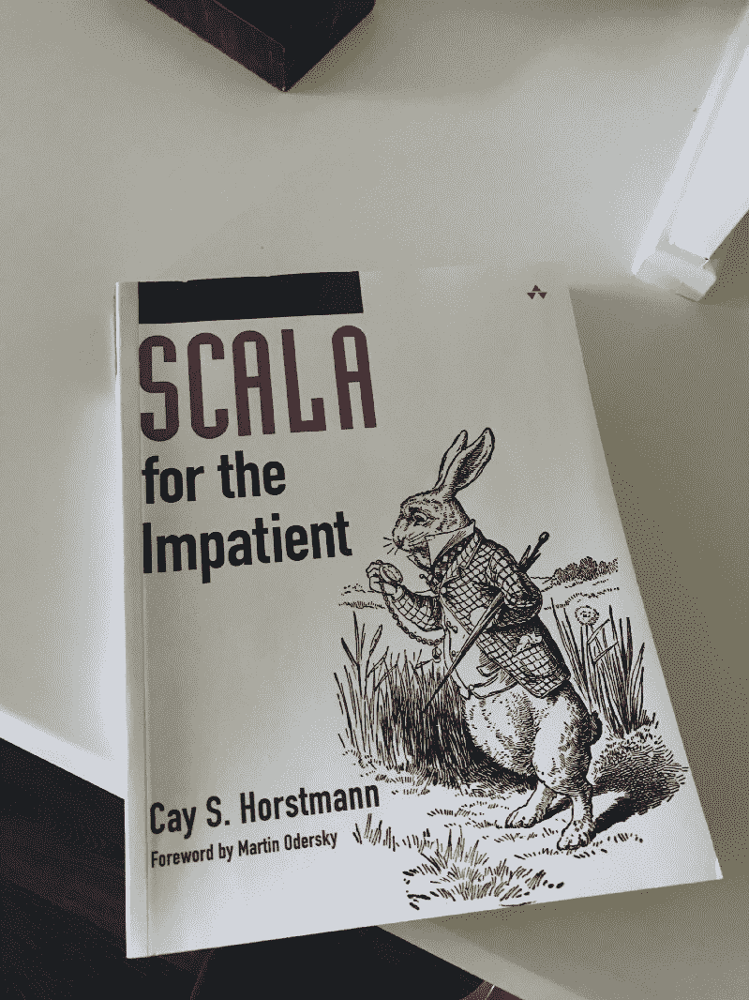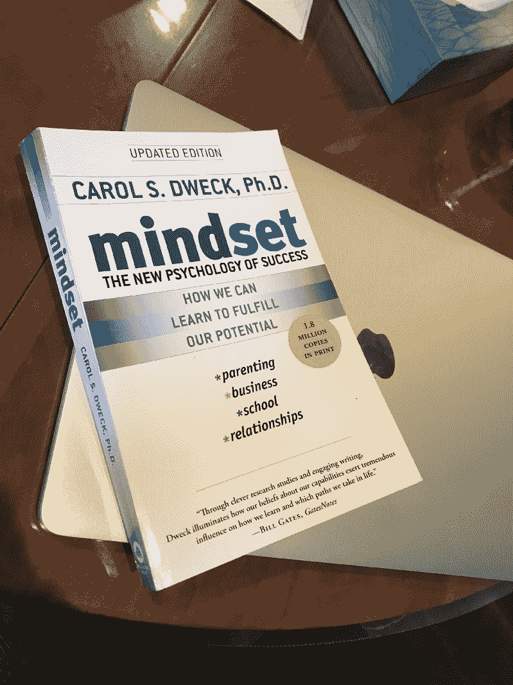

Recommended reading for new hires

除此之外，我还观察到 Twitter 强调优秀工程文化的一些关键领域。

**快速移动，打破东西。**

然而，这句格言有一个警告——谁来修理坏掉的东西？在 Twitter 工作期间，我了解到快速行动的文化需要伴随着适当的指标和提醒，以帮助你监控进展。

作为一个创业背景的人，首要任务是运送东西。功能赚钱，代码质量不赚钱。然而，许多软件工程师会告诉你，软件开发的大部分成本来自软件的长期维护。快速运输和高质量运输之间的权衡常常是一个争论的话题。

我学到的是，只要有适当的指标和策略来限制爆炸半径 *，高速运输是没问题的**。***

适当的警报和指标可以帮助您**监控您的功能的健康状况**，并告知“我应该保留还是取消该功能？”能够限制爆炸半径意味着你可以自由试验新功能，同时能够**隔离影响范围**。两者一起将真正让你“快速移动和打破东西”。

#### 流程在大团队中至关重要

流程有助于建立一致性，并使新工程师能够快速加入。在一个 50-100 人的小型创业公司中，指导和吸纳新员工可能很容易。然而，一旦公司规模达到某个阈值，没有标准的程序就很难跟踪事情的发展。此外，共享知识的难度随着大规模人群的增加而成倍增长。

有很多关于过程的讨论，比如“官僚主义”、“低生产率”、“必然的邪恶”等等。在某些方面，这是真的。另一方面，我亲眼目睹了流程如何建立一致性、降低复杂性和提高生产率。**流程是指导方针，而不是规则**，可以随着团队/公司的发展而更新。

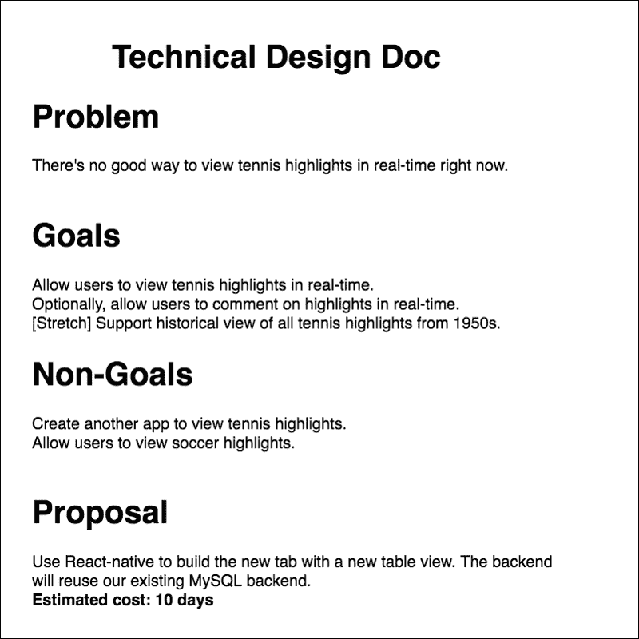

A typical technical design doc

例如，每个新项目都附有一份技术设计文档，其中概述了目标、非目标、可能的解决方案、成功标准和潜在的风险因素。

在内部，我们为技术设计文档编写了一个模板，以标准化设计流程。模板本身迫使首席工程师考虑完整的端到端场景，从推导需求，考虑各种备选方案的利弊，挑选解决方案，然后将解决方案与成功标准联系起来。

使用数据作为成功的衡量标准可以让我们快速行动和/或在事情不顺利的情况下进行调整。

此外，我们在**两周冲刺**中规划了我们的工作，并且在每个冲刺阶段结束时我们有一个**回顾**。每个 sprint 都从一个任务列表开始，这些任务根据资源可用性和紧迫性进行优先排序。然后，我们将这些任务放入 Google 电子表格，然后像日历一样填充。我认为它在跟踪任务，识别瓶颈，最重要的是，判断我们是否能按时交付所有任务方面非常有效。

在每个冲刺阶段结束时，我们都会进行一次回顾，讨论哪些进展顺利，哪些可以改进。回顾会庆祝胜利，强调失败，这样我们可以从中吸取教训，避免将来犯同样的错误。

庆祝胜利是很重要的，比如发布新产品和减少技术债务，因为每个人都非常努力地实现这些。士气是保持团队动力的关键。另一方面，仔细检查混乱的情况也同样有用，这样我们就可以找出哪里出了问题。审查错误有正确和错误的方式，这就引出了我的下一个观察。

#### 纯洁的文化

Twitter 鼓励一种无责备的环境，这进一步促进了 T2 从错误中学习，而不是挑毛病。[我们每个人都会犯错](https://www.theverge.com/2017/3/2/14792442/amazon-s3-outage-cause-typo-internet-server)，围绕失败建立一种健康的文化非常重要。

我不是说我们应该原谅和忘记。而是要大力寻找根源，这样**才能在核心**处修复，防止以后搬起石头砸自己的脚。

威尔·史密斯在这次[采访](https://www.youtube.com/watch?v=0DNv2p2ayZ0)中有一句名言:

> "生活中最美好的事情**在恐惧的另一边**"

我相信犯错和冒险对于建立一个有弹性、快速发展的公司至关重要。因此，作为一名工程师，我工作的公司允许我这样做对我来说非常重要。Twitter 正是这样做的——通过给我机会去冒险、犯错并从中吸取教训来支持我。

在过去的一年里，我也经历过失败。我通过事后分析来处理这些问题，分析出了什么问题，为什么会这样，是如何发生的，以及下次可以做得更好的地方。这里的重点是找出问题的原因，以及我们可以设置哪些障碍来防止类似的错误继续发生。

#### 关注质量会带来利益

像任何其他科技公司一样，Twitter 也有科技债务潜伏在角落里，等待着突然袭击。这就像房间里的大象——人们**注意到**它，但他们选择忽略它。也就是说，直到大象竖起它巨大而有力的鼻子，搅乱了聚会。

我们最近开始使用#CoreQuality 这个标签，(我们有一种为一切事物制作标签的文化)，以在内部强调我们本季度关注的内容。没错——我们花了一个季度的时间清理代码(也称为代码重构),偿还技术债务，编写文档，并投资于长期稳定性。

与#CoreQuality 一起，我们发现在团队中传播知识是实现长期稳定的关键一步。我们思考这个问题的方式是建立一个 T 形的知识图表:

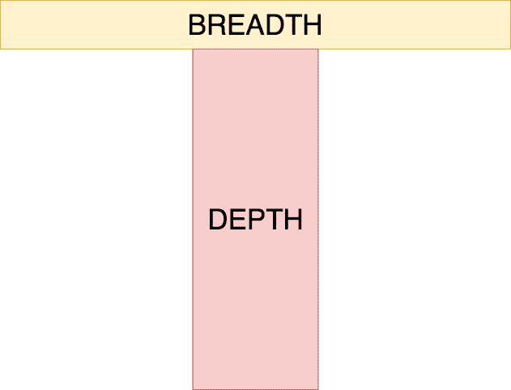

T-shaped knowledge

T 形知识有两个组成部分:

*   广度，或者说“你知道什么？”
*   深度，或者“你有多了解它？”

我们在某个时候意识到，一些团队成员在某个特定的服务方面有很深的专业知识，而对外部的任何事情基本上一无所知。

这是如此普遍，以至于有一个术语来形容它— [总线因子](https://en.wikipedia.org/wiki/Bus_factor)。这是在项目因缺乏专业知识而停止之前需要消失的团队成员数量的风险因素。1 的总线因子也可以粗略地理解为[单点故障](https://en.wikipedia.org/wiki/Single_point_of_failure)，这意味着如果这个关键专家消失了，那么项目将会失败。

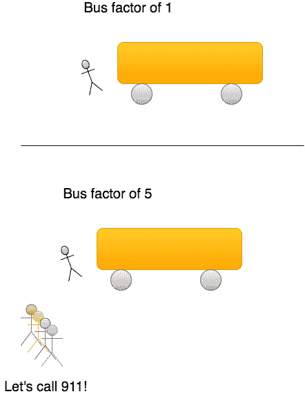

My idea of bus factor

我们的目标是在整个团队中消除 1 的总线因素。为此，我们启动了多项计划:

1.  **每天投资 30 分钟**在文档上(感谢[开源组合](https://www.freecodecamp.org/news/what-ive-learned-in-1-year-at-twitter-65150f5d4af2/undefined))。我们的队友莱尼建议我们养成写下一整天所学的东西的习惯，每次 30 分钟。
2.  **鼓励科技棕色包**。一个棕色的袋子本质上是一个午餐展示，团队成员在这里与团队的其他成员分享他们的专业知识。我们在午餐时与当地专家讨论了[滚烫](https://github.com/twitter/scalding)、[知更鸟](https://github.com/twitter/summingbird)和 Hadoop Map-Reduce。这也是一个了解你可能不知道的技术堆栈的好机会。
3.  **每次冲刺**分配专业领域之外的任务。每个人在每个 sprint 中都被分配了不同的任务，从而有机会学习不同的技术栈或代码库。我个人认为这是一种非常有效的传播知识的方式，因为否则我将无法钻研另一个代码库。

#### 团队比项目更重要

与你日常共事的人对你职业生涯的影响要比一个项目或公司大得多。

一个伟大的团队会让低潮变得可以忍受，让高潮变得令人振奋。

项目来了又走，但是即使在项目解散或被转移之后，团队仍然在一起。如果你们每天在一起呆八个小时，难道你不想和你喜欢的人一起工作吗？

在我过去的一年里，能够和一个摇滚明星团队一起工作是有趣的，具有挑战性的，令人兴奋的，同时又令人耳目一新。当你团队中的每个人都是摇滚明星时，他们会像你激励他们一样激励你取得成功。我们互相推着，把对方抱到一个高杠上。我们努力工作，也同样努力玩耍。

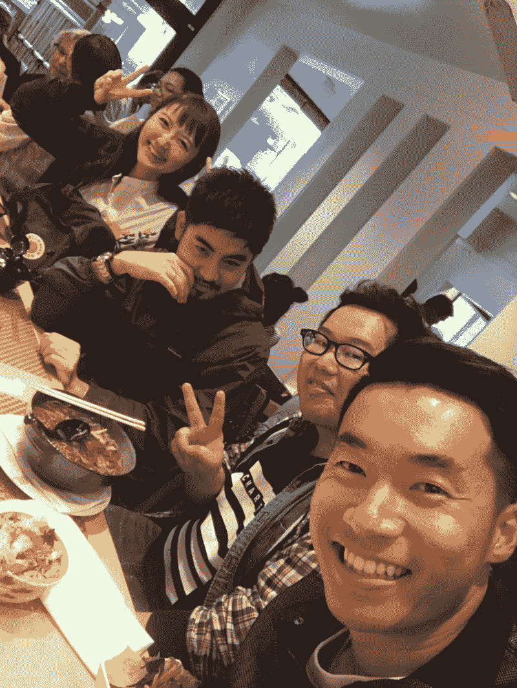

Dinner with the international Twitter Singapore + Japan team!

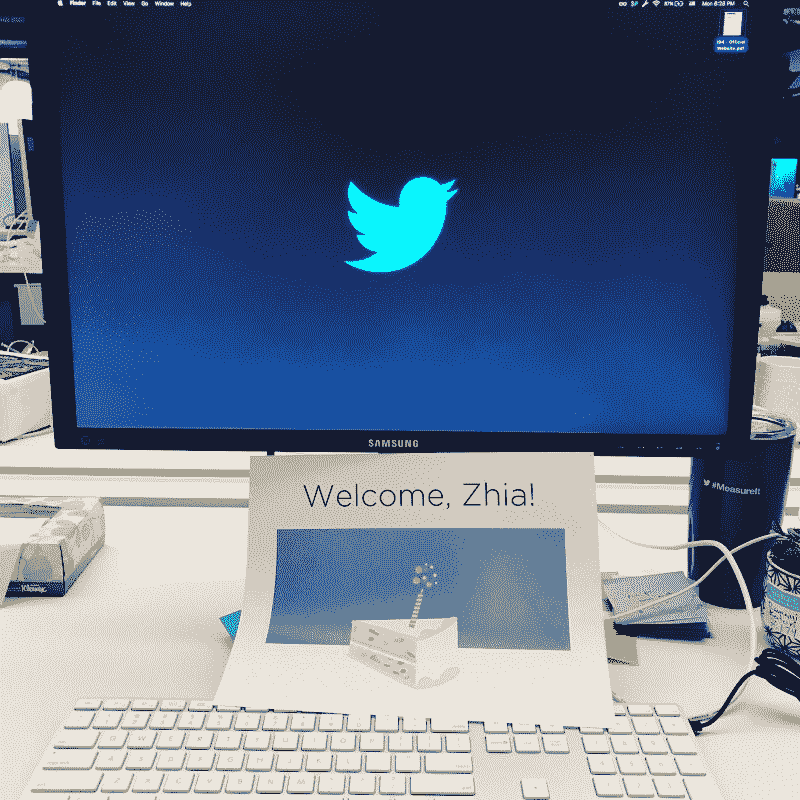

My first day at Twitter

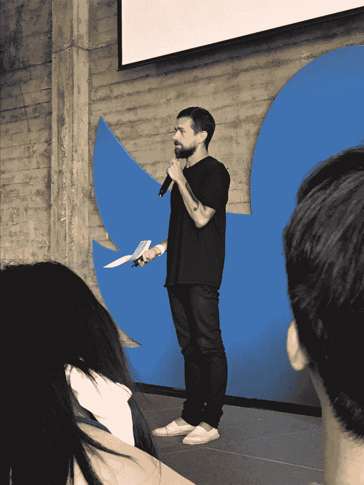

Jack on stage for my first tea-time

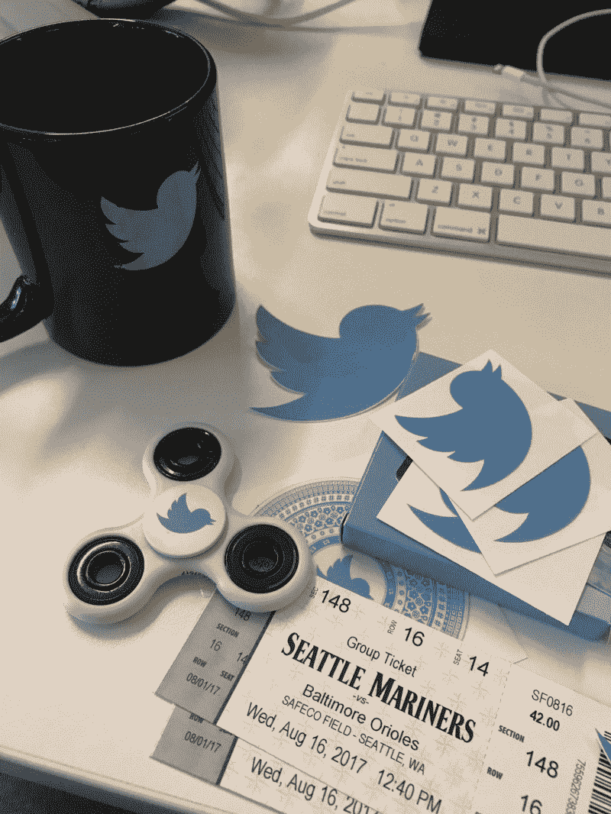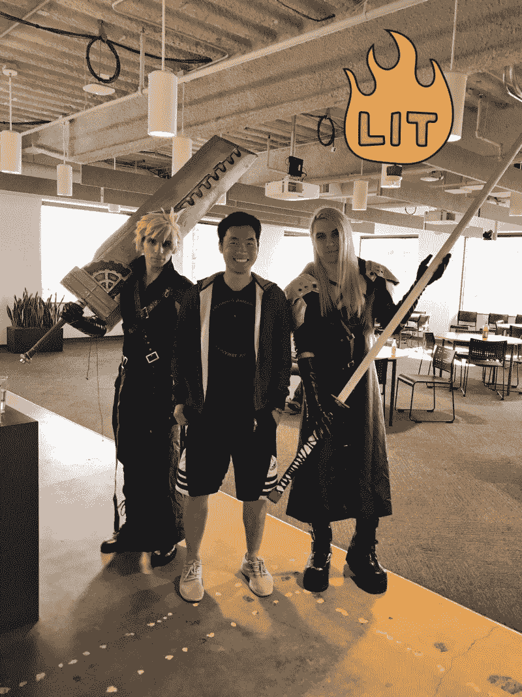

Twitter swag and events

#### 最优秀的人有自己的问题

机会出现在危险的情况下，这时你会看到最优秀的人站出来抓住机会。身处转型时期的 Twitter 给了我一个难得的机会，让我得以一瞥公司内部的诸多问题。

> “中国人用两种笔画来写‘危机’这个词。”一笔代表危险；另一个是机会。“—约翰·肯尼迪

最优秀的人倾向于承认问题，而不是指出问题。他们能在其他人之前迅速发现问题，并且总是第一个自愿解决问题的人。

相对于它在世界上的范围和影响，Twitter 是一个非常小的公司。小规模使得小团队很容易产生巨大的影响。看到一个 10 人的团队每年为公司创造数千万美元的收入并不罕见。

在某种程度上，这就是在 Twitter 工作的特别之处:有机会承认问题并解决它们。

正如我前面提到的，我挑选公司的一个标准是，公司需要支持并为员工提供充足的学习和成长机会。我发现这就是我在这里的真实情况。主动解决问题，即使是那些超出我能力范围的问题，也能让我挑战和拓展自己的极限。

### 加入 Twitter 是正确的决定吗？

最终，这是一年后要问的问题。简而言之，这是一个明确的、响亮的肯定——我爱我的团队，我拥有的范围和影响，成长的机会，等等。这是我的清单:

*   作为一个单位工作的相互支持的团队
*   工作生活平衡
*   经济补偿是按市场价值计算的
*   公司支持并为员工提供充足的学习和成长机会
*   该公司正在加速发展

在 Twitter，工作和生活的平衡很大程度上取决于你如何运作。我经常在工作日朝九晚五地工作，有时周末也工作，只是因为我想这样做，而不是因为我需要这样做。当我在做一个让我非常兴奋的功能时，无论如何都感觉不像是在工作。

我们最近还在整个组织内开始每周二和周四不开会，这样我们就不会被会议束缚，可以专注于执行。

从财务补偿的角度来看，Twitter 试图通过股票刷新、有竞争力的薪酬、慷慨的 rsu、401K 等等来为员工做好事。自从我加入以来，Twitter 的估值已经翻了近 3 倍，这也有助于提高用户的忠诚度。我在西雅图的团队还在招人！

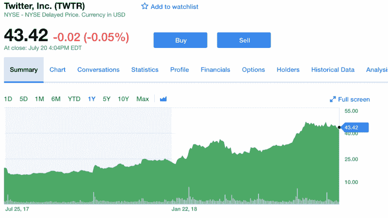

Image credit of Yahoo! Finance

阿智·钟是 Twitter 广告测量团队的软件工程师。所有观点都是他自己的，并不表达推特公司的观点或看法。

你可以在 [LinkedIn](https://www.linkedin.com/in/zhiachong/) 和 [Twitter](https://twitter.com/zhiachong) 上找到他。

他有一份时事通讯，分享面试技巧&技巧、行业新闻等等。点击订阅更多文章更新！