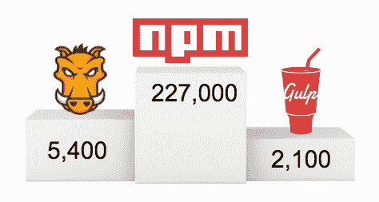

# 为什么我为了 npm 脚本而离开 Gulp 和 Grunt

> 原文：<https://www.freecodecamp.org/news/why-i-left-gulp-and-grunt-for-npm-scripts-3d6853dd22b8/>

我知道你在想什么。瓦特？！Gulp 不是刚杀了 Grunt 吗？为什么我们不能在 JavaScript 的世界里满足几分钟呢？我听到了，但是…

> 我发现 Gulp 和 Grunt 是不必要的抽象。npm 脚本非常强大，通常更容易使用。

#### 让我们从一个例子开始…

我是吞咽的忠实粉丝。但是在我的上一个项目中，我的 Gulp 文件中有 100 多行代码和大约 12 个 Gulp 插件。我正在努力使用 Gulp 集成 Webpack、Browsersync、hot reloading、Mocha 和更多功能。为什么？嗯，对于我的用例，一些插件没有足够的文档。一些插件只暴露了我需要的 API 的一部分。其中一个有一个奇怪的错误，它只能看到少量的文件。另一个是输出到命令行时去掉的颜色。

这些都是可以解决的问题，但是当我直接调用这些工具时，这些问题都没有发生。

最近我注意到许多开源项目只是简单地使用 npm 脚本。我决定退后一步重新审视。我真的需要吞咽吗？结果我没有。

我决定在我的新开源项目中尝试只使用 npm 脚本。我只使用 npm 脚本为 React 应用程序创建了一个丰富的开发环境和构建过程。好奇这是什么样子吗？看看[反应弹弓](https://github.com/coryhouse/react-slingshot)。在 Pluralsight 的“[构建 JavaScript 开发环境](https://app.pluralsight.com/library/courses/javascript-development-environment/table-of-contents)”中，我介绍了如何使用 npm 脚本创建这个构建过程。

令人惊讶的是，我现在更喜欢使用 npm 脚本而不是 Gulp。原因如下。

### 咕噜咕噜怎么了？

随着时间的推移，我注意到了 Gulp 和 Grunt 等任务运行程序的三个核心问题:

1.  对插件作者的依赖
2.  令人沮丧的调试
3.  杂乱无章的文件

让我们逐一考虑这些问题。

#### 问题#1:依赖插件作者

当你使用新的或不受欢迎的技术时，可能根本不存在插件。而当一个插件存在的时候，它可能已经过时了。比如最近发布的 Babel 6。API 变化很大，所以很多 Gulp 插件和最新版本不兼容。使用 Gulp 的时候，因为需要的 Gulp 插件还没有更新，所以卡住了。

对于 Gulp 或 Grunt，你必须等待插件维护者提供更新，或者自己修复。这延迟了你利用新版本现代工具的能力。相比之下，**当我使用 npm 脚本时，我直接使用工具，没有额外的抽象层**。这意味着当 Mocha、伊斯坦布尔、Babel、Webpack、Browserify 等新版本发布时，我可以立即使用这些新版本。

在选择方面，没有什么能打败 npm:



Gulp has ~2,100 plugins. Grunt has ~5,400\. npm offers over 227,000 packages, growing at a rate of 400+ daily.

> 当你使用 **npm 脚本时，你不会去搜索一个咕哝或者吞咽的插件。您可以从超过 227，000 个 npm 包中进行选择。**

公平地说，如果你需要的 Grunt 或 Gulp 插件不可用，你当然可以直接使用 npm 包。但是这样你就不会再利用吞咽或者咕噜来完成特定的任务了。

#### 问题#2:令人沮丧的调试

当集成失败时，咕噜咕噜地调试可能会令人沮丧。因为您正在使用一个额外的抽象层，所以任何 bug 都有更多的潜在原因:

1.  基础工具坏了吗？
2.  咕噜/大口插件坏了吗？
3.  我的配置坏了吗？
4.  我使用的是不兼容的版本吗？

使用 npm 脚本消除了第二个问题。我发现#3 不太常见，因为我通常直接调用该工具的命令行界面。最后，#4 不太常见，因为我已经通过直接利用 npm 而不是使用任务运行器的抽象减少了项目中的包的数量。

#### 问题#3:不连贯的文档

我需要的核心工具的文档几乎总是比相关的 Grunt 和 Gulp 插件好。例如，如果我使用 gulp-eslint，我最终会把我的时间分配在 gulp-eslint 文档和 eslint 网站上。我必须在插件和它所抽象的工具之间切换上下文。《吞咽和咕噜咕噜》中的核心摩擦是这样的:

> 仅仅了解工具是不够的。Gulp 和 Grunt 要求你理解插件的抽象。

大多数与构建相关的工具都提供了清晰、强大、文档完善的命令行界面。参见 ESLint 的 CLI 上的[文档就是一个很好的例子。我发现在 npm 脚本中阅读和实现一个简短的命令行调用更清晰、更少摩擦、更容易调试(因为去掉了一层抽象)。](http://eslint.org/docs/user-guide/command-line-interface)

现在我已经确定了痛点，问题是，为什么我们认为我们需要像 Gulp 和 Grunt 这样的任务运行程序？

### 为什么我们在构建中忽略了 npm？

我认为有四个核心误解导致了 Gulp 和 Grunt 如此流行:

1.  人们认为 npm 脚本需要很强的命令行技能
2.  人们认为 npm 脚本不够强大
3.  人们认为 Gulp 的流对于快速构建是必要的
4.  人们认为 npm 脚本不能跨平台运行

让我们依次解决这些误解。

#### 误解 1 **:** npm 脚本需要很强的命令行技能

要享受 npm 脚本的强大功能，您不需要了解太多操作系统的命令行。当然， [grep、sed、awk 和 pipes](http://www.tutorialspoint.com/unix/unix-useful-commands.htm) 是值得学习的终身技能，但是**你不必成为 Unix 或 Windows 命令行向导来使用 npm 脚本**。您可以利用 npm 中数以千计的软件包来完成这项工作。

例如，您可能不知道在 Unix 中这会强制删除一个目录:rm -rf。没关系。你可以使用 [rimraf](https://www.npmjs.com/package/rimraf) 做同样的事情(它可以跨平台启动)。大多数 npm 软件包提供的界面都假定你对操作系统的命令行知之甚少。只需在 npm 中搜索能满足您需求的包，阅读文档，边做边学。我曾经搜索过 Gulp 插件。现在我转而搜索 npm 包。一个很棒的资源: [libraries.io](https://libraries.io) 。

#### **误解 2: npm 脚本不够强大**

npm 脚本本身惊人地强大。有基于约定的[前置和后置挂钩](https://docs.npmjs.com/misc/scripts#description):

```
 {
  "name": "npm-scripts-example",
  "version": "1.0.0",
  "description": "npm scripts example",
  "scripts": {
    "prebuild": "echo I run before the build script",
    "build": "cross-env NODE_ENV=production webpack",
    "postbuild": "echo I run after the build script"
  }
}
```

你所做的就是遵循惯例。上面的脚本将根据它们的前缀按顺序运行。预构建脚本将在构建脚本之前运行，因为它具有相同的名称，但以“pre”为前缀。postbuild 脚本将在构建脚本之后运行，因为它具有前缀“post”。因此，如果我创建名为 prebuild、build 和 postbuild 的脚本，当我键入“npm run build”时，它们将按该顺序自动运行。

您还可以通过从一个脚本调用另一个脚本来分解大问题:

```
{
  "name": "npm-scripts-example",
  "version": "1.0.0",
  "description": "npm scripts example",
  "scripts": {
    "clean": "rimraf ./dist && mkdir dist",
    "prebuild": "npm run clean",
    "build": "cross-env NODE_ENV=production webpack"
  }
}
```

在此示例中，预构建任务调用清理任务。这允许您将您的脚本分解成小的、命名良好的、单一责任的一行程序。

您可以使用&&，在一行中连续调用多个脚本。上面清理步骤中的脚本将一个接一个地运行。这种简单性真的会让你会心一笑，如果你是一个努力让一系列任务按顺序运行的人。

如果一个命令变得太复杂，你总是可以调用一个单独的文件:

```
{
  "name": "npm-scripts-example",
  "version": "1.0.0",
  "description": "npm scripts example",
  "scripts": {
    "build": "node build.js"
  }
}
```

我在上面的构建任务中调用了一个单独的脚本。该脚本将由 Node 运行，因此可以利用我需要的任何 npm 包，并利用内部 JavaScript 的所有功能。

我可以继续说下去，但是[核心特性记录在这里](https://docs.npmjs.com/misc/scripts)。此外，还有一个关于使用 npm 作为构建工具的简短 [Pluralsight 课程](https://www.pluralsight.com/courses/npm-build-tool-introduction)。或者，看看[反应弹弓](https://github.com/coryhouse/react-slingshot)的例子。

#### 误解 3: gulp 的流是快速构建的文章

Gulp 很快就超过了 Grunt，因为 Gulp 的内存流比 Grunt 基于文件的方法更快。但你不需要大口大口地享受流媒体的力量。事实上，**流一直被构建在 Unix 和 Windows 命令行中**。管道(|)运算符将一个命令的输出传输到另一个命令的输入。重定向(>)操作符将输出重定向到一个文件。

例如，在 Unix 中，我可以使用“grep”文件的内容，并将输出重定向到一个新文件:

```
grep ‘Cory House’ bigFile.txt > linesThatHaveMyName.txt
```

**上面的工作是流式的。不写入中间文件。**(想知道如何跨平台的做上面的命令？请继续阅读……)

您还可以使用` & '运算符在 Unix 上同时运行两个命令:

```
npm run script1.js & npm run script2.js
```

上面的两个脚本将同时运行。要跨平台并发运行脚本，请使用 [npm-run-all](https://www.npmjs.com/package/npm-run-all) 。这导致了下一个误解…

#### 误解 4: npm 脚本不能跨平台运行

许多项目都与特定的操作系统相关联，因此跨平台问题无关紧要。但是如果您需要跨平台运行，npm 脚本仍然可以很好地工作。无数的开源项目就是证明。以下是方法。

操作系统的命令行运行 npm 脚本。因此，在 Linux 和 OSX 上，您的 npm 脚本在 Unix 命令行上运行。在 Windows 上，npm 脚本在 Windows 命令行上运行。因此，如果您希望您的构建脚本在所有平台上运行，您需要让 Unix 和 Windows 都满意。这里有三种方法:

**方法 1:** 使用跨平台运行的[命令](http://www.yolinux.com/TUTORIALS/unix_for_dos_users.html)。跨平台命令的数量惊人。以下是一些例子:

```
&& chain tasks (Run one task after another)
< input file contents to a command
> redirect command output to a file
| redirect command output to another command
```

**方法二:**使用节点包。您可以使用节点包来代替 shell 命令。例如，使用 [rimraf](https://www.npmjs.com/package/rimraf) 而不是“rm -rf”。使用 [cross-env](https://www.npmjs.com/package/cross-env) 跨平台设置环境变量。搜索 Google、npm 或 [libraries.io](https://libraries.io) 寻找你想要做的事情，几乎可以肯定有一个节点包可以跨平台完成它。如果您的命令行调用太长，您也可以在单独的脚本中调用节点包，如下所示:

```
node scriptName.js
```

上面的脚本是普通的老式 JavaScript，由 Node 运行。因为您只是在命令行上调用一个脚本，所以您并不局限于。js 文件。您可以运行您的操作系统可以执行的任何脚本，比如 Bash、Python、Ruby 或 Powershell。

**接近 3** :使用[外壳](https://www.npmjs.com/package/shelljs)。ShellJS 是一个 npm 包，它通过 Node 运行 Unix 命令。因此，这使您能够在所有平台上运行 Unix 命令，包括 Windows。

我在[React slings](https://github.com/coryhouse/react-slingshot)上使用了方法#1 和#2 的组合。

### 痛点

不可否认有一些缺点:JSON 规范不支持注释，所以不能在 package.json 中添加注释。

1.  编写小型的、命名良好的、单一用途的脚本
2.  单独记录脚本(例如在 README.md 中)
3.  叫一个单独的。js 文件

我更喜欢选项 1。如果你将每个脚本分解成一个单独的职责，那么注释是很少必要的。脚本的名字应该充分描述意图，就像任何小的命名良好的函数一样。正如我在“[干净的代码:为人类编写代码](https://www.pluralsight.com/courses/writing-clean-code-humans)中所讨论的，小型的单一责任功能很少需要注释。当我觉得有必要添加注释时，我使用选项#3，将脚本移动到一个单独的文件中。当我需要时，这给了我 JavaScript 所有的组合能力。

Package.json 也不支持变量。这听起来像是一件大事，但不是因为两个原因。首先，最常见的变量需求与环境有关，您可以在命令行上设置。第二，如果因为其他原因需要变量，可以单独调用。js 文件。查看 [React-starter-kit](https://github.com/kriasoft/react-starter-kit/blob/master/package.json#L74) 以获得这种模式的优雅示例。

最后，还存在创建难以理解的长而复杂的命令行参数的风险。代码审查和勤奋的重构是确保 npm 脚本被分解成每个人都理解的小的、命名良好的、单一用途的功能的好方法。如果它复杂到需要注释，您应该将单个脚本重构为多个命名良好的脚本，或者将其提取到一个单独的文件中。

#### 抽象必须是合理的

Gulp 和 Grunt 是对我使用的工具的抽象。抽象是有用的，但是抽象是有代价的。它们会泄漏。他们让我们依赖插件维护者和他们的文档。它们通过增加依赖项的数量来增加复杂性。我已经决定像 Gulp 和 Grunt 这样的任务运行器是我不再需要的抽象。

寻找细节？在 Pluralsight 上的“[构建 JavaScript 开发环境](https://app.pluralsight.com/library/courses/javascript-development-environment/table-of-contents)”中，我介绍了如何使用 npm 脚本从头开始创建构建过程。

评论？在下面或在 [Reddit](https://www.reddit.com/r/javascript/comments/41e1ys/why_i_left_gulp_and_grunt_for_npm_scripts/) 或[黑客新闻](https://news.ycombinator.com/item?id=10929476)上插话。

最后，我绝不是第一个提出这个建议的人。以下是一些优秀的链接:

*   npm 运行下的任务自动化 —詹姆斯·霍利迪
*   [使用 npm 脚本的高级前端自动化](https://www.youtube.com/watch?v=0RYETb9YVrk) —凯特·哈德森
*   [如何使用 npm 作为构建工具](http://blog.keithcirkel.co.uk/how-to-use-npm-as-a-build-tool/) — Kieth Cirkel
*   [介绍作为构建工具的 NPM](http://app.pluralsight.com/courses/npm-build-tool-introduction)—Marcus hamma rberg
*   吞咽很棒，但是我们真的需要它吗？ —刚托
*   用于构建工具的 NPM 脚本

***科里屋*** 著有《 [React and Redux in ES6](https://pluralsight.com/courses/react-redux-react-router-es6) 》、[Clean Code:Writing Code for Humans](https://www.google.com/url?sa=t&rct=j&q=&esrc=s&source=web&cd=1&cad=rja&uact=8&ved=0ahUKEwiK1pXx89nJAhUujoMKHeuWAEUQFggcMAA&url=https%3A%2F%2Fwww.pluralsight.com%2Fcourses%2Fwriting-clean-code-humans&usg=AFQjCNEBfkBoN-IgCn_1jFUqWDAUIxcmAw&sig2=Ub9Wup4k4mrw_ffPgYu3tA)》和[plural sight](https://app.pluralsight.com/profile/author/cory-house)上的多个其他课程。他是 VinSolutions 的软件架构师，[在国际上培训软件开发人员](http://www.bitnative.com/training/)前端开发和干净编码等软件实践。科里是微软的 MVP，Telerik 开发专家，outlierdeveloper.com 的创始人。