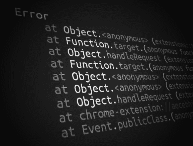

# 程序员日志介绍

> 原文：<https://www.freecodecamp.org/news/you-should-have-better-logging-now-fbab2f667fac/>

斯特凡诺斯·瓦达洛斯

# 程序员日志介绍

I have no idea what is going on…

并不是所有的开发人员都非常重视软件开发的一部分。这部分是正确的日志记录，每个在调试过程中损失了无数时间的人都知道我的意思。

有用的日志可以为开发人员(特别是当有人必须调试/维护别人的代码时)提供巨大的帮助，帮助他们理解代码实际上做了什么。一些开发人员说堆栈跟踪是所有人都应该需要的，但是这与事实相去甚远。堆栈跟踪很棒，可以告诉你哪里出了问题，哪里出了问题，但是它们不能告诉你最初是如何到达那里的。当然，你可以通过断点来跟踪执行，但是盲目地去做将会使整个过程比它实际应该和可能花费的时间多得多。

Not very helpful

这是日志记录的*诊断*部分，是最重要的部分，也是开发人员更容易理解的部分，因为这是他们日常工作的一部分。还有一部分叫做*审计*日志记录。诊断日志记录负责记录运行时发生的事件(方法调用、输入/输出、HTTP 调用、SQL 执行)，而审计日志记录负责记录更抽象的业务逻辑事件。此类事件可以是用户操作(添加/编辑/删除内容、交易、访问数据)或其他具有管理价值或更重要的法律价值的事情。

在后端世界，有一些很好的日志框架可供选择，因为对它们的需求很早就出现了。例如，在 Java 中，您可以在 Java 自己的日志引擎 java.util.logging 或一些优秀的外部框架(如 Logback 或最流行的 Log4j)之间进行选择。在前端世界中，事情还没有发展到那一步，但是有一些选项可以帮助您完成额外的工作(当然也可以消除琐碎的 console.log 消息)。两个这样的前端 Javascript 库是最小但功能强大的 loglevel 和 browser-bunyan，这是浏览器的 awesome node.js 日志模块的一个端口。这些框架之间有一些共同的特性，但是也有一些独特的特性可以指导开发者选择他所需要的。可以用一些例子来说明它们的用法。

> 宣言:服务器日志应该结构化。JSON 是个好格式。就这么办吧。

正如最初的[班扬](https://github.com/trentm/node-bunyan)的宣言所说，日志应该是结构化的，易于索引、过滤和搜索。这个令人惊叹的框架生成 JSON 格式的日志，其他服务可以轻松地使用这些日志进行进一步处理。

除了 JSON 导出功能之外， [Bunyan](https://github.com/philmander/browser-bunyan) 还有子记录器的概念，可以用来为应用程序的不同组件创建不同的记录器。这给了你很大的灵活性，你可以选择在你的应用程序的特定部分包含哪些字段和额外的信息。Bunyan 还合并了流，这是其记录器的“输出”设置。您可以创建多个流，并为每个日志记录器分配一个或多个流，每个流可以有不同的设置，如要记录的日志的最低级别(可接受的 Bunyan 级别为 fatal/error/warn/info/debug/trace)或输出方法(在浏览器中只有与控制台相关的选项，但在节点环境中，您可以做其他事情，如将日志写入特定文件)。

> 这是一个基本可靠的日常日志库。它不做花哨的事情，不允许您重新配置附加器或添加复杂的日志过滤规则或烧茶(更遗憾的是)，但它确实具有您实际使用的所有核心功能

用一句相当谦虚的话来说， [loglevel](http://pimterry.github.io/loglevel/) 为自己提供了一个最小的日志框架，它只添加了大多数应用程序需要的最少的日志。它添加了一些适当的基于级别的日志记录(trace/debug/info/warn/error)和过滤，以确定控制台上显示的最低级别。

这个框架的强大之处在于它的简单性，因为很容易将它集成到您的项目中并开始使用它，从而永远取代 console.log()。此外，loglevel 还有一个隐藏的瑰宝，它的可扩展性，因为有各种各样的插件为它编写，为那些想要它们的人提供额外的功能，如[前缀消息](https://github.com/kutuluk/loglevel-plugin-prefix)。

无论您最终为 JavaScript 应用程序选择哪种框架，您都将在调试过程中节省大量的工作时间，并使您的应用程序更加经得起未来的考验。